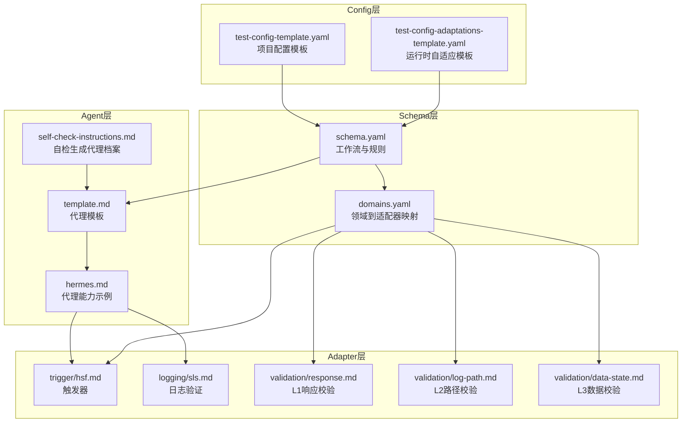
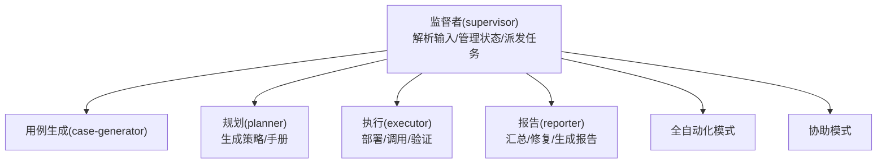
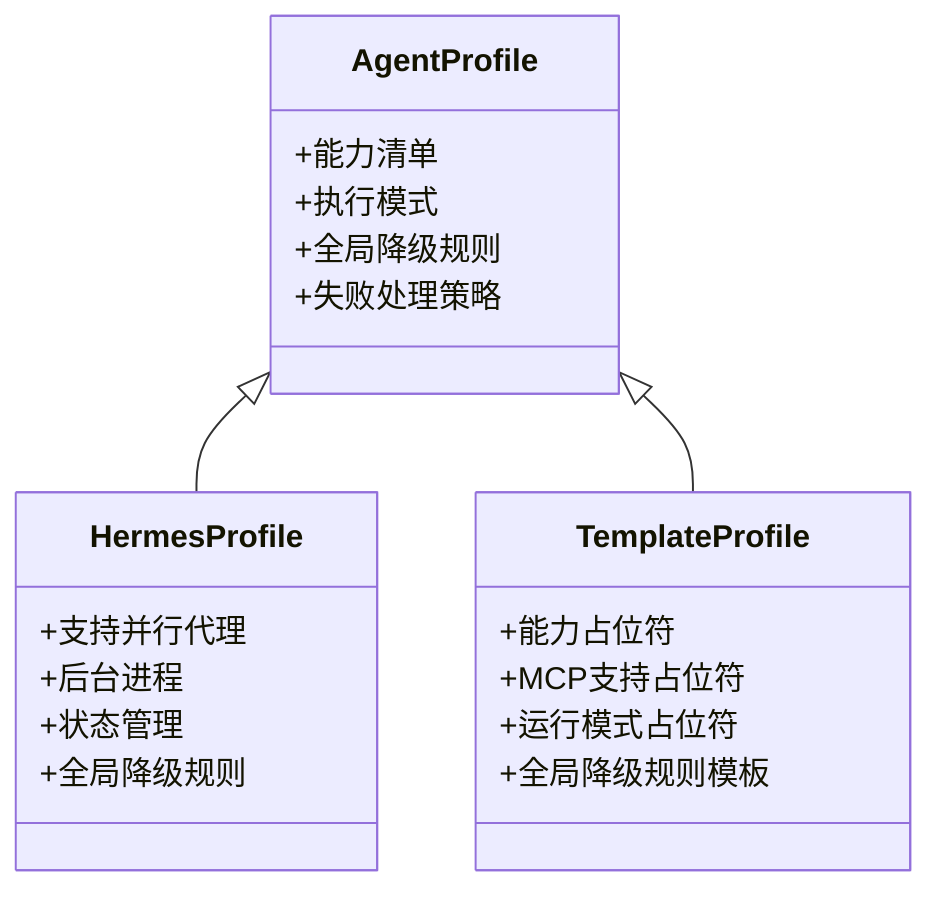
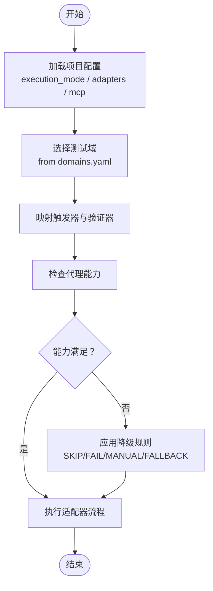
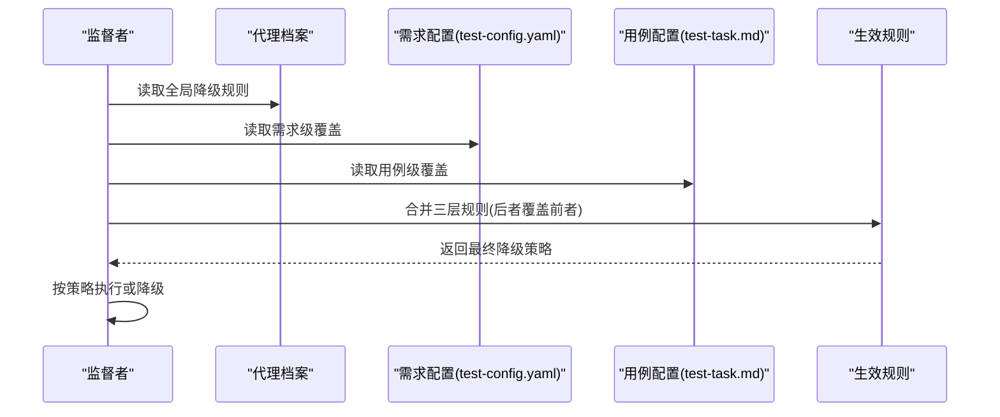
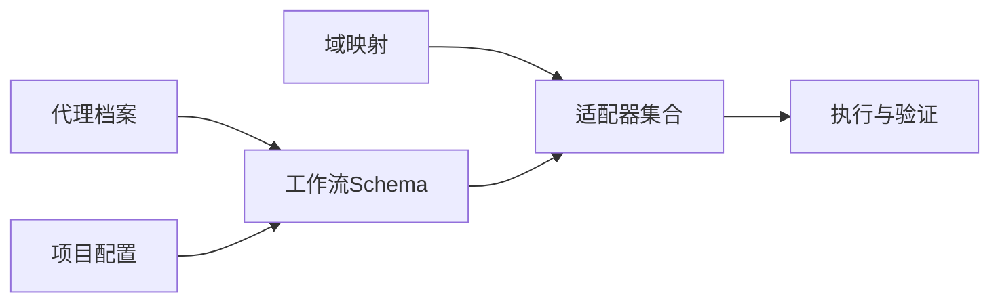

# 代理管理

<cite>
**本文引用的文件**
- [README.md](file://README.md)
- [DESIGN.md](file://DESIGN.md)
- [INSTRUCTIONS.md](file://INSTRUCTIONS.md)
- [agents/hermes.md](file://agents/hermes.md)
- [agents/template.md](file://agents/template.md)
- [agents/self-check-instructions.md](file://agents/self-check-instructions.md)
- [config/test-config-template.yaml](file://config/test-config-template.yaml)
- [config/test-config-adaptations-template.yaml](file://config/test-config-adaptations-template.yaml)
- [schemas/ai-test-workflow/schema.yaml](file://schemas/ai-test-workflow/schema.yaml)
- [adapters/domains.yaml](file://adapters/domains.yaml)
- [adapters/trigger/hsf.md](file://adapters/trigger/hsf.md)
- [adapters/logging/sls.md](file://adapters/logging/sls.md)
- [adapters/validation/log-path.md](file://adapters/validation/log-path.md)
- [adapters/validation/data-state.md](file://adapters/validation/data-state.md)
- [adapters/validation/response.md](file://adapters/validation/response.md)
</cite>

## 目录
1. [简介](#简介)
2. [项目结构](#项目结构)
3. [核心组件](#核心组件)
4. [架构总览](#架构总览)
5. [详细组件分析](#详细组件分析)
6. [依赖分析](#依赖分析)
7. [性能考量](#性能考量)
8. [故障排查指南](#故障排查指南)
9. [结论](#结论)
10. [附录](#附录)

## 简介
本文件系统化阐述“AI自动测试SOP”中的代理管理体系，覆盖代理配置文件结构、能力识别机制、降级规则与多代理协调策略；解释不同代理类型特性与适用场景；给出配置最佳实践与安全注意事项；提供代理能力矩阵、兼容性检查与故障转移机制说明；阐明代理与适配器的匹配逻辑与自适应执行策略；并提供扩展与自定义开发指南及监控、性能评估与优化建议。

## 项目结构
该仓库采用分层解耦设计：Schema层定义流程与产物；Adapter层封装技术实现；Agent层定义代理能力；Knowledge层沉淀经验；Config层承载运行时参数与自适应调整；SOP通过共享状态文件驱动多角色协作。

图表来源
- [schemas/ai-test-workflow/schema.yaml:1-111](file://schemas/ai-test-workflow/schema.yaml#L1-L111)
- [adapters/domains.yaml:1-27](file://adapters/domains.yaml#L1-L27)
- [agents/template.md:1-36](file://agents/template.md#L1-L36)
- [agents/hermes.md:1-29](file://agents/hermes.md#L1-L29)
- [agents/self-check-instructions.md:1-25](file://agents/self-check-instructions.md#L1-L25)
- [adapters/trigger/hsf.md:1-14](file://adapters/trigger/hsf.md#L1-L14)
- [adapters/logging/sls.md:1-10](file://adapters/logging/sls.md#L1-L10)
- [adapters/validation/response.md:1-7](file://adapters/validation/response.md#L1-L7)
- [adapters/validation/log-path.md:1-10](file://adapters/validation/log-path.md#L1-L10)
- [adapters/validation/data-state.md:1-8](file://adapters/validation/data-state.md#L1-L8)
- [config/test-config-template.yaml:1-32](file://config/test-config-template.yaml#L1-L32)
- [config/test-config-adaptations-template.yaml:1-26](file://config/test-config-adaptations-template.yaml#L1-L26)

章节来源
- [README.md:1-89](file://README.md#L1-L89)
- [DESIGN.md:12-155](file://DESIGN.md#L12-L155)

## 核心组件
- 代理档案（agents）：定义代理能力、执行模式与全局降级规则，支持自动生成与手动维护。
- 配置（config）：项目级执行模式、适配器选择、MCP工具开关与降级覆盖。
- 工作流Schema（schemas）：声明角色、产物、规则、执行模式、通信协议与循环控制。
- 适配器注册（adapters/domains.yaml）：将测试域映射到触发器与验证器集合。
- 日志与验证适配器：提供L1-L3验证的具体实现与调用方式。
- 自适应与知识：运行时参数调整与经验沉淀，支撑“自进化”。

章节来源
- [agents/template.md:1-36](file://agents/template.md#L1-L36)
- [agents/hermes.md:1-29](file://agents/hermes.md#L1-L29)
- [config/test-config-template.yaml:1-32](file://config/test-config-template.yaml#L1-L32)
- [schemas/ai-test-workflow/schema.yaml:1-111](file://schemas/ai-test-workflow/schema.yaml#L1-L111)
- [adapters/domains.yaml:1-27](file://adapters/domains.yaml#L1-L27)
- [config/test-config-adaptations-template.yaml:1-26](file://config/test-config-adaptations-template.yaml#L1-L26)

## 架构总览
SOP以Schema为“脑”，定义流程与约束；以Adapter为“手”，封装具体技术实现；以Agent为“身份”，决定执行策略与降级行为；以Knowledge为“记忆”，沉淀经验与规避风险。执行通过共享状态文件推进，支持全自动化与“AI计划+人工执行”的混合模式。

图表来源
- [schemas/ai-test-workflow/schema.yaml:8-26](file://schemas/ai-test-workflow/schema.yaml#L8-L26)
- [schemas/ai-test-workflow/schema.yaml:65-70](file://schemas/ai-test-workflow/schema.yaml#L65-L70)

## 详细组件分析

### 代理档案与能力识别
- 能力维度：文件读写/补丁、Shell执行、后台进程、并行代理、状态管理、MCP支持等。
- 执行模式：多代理编排（Supervisor委派子代理并行执行）与串行模式（单一代理承担多角色）。
- 自检生成：当代理档案缺失时，AI按自检指令自动探测能力并生成档案。
- 全局降级规则：针对无MCP、无Shell、无部署、无数据库等场景设定默认降级动作（可被需求级或用例级覆盖）。

图表来源
- [agents/hermes.md:1-29](file://agents/hermes.md#L1-L29)
- [agents/template.md:1-36](file://agents/template.md#L1-L36)

章节来源
- [agents/self-check-instructions.md:1-25](file://agents/self-check-instructions.md#L1-L25)
- [agents/template.md:1-36](file://agents/template.md#L1-L36)
- [agents/hermes.md:1-29](file://agents/hermes.md#L1-L29)

### 代理与适配器的匹配逻辑
- 域到适配器映射：通过domains.yaml将测试域（如后端接口、前端UI、全栈）映射到一组触发器与验证器。
- 适配器实现：例如Hsf触发器、SLS日志查询、L1/L2/L3验证规则等。
- 匹配原则：根据执行模式与配置选择对应适配器；若代理能力不足，按降级规则回退或转为协助模式。

图表来源
- [adapters/domains.yaml:1-27](file://adapters/domains.yaml#L1-L27)
- [adapters/trigger/hsf.md:1-14](file://adapters/trigger/hsf.md#L1-L14)
- [adapters/logging/sls.md:1-10](file://adapters/logging/sls.md#L1-L10)
- [adapters/validation/log-path.md:1-10](file://adapters/validation/log-path.md#L1-L10)
- [adapters/validation/data-state.md:1-8](file://adapters/validation/data-state.md#L1-L8)
- [adapters/validation/response.md:1-7](file://adapters/validation/response.md#L1-L7)

章节来源
- [adapters/domains.yaml:1-27](file://adapters/domains.yaml#L1-L27)
- [adapters/trigger/hsf.md:1-14](file://adapters/trigger/hsf.md#L1-L14)
- [adapters/logging/sls.md:1-10](file://adapters/logging/sls.md#L1-L10)
- [adapters/validation/log-path.md:1-10](file://adapters/validation/log-path.md#L1-L10)
- [adapters/validation/data-state.md:1-8](file://adapters/validation/data-state.md#L1-L8)
- [adapters/validation/response.md:1-7](file://adapters/validation/response.md#L1-L7)

### 降级规则与多代理协调策略
- 三层继承链：用例级 > 需求级(test-config.yaml) > 全局(代理档案)。未显式指定的键从上层继承。
- 可用动作：SKIP（跳过）、FAIL（直接失败）、MANUAL（转协助模式）、FALLBACK:<adapter>（切换适配器）。
- 多代理编排：Supervisor可委派子代理并行执行，提升容错与吞吐；串行模式则由单一代理承担多角色，适合资源受限场景。

图表来源
- [schemas/ai-test-workflow/schema.yaml:38-61](file://schemas/ai-test-workflow/schema.yaml#L38-L61)
- [agents/template.md:17-36](file://agents/template.md#L17-L36)
- [config/test-config-template.yaml:24-32](file://config/test-config-template.yaml#L24-L32)

章节来源
- [schemas/ai-test-workflow/schema.yaml:38-61](file://schemas/ai-test-workflow/schema.yaml#L38-L61)
- [agents/template.md:17-36](file://agents/template.md#L17-L36)
- [config/test-config-template.yaml:24-32](file://config/test-config-template.yaml#L24-L32)

### 不同代理类型的特性与适用场景
- 多代理编排型（如Hermes）：适合复杂任务分解与并行执行，具备更强容错与并发能力。
- 串行执行型：适合资源受限或上下文污染风险高的环境，但整体吞吐较低。
- 场景建议：
  - 高并发、强隔离：优先多代理编排型。
  - 小规模、低权限：优先串行型并结合MANUAL降级策略。

章节来源
- [DESIGN.md:116-126](file://DESIGN.md#L116-L126)
- [agents/hermes.md:10-14](file://agents/hermes.md#L10-L14)

### 代理配置最佳实践与安全考虑
- 最佳实践
  - 明确execution_mode，并在test-config.yaml中显式声明MCP工具启用状态。
  - 在需求级或用例级仅覆盖必要键，避免过度放宽降级导致质量风险。
  - 使用FALLBACK:<adapter>进行可控回退，保留原策略作为对比基线。
  - 定期审阅.knowledge/与.test-adaptations.yaml，形成闭环改进。
- 安全考虑
  - 严格遵守只读输入源、输出写入test-runs/<id>/的隔离规则。
  - 对Shell与MCP工具调用进行最小权限授权与审计记录。
  - 避免在Agent档案中泄露敏感信息，必要时使用占位符与外部密钥管理。

章节来源
- [schemas/ai-test-workflow/schema.yaml:30-37](file://schemas/ai-test-workflow/schema.yaml#L30-L37)
- [config/test-config-template.yaml:1-32](file://config/test-config-template.yaml#L1-L32)
- [DESIGN.md:127-155](file://DESIGN.md#L127-L155)

### 代理能力矩阵与兼容性检查
- 能力矩阵（示例）
  - 文件读写/补丁：用于生成/修改中间产物与配置。
  - Shell执行：用于命令行工具调用与环境准备。
  - 后台进程：支持异步等待与并行任务。
  - 并行代理：支持delegate_task，实现子代理编排。
  - 状态管理：基于test-status.json的状态机推进。
  - MCP支持：通过mcporter或原生MCP访问外部系统。
- 兼容性检查
  - 在启动阶段执行自检，确认能力并生成代理档案。
  - 通过domains.yaml核对当前域所需的触发器与验证器是否齐备。
  - 若缺失关键能力，依据降级规则进行策略调整。

章节来源
- [agents/template.md:3-8](file://agents/template.md#L3-L8)
- [agents/self-check-instructions.md:7-22](file://agents/self-check-instructions.md#L7-L22)
- [adapters/domains.yaml:1-27](file://adapters/domains.yaml#L1-L27)

### 故障转移机制
- 降级动作
  - SKIP：跳过当前层验证，标记为SKIPPED。
  - FAIL：立即标记用例FAIL。
  - MANUAL：生成manual-test-guide，等待人工介入。
  - FALLBACK:<adapter>：切换到替代适配器执行。
- 循环与重试
  - 通过repair-cycle在结果含FAIL时最多重试固定次数，降低偶发失败影响。

章节来源
- [schemas/ai-test-workflow/schema.yaml:51-61](file://schemas/ai-test-workflow/schema.yaml#L51-L61)
- [schemas/ai-test-workflow/schema.yaml:105-109](file://schemas/ai-test-workflow/schema.yaml#L105-L109)

### 代理与适配器的自适应执行策略
- 动态适配
  - 运行时根据异常模式自动调整超时、排除日志模式等参数，写入.test-adaptations.yaml。
  - 结构性变更通过proposals/提出方案，经人工评审后合并至schemas/。
- 执行路由
  - full-auto：AI自动部署、调用、验证。
  - assisted：生成manual-test-guide，等待人工执行与回传结果。

章节来源
- [DESIGN.md:127-155](file://DESIGN.md#L127-L155)
- [schemas/ai-test-workflow/schema.yaml:65-70](file://schemas/ai-test-workflow/schema.yaml#L65-L70)

### 开发指南：扩展与自定义
- 新增代理档案
  - 基于agents/template.md填写能力与降级规则，命名agents/<your-agent>.md。
  - 如档案缺失，AI将按agents/self-check-instructions.md自动生成。
- 新增适配器
  - 在adapters/下新增触发器/验证器文档，遵循现有格式与命名规范。
  - 在adapters/domains.yaml中将新域映射到相应适配器集合。
- 新增验证层级
  - 在adapters/validation/新增对应验证器文档，并在schema.yaml中声明规则与触发条件。
- 配置覆盖
  - 在test-config.yaml中覆盖全局降级规则；在test-task.md中覆盖单用例规则。

章节来源
- [agents/template.md:1-36](file://agents/template.md#L1-L36)
- [agents/self-check-instructions.md:20-25](file://agents/self-check-instructions.md#L20-L25)
- [adapters/domains.yaml:1-27](file://adapters/domains.yaml#L1-L27)
- [schemas/ai-test-workflow/schema.yaml:38-61](file://schemas/ai-test-workflow/schema.yaml#L38-L61)

## 依赖分析
- 组件耦合
  - Schema对Agent与Config存在高层依赖，但通过文件约定与状态机解耦具体实现。
  - Adapter层与Domain层弱耦合，便于替换与扩展。
- 外部依赖
  - MCP工具（如sls-mcp、dms-mcp-server、group-env）与外部系统交互，需在test-config.yaml中启用。
- 潜在风险
  - 代理能力不匹配导致的降级风暴；配置覆盖不当引发的质量回退。
  - 适配器切换未充分测试造成验证偏差。

图表来源
- [schemas/ai-test-workflow/schema.yaml:1-111](file://schemas/ai-test-workflow/schema.yaml#L1-L111)
- [adapters/domains.yaml:1-27](file://adapters/domains.yaml#L1-L27)
- [config/test-config-template.yaml:1-32](file://config/test-config-template.yaml#L1-L32)

章节来源
- [schemas/ai-test-workflow/schema.yaml:1-111](file://schemas/ai-test-workflow/schema.yaml#L1-L111)
- [adapters/domains.yaml:1-27](file://adapters/domains.yaml#L1-L27)
- [config/test-config-template.yaml:1-32](file://config/test-config-template.yaml#L1-L32)

## 性能考量
- 并行与异步：优先使用支持后台进程与并行代理的代理，减少串行阻塞。
- 降级策略：在工具不可用时快速降级，避免长时间等待；必要时使用FALLBACK切换更高效的适配器。
- 参数自适应：利用.test-adaptations.yaml动态调整超时与过滤规则，减少误报与漏报。
- 日志与审计：确保每次工具调用前写入execution-log.md，便于定位瓶颈与异常。

## 故障排查指南
- 常见问题
  - MCP工具未启用：检查test-config.yaml中mcp.tools.*是否enabled=true。
  - 代理能力不足：查看agents/<agent>.md的能力清单，必要时切换代理或启用FALLBACK。
  - 协助模式卡住：确认manual-test-guide是否生成且人工已回填结果。
- 排查步骤
  - 查看test-status.json的current_step与retry_count，定位卡点。
  - 检查execution-log.md中最近一次工具调用的参数与返回。
  - 根据降级规则核对生效策略，确认是否应跳过/失败/转人工。
- 自愈机制
  - Tier 1：自动调整参数（如超时、日志排除），立即生效。
  - Tier 2：重大变更通过proposals/提交方案，经人工评审后合并。

章节来源
- [README.md:61-70](file://README.md#L61-L70)
- [DESIGN.md:127-155](file://DESIGN.md#L127-L155)
- [schemas/ai-test-workflow/schema.yaml:105-109](file://schemas/ai-test-workflow/schema.yaml#L105-L109)

## 结论
本SOP通过“Schema+Agent+Adapter+Knowledge”的分层设计，实现了跨代理、跨域、跨工具的自适应测试执行。代理档案与降级规则提供了稳健的容错与回退策略；配置与自适应机制保障了持续优化；文件化状态机与日志体系确保了可观测性与可追溯性。遵循本文最佳实践与开发指南，可在保证质量的前提下最大化自动化收益。

## 附录
- 关键文件索引
  - 代理档案：agents/hermes.md、agents/template.md、agents/self-check-instructions.md
  - 配置模板：config/test-config-template.yaml、config/test-config-adaptations-template.yaml
  - 工作流Schema：schemas/ai-test-workflow/schema.yaml
  - 适配器与域映射：adapters/domains.yaml、adapters/trigger/hsf.md、adapters/logging/sls.md、adapters/validation/response.md、adapters/validation/log-path.md、adapters/validation/data-state.md
  - 快速指引：README.md、INSTRUCTIONS.md、DESIGN.md