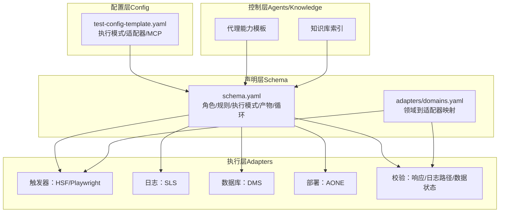
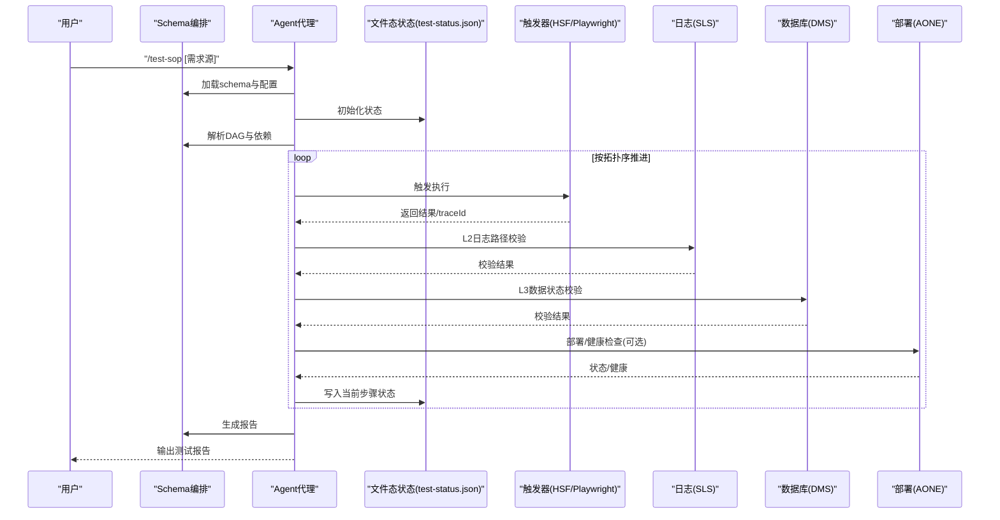
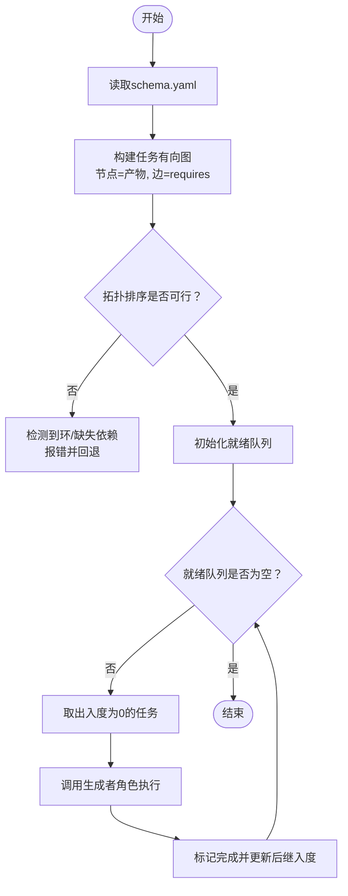
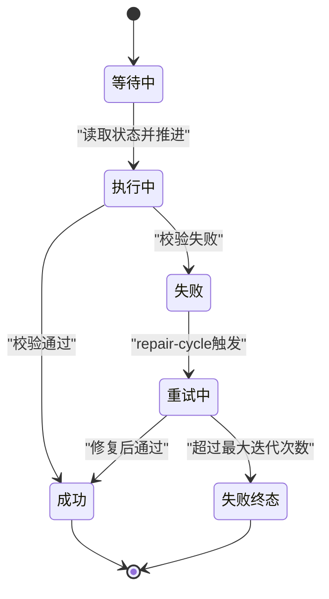
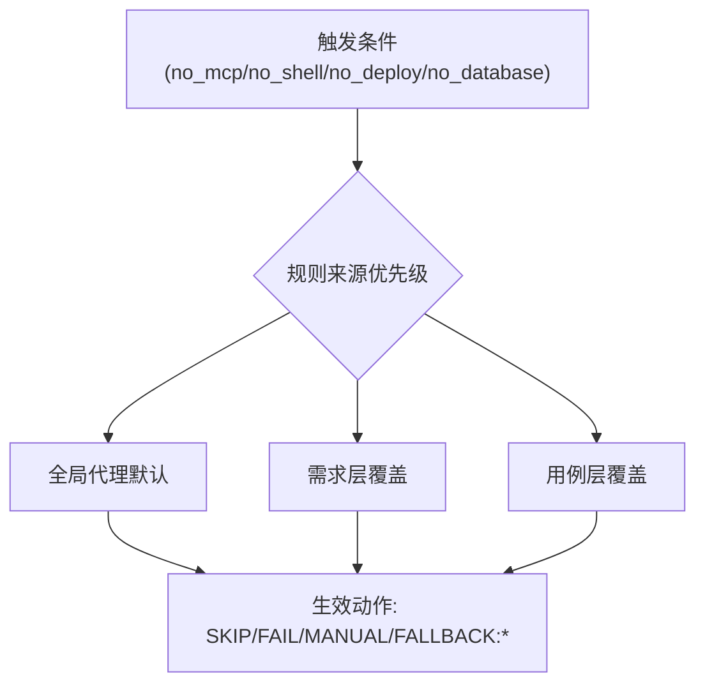
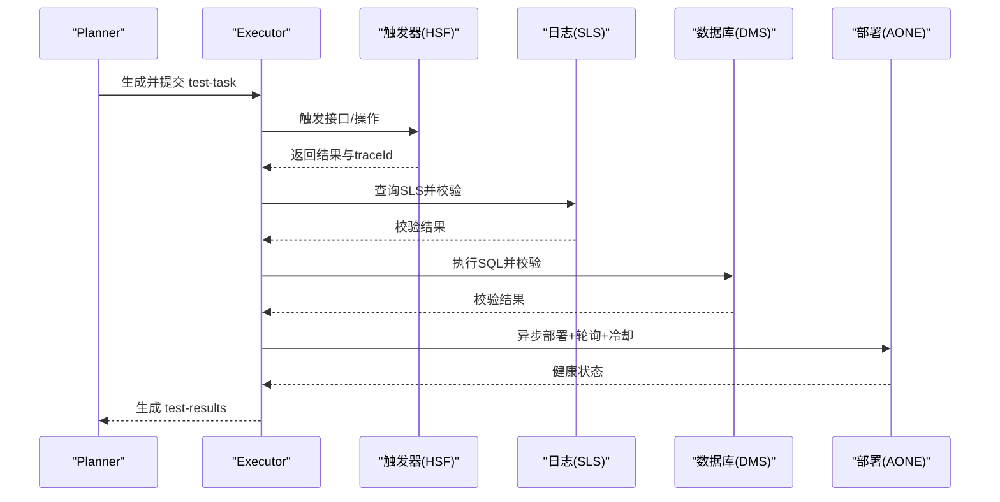
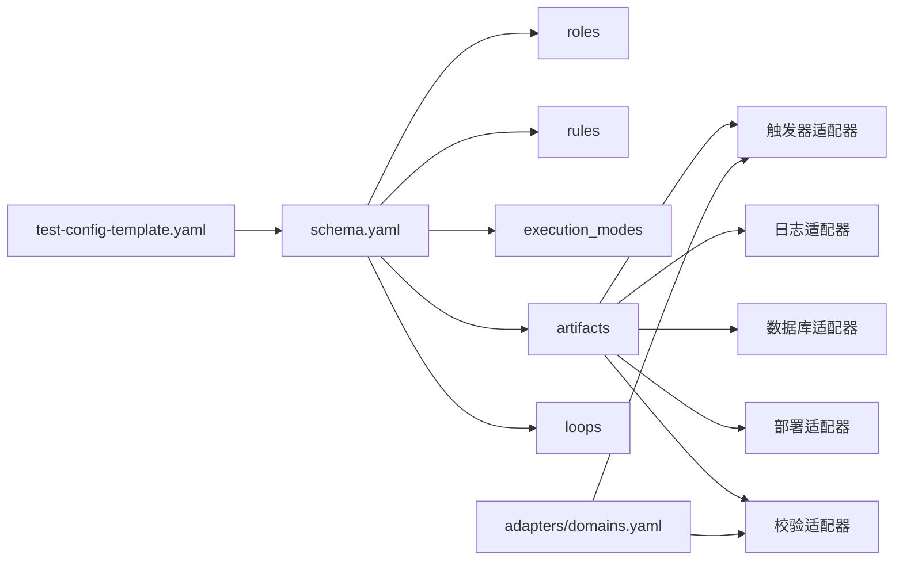

# DAG执行引擎

<cite>
**本文引用的文件**
- [README.md](file://README.md)
- [DESIGN.md](file://DESIGN.md)
- [INSTRUCTIONS.md](file://INSTRUCTIONS.md)
- [schemas/ai-test-workflow/schema.yaml](file://schemas/ai-test-workflow/schema.yaml)
- [config/test-config-template.yaml](file://config/test-config-template.yaml)
- [adapters/domains.yaml](file://adapters/domains.yaml)
- [adapters/trigger/hsf.md](file://adapters/trigger/hsf.md)
- [adapters/logging/sls.md](file://adapters/logging/sls.md)
- [adapters/validation/log-path.md](file://adapters/validation/log-path.md)
- [adapters/database/dms.md](file://adapters/database/dms.md)
- [adapters/deployment/aone.md](file://adapters/deployment/aone.md)
</cite>

## 目录
1. [引言](#引言)
2. [项目结构](#项目结构)
3. [核心组件](#核心组件)
4. [架构总览](#架构总览)
5. [详细组件分析](#详细组件分析)
6. [依赖关系分析](#依赖关系分析)
7. [性能考虑](#性能考虑)
8. [故障排查指南](#故障排查指南)
9. [结论](#结论)
10. [附录](#附录)

## 引言
本文件面向开发者与测试工程师，系统化阐述该AI自动测试工作流中的“DAG执行引擎”设计与实现要点。该引擎以有向无环图（DAG）编排测试任务，结合角色分工、文件态通信协议、自适应降级与自演进机制，形成“规范可声明、执行可路由、失败可修复”的闭环体系。本文重点覆盖：
- 任务依赖解析与拓扑排序
- 并行执行策略与状态推进
- 任务状态管理、进度跟踪与资源分配
- 执行流程示例与配置语法
- 重试、超时与错误恢复策略
- 性能优化建议与监控指标
- 可扩展性与二次开发指导

## 项目结构
该仓库采用“分层解耦 + 声明式编排”的组织方式：
- schemas/：工作流定义（DAG + 模板）
- adapters/：技术实现适配器（触发、日志、数据库、部署、校验等）
- agents/：AI代理能力模板与自检流程
- knowledge/：知识库（坑点与最佳实践）
- config/：项目配置模板
- 根目录文档：快速入门、设计原则与指令协议

图表来源
- [schemas/ai-test-workflow/schema.yaml:1-111](file://schemas/ai-test-workflow/schema.yaml#L1-L111)
- [adapters/domains.yaml:1-27](file://adapters/domains.yaml#L1-L27)
- [config/test-config-template.yaml:1-32](file://config/test-config-template.yaml#L1-L32)

章节来源
- [README.md:71-84](file://README.md#L71-L84)
- [DESIGN.md:12-38](file://DESIGN.md#L12-L38)

## 核心组件
- 工作流编排（DAG）：由 schema.yaml 定义角色、规则、执行模式、产物与循环，明确任务间依赖与顺序。
- 文件态通信协议：通过 test-status.json 实现Agent间的状态同步与幂等推进。
- 自适应降级：基于三层继承链（用例 > 需求 > 全局代理配置）动态选择动作（SKIP/FAIL/MANUAL/FALLBACK）。
- 适配器生态：按领域与验证层级拆分触发、日志、数据库、部署与校验，便于替换与扩展。

章节来源
- [schemas/ai-test-workflow/schema.yaml:8-26](file://schemas/ai-test-workflow/schema.yaml#L8-L26)
- [schemas/ai-test-workflow/schema.yaml:30-61](file://schemas/ai-test-workflow/schema.yaml#L30-L61)
- [DESIGN.md:106-126](file://DESIGN.md#L106-L126)

## 架构总览
下图展示从输入需求到产出报告的端到端执行路径，以及关键适配器在各阶段的职责。

图表来源
- [INSTRUCTIONS.md:27-36](file://INSTRUCTIONS.md#L27-L36)
- [schemas/ai-test-workflow/schema.yaml:65-70](file://schemas/ai-test-workflow/schema.yaml#L65-L70)
- [adapters/trigger/hsf.md:1-14](file://adapters/trigger/hsf.md#L1-L14)
- [adapters/logging/sls.md:1-10](file://adapters/logging/sls.md#L1-L10)
- [adapters/database/dms.md:1-10](file://adapters/database/dms.md#L1-L10)
- [adapters/deployment/aone.md:1-12](file://adapters/deployment/aone.md#L1-L12)

## 详细组件分析

### 组件一：DAG任务定义与依赖解析
- 任务定义：每个产物（如 spec、test-cases、test-task、manual-test-guide、test-results、test-report）对应一个DAG节点，具备生成者角色与前置依赖列表。
- 依赖解析：通过 requires 字段建立边集；若存在环或未满足的上游依赖，则阻塞直至可推进。
- 拓扑排序：依据依赖边进行拓扑排序，确保按序执行且并发安全。
- 条件分支：condition 字段支持根据执行模式（full-auto/assisted）动态启用/禁用节点。

图表来源
- [schemas/ai-test-workflow/schema.yaml:81-104](file://schemas/ai-test-workflow/schema.yaml#L81-L104)

章节来源
- [schemas/ai-test-workflow/schema.yaml:81-104](file://schemas/ai-test-workflow/schema.yaml#L81-L104)

### 组件二：并行执行策略与资源分配
- 并行度控制：同一轮次内，所有入度为0且前置满足的任务可并行执行；由生成者角色负责隔离输出路径。
- 资源分配：
  - 触发器：按领域映射到具体适配器（如 HSF/Playwright），避免跨域耦合。
  - 日志与数据库：通过MCP工具调用，统一参数接口，便于替换。
  - 部署：异步触发+轮询+冷却，降低对主流程阻塞。
- 输出隔离：所有产物写入 test-runs/<requirement-id>/，避免输入污染。

章节来源
- [adapters/domains.yaml:1-27](file://adapters/domains.yaml#L1-L27)
- [adapters/deployment/aone.md:3-7](file://adapters/deployment/aone.md#L3-L7)
- [schemas/ai-test-workflow/schema.yaml:31-36](file://schemas/ai-test-workflow/schema.yaml#L31-L36)

### 组件三：任务状态管理与进度跟踪
- 文件态状态机：以 test-status.json 为唯一真相源，遵循“先读后写、跳过已完成、循环控制”三大规则。
- 进度可见性：通过 test-status.json 的 current_step 与 retry_count 快速定位卡点。
- 失败恢复：repair-cycle 循环在结果含 FAIL 时最多重试若干次，每次重试前可插入降级动作。

图表来源
- [DESIGN.md:106-115](file://DESIGN.md#L106-L115)
- [schemas/ai-test-workflow/schema.yaml:105-109](file://schemas/ai-test-workflow/schema.yaml#L105-L109)

章节来源
- [DESIGN.md:106-115](file://DESIGN.md#L106-L115)
- [README.md:65-70](file://README.md#L65-L70)
- [schemas/ai-test-workflow/schema.yaml:105-109](file://schemas/ai-test-workflow/schema.yaml#L105-L109)

### 组件四：自适应降级与容错策略
- 三层继承链：用例级别 > 需求级别 > 全局代理配置，后层覆盖前层。
- 动作集合：SKIP（跳过）、FAIL（立即失败）、MANUAL（转人工）、FALLBACK:<adapter>（切换适配器）。
- 场景示例：当 MCP 不可用时，可在需求层强制 FAIL，或在用例层允许 SKIP；也可通过 FALLBACK 切换诊断工具。

图表来源
- [DESIGN.md:131-138](file://DESIGN.md#L131-L138)
- [DESIGN.md:150-165](file://DESIGN.md#L150-L165)
- [config/test-config-template.yaml:24-32](file://config/test-config-template.yaml#L24-L32)

章节来源
- [DESIGN.md:127-187](file://DESIGN.md#L127-L187)
- [config/test-config-template.yaml:24-32](file://config/test-config-template.yaml#L24-L32)

### 组件五：执行流程示例（Full-Auto）
- 步骤序列：spec → test-cases（需人工评审）→ test-task（需人工评审）→ test-execution（全自动化）→ test-report。
- 关键点：
  - 每个工具调用（HSF、SQL、Shell）必须在执行前写入 execution-log.md。
  - L2日志路径校验：提取 traceId，查询SLS，校验完整性、顺序与干净度。
  - L3数据状态校验：通过DMS执行SQL，验证数据一致性。
  - 部署与健康检查：AONE异步部署，轮询状态并冷却后进行健康检查。

图表来源
- [INSTRUCTIONS.md:27-36](file://INSTRUCTIONS.md#L27-L36)
- [adapters/trigger/hsf.md:1-14](file://adapters/trigger/hsf.md#L1-L14)
- [adapters/logging/sls.md:1-10](file://adapters/logging/sls.md#L1-L10)
- [adapters/validation/log-path.md:1-10](file://adapters/validation/log-path.md#L1-L10)
- [adapters/database/dms.md:1-10](file://adapters/database/dms.md#L1-L10)
- [adapters/deployment/aone.md:1-12](file://adapters/deployment/aone.md#L1-L12)

章节来源
- [INSTRUCTIONS.md:27-36](file://INSTRUCTIONS.md#L27-L36)
- [README.md:61-70](file://README.md#L61-L70)

### 组件六：配置语法与示例
- 执行模式：execution_mode 支持 full-auto 与 assisted。
- 适配器选择：trigger、logging、database、deployment 分别指定领域适配器。
- MCP工具：tools.enabled 控制可用能力，fallback 定义降级策略。
- 需求级降级：degradation 可覆盖全局默认动作。

章节来源
- [config/test-config-template.yaml:1-32](file://config/test-config-template.yaml#L1-L32)

## 依赖关系分析
- 任务耦合：DAG边由 requires 建模，确保严格的先后约束；同时允许同层多任务并行。
- 外部依赖：MCP工具链（日志、数据库、部署）作为黑盒服务被统一调用。
- 适配器解耦：领域与验证层级分离，便于替换与组合。

图表来源
- [schemas/ai-test-workflow/schema.yaml:8-26](file://schemas/ai-test-workflow/schema.yaml#L8-L26)
- [schemas/ai-test-workflow/schema.yaml:65-104](file://schemas/ai-test-workflow/schema.yaml#L65-L104)
- [adapters/domains.yaml:1-27](file://adapters/domains.yaml#L1-L27)
- [config/test-config-template.yaml:1-32](file://config/test-config-template.yaml#L1-L32)

章节来源
- [schemas/ai-test-workflow/schema.yaml:8-26](file://schemas/ai-test-workflow/schema.yaml#L8-L26)
- [adapters/domains.yaml:1-27](file://adapters/domains.yaml#L1-L27)

## 性能考虑
- 并行最大化：同一轮次内尽可能并行执行，减少串行瓶颈。
- I/O解耦：日志与数据库通过MCP异步访问，避免阻塞主流程。
- 部署优化：异步部署+轮询+冷却，降低等待时间波动。
- 缓存与去噪：利用知识库与排除规则减少无效校验。
- 监控与可观测：通过 test-status.json 与 execution-log.md 实时定位问题。

## 故障排查指南
- 状态卡死：检查 test-status.json 的 current_step 与 retry_count，确认是否重复进入同一阶段。
- L2日志校验失败：核对 traceId 提取是否正确，SLS查询条件与时间窗口设置。
- L3数据校验异常：确认SQL执行权限与表结构一致性，关注事务隔离与快照延迟。
- 部署失败：查看AONE轮询间隔与冷却时间，确认健康检查项（端口/接口/日志）。
- 自适应降级：核对三层继承链的生效顺序，确认用例级覆盖是否正确下发。

章节来源
- [README.md:65-70](file://README.md#L65-L70)
- [DESIGN.md:131-138](file://DESIGN.md#L131-L138)
- [adapters/validation/log-path.md:1-10](file://adapters/validation/log-path.md#L1-L10)
- [adapters/database/dms.md:1-10](file://adapters/database/dms.md#L1-L10)
- [adapters/deployment/aone.md:1-12](file://adapters/deployment/aone.md#L1-L12)

## 结论
该DAG执行引擎以声明式Schema为核心，结合文件态状态机与自适应降级，实现了高弹性、可演进的AI驱动测试流水线。通过清晰的依赖建模、并行推进与可观测性保障，能够在复杂场景下稳定运行，并持续优化自身能力。

## 附录

### A. 执行流程清单（参考）
- 触发：/test-sop [需求源]
- 自检：加载 agents/<profile>.md，确认能力
- 加载：schema.yaml 与 test-config.yaml
- 生成：spec → test-cases（可人工评审）→ test-task（可人工评审）
- 执行：test-execution（全自动化）
- 报告：test-report
- 自演进：记录异常并生成 runtime adaptation 或 proposal

章节来源
- [INSTRUCTIONS.md:27-44](file://INSTRUCTIONS.md#L27-L44)

### B. 关键配置字段说明
- execution_mode：full-auto 或 assisted
- mcp.tools.*：启用对应MCP工具
- degradation：在三层继承链中覆盖默认动作
- output_base：产物输出根目录占位符

章节来源
- [config/test-config-template.yaml:3-32](file://config/test-config-template.yaml#L3-L32)
- [schemas/ai-test-workflow/schema.yaml:105-111](file://schemas/ai-test-workflow/schema.yaml#L105-L111)