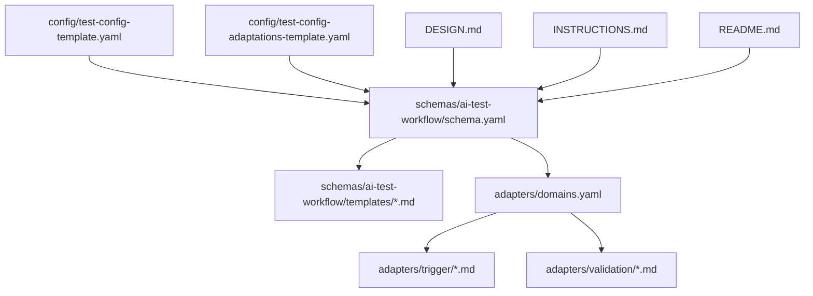
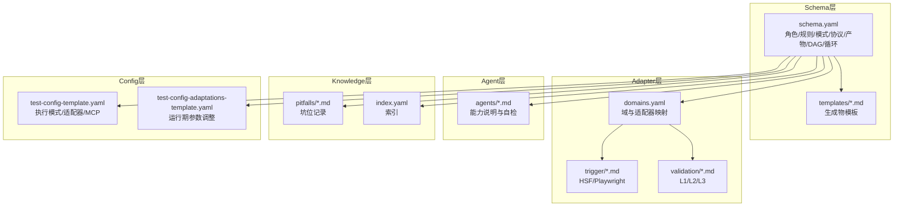
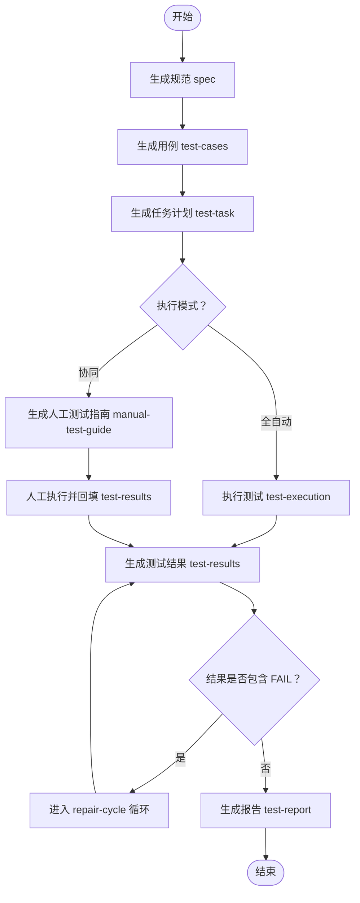
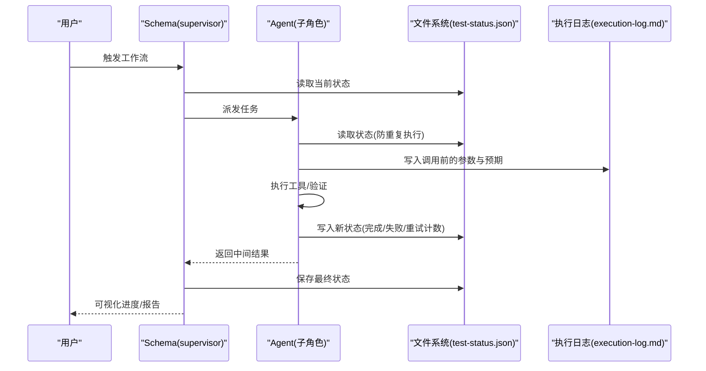
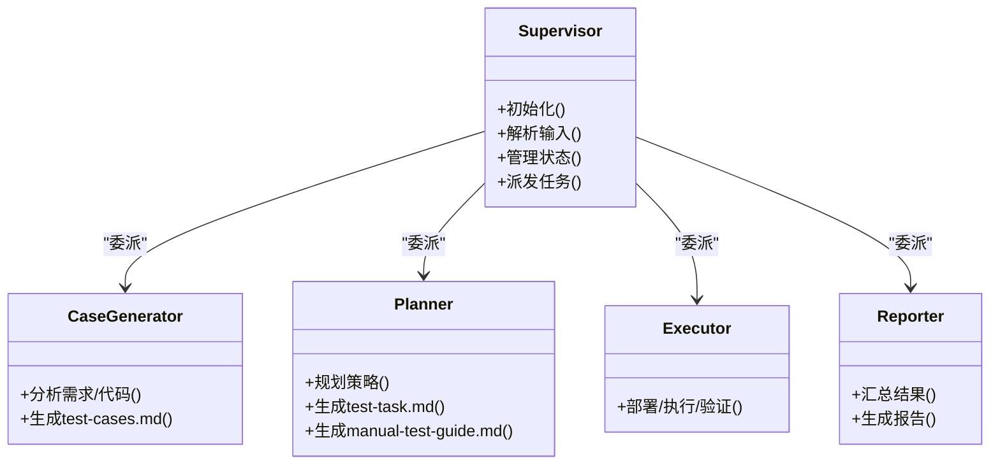
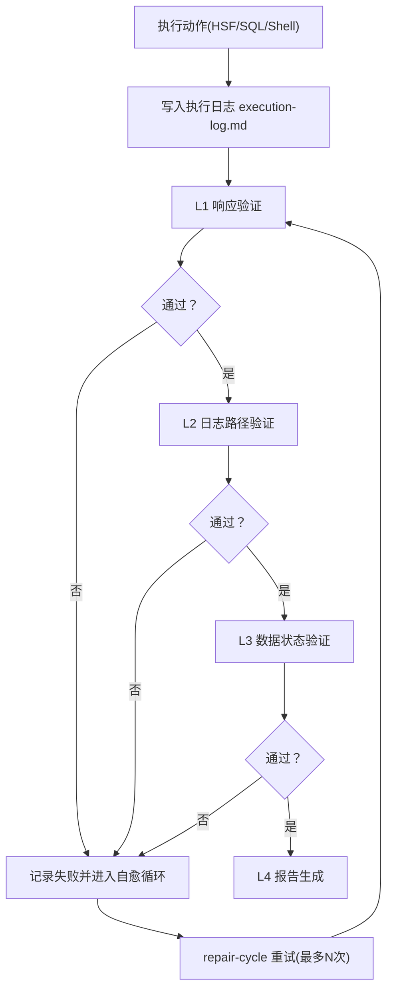
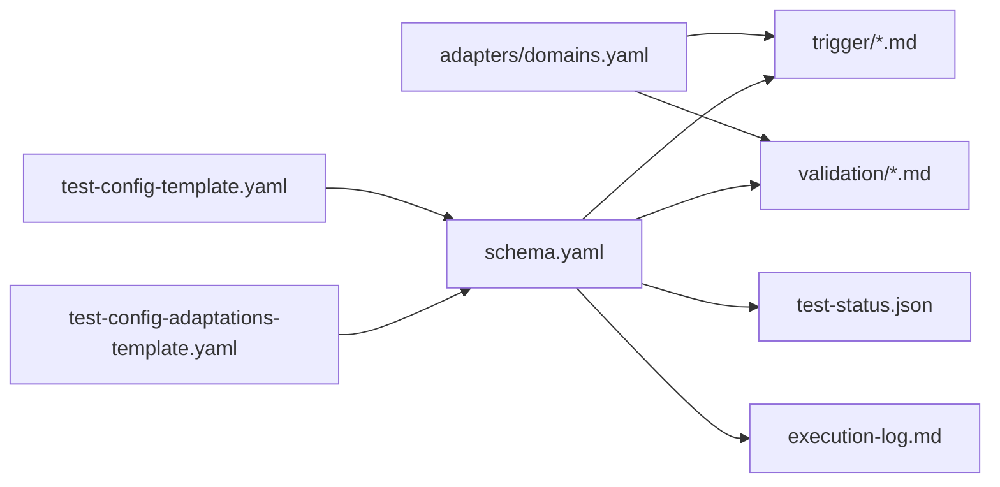

# 工作流引擎

<cite>
**本文引用的文件**
- [README.md](file://README.md)
- [DESIGN.md](file://DESIGN.md)
- [INSTRUCTIONS.md](file://INSTRUCTIONS.md)
- [schema.yaml](file://schemas/ai-test-workflow/schema.yaml)
- [domains.yaml](file://adapters/domains.yaml)
- [log-path.md](file://adapters/validation/log-path.md)
- [data-state.md](file://adapters/validation/data-state.md)
- [response.md](file://adapters/validation/response.md)
- [hsf.md](file://adapters/trigger/hsf.md)
- [playwright.md](file://adapters/trigger/playwright.md)
- [test-task.md](file://schemas/ai-test-workflow/templates/test-task.md)
- [manual-test-guide.md](file://schemas/ai-test-workflow/templates/manual-test-guide.md)
- [test-report.md](file://schemas/ai-test-workflow/templates/test-report.md)
- [test-config-template.yaml](file://config/test-config-template.yaml)
- [test-config-adaptations-template.yaml](file://config/test-config-adaptations-template.yaml)
</cite>

## 目录
1. [简介](#简介)
2. [项目结构](#项目结构)
3. [核心组件](#核心组件)
4. [架构总览](#架构总览)
5. [详细组件分析](#详细组件分析)
6. [依赖关系分析](#依赖关系分析)
7. [性能考虑](#性能考虑)
8. [故障排查指南](#故障排查指南)
9. [结论](#结论)
10. [附录](#附录)

## 简介
本工作流引擎是一个面向AI驱动的自动化测试框架，强调“规范无界、代理无关、自我演化”。其通过分层架构与声明式工作流定义，实现从需求到报告的全链路可观察、可回溯、可自适应的测试执行闭环。核心特性包括：
- 基于DAG（有向无环图）的工作流编排与状态机通信
- 分层适配器解耦具体工具与验证逻辑
- 文件态状态机保障可恢复与可重入
- 自愈循环与知识沉淀机制
- 多层级日志验证（L1-L4）与数据状态验证
- 支持全自动化与“人机协同”两种执行模式

## 项目结构
该仓库采用“分层+模板”的组织方式：
- schemas/：工作流定义与模板（DAG、角色、产物、规则）
- adapters/：适配器与验证规则（触发器、日志、数据、UI等）
- agents/：AI代理能力说明与自检流程
- knowledge/：知识库与坑位记录
- config/：全局配置与运行期参数调整模板
- 根目录：使用说明、设计文档与安装脚本

图表来源
- [schema.yaml:1-87](file://schemas/ai-test-workflow/schema.yaml#L1-L87)
- [domains.yaml:1-27](file://adapters/domains.yaml#L1-L27)
- [test-config-template.yaml:1-23](file://config/test-config-template.yaml#L1-L23)
- [test-config-adaptations-template.yaml:1-26](file://config/test-config-adaptations-template.yaml#L1-L26)

章节来源
- [README.md:71-84](file://README.md#L71-L84)
- [DESIGN.md:12-38](file://DESIGN.md#L12-L38)

## 核心组件
- 工作流定义（Schema）
  - 定义角色、规则、执行模式、通信协议、产物与DAG依赖、循环策略与输出基路径
- 适配器（Adapters）
  - 触发器：如HSF、Playwright
  - 验证器：L1响应、L2日志路径、L3数据状态等
  - 日志系统：统一审计与可追溯
- 代理（Agents）
  - 描述AI能力边界，支持“编排型”与“串行型”两种执行风格
- 知识层（Knowledge）
  - 记录坑位与最佳实践，支撑自演进
- 配置层（Config）
  - 运行模式、适配器选择、MCP工具开关与参数调整模板

章节来源
- [schema.yaml:8-87](file://schemas/ai-test-workflow/schema.yaml#L8-L87)
- [domains.yaml:1-27](file://adapters/domains.yaml#L1-L27)
- [DESIGN.md:106-126](file://DESIGN.md#L106-L126)
- [test-config-template.yaml:1-23](file://config/test-config-template.yaml#L1-L23)
- [test-config-adaptations-template.yaml:1-26](file://config/test-config-adaptations-template.yaml#L1-L26)

## 架构总览
整体架构分为四层，职责清晰、边界明确：
- Schema层：定义工作流、角色、产物与约束
- Adapter层：封装具体技术实现（触发、验证、日志、部署）
- Agent层：描述AI能力，决定执行风格与降级策略
- Knowledge层：沉淀经验，形成自适应反馈

图表来源
- [schema.yaml:1-87](file://schemas/ai-test-workflow/schema.yaml#L1-L87)
- [domains.yaml:1-27](file://adapters/domains.yaml#L1-L27)
- [hsf.md:1-14](file://adapters/trigger/hsf.md#L1-L14)
- [playwright.md:1-8](file://adapters/trigger/playwright.md#L1-L8)
- [log-path.md:1-10](file://adapters/validation/log-path.md#L1-L10)
- [data-state.md:1-8](file://adapters/validation/data-state.md#L1-L8)
- [response.md:1-7](file://adapters/validation/response.md#L1-L7)
- [test-config-template.yaml:1-23](file://config/test-config-template.yaml#L1-L23)
- [test-config-adaptations-template.yaml:1-26](file://config/test-config-adaptations-template.yaml#L1-L26)

## 详细组件分析

### 工作流定义与DAG
- 角色分工
  - 主导者（supervisor）：解析输入、管理状态、派发任务
  - 子代理（case-generator/planner/executor/reporter）：按职责生成用例、规划策略、执行验证、汇总报告
- 执行模式
  - 全自动化：spec → test-cases → test-task → test-execution → test-report
  - 协同模式：spec → test-cases → test-task → manual-test-guide → (人工输入) → test-results → test-report
- 产物与依赖
  - 每个产物由特定角色生成，且可声明前置依赖；部分产物需人工评审
- 循环与自愈
  - repair-cycle：当结果中出现FAIL时触发，最多迭代N次，用于失败自修复
- 输出基路径
  - 统一写入 test-runs/<requirement-id>/，避免污染输入源

图表来源
- [schema.yaml:41-87](file://schemas/ai-test-workflow/schema.yaml#L41-L87)

章节来源
- [schema.yaml:8-87](file://schemas/ai-test-workflow/schema.yaml#L8-L87)

### 通信协议与状态机
- 文件态状态机
  - 使用 test-status.json 作为共享状态文件
  - 读取-再写入原则：每个代理在行动前必须先读取当前状态
  - 跳过已完成步骤：若某步已标记完成则跳过，支持断点续跑
  - 循环控制：由 schema.yaml 中的 repair-cycle 定义最大迭代次数与触发条件
- 透明性与可观测性
  - 执行日志 execution-log.md 记录每次工具调用（HSF、SQL、Shell）的参数与结果
  - 日志验证分层：L1（响应）、L2（日志路径）、L3（数据状态）

图表来源
- [DESIGN.md:106-115](file://DESIGN.md#L106-L115)
- [schema.yaml:50-53](file://schemas/ai-test-workflow/schema.yaml#L50-L53)

章节来源
- [DESIGN.md:106-115](file://DESIGN.md#L106-L115)
- [README.md:61-70](file://README.md#L61-L70)

### 角色分工与协作模式
- 编排型（Orchestrator）
  - 优势：子代理独立失败不影响全局，容错高
  - 劣势：上下文隔离，存在窗口污染风险
- 串行型（Serial）
  - 优势：共享上下文，逻辑连贯
  - 劣势：一处错误阻塞全流程
- Agent能力与模式适配
  - 根据Agent能力（如异步、MCP支持）自动降级或切换执行策略（例如从异步部署降级为同步等待）

图表来源
- [schema.yaml:8-26](file://schemas/ai-test-workflow/schema.yaml#L8-L26)

章节来源
- [DESIGN.md:116-126](file://DESIGN.md#L116-L126)
- [schema.yaml:8-26](file://schemas/ai-test-workflow/schema.yaml#L8-L26)

### 日志与验证层级（L1-L4）
- L1 响应验证：校验 success、code、data 结构
- L2 日志路径验证：提取 traceId，查询日志，验证节点完整性、顺序与干净度
- L3 数据状态验证：执行前后快照对比，关注字段变更与副作用
- L4 报告与总结：生成结论、失败明细、修复记录与建议

图表来源
- [DESIGN.md:70-89](file://DESIGN.md#L70-L89)
- [response.md:1-7](file://adapters/validation/response.md#L1-L7)
- [log-path.md:1-10](file://adapters/validation/log-path.md#L1-L10)
- [data-state.md:1-8](file://adapters/validation/data-state.md#L1-L8)

章节来源
- [DESIGN.md:70-89](file://DESIGN.md#L70-L89)
- [response.md:1-7](file://adapters/validation/response.md#L1-L7)
- [log-path.md:1-10](file://adapters/validation/log-path.md#L1-L10)
- [data-state.md:1-8](file://adapters/validation/data-state.md#L1-L8)

### 任务调度与并发控制
- 串行DAG：严格按依赖顺序执行，避免资源竞争
- 并发控制：在不破坏依赖的前提下，允许同一阶段内并行执行不同TC（通过模板与任务拆分）
- 错误恢复：基于文件态状态机的“读-改-写”，结合 repair-cycle 实现有限次重试
- 超时与重试：可通过运行期参数调整模板对超时阈值进行动态修正

章节来源
- [schema.yaml:81-85](file://schemas/ai-test-workflow/schema.yaml#L81-L85)
- [test-config-adaptations-template.yaml:8-26](file://config/test-config-adaptations-template.yaml#L8-L26)

### 文件状态机通信协议
- 读取-修改-写入：所有Agent在操作前读取 test-status.json，根据当前状态决定是否执行
- 跳过已完成：若某步骤已标记完成，则直接跳过
- 循环控制：repair-cycle 在失败时触发，限制最大迭代次数
- 可观测：每次工具调用前写入 execution-log.md，确保黑盒审计

章节来源
- [DESIGN.md:106-115](file://DESIGN.md#L106-L115)
- [schema.yaml:50-53](file://schemas/ai-test-workflow/schema.yaml#L50-L53)
- [README.md:61-70](file://README.md#L61-L70)

### 自愈循环机制
- 触发条件：当 test-results 中包含 FAIL
- 最大迭代：由 repair-cycle.max_iterations 控制
- 适用范围：针对失败场景进行有限次重试与修复
- 与知识层联动：修复记录可沉淀至知识库，形成经验复用

章节来源
- [schema.yaml:81-85](file://schemas/ai-test-workflow/schema.yaml#L81-L85)
- [test-report.md:27-31](file://schemas/ai-test-workflow/templates/test-report.md#L27-L31)

### 工作流定义语法与约束检查
- 角色与职责：roles 明确各角色类型与初始化流程
- 规则与隔离：禁止写入输入源、统一输出到 test-runs/<req-id>/
- 产物与依赖：artifacts 声明生成者与前置依赖；部分产物需人工评审
- 执行模式：execution_modes 定义全自动化与协同模式的流程差异
- 通信协议：communication 指定文件态状态机与状态文件名
- 循环策略：loops 定义 repair-cycle 的触发条件与最大迭代次数
- 输出基路径：output_base 统一产物输出位置

章节来源
- [schema.yaml:8-87](file://schemas/ai-test-workflow/schema.yaml#L8-L87)

### 适配器与域映射
- 域定义：backend-api、frontend-ui、full-stack
- 触发器：trigger/hsf.md、trigger/playwright.md
- 验证器：validation/response.md、validation/log-path.md、validation/data-state.md
- 域-适配器映射：domains.yaml 将域与所需适配器组合关联

章节来源
- [domains.yaml:1-27](file://adapters/domains.yaml#L1-L27)
- [hsf.md:1-14](file://adapters/trigger/hsf.md#L1-L14)
- [playwright.md:1-8](file://adapters/trigger/playwright.md#L1-L8)
- [log-path.md:1-10](file://adapters/validation/log-path.md#L1-L10)
- [data-state.md:1-8](file://adapters/validation/data-state.md#L1-L8)
- [response.md:1-7](file://adapters/validation/response.md#L1-L7)

### 生成物模板与最佳实践
- 测试任务模板：test-task.md 提供TC清单、数据准备、验证计划与确认清单
- 人工测试指南：manual-test-guide.md 提供手动执行步骤、输入数据与观察要点
- 报告模板：test-report.md 展示结论、执行详情、失败明细、修复记录与建议

章节来源
- [test-task.md:1-37](file://schemas/ai-test-workflow/templates/test-task.md#L1-L37)
- [manual-test-guide.md:1-32](file://schemas/ai-test-workflow/templates/manual-test-guide.md#L1-L32)
- [test-report.md:1-34](file://schemas/ai-test-workflow/templates/test-report.md#L1-L34)

## 依赖关系分析
- 适配器依赖
  - domains.yaml 将域映射到具体触发器与验证器
  - 触发器与验证器分别负责执行与校验
- 配置依赖
  - test-config-template.yaml 决定执行模式、适配器与MCP工具
  - test-config-adaptations-template.yaml 提供运行期参数调整入口
- 状态依赖
  - 所有Agent依赖 test-status.json 的一致性
  - 执行日志与验证结果共同驱动下一步决策

图表来源
- [test-config-template.yaml:1-23](file://config/test-config-template.yaml#L1-L23)
- [domains.yaml:1-27](file://adapters/domains.yaml#L1-L27)
- [schema.yaml:1-87](file://schemas/ai-test-workflow/schema.yaml#L1-L87)
- [test-config-adaptations-template.yaml:1-26](file://config/test-config-adaptations-template.yaml#L1-L26)

章节来源
- [test-config-template.yaml:1-23](file://config/test-config-template.yaml#L1-L23)
- [domains.yaml:1-27](file://adapters/domains.yaml#L1-L27)
- [schema.yaml:1-87](file://schemas/ai-test-workflow/schema.yaml#L1-L87)

## 性能考虑
- 串行优先，避免锁争用：DAG保证严格的先后顺序，减少并发冲突
- 限次重试：repair-cycle 限制最大迭代次数，防止无限循环
- 参数化调整：通过运行期参数模板对超时、排除规则等进行动态优化
- 日志与验证分离：L1快速过滤无效请求，L2/L3聚焦关键路径，降低全量扫描成本
- 产物复用：已完成步骤跳过，提升断点续跑效率

## 故障排查指南
- 状态异常
  - 症状：Agent重复执行或跳过步骤
  - 排查：检查 test-status.json 的读写一致性与当前 step/状态字段
- 日志缺失
  - 症状：L2 无法定位 traceId 或日志不完整
  - 排查：确认执行前是否写入 execution-log.md；核对 MCP 工具可用性与查询条件
- 数据验证失败
  - 症状：L3 对比字段不一致或副作用表被意外修改
  - 排查：确认快照采集时机与清理脚本；检查事务边界与并发写入
- 自愈循环未生效
  - 症状：repair-cycle 未触发或超过最大迭代
  - 排查：核对触发条件与 max_iterations；检查 test-results 是否包含 FAIL
- 配置问题
  - 症状：执行模式不符或适配器不可用
  - 排查：核对 test-config-template.yaml 的 execution_mode、adapters 与 MCP 工具开关

章节来源
- [DESIGN.md:106-115](file://DESIGN.md#L106-L115)
- [README.md:61-70](file://README.md#L61-L70)
- [schema.yaml:81-85](file://schemas/ai-test-workflow/schema.yaml#L81-L85)

## 结论
该工作流引擎以Schema为中心，通过文件态状态机与分层适配器实现“可声明、可观察、可自愈”的测试自动化体系。其在工程实践中具备以下价值：
- 快速落地：零配置触发与模板化产物，降低上手门槛
- 稳健执行：DAG与状态机保障顺序与幂等，repair-cycle 提升容错
- 可演进：两级自适应（参数调整）与结构化提案，持续优化流程
- 可扩展：域-适配器映射与配置模板，便于接入新工具与验证维度

## 附录
- 实际配置示例
  - 执行模式与适配器：参考 [test-config-template.yaml:1-23](file://config/test-config-template.yaml#L1-L23)
  - 运行期参数调整：参考 [test-config-adaptations-template.yaml:8-26](file://config/test-config-adaptations-template.yaml#L8-L26)
- 关键文件路径
  - 工作流定义：[schema.yaml](file://schemas/ai-test-workflow/schema.yaml)
  - 域与适配器映射：[domains.yaml](file://adapters/domains.yaml)
  - 生成物模板：[test-task.md](file://schemas/ai-test-workflow/templates/test-task.md)、[manual-test-guide.md](file://schemas/ai-test-workflow/templates/manual-test-guide.md)、[test-report.md](file://schemas/ai-test-workflow/templates/test-report.md)
  - 触发器与验证器：[hsf.md](file://adapters/trigger/hsf.md)、[playwright.md](file://adapters/trigger/playwright.md)、[log-path.md](file://adapters/validation/log-path.md)、[data-state.md](file://adapters/validation/data-state.md)、[response.md](file://adapters/validation/response.md)
- 使用说明
  - 快速开始与监控：参考 [README.md:14-70](file://README.md#L14-L70)
  - 触发协议与自检：参考 [INSTRUCTIONS.md:1-44](file://INSTRUCTIONS.md#L1-L44)
  - 设计与架构：参考 [DESIGN.md:1-155](file://DESIGN.md#L1-L155)