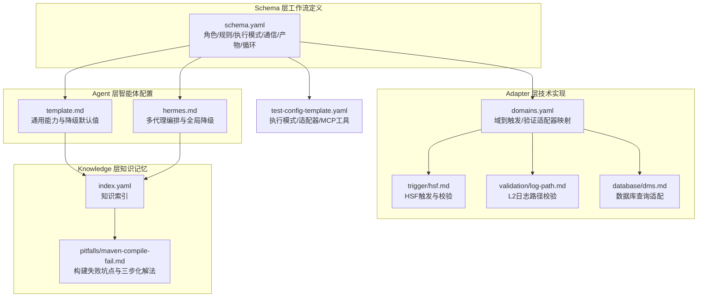
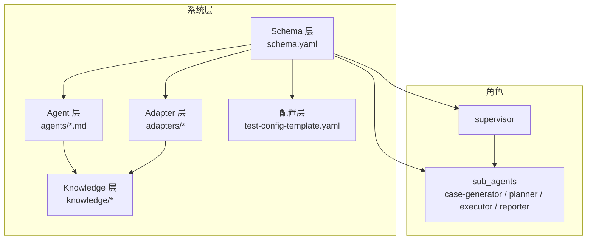
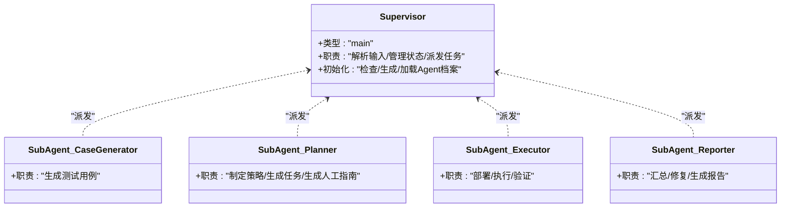
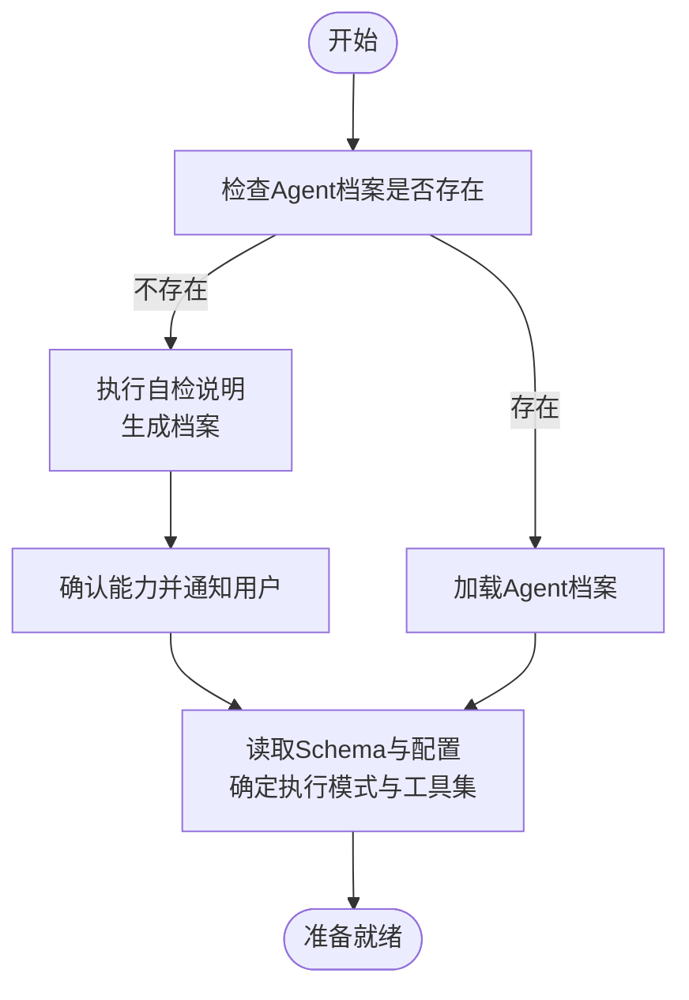
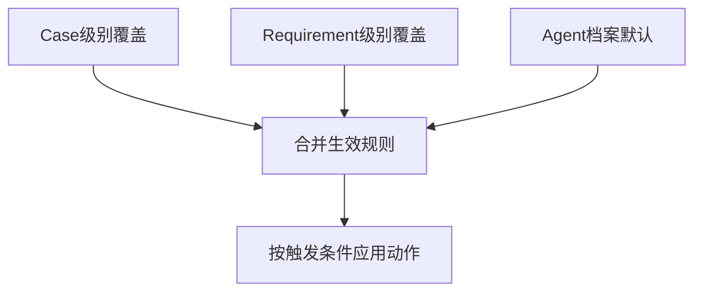
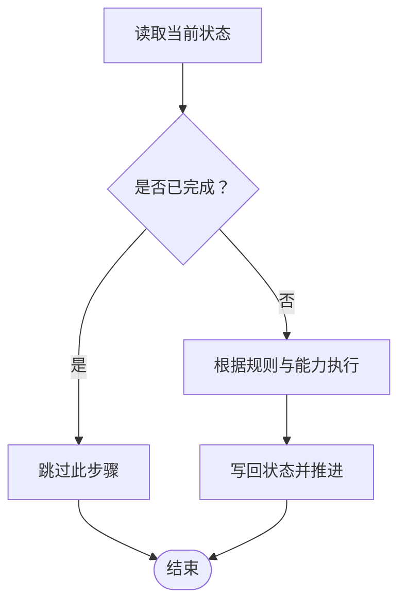
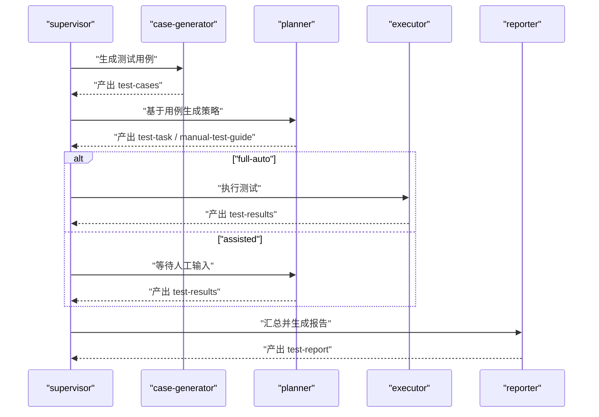
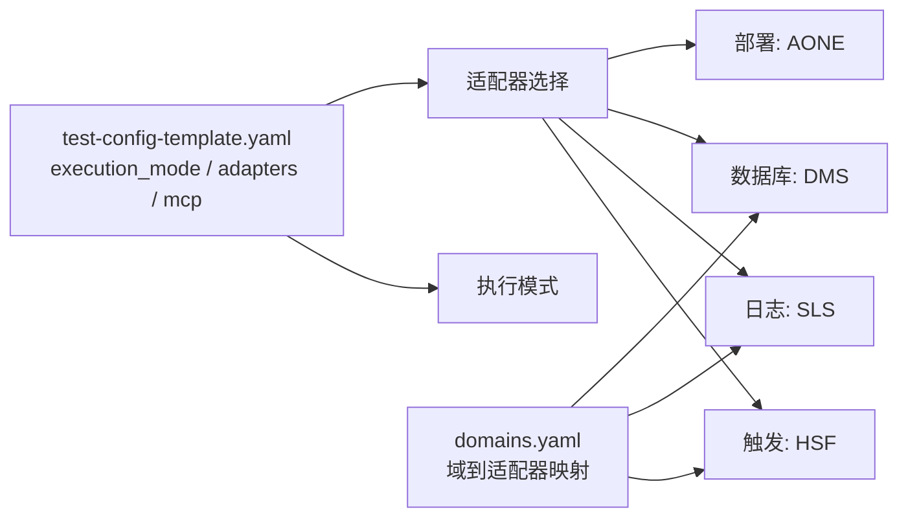
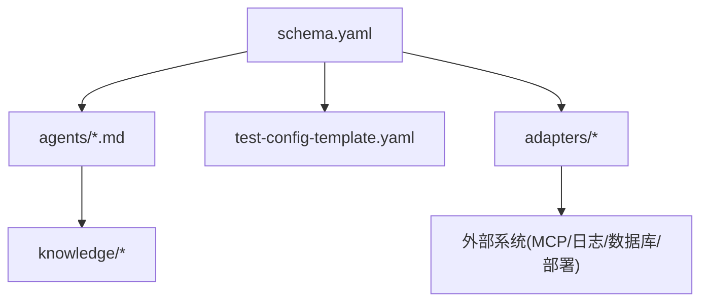

# 角色管理

<cite>
**本文引用的文件**
- [README.md](file://README.md)
- [DESIGN.md](file://DESIGN.md)
- [INSTRUCTIONS.md](file://INSTRUCTIONS.md)
- [schema.yaml](file://schemas/ai-test-workflow/schema.yaml)
- [template.md](file://agents/template.md)
- [hermes.md](file://agents/hermes.md)
- [domains.yaml](file://adapters/domains.yaml)
- [test-config-template.yaml](file://config/test-config-template.yaml)
- [hsf.md](file://adapters/trigger/hsf.md)
- [log-path.md](file://adapters/validation/log-path.md)
- [dms.md](file://adapters/database/dms.md)
- [index.yaml](file://knowledge/index.yaml)
- [maven-compile-fail.md](file://knowledge/pitfalls/maven-compile-fail.md)
</cite>

## 目录
1. [简介](#简介)
2. [项目结构](#项目结构)
3. [核心组件](#核心组件)
4. [架构总览](#架构总览)
5. [详细组件分析](#详细组件分析)
6. [依赖分析](#依赖分析)
7. [性能考虑](#性能考虑)
8. [故障排查指南](#故障排查指南)
9. [结论](#结论)
10. [附录](#附录)

## 简介
本文件面向“角色管理”主题，系统化梳理该AI自动测试SOP框架中的角色体系：以supervisor主协调器与sub_agents子代理为核心，结合角色定义、职责分工、协作机制、初始化流程、能力识别与降级策略、角色配置语法、权限控制与状态同步、角色间通信协议与数据流转、扩展与自定义指导，以及监控与性能优化策略。目标是帮助读者快速掌握如何在该框架中设计、部署与演进角色体系。

## 项目结构
该仓库采用分层解耦的设计理念，围绕“工作流定义（Schema）—适配器（Adapter）—智能体（Agent）—知识库（Knowledge）”四层展开，并通过统一的配置模板与共享状态文件实现跨层协作与可演进性。

图示来源
- [schema.yaml:1-111](file://schemas/ai-test-workflow/schema.yaml#L1-L111)
- [template.md:1-36](file://agents/template.md#L1-L36)
- [hermes.md:1-29](file://agents/hermes.md#L1-L29)
- [domains.yaml:1-27](file://adapters/domains.yaml#L1-L27)
- [hsf.md:1-14](file://adapters/trigger/hsf.md#L1-L14)
- [log-path.md:1-10](file://adapters/validation/log-path.md#L1-L10)
- [dms.md:1-10](file://adapters/database/dms.md#L1-L10)
- [index.yaml:1-10](file://knowledge/index.yaml#L1-L10)
- [maven-compile-fail.md:1-18](file://knowledge/pitfalls/maven-compile-fail.md#L1-L18)
- [test-config-template.yaml:1-32](file://config/test-config-template.yaml#L1-L32)

章节来源
- [README.md:71-84](file://README.md#L71-L84)
- [DESIGN.md:12-38](file://DESIGN.md#L12-L38)

## 核心组件
- 角色定义与职责
  - supervisor：主协调器，负责输入解析、状态管理、任务派发与结果汇总。
  - sub_agents：一组子代理，按职责拆分，包括用例生成、策略规划、执行与验证、报告生成等。
- 角色初始化流程
  - 自检与能力确认：首次运行时检查当前Agent档案是否存在，不存在则按自检说明生成档案并确认能力；存在则加载档案。
  - 上下文加载：读取Schema与用户配置，确定执行模式与可用MCP工具集。
- 能力识别与降级策略
  - 通过Agent档案声明能力（文件读写、Shell、后台进程、并行代理、状态管理等），并设定全局降级规则。
  - 三层继承链：Case级别 > Requirement级别 > 全局（Agent档案），后层覆盖前层未指定项。
  - 可用触发条件：无MCP、无Shell、无部署、无数据库访问；对应动作：SKIP、FAIL、MANUAL、FALLBACK:<adapter>。
- 权限控制与状态同步
  - 基于共享文件的状态机（test-status.json）进行跨角色通信，遵循“先读后写、已完成则跳过、循环控制”等规则。
- 通信协议与数据流转
  - 文件态协议：各角色通过读写test-status.json推进流程；产物按Schema定义顺序生成，满足前置依赖与条件分支。
- 配置语法与适配器生态
  - 执行模式：full-auto或assisted；适配器：触发（如HSF）、日志（如SLS）、数据库（如DMS）、部署（如AONE）。
  - 域到适配器映射：domains.yaml将不同测试域（后端接口、前端UI、全栈）映射到对应的触发与验证适配器集合。

章节来源
- [schema.yaml:8-26](file://schemas/ai-test-workflow/schema.yaml#L8-L26)
- [schema.yaml:30-61](file://schemas/ai-test-workflow/schema.yaml#L30-L61)
- [schema.yaml:74-77](file://schemas/ai-test-workflow/schema.yaml#L74-L77)
- [schema.yaml:81-104](file://schemas/ai-test-workflow/schema.yaml#L81-L104)
- [INSTRUCTIONS.md:9-26](file://INSTRUCTIONS.md#L9-L26)
- [template.md:17-36](file://agents/template.md#L17-L36)
- [hermes.md:15-23](file://agents/hermes.md#L15-L23)
- [DESIGN.md:127-187](file://DESIGN.md#L127-L187)
- [domains.yaml:1-27](file://adapters/domains.yaml#L1-L27)
- [test-config-template.yaml:1-32](file://config/test-config-template.yaml#L1-L32)

## 架构总览
下图展示角色管理在整体系统中的位置与交互关系：Schema层定义角色与规则，Agent层提供能力与降级策略，Adapter层封装技术实现，Knowledge层提供历史经验，配置文件驱动执行模式与适配器选择。

图示来源
- [schema.yaml:1-111](file://schemas/ai-test-workflow/schema.yaml#L1-L111)
- [hermes.md:10-13](file://agents/hermes.md#L10-L13)
- [template.md:17-27](file://agents/template.md#L17-L27)
- [domains.yaml:1-27](file://adapters/domains.yaml#L1-L27)
- [index.yaml:1-10](file://knowledge/index.yaml#L1-L10)
- [test-config-template.yaml:1-32](file://config/test-config-template.yaml#L1-L32)

## 详细组件分析

### 角色定义与职责
- supervisor
  - 类型：main
  - 描述：解析输入、管理状态、派发任务
  - 初始化步骤：检查Agent档案、缺失时自动生成并确认能力、加载档案
- sub_agents 子代理
  - case-generator：分析规范/代码，生成测试用例
  - planner：制定策略，生成测试任务与（可选）人工测试指南
  - executor：部署/执行/验证
  - reporter：汇总结果、修复问题、生成报告

图示来源
- [schema.yaml:8-26](file://schemas/ai-test-workflow/schema.yaml#L8-L26)

章节来源
- [schema.yaml:8-26](file://schemas/ai-test-workflow/schema.yaml#L8-L26)
- [INSTRUCTIONS.md:9-26](file://INSTRUCTIONS.md#L9-L26)

### 角色初始化流程
- 自检与档案生成
  - 若当前Agent档案不存在，则执行自检说明，生成档案并提示用户确认能力
  - 若已存在，则直接加载档案以确定能力
- 上下文加载
  - 读取Schema与用户配置，确定执行模式（full-auto/assisted）
  - 识别MCP工具可用性，为后续降级策略提供依据

图示来源
- [INSTRUCTIONS.md:9-26](file://INSTRUCTIONS.md#L9-L26)

章节来源
- [INSTRUCTIONS.md:9-26](file://INSTRUCTIONS.md#L9-L26)

### 能力识别与降级策略
- 能力识别
  - Agent档案声明能力项（文件读写、Shell、后台进程、并行代理、状态管理等）
- 降级规则
  - 三层继承链：Case级别 > Requirement级别 > 全局（Agent档案）
  - 触发条件：无MCP、无Shell、无部署、无数据库访问
  - 动作：SKIP、FAIL、MANUAL、FALLBACK:<adapter>
- 示例生效规则
  - 某Case在Requirement与Agent档案基础上叠加特定覆盖，最终形成生效规则集

图示来源
- [schema.yaml:38-61](file://schemas/ai-test-workflow/schema.yaml#L38-L61)
- [template.md:17-27](file://agents/template.md#L17-L27)
- [hermes.md:15-23](file://agents/hermes.md#L15-L23)

章节来源
- [DESIGN.md:127-187](file://DESIGN.md#L127-L187)
- [schema.yaml:38-61](file://schemas/ai-test-workflow/schema.yaml#L38-L61)
- [template.md:17-27](file://agents/template.md#L17-L27)
- [hermes.md:15-23](file://agents/hermes.md#L15-L23)

### 权限控制与状态同步
- 权限控制
  - 输入源只读，输出必须写入test-runs/<requirement-id>/目录，避免混用输入输出
  - 工具调用（HSF、SQL、Shell）必须在执行前记录参数与结果
- 状态同步
  - 使用共享文件test-status.json作为状态机
  - 规则：先读后写、已完成则跳过、循环控制（如repair-cycle）

图示来源
- [schema.yaml:30-37](file://schemas/ai-test-workflow/schema.yaml#L30-L37)
- [schema.yaml:74-77](file://schemas/ai-test-workflow/schema.yaml#L74-L77)
- [schema.yaml:105-109](file://schemas/ai-test-workflow/schema.yaml#L105-L109)

章节来源
- [schema.yaml:30-37](file://schemas/ai-test-workflow/schema.yaml#L30-L37)
- [schema.yaml:74-77](file://schemas/ai-test-workflow/schema.yaml#L74-L77)
- [schema.yaml:105-109](file://schemas/ai-test-workflow/schema.yaml#L105-L109)

### 通信协议与数据流转
- 协议
  - 文件态协议：所有角色通过test-status.json进行状态同步
- 数据流
  - 产物按Schema定义顺序生成，满足前置依赖与条件分支（如execution_mode决定manual-test-guide与test-results的生成）
- 循环控制
  - repair-cycle在测试结果包含FAIL时触发，最多重试若干次

图示来源
- [schema.yaml:65-70](file://schemas/ai-test-workflow/schema.yaml#L65-L70)
- [schema.yaml:81-104](file://schemas/ai-test-workflow/schema.yaml#L81-L104)
- [schema.yaml:105-109](file://schemas/ai-test-workflow/schema.yaml#L105-L109)

章节来源
- [schema.yaml:65-70](file://schemas/ai-test-workflow/schema.yaml#L65-L70)
- [schema.yaml:81-104](file://schemas/ai-test-workflow/schema.yaml#L81-L104)
- [schema.yaml:105-109](file://schemas/ai-test-workflow/schema.yaml#L105-L109)

### 角色配置语法与适配器生态
- 执行模式
  - full-auto：由AI完成全部流程
  - assisted：生成人工测试指南，等待人工执行与回填
- 适配器选择
  - 触发：如HSF
  - 日志：如SLS
  - 数据库：如DMS
  - 部署：如AONE
- 域到适配器映射
  - 后端接口、前端UI、全栈等域分别映射到不同的触发与验证适配器组合

图示来源
- [test-config-template.yaml:1-32](file://config/test-config-template.yaml#L1-L32)
- [domains.yaml:1-27](file://adapters/domains.yaml#L1-L27)
- [hsf.md:1-14](file://adapters/trigger/hsf.md#L1-L14)
- [log-path.md:1-10](file://adapters/validation/log-path.md#L1-L10)
- [dms.md:1-10](file://adapters/database/dms.md#L1-L10)

章节来源
- [test-config-template.yaml:1-32](file://config/test-config-template.yaml#L1-L32)
- [domains.yaml:1-27](file://adapters/domains.yaml#L1-L27)

### 扩展与自定义指导
- 新增Agent档案
  - 基于template.md补充能力清单与全局降级规则
  - 在hermes.md示例中学习多代理编排与失败处理思路
- 新增角色
  - 在schema.yaml的roles段落中新增子代理定义，并在artifacts中声明其产出与前置依赖
- 新增适配器
  - 在adapters/下新增触发/验证/诊断/数据库等适配器文件，并在domains.yaml中映射到相应域
- 自定义降级规则
  - 在agents/<profile>.md设置全局默认，在test-config.yaml覆盖需求级，在test-task.md覆盖用例级

章节来源
- [template.md:1-36](file://agents/template.md#L1-L36)
- [hermes.md:1-29](file://agents/hermes.md#L1-L29)
- [schema.yaml:8-26](file://schemas/ai-test-workflow/schema.yaml#L8-L26)
- [schema.yaml:81-104](file://schemas/ai-test-workflow/schema.yaml#L81-L104)
- [domains.yaml:1-27](file://adapters/domains.yaml#L1-L27)

## 依赖分析
- 组件耦合与内聚
  - Schema层对Agent与Adapter层具有强约束（角色职责、产物依赖、执行模式），但通过配置与适配器实现低耦合
  - Agent层与Knowledge层弱耦合，仅通过知识索引与坑点文件进行信息交互
- 外部依赖与集成点
  - MCP工具（日志、数据库、部署）通过配置启用
  - 适配器通过命令行或HTTP接口与外部系统交互
- 循环依赖规避
  - 通过状态文件与单向数据流避免角色间循环调用

图示来源
- [schema.yaml:1-111](file://schemas/ai-test-workflow/schema.yaml#L1-L111)
- [test-config-template.yaml:18-22](file://config/test-config-template.yaml#L18-L22)
- [index.yaml:1-10](file://knowledge/index.yaml#L1-L10)

章节来源
- [schema.yaml:1-111](file://schemas/ai-test-workflow/schema.yaml#L1-L111)
- [test-config-template.yaml:18-22](file://config/test-config-template.yaml#L18-L22)

## 性能考虑
- 并行执行
  - 支持子代理并行独立验证任务，提升吞吐
- 降级策略
  - 在工具不可用时自动SKIP或MANUAL，避免无效阻塞
- 状态同步
  - 文件态协议简单可靠，建议避免频繁小粒度写入，批量更新状态
- 适配器选择
  - 优先选择响应快、稳定性高的外部工具与适配器实现

## 故障排查指南
- 常见问题定位
  - 执行日志缺失：确认每次工具调用前是否已写execution-log.md
  - 状态异常：检查test-status.json读写权限与并发冲突
  - 产物缺失：核对artifacts依赖链与execution_mode条件
- 降级规则生效
  - 检查agents/<profile>.md、test-config.yaml、test-task.md的覆盖层级是否正确
- 知识库辅助
  - 参考pitfalls中的典型问题与解决方案，减少重复踩坑

章节来源
- [schema.yaml:30-37](file://schemas/ai-test-workflow/schema.yaml#L30-L37)
- [schema.yaml:74-77](file://schemas/ai-test-workflow/schema.yaml#L74-L77)
- [schema.yaml:81-104](file://schemas/ai-test-workflow/schema.yaml#L81-L104)
- [maven-compile-fail.md:1-18](file://knowledge/pitfalls/maven-compile-fail.md#L1-L18)

## 结论
该角色管理体系以Schema为纲、Agent为体、Adapter为用、Knowledge为辅，通过文件态状态机与三层降级规则实现了高弹性与可演进的测试自动化框架。supervisor负责全局编排，sub_agents按职责拆分，配合配置与适配器生态，既支持全自动化也支持人机协同。通过明确的初始化流程、权限控制与状态同步机制，以及完善的扩展与自定义指导，能够有效支撑复杂场景下的角色演进与性能优化。

## 附录
- 关键参考文件路径
  - 角色与规则：[schema.yaml](file://schemas/ai-test-workflow/schema.yaml)
  - Agent档案模板与示例：[template.md](file://agents/template.md), [hermes.md](file://agents/hermes.md)
  - 配置模板：[test-config-template.yaml](file://config/test-config-template.yaml)
  - 适配器与域映射：[domains.yaml](file://adapters/domains.yaml), [hsf.md](file://adapters/trigger/hsf.md), [log-path.md](file://adapters/validation/log-path.md), [dms.md](file://adapters/database/dms.md)
  - 知识库索引与坑点：[index.yaml](file://knowledge/index.yaml), [maven-compile-fail.md](file://knowledge/pitfalls/maven-compile-fail.md)
  - 触发协议与使用说明：[INSTRUCTIONS.md](file://INSTRUCTIONS.md), [README.md](file://README.md)