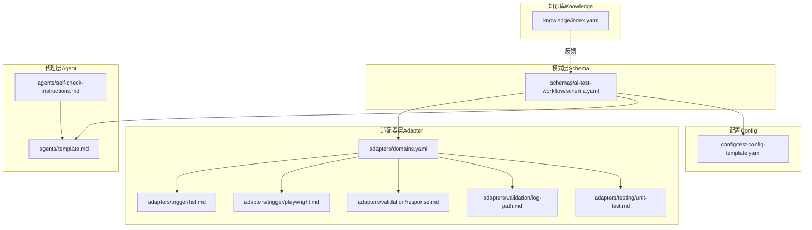
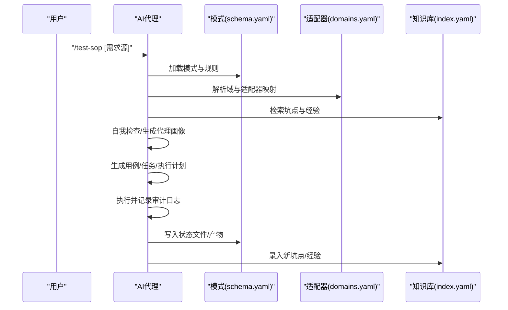
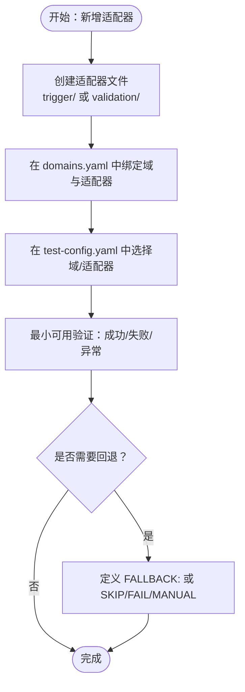
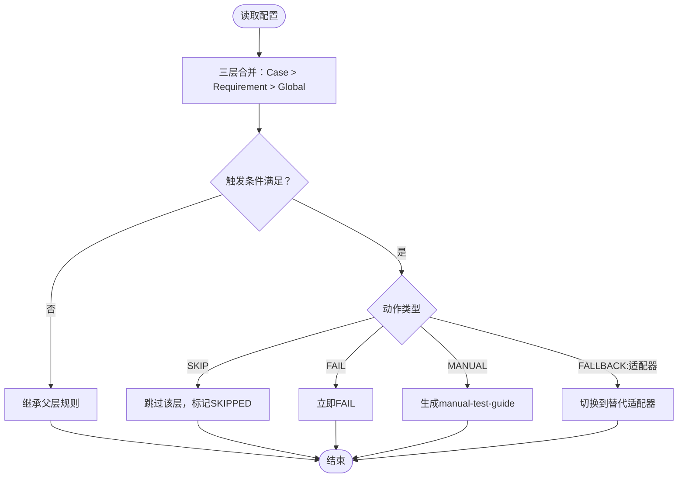
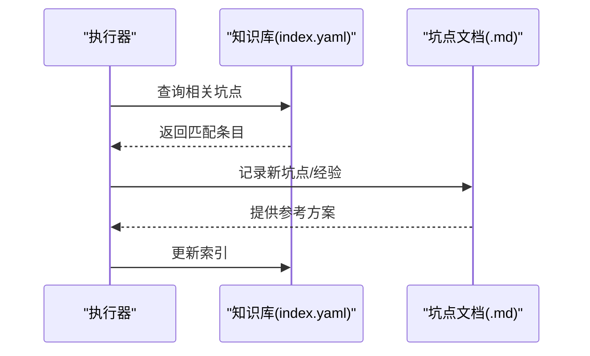
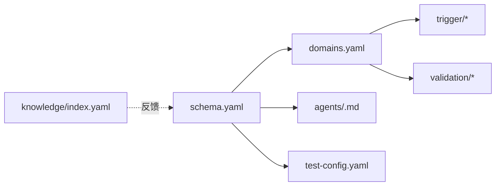

# 开发者指南

<cite>
**本文引用的文件**
- [README.md](file://README.md)
- [DESIGN.md](file://DESIGN.md)
- [INSTRUCTIONS.md](file://INSTRUCTIONS.md)
- [install.sh](file://install.sh)
- [adapters/domains.yaml](file://adapters/domains.yaml)
- [adapters/trigger/hsf.md](file://adapters/trigger/hsf.md)
- [adapters/trigger/playwright.md](file://adapters/trigger/playwright.md)
- [adapters/validation/response.md](file://adapters/validation/response.md)
- [adapters/validation/log-path.md](file://adapters/validation/log-path.md)
- [adapters/testing/unit-test.md](file://adapters/testing/unit-test.md)
- [schemas/ai-test-workflow/schema.yaml](file://schemas/ai-test-workflow/schema.yaml)
- [agents/template.md](file://agents/template.md)
- [agents/self-check-instructions.md](file://agents/self-check-instructions.md)
- [config/test-config-template.yaml](file://config/test-config-template.yaml)
- [knowledge/index.yaml](file://knowledge/index.yaml)
</cite>

## 目录
1. [简介](#简介)
2. [项目结构](#项目结构)
3. [核心组件](#核心组件)
4. [架构总览](#架构总览)
5. [详细组件分析](#详细组件分析)
6. [依赖关系分析](#依赖关系分析)
7. [性能与可维护性建议](#性能与可维护性建议)
8. [故障排查指南](#故障排查指南)
9. [结论](#结论)
10. [附录](#附录)

## 简介
本指南面向希望扩展适配器系统、自定义代理配置与贡献知识库的开发者。内容覆盖适配器开发流程、接口规范、测试方法；代理配置的高级选项与降级策略；知识库扩展与贡献流程；以及开发环境搭建、调试工具、测试策略、版本管理与发布流程、向后兼容性与开源贡献实践。

## 项目结构
该仓库采用“分层解耦”的设计：通过模式定义（Schema）、适配器实现（Adapter）、代理能力（Agent）与知识库（Knowledge）四层协作，形成“无侵入、可替换、可自进化”的测试框架。

图表来源
- [schemas/ai-test-workflow/schema.yaml:1-111](file://schemas/ai-test-workflow/schema.yaml#L1-L111)
- [adapters/domains.yaml:1-27](file://adapters/domains.yaml#L1-L27)
- [adapters/trigger/hsf.md:1-14](file://adapters/trigger/hsf.md#L1-L14)
- [adapters/trigger/playwright.md:1-8](file://adapters/trigger/playwright.md#L1-L8)
- [adapters/validation/response.md:1-7](file://adapters/validation/response.md#L1-L7)
- [adapters/validation/log-path.md:1-10](file://adapters/validation/log-path.md#L1-L10)
- [adapters/testing/unit-test.md:1-11](file://adapters/testing/unit-test.md#L1-L11)
- [agents/template.md:1-36](file://agents/template.md#L1-L36)
- [agents/self-check-instructions.md:1-25](file://agents/self-check-instructions.md#L1-L25)
- [config/test-config-template.yaml:1-32](file://config/test-config-template.yaml#L1-L32)
- [knowledge/index.yaml:1-10](file://knowledge/index.yaml#L1-L10)

章节来源
- [README.md:71-84](file://README.md#L71-L84)
- [DESIGN.md:12-38](file://DESIGN.md#L12-L38)

## 核心组件
- 模式层（Schema）
  - 定义角色、规则、执行模式、通信协议、产物与循环控制，确保流程可声明、可演进。
- 适配器层（Adapter）
  - 封装具体技术实现（触发器、日志、数据库、部署、校验等），支持多域组合与替换。
- 代理层（Agent）
  - 描述代理能力与全局降级规则，支持自动自我检测与能力画像生成。
- 知识库（Knowledge）
  - 记录坑点与最佳实践，支撑运行时检索与自进化。

章节来源
- [DESIGN.md:12-38](file://DESIGN.md#L12-L38)
- [schemas/ai-test-workflow/schema.yaml:8-26](file://schemas/ai-test-workflow/schema.yaml#L8-L26)
- [adapters/domains.yaml:1-27](file://adapters/domains.yaml#L1-L27)
- [agents/template.md:1-36](file://agents/template.md#L1-L36)
- [knowledge/index.yaml:1-10](file://knowledge/index.yaml#L1-L10)

## 架构总览
系统通过模式驱动的任务编排，结合适配器插件化实现与代理能力自适应，形成“Agent 无关、Spec 无关、自进化”的测试闭环。

图表来源
- [INSTRUCTIONS.md:5-44](file://INSTRUCTIONS.md#L5-L44)
- [DESIGN.md:39-55](file://DESIGN.md#L39-L55)
- [schemas/ai-test-workflow/schema.yaml:1-111](file://schemas/ai-test-workflow/schema.yaml#L1-L111)
- [adapters/domains.yaml:1-27](file://adapters/domains.yaml#L1-L27)
- [knowledge/index.yaml:1-10](file://knowledge/index.yaml#L1-L10)

## 详细组件分析

### 适配器系统扩展指南
- 设计原则
  - 以“域”为中心组织适配器，每个域由一组触发器与验证器组成，便于组合与替换。
  - 适配器以纯文本/脚本形式存在，降低对运行时的耦合。
- 开发流程
  1) 在适配器目录新增实现文件（如 trigger/xxx.md 或 validation/xxx.md）。
  2) 在域注册表中绑定该适配器到目标域。
  3) 在配置中选择对应域或直接指定适配器。
  4) 编写最小可用示例与失败分支处理，确保可回退。
- 接口规范
  - 触发器：描述如何调用外部系统（如 HSF HTTP 代理、Playwright 页面操作）。
  - 验证器：定义 L1-L4 层级的校验规则（响应结构、日志路径、数据状态等）。
  - 单元测试：提供编译期与运行期失败的兜底策略。
- 测试方法
  - 使用配置模板启用目标适配器，运行端到端流程，观察产物与状态文件。
  - 对关键路径编写断言与回归用例，覆盖成功、失败与异常场景。

图表来源
- [adapters/domains.yaml:1-27](file://adapters/domains.yaml#L1-L27)
- [adapters/trigger/hsf.md:1-14](file://adapters/trigger/hsf.md#L1-L14)
- [adapters/trigger/playwright.md:1-8](file://adapters/trigger/playwright.md#L1-L8)
- [adapters/validation/response.md:1-7](file://adapters/validation/response.md#L1-L7)
- [adapters/validation/log-path.md:1-10](file://adapters/validation/log-path.md#L1-L10)
- [adapters/testing/unit-test.md:1-11](file://adapters/testing/unit-test.md#L1-L11)
- [config/test-config-template.yaml:9-14](file://config/test-config-template.yaml#L9-L14)

章节来源
- [adapters/domains.yaml:1-27](file://adapters/domains.yaml#L1-L27)
- [adapters/trigger/hsf.md:1-14](file://adapters/trigger/hsf.md#L1-L14)
- [adapters/trigger/playwright.md:1-8](file://adapters/trigger/playwright.md#L1-L8)
- [adapters/validation/response.md:1-7](file://adapters/validation/response.md#L1-L7)
- [adapters/validation/log-path.md:1-10](file://adapters/validation/log-path.md#L1-L10)
- [adapters/testing/unit-test.md:1-11](file://adapters/testing/unit-test.md#L1-L11)
- [config/test-config-template.yaml:9-14](file://config/test-config-template.yaml#L9-L14)

### 代理配置与降级策略
- 能力画像
  - 代理需声明文件读写、Shell、后台进程、并行代理、MCP 支持等能力。
  - 若缺失能力，系统按三层继承链进行降级：Case > Requirement > Global（代理画像）。
- 降级动作
  - SKIP：跳过该层级，标记为 SKIPPED。
  - FAIL：直接标记用例 FAIL。
  - MANUAL：降级为人工模式，生成手动测试指南。
  - FALLBACK:<adapter>：切换到替代适配器。
- 配置要点
  - 在代理画像中设置默认降级规则。
  - 在需求配置中覆盖特定触发条件的动作。
  - 在单个用例中微调例外情况。

图表来源
- [agents/template.md:1-36](file://agents/template.md#L1-L36)
- [schemas/ai-test-workflow/schema.yaml:38-61](file://schemas/ai-test-workflow/schema.yaml#L38-L61)
- [DESIGN.md:127-187](file://DESIGN.md#L127-L187)

章节来源
- [agents/template.md:1-36](file://agents/template.md#L1-L36)
- [agents/self-check-instructions.md:1-25](file://agents/self-check-instructions.md#L1-L25)
- [schemas/ai-test-workflow/schema.yaml:38-61](file://schemas/ai-test-workflow/schema.yaml#L38-L61)
- [DESIGN.md:127-187](file://DESIGN.md#L127-L187)

### 知识库扩展与贡献流程
- 结构
  - 索引文件用于快速检索坑点与最佳实践。
  - 坑点文档记录问题现象、根因、解决方案与验证步骤。
- 贡献流程
  - 运行时捕获异常与异常模式，自动生成坑点条目。
  - 维护者审阅后归档至知识库，供后续检索与学习。
- 使用建议
  - 在生成用例与执行前查询知识库，避免重复踩坑。
  - 新增坑点时提供关键词、分类与最小复现步骤。

图表来源
- [knowledge/index.yaml:1-10](file://knowledge/index.yaml#L1-L10)
- [DESIGN.md:196-224](file://DESIGN.md#L196-L224)

章节来源
- [knowledge/index.yaml:1-10](file://knowledge/index.yaml#L1-L10)
- [DESIGN.md:196-224](file://DESIGN.md#L196-L224)

### 配置模板与安装脚本
- 安装脚本
  - 自动克隆/更新仓库，清理历史元数据，生成默认配置文件。
- 配置模板
  - 定义执行模式、适配器选择、MCP 工具开关、项目上下文与降级覆盖。
- 使用建议
  - 在模板基础上按项目栈调整适配器与工具集。
  - 仅在必要时覆盖降级规则，保持默认行为以获得最大兼容性。

章节来源
- [install.sh:1-40](file://install.sh#L1-L40)
- [config/test-config-template.yaml:1-32](file://config/test-config-template.yaml#L1-L32)

## 依赖关系分析
- 模式依赖适配器：模式通过域注册表解析适配器集合，决定执行路径。
- 代理影响执行策略：代理能力决定是否可异步部署、是否支持 MCP、是否可并行。
- 知识库反哺模式：运行时反馈进入知识库，指导后续用例生成与参数调整。

图表来源
- [schemas/ai-test-workflow/schema.yaml:1-111](file://schemas/ai-test-workflow/schema.yaml#L1-L111)
- [adapters/domains.yaml:1-27](file://adapters/domains.yaml#L1-L27)
- [agents/template.md:1-36](file://agents/template.md#L1-L36)
- [config/test-config-template.yaml:1-32](file://config/test-config-template.yaml#L1-L32)
- [knowledge/index.yaml:1-10](file://knowledge/index.yaml#L1-L10)

章节来源
- [schemas/ai-test-workflow/schema.yaml:1-111](file://schemas/ai-test-workflow/schema.yaml#L1-L111)
- [adapters/domains.yaml:1-27](file://adapters/domains.yaml#L1-L27)
- [agents/template.md:1-36](file://agents/template.md#L1-L36)
- [config/test-config-template.yaml:1-32](file://config/test-config-template.yaml#L1-L32)
- [knowledge/index.yaml:1-10](file://knowledge/index.yaml#L1-L10)

## 性能与可维护性建议
- 适配器层面
  - 将外部调用封装为幂等、可重试的步骤，并在执行前记录审计日志。
  - 对耗时操作使用超时与并发上限，避免阻塞整体流程。
- 代理层面
  - 合理利用并行代理能力，减少串行等待时间；在不支持并行时采用顺序执行。
- 模式与配置
  - 优先使用默认降级规则，仅在特殊需求时覆盖，降低维护成本。
  - 将环境差异收敛到适配器与知识库，而非频繁修改模式。
- 日志与可观测性
  - 严格遵守“先写日志再执行”的约定，确保可追溯性与问题定位效率。

## 故障排查指南
- 常见问题定位
  - 查看状态文件：确认当前步骤与重试次数。
  - 查看审计日志：核对每次外部调用的参数与结果。
- 适配器问题
  - 检查域注册是否正确、适配器路径是否存在、MCP 工具是否启用。
  - 对失败场景补充 FALLBACK 或 SKIP，确保流程可继续。
- 代理能力不足
  - 通过自我检查指令生成画像，补齐缺失能力或调整降级规则。
- 知识库辅助
  - 搜索相关坑点，复用已有解决方案，减少重复排查。

章节来源
- [README.md:61-70](file://README.md#L61-L70)
- [DESIGN.md:56-105](file://DESIGN.md#L56-L105)

## 结论
本指南提供了从适配器扩展、代理配置到知识库贡献的全链路开发与运维实践。遵循分层解耦、声明式模式与自进化机制，可在不改变核心逻辑的前提下快速适配不同技术栈与团队能力，持续提升测试效率与质量。

## 附录

### 开发环境搭建
- 安装依赖：确保具备 Git 与 Bash 环境。
- 初始化：运行安装脚本，生成默认配置文件。
- 配置：根据项目栈调整适配器与 MCP 工具。

章节来源
- [install.sh:1-40](file://install.sh#L1-L40)
- [config/test-config-template.yaml:1-32](file://config/test-config-template.yaml#L1-L32)

### 调试与测试策略
- 调试工具
  - 状态文件与审计日志作为黑盒观测手段。
  - 在失败路径输出最小可复现步骤与上下文信息。
- 测试策略
  - 成功/失败/异常三类用例全覆盖。
  - 引入回归用例，覆盖关键适配器与代理能力组合。

章节来源
- [README.md:61-70](file://README.md#L61-L70)
- [adapters/testing/unit-test.md:1-11](file://adapters/testing/unit-test.md#L1-L11)

### 版本管理与发布
- 版本标识：模式文件包含版本号，用于追踪变更范围。
- 发布流程：更新主干后，下游项目通过安装脚本拉取最新版本。
- 向后兼容：通过三层降级规则与适配器替换，尽量避免破坏性变更。

章节来源
- [schemas/ai-test-workflow/schema.yaml:1-3](file://schemas/ai-test-workflow/schema.yaml#L1-L3)
- [README.md:54-59](file://README.md#L54-L59)

### 开源贡献指南
- 代码规范
  - 适配器以纯文本/脚本形式提供，注释清晰、路径明确。
  - 配置项遵循模板约定，避免冗余与歧义。
- 最佳实践
  - 优先通过适配器替换与知识库沉淀解决问题。
  - 在模式层面提出结构性变更前，先在提案目录中沉淀方案与影响评估。
- 性能优化
  - 减少不必要的外部调用，合并相似步骤，引入缓存与重试策略。

章节来源
- [DESIGN.md:196-224](file://DESIGN.md#L196-L224)
- [adapters/domains.yaml:1-27](file://adapters/domains.yaml#L1-L27)