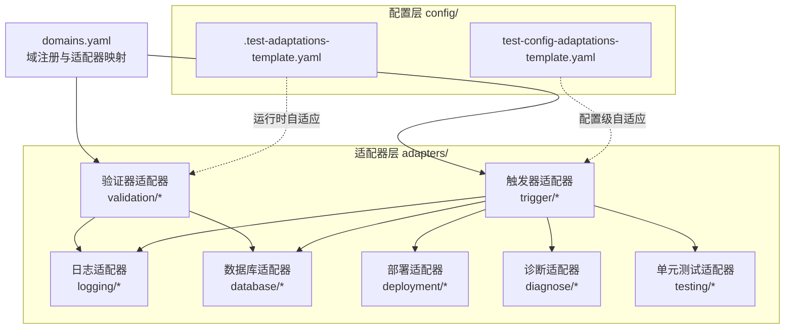
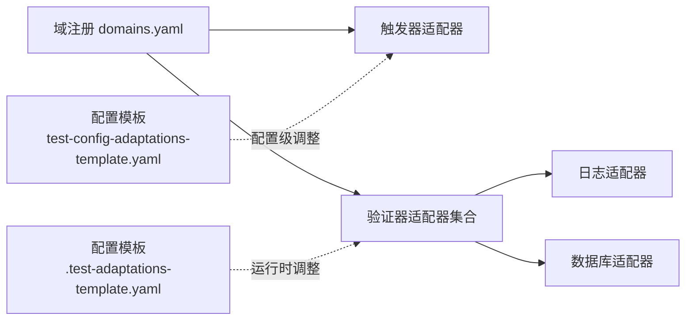
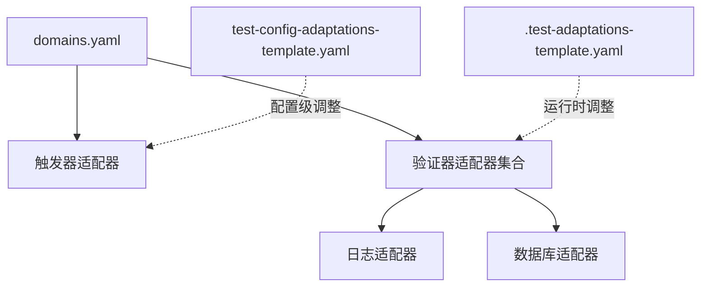

# 适配器开发指南

<cite>
**本文引用的文件**
- [README.md](file://README.md)
- [DESIGN.md](file://DESIGN.md)
- [domains.yaml](file://adapters/domains.yaml)
- [.test-adaptations-template.yaml](file://config/.test-adaptations-template.yaml)
- [test-config-adaptations-template.yaml](file://config/test-config-adaptations-template.yaml)
- [hsf.md](file://adapters/trigger/hsf.md)
- [playwright.md](file://adapters/trigger/playwright.md)
- [response.md](file://adapters/validation/response.md)
- [log-path.md](file://adapters/validation/log-path.md)
- [data-state.md](file://adapters/validation/data-state.md)
- [sls.md](file://adapters/logging/sls.md)
- [dms.md](file://adapters/database/dms.md)
- [aone.md](file://adapters/deployment/aone.md)
- [arthas.md](file://adapters/diagnose/arthas.md)
- [unit-test.md](file://adapters/testing/unit-test.md)
</cite>

## 目录
1. [简介](#简介)
2. [项目结构](#项目结构)
3. [核心组件](#核心组件)
4. [架构总览](#架构总览)
5. [详细组件分析](#详细组件分析)
6. [依赖关系分析](#依赖关系分析)
7. [性能考量](#性能考量)
8. [故障排查指南](#故障排查指南)
9. [结论](#结论)
10. [附录](#附录)

## 简介
本指南面向希望为 AI 自动化测试框架扩展“适配器”的开发者，系统讲解适配器体系的架构设计与开发规范，覆盖触发器适配器、验证器适配器、日志适配器与数据库适配器的开发流程；明确接口规范、参数定义与返回值说明；阐述生命周期管理、错误处理机制与性能优化策略；提供可复用的模板与最佳实践，并给出配置管理、版本控制与向后兼容的建议。

## 项目结构
该仓库采用“分层解耦 + 适配器插件化”的组织方式：
- schemas/：工作流定义（DAG + 模板）
- adapters/：技术实现适配器（触发器、验证器、日志、数据库、部署、诊断、单元测试等）
- agents/：AI 执行者能力描述与自检
- knowledge/：知识库（坑点与经验）
- config/：配置模板与运行时自适应规则

图表来源
- [domains.yaml:1-27](file://adapters/domains.yaml#L1-L27)
- [README.md:71-84](file://README.md#L71-L84)

章节来源
- [README.md:71-84](file://README.md#L71-L84)
- [DESIGN.md:12-38](file://DESIGN.md#L12-L38)

## 核心组件
- 触发器适配器：封装“如何发起一次测试动作”，如 HSF/HTTP 调用或前端 UI 操作。
- 验证器适配器：封装“如何验证结果”，分为 L1 响应、L2 日志路径、L3 数据状态等层级。
- 日志适配器：封装“如何查询与解析日志”，如 SLS 查询。
- 数据库适配器：封装“如何执行 SQL 并断言数据变更”。
- 部署适配器：封装“如何部署与健康检查”。
- 诊断适配器：封装“如何进行线上诊断与热修复”。
- 单元测试适配器：封装“如何在受限环境下运行单元测试”。

章节来源
- [DESIGN.md:56-95](file://DESIGN.md#L56-L95)
- [domains.yaml:1-27](file://adapters/domains.yaml#L1-L27)

## 架构总览
适配器系统通过“域注册 + 适配器清单”的方式，将不同测试域（如后端接口、前端 UI、全栈）与具体技术栈绑定，形成可插拔的执行链路。

图表来源
- [domains.yaml:1-27](file://adapters/domains.yaml#L1-L27)
- [.test-adaptations-template.yaml:1-16](file://config/.test-adaptations-template.yaml#L1-L16)
- [test-config-adaptations-template.yaml:1-26](file://config/test-config-adaptations-template.yaml#L1-L26)

## 详细组件分析

### 触发器适配器开发规范
- 设计目标：以最小接口封装一次“可重复、可观测”的触发行为，便于在不同 Agent 间复用。
- 接口规范
  - 入参：由调用方注入的环境变量与上下文参数（例如代理地址、接口签名、业务参数等），统一通过适配器文档声明。
  - 出参：返回标准结构（如成功标志、traceId、响应体摘要、耗时统计等），供后续验证使用。
- 参数定义
  - 必填项：接口标识、方法名、参数列表。
  - 可选项：超时、重试、鉴权头、traceId 注入等。
- 返回值说明
  - 成功：success=true，包含 traceId 与必要字段快照。
  - 失败：success=false，包含错误码、错误信息与建议处理方式。
- 生命周期管理
  - 触发前：记录到执行日志，包含入参与时间戳。
  - 触发中：按退避策略重试，避免抖动。
  - 触发后：产出标准化结果，用于上层断言。
- 错误处理
  - 网络异常：区分瞬时与永久，采用指数退避。
  - 业务异常：提取 code/message，结合降级策略（SKIP/FAIL/MANUAL/FALLBACK）。
- 性能优化
  - 合理设置超时与并发度，避免阻塞。
  - 对热点接口缓存必要元信息（如接口签名）。
- 示例参考
  - HSF 触发器：[hsf.md:1-14](file://adapters/trigger/hsf.md#L1-L14)
  - Playwright 触发器：[playwright.md:1-8](file://adapters/trigger/playwright.md#L1-L8)

章节来源
- [hsf.md:1-14](file://adapters/trigger/hsf.md#L1-L14)
- [playwright.md:1-8](file://adapters/trigger/playwright.md#L1-L8)

### 验证器适配器开发规范
- 设计目标：按层级对触发结果进行多维校验，确保端到端质量。
- L1 响应验证
  - 规则：校验 success 字段、code 值、data 结构完整性（空值、数组长度）。
  - 输出：通过/失败明细、失败原因归类。
  - 示例参考：[response.md:1-7](file://adapters/validation/response.md#L1-L7)
- L2 日志路径验证
  - 规则：从响应提取 traceId，查询日志，校验节点完整性、顺序与干净度（无 ERROR/WARN）。
  - 示例参考：[log-path.md:1-10](file://adapters/validation/log-path.md#L1-L10)
- L3 数据状态验证
  - 规则：执行前后快照对比，关注主数据与副作用表变化。
  - 示例参考：[data-state.md:1-8](file://adapters/validation/data-state.md#L1-L8)
- 生命周期管理
  - 在触发器之后立即执行，若 L1 不通过则短路。
  - L2/L3 可并行或串行，依据配置与依赖关系决定。
- 错误处理
  - 日志/数据库不可用时，根据降级规则选择 SKIP 或 MANUAL。
- 性能优化
  - 使用 traceId 精准检索，避免全量扫描。
  - 对高频断言做缓存与去重。
- 示例参考
  - L1 响应验证：[response.md:1-7](file://adapters/validation/response.md#L1-L7)
  - L2 日志路径验证：[log-path.md:1-10](file://adapters/validation/log-path.md#L1-L10)
  - L3 数据状态验证：[data-state.md:1-8](file://adapters/validation/data-state.md#L1-L8)

章节来源
- [response.md:1-7](file://adapters/validation/response.md#L1-L7)
- [log-path.md:1-10](file://adapters/validation/log-path.md#L1-L10)
- [data-state.md:1-8](file://adapters/validation/data-state.md#L1-L8)

### 日志适配器开发规范
- 设计目标：屏蔽底层日志平台差异，提供统一查询入口。
- 接口规范
  - 入参：traceId、时间窗口、过滤条件、日志源标识。
  - 出参：匹配的日志条目列表、统计信息（ERROR/WARN 计数）、是否干净。
- 参数定义
  - 必填：traceId。
  - 可选：project、logstore、query、时间范围、排除模式。
- 返回值说明
  - 成功：返回日志集与统计；失败：返回错误码与定位信息。
- 生命周期管理
  - 查询前写入执行日志，查询后输出摘要。
- 错误处理
  - 平台不可用：按降级策略处理；查询超时：重试或标记为部分结果。
- 性能优化
  - 使用精确查询条件与时间窗口，减少 IO。
  - 支持批量查询与并发限流。
- 示例参考
  - SLS 日志查询：[sls.md:1-10](file://adapters/logging/sls.md#L1-L10)

章节来源
- [sls.md:1-10](file://adapters/logging/sls.md#L1-L10)

### 数据库适配器开发规范
- 设计目标：在受限环境中安全地执行 SQL 并断言数据一致性。
- 接口规范
  - 入参：数据库标识、SQL 文本、参数化绑定。
  - 出参：查询结果集、受影响行数、执行耗时。
- 参数定义
  - 必填：database、sql。
  - 可选：只读事务、超时、分页大小。
- 返回值说明
  - 成功：返回结果集与元信息；失败：返回 SQL 错误码与语句片段。
- 生命周期管理
  - 读写分离：在触发前与触发后分别执行快照查询。
  - 事务隔离：尽量使用只读查询，避免影响生产数据。
- 错误处理
  - 权限不足：提示用户授权；连接失败：按降级策略处理。
- 性能优化
  - 使用索引列作为过滤条件，避免全表扫描。
  - 对高频查询做结果缓存与去重。
- 示例参考
  - DMS 数据查询：[dms.md:1-10](file://adapters/database/dms.md#L1-L10)

章节来源
- [dms.md:1-10](file://adapters/database/dms.md#L1-L10)

### 部署适配器开发规范
- 设计目标：在 CI/CD 环境中完成应用部署与健康检查。
- 接口规范
  - 入参：部署任务 ID、环境标识、镜像/包信息。
  - 出参：部署状态、健康检查结果、启动冷却时间。
- 参数定义
  - 必填：apre_id 或等价标识。
  - 可选：轮询间隔、最大等待时间、冷却时间。
- 返回值说明
  - 成功：SUCCESS + 健康检查详情；失败：FAILURE + 原因与回滚建议。
- 生命周期管理
  - 异步部署：后台触发 + 定期轮询 + 冷却。
  - 健康检查：端口探测、只读接口探测、日志观测。
- 错误处理
  - 部署失败：自动回滚或标记为 MANUAL。
- 性能优化
  - 合理设置轮询间隔与超时阈值。
- 示例参考
  - Aone 部署：[aone.md:1-12](file://adapters/deployment/aone.md#L1-L12)

章节来源
- [aone.md:1-12](file://adapters/deployment/aone.md#L1-L12)

### 诊断适配器开发规范
- 设计目标：在生产环境快速定位问题，支持轻量诊断与热修复。
- 接口规范
  - 入参：进程 PID、类名/方法名、诊断命令类型。
  - 出参：诊断结果（堆栈、耗时、线程状态等）。
- 参数定义
  - 必填：pid、class/method。
  - 可选：深度、时间窗、输出格式。
- 返回值说明
  - 成功：返回诊断指标与建议；失败：返回错误码与定位。
- 生命周期管理
  - 诊断前记录上下文，诊断后输出报告。
- 错误处理
  - 权限不足：提示用户提权；工具不可用：按降级策略处理。
- 性能优化
  - 控制采样深度与时长，避免对线上性能造成影响。
- 示例参考
  - Arthas 诊断：[arthas.md:1-10](file://adapters/diagnose/arthas.md#L1-L10)

章节来源
- [arthas.md:1-10](file://adapters/diagnose/arthas.md#L1-L10)

### 单元测试适配器开发规范
- 设计目标：在受限环境下稳定运行单元测试，处理编译与运行时异常。
- 决策树
  1) 预检查：编译测试类。
  2) 通过：直接运行测试。
  3) 编译失败：三步 workaround（依赖编译 → 单类编译 → 控制台运行）。
  4) 运行失败：标记 SKIP，引导人工介入。
- 参数定义
  - 必填：测试类/方法名、依赖路径。
  - 可选：JVM 参数、输出目录。
- 返回值说明
  - 成功：测试报告与覆盖率；失败：错误堆栈与建议。
- 生命周期管理
  - 优先本地缓存产物，避免重复编译。
- 错误处理
  - 依赖冲突：提示用户清理缓存；权限不足：提示用户授权。
- 性能优化
  - 并行运行互不依赖的测试套件。
- 示例参考
  - 单元测试策略：[unit-test.md:1-11](file://adapters/testing/unit-test.md#L1-L11)

章节来源
- [unit-test.md:1-11](file://adapters/testing/unit-test.md#L1-L11)

## 依赖关系分析
- 域注册与适配器映射
  - domains.yaml 将“域”与“触发器/验证器集合”关联，形成执行图谱。
- 适配器之间的依赖
  - 验证器依赖日志/数据库适配器提供的输入。
  - 触发器可能依赖部署/诊断/单元测试适配器的前置准备。
- 配置与自适应
  - .test-adaptations-template.yaml 与 test-config-adaptations-template.yaml 提供运行时与配置级的参数化调整能力。

图表来源
- [domains.yaml:1-27](file://adapters/domains.yaml#L1-L27)
- [.test-adaptations-template.yaml:1-16](file://config/.test-adaptations-template.yaml#L1-L16)
- [test-config-adaptations-template.yaml:1-26](file://config/test-config-adaptations-template.yaml#L1-L26)

章节来源
- [domains.yaml:1-27](file://adapters/domains.yaml#L1-L27)
- [.test-adaptations-template.yaml:1-16](file://config/.test-adaptations-template.yaml#L1-L16)
- [test-config-adaptations-template.yaml:1-26](file://config/test-config-adaptations-template.yaml#L1-L26)

## 性能考量
- 统一查询与缓存
  - 对日志与数据库查询建立缓存键（traceId/主键），避免重复 IO。
- 超时与并发
  - 为网络与数据库调用设置上限，防止雪崩；对并发请求做限流。
- 精准过滤
  - 使用 traceId、时间窗、索引列作为过滤条件，减少扫描范围。
- 异步与轮询
  - 部署与长任务采用异步 + 轮询，合理设置退避策略。
- 只读优先
  - 数据验证尽量使用只读查询，避免对生产数据产生副作用。

## 故障排查指南
- 触发器失败
  - 检查入参与鉴权头；查看执行日志中的请求与响应摘要；按降级策略切换或回退。
- 验证器失败
  - L1：核对响应结构与 code；L2：确认 traceId 正确与日志平台可用；L3：核对快照与断言逻辑。
- 日志/数据库不可用
  - 查看配置模板中的自适应规则，确认是否被临时禁用或降级。
- 部署失败
  - 检查轮询间隔与冷却时间；核对健康检查项；必要时回滚。
- 诊断与热修复
  - 确认进程 PID 与工具可用性；限制采样深度与时长。

章节来源
- [DESIGN.md:166-186](file://DESIGN.md#L166-L186)
- [sls.md:1-10](file://adapters/logging/sls.md#L1-L10)
- [dms.md:1-10](file://adapters/database/dms.md#L1-L10)
- [aone.md:1-12](file://adapters/deployment/aone.md#L1-L12)

## 结论
适配器系统通过“域注册 + 适配器清单 + 配置自适应”的组合，实现了测试能力的模块化与可演进。开发者只需遵循统一的接口规范与生命周期约定，即可快速扩展新的技术栈适配器，并在运行过程中持续优化体验。

## 附录

### 开发流程与最佳实践
- 新增适配器步骤
  1) 在对应目录下新增适配器文档，命名清晰、职责单一。
  2) 在 domains.yaml 中注册或更新域与适配器映射。
  3) 在配置模板中补充必要的自适应规则与默认值。
  4) 编写最小可验证的示例，覆盖正常与异常分支。
  5) 在知识库记录常见坑点与排障要点。
- 测试方法
  - 单元测试：针对关键断言与边界条件编写用例。
  - 集成测试：在受控环境模拟日志/数据库/部署场景。
  - 回归测试：随版本更新回归关键路径。
- 调试技巧
  - 在每次外部调用前写入执行日志，保留上下文与时间戳。
  - 使用最小化参数复现问题，逐步缩小范围。
  - 利用配置模板临时放宽限制，定位根因。
- 版本控制与向后兼容
  - 保持接口入参与返回值稳定，新增字段以可选形式提供。
  - 通过配置模板与自适应规则实现渐进式升级，避免强制迁移。
  - 在知识库沉淀兼容性说明与迁移指引。

章节来源
- [DESIGN.md:196-224](file://DESIGN.md#L196-L224)
- [domains.yaml:1-27](file://adapters/domains.yaml#L1-L27)
- [.test-adaptations-template.yaml:1-16](file://config/.test-adaptations-template.yaml#L1-L16)
- [test-config-adaptations-template.yaml:1-26](file://config/test-config-adaptations-template.yaml#L1-L26)