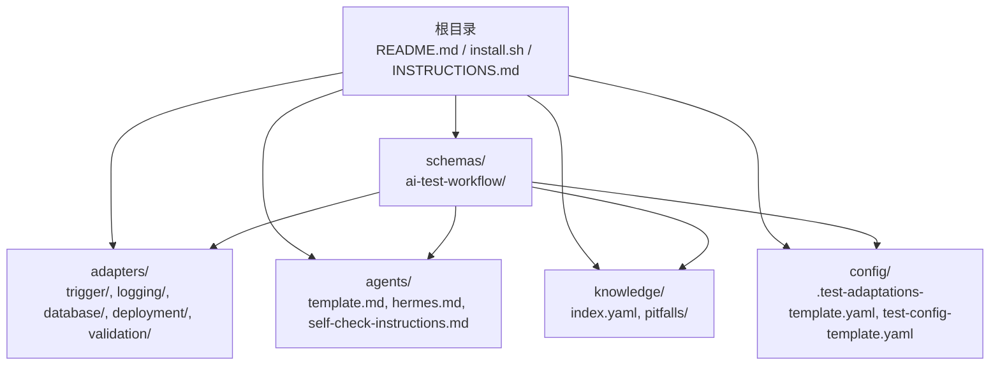
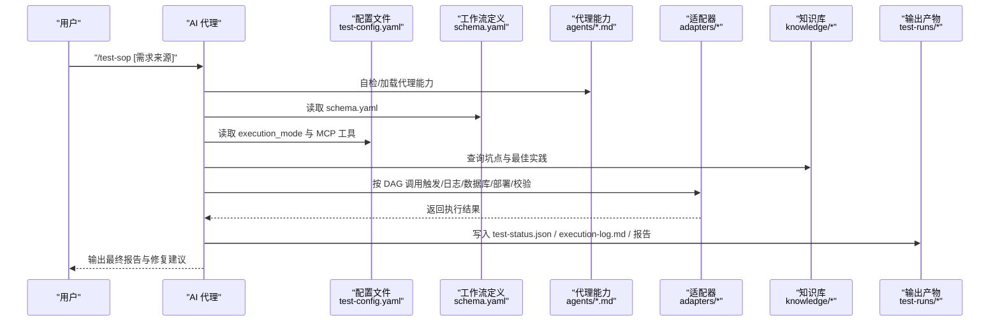
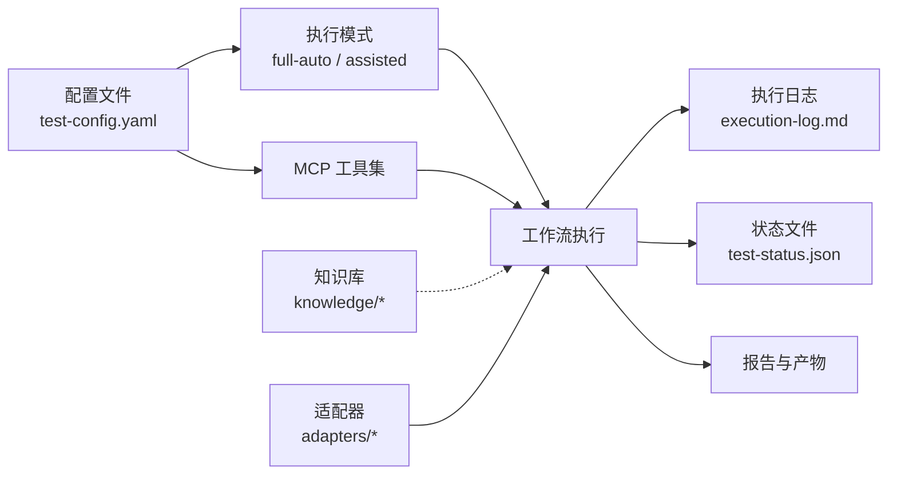

# 快速开始

<cite>
**本文引用的文件**
- [README.md](file://README.md)
- [install.sh](file://install.sh)
- [DESIGN.md](file://DESIGN.md)
- [INSTRUCTIONS.md](file://INSTRUCTIONS.md)
- [test-config-template.yaml](file://config/test-config-template.yaml)
- [.test-adaptations-template.yaml](file://config/.test-adaptations-template.yaml)
- [domains.yaml](file://adapters/domains.yaml)
- [playwright.md](file://adapters/trigger/playwright.md)
- [response.md](file://adapters/validation/response.md)
- [test-task.md](file://schemas/ai-test-workflow/templates/test-task.md)
- [manual-test-guide.md](file://schemas/ai-test-workflow/templates/manual-test-guide.md)
- [test-report.md](file://schemas/ai-test-workflow/templates/test-report.md)
- [template.md](file://agents/template.md)
</cite>

## 目录
1. [简介](#简介)
2. [项目结构](#项目结构)
3. [核心组件](#核心组件)
4. [架构总览](#架构总览)
5. [详细组件解析](#详细组件解析)
6. [依赖关系分析](#依赖关系分析)
7. [性能与可扩展性建议](#性能与可扩展性建议)
8. [故障排除指南](#故障排除指南)
9. [结论](#结论)
10. [附录](#附录)

## 简介
本指南旨在帮助你在最短时间内上手 AI 自动化测试 SOP 框架，覆盖两种启动方式：
- 零配置模式（推荐给 AI 代理）
- 手动设置模式（面向开发者）

你将学会如何克隆框架、准备配置文件、配置 MCP 工具、选择执行模式，并运行第一个测试流程。同时，文档解释了全自动化与人工辅助两种执行模式的区别与适用场景，并提供常见问题与排障建议。

## 项目结构
该仓库采用“分层 + 插件化”的组织方式：
- schemas/：工作流定义（DAG + 模板）
- adapters/：技术实现适配器（触发、日志、数据库、部署、校验等）
- agents/：AI 代理能力描述与自检模板
- knowledge/：知识库（坑点与最佳实践）
- config/：配置模板与运行时适配文件
- 根目录：安装脚本、设计文档、使用说明与入口指令

图表来源
- [README.md:71-84](file://README.md#L71-L84)
- [DESIGN.md:12-38](file://DESIGN.md#L12-L38)

章节来源
- [README.md:71-84](file://README.md#L71-L84)
- [DESIGN.md:12-38](file://DESIGN.md#L12-L38)

## 核心组件
- 配置系统
  - 运行配置：execution_mode、adapters、mcp.tools、context 等
  - 运行时适配：.test-adaptations.yaml 动态调整参数
- 执行模式
  - 全自动化（full-auto）：由 AI 执行部署、调用、验证
  - 人工辅助（assisted）：生成手动测试清单，等待人工执行后回填结果
- 工作流与模板
  - 测试任务计划、手动测试指南、测试报告模板
- 适配器体系
  - 触发器（HSF/Playwright）、日志（SLS）、数据库（DMS）、部署（AONE）、校验（响应/日志路径/数据状态）
- 代理能力
  - 能力声明、降级规则、MCP 支持与运行模式

章节来源
- [test-config-template.yaml:1-23](file://config/test-config-template.yaml#L1-L23)
- [.test-adaptations-template.yaml:1-16](file://config/.test-adaptations-template.yaml#L1-L16)
- [DESIGN.md:39-55](file://DESIGN.md#L39-L55)
- [test-task.md:1-37](file://schemas/ai-test-workflow/templates/test-task.md#L1-L37)
- [manual-test-guide.md:1-32](file://schemas/ai-test-workflow/templates/manual-test-guide.md#L1-L32)
- [test-report.md:1-34](file://schemas/ai-test-workflow/templates/test-report.md#L1-L34)
- [domains.yaml:1-27](file://adapters/domains.yaml#L1-L27)
- [template.md:1-20](file://agents/template.md#L1-L20)

## 架构总览
下图展示了从“触发指令”到“测试执行与报告”的端到端流程，以及关键文件与角色之间的交互。

图表来源
- [INSTRUCTIONS.md:5-44](file://INSTRUCTIONS.md#L5-L44)
- [DESIGN.md:106-115](file://DESIGN.md#L106-L115)
- [DESIGN.md:40-55](file://DESIGN.md#L40-L55)

## 详细组件解析

### 启动方式一：零配置模式（推荐给 AI 代理）
- 适合场景
  - 希望让 AI 完全接管初始化、自检、执行与报告
  - 无需手动编辑配置文件
- 关键步骤
  1) 克隆框架并复制配置模板
     - 参考命令与说明：[README.md:19-23](file://README.md#L19-L23)
  2) 将入口指令复制到项目根目录，启用 /test-sop 触发
     - 参考说明：[README.md:25-30](file://README.md#L25-L30)
  3) 在 AI 的自定义指令中粘贴入口说明
     - 参考文件：[INSTRUCTIONS.md:1-44](file://INSTRUCTIONS.md#L1-L44)
  4) 触发后，AI 将自动完成自检、加载上下文、执行工作流并生成报告
- 注意事项
  - 若无 MCP 工具，可在配置中设置 execution_mode: assisted，AI 将生成手动测试指南
    - 参考说明：[README.md:52](file://README.md#L52)

章节来源
- [README.md:14-31](file://README.md#L14-L31)
- [INSTRUCTIONS.md:1-44](file://INSTRUCTIONS.md#L1-L44)

### 启动方式二：手动设置模式（面向开发者）
- 适合场景
  - 需要精细控制执行模式、适配器与 MCP 工具
  - 对环境权限与工具链有明确要求
- 关键步骤
  1) 克隆框架
     - 参考命令：[README.md:34](file://README.md#L34)
  2) 复制配置模板为运行配置
     - 参考命令：[README.md:35](file://README.md#L35)
  3) 编辑配置文件，定义执行模式与 MCP 工具
     - 参考配置项：[test-config-template.yaml:3-23](file://config/test-config-template.yaml#L3-L23)
  4) 使用工作流 schema 触发测试执行
     - 参考说明：[README.md:37](file://README.md#L37)

章节来源
- [README.md:32-37](file://README.md#L32-L37)
- [test-config-template.yaml:1-23](file://config/test-config-template.yaml#L1-L23)

### 配置文件详解（test-config.yaml）
- 关键字段
  - execution_mode：full-auto 或 assisted
  - adapters.trigger/logging/database/deployment：选择对应适配器
  - mcp.tools：启用的 MCP 工具集合
  - context：项目技术栈与上下文说明
- MCP 工具配置要点
  - 至少启用 sls-mcp、dms-mcp-server、group-env 中的若干以支持 L2/L3 校验与部署
  - 若无 MCP，设置 execution_mode: assisted
- 运行时适配
  - .test-adaptations.yaml 用于记录参数级调整（如超时、日志排除）

章节来源
- [test-config-template.yaml:1-23](file://config/test-config-template.yaml#L1-L23)
- [.test-adaptations-template.yaml:1-16](file://config/.test-adaptations-template.yaml#L1-L16)
- [README.md:39-52](file://README.md#L39-L52)

### 执行模式对比与适用场景
- 全自动化（full-auto）
  - 由 AI 自动完成部署、调用、日志与数据校验
  - 适用于具备 MCP 工具与足够权限的环境
- 人工辅助（assisted）
  - 生成手动测试清单，等待人工执行后回填结果
  - 适用于受限环境或需要人机协作的场景

章节来源
- [DESIGN.md:43-55](file://DESIGN.md#L43-L55)
- [README.md:52](file://README.md#L52)

### 工作流模板与产物
- 测试任务计划（Test Task Plan）
  - 用于规划用例、数据准备与观察点
  - 参考模板：[test-task.md:1-37](file://schemas/ai-test-workflow/templates/test-task.md#L1-L37)
- 手动测试指南（Manual Test Guide）
  - 生成后由人工执行并回填结果
  - 参考模板：[manual-test-guide.md:1-32](file://schemas/ai-test-workflow/templates/manual-test-guide.md#L1-L32)
- 测试报告（Test Report）
  - 汇总结论、执行详情、失败原因与修复建议
  - 参考模板：[test-report.md:1-34](file://schemas/ai-test-workflow/templates/test-report.md#L1-L34)

章节来源
- [test-task.md:1-37](file://schemas/ai-test-workflow/templates/test-task.md#L1-L37)
- [manual-test-guide.md:1-32](file://schemas/ai-test-workflow/templates/manual-test-guide.md#L1-L32)
- [test-report.md:1-34](file://schemas/ai-test-workflow/templates/test-report.md#L1-L34)

### 适配器与验证层级
- 触发器
  - HSF/HTTP 接口触发：[domains.yaml:5](file://adapters/domains.yaml#L5)
  - Playwright 前端触发：[playwright.md:1-8](file://adapters/trigger/playwright.md#L1-L8)
- 日志与数据校验
  - L1 响应校验：[response.md:1-7](file://adapters/validation/response.md#L1-L7)
  - L2 日志路径校验：基于 SLS 的日志查询与规则
  - L3 数据状态校验：基于数据库的状态变更验证
- 适配器注册
  - domains.yaml 注册不同领域（后端接口、前端 UI、全栈）所需的触发与校验组合

章节来源
- [domains.yaml:1-27](file://adapters/domains.yaml#L1-L27)
- [playwright.md:1-8](file://adapters/trigger/playwright.md#L1-L8)
- [response.md:1-7](file://adapters/validation/response.md#L1-L7)

### 代理能力与降级规则
- 代理能力声明
  - 文件读写、Shell 执行、后台进程、并行代理等
  - 参考模板：[template.md:1-20](file://agents/template.md#L1-L20)
- 降级规则
  - 无 Shell → 手动部署
  - 无 MCP → 跳过 L2/L3 校验
  - 参考模板：[template.md:17-20](file://agents/template.md#L17-L20)

章节来源
- [template.md:1-20](file://agents/template.md#L1-L20)

## 依赖关系分析
- 配置驱动
  - execution_mode 与 mcp.tools 决定工作流是否全自动化
- 适配器耦合
  - domains.yaml 将“领域”与“触发/校验”适配器绑定
- 知识库与自进化
  - knowledge/ 与 .test-adaptations.yaml 协同实现参数级自适应
- 产物与可观测性
  - test-status.json 与 execution-log.md 提供状态机与审计日志

图表来源
- [test-config-template.yaml:1-23](file://config/test-config-template.yaml#L1-L23)
- [DESIGN.md:106-115](file://DESIGN.md#L106-L115)
- [DESIGN.md:12-38](file://DESIGN.md#L12-L38)

章节来源
- [test-config-template.yaml:1-23](file://config/test-config-template.yaml#L1-L23)
- [DESIGN.md:106-115](file://DESIGN.md#L106-L115)

## 性能与可扩展性建议
- 优先启用必要的 MCP 工具，减少人工干预
- 使用 .test-adaptations.yaml 记录参数优化，避免重复试错
- 在受限环境中采用 assisted 模式，先生成 manual-test-guide.md 再逐步完善工具链
- 通过 domains.yaml 扩展新的测试域（如新增前端 UI 或全栈场景），复用现有适配器

[本节为通用建议，不直接分析具体文件]

## 故障排除指南
- 无法找到 /test-sop 触发
  - 确认已将入口指令复制到项目根目录
  - 参考：[README.md:25-30](file://README.md#L25-L30)，[INSTRUCTIONS.md:1-44](file://INSTRUCTIONS.md#L1-L44)
- MCP 工具未生效
  - 检查 test-config.yaml 中 mcp.tools 是否启用
  - 若无 MCP，设置 execution_mode: assisted
  - 参考：[README.md:39-52](file://README.md#L39-L52)，[test-config-template.yaml:18-23](file://config/test-config-template.yaml#L18-L23)
- 执行长时间无进展
  - 查看 test-runs/<id>/test-status.json 的 current_step 与 retry_count
  - 参考：[README.md:65-70](file://README.md#L65-L70)
- 生成的手动测试清单未被 AI 继续处理
  - 回填 manual-test-guide.md 中要求的人工结果，AI 将继续进行 L1-L4 校验与报告
  - 参考：[manual-test-guide.md:22-32](file://schemas/ai-test-workflow/templates/manual-test-guide.md#L22-L32)
- 适配器切换（如从 SLS 切换到其他日志系统）
  - 修改 adapters/logging 下的适配器文件，并在 domains.yaml 中更新注册
  - 参考：[domains.yaml:89-94](file://adapters/domains.yaml#L89-L94)

章节来源
- [README.md:25-30](file://README.md#L25-L30)
- [README.md:39-52](file://README.md#L39-L52)
- [README.md:65-70](file://README.md#L65-L70)
- [manual-test-guide.md:22-32](file://schemas/ai-test-workflow/templates/manual-test-guide.md#L22-L32)
- [domains.yaml:89-94](file://adapters/domains.yaml#L89-L94)

## 结论
通过零配置模式或手动设置模式，你可以快速启动 AI 自动化测试流程。建议优先尝试零配置模式以获得最短路径，随后根据团队工具链与权限情况，逐步迁移到手动设置模式并完善 MCP 工具与适配器。配合 .test-adaptations.yaml 与 knowledge/，SOP 将在每次运行后持续优化，提升稳定性与效率。

[本节为总结性内容，不直接分析具体文件]

## 附录

### 安装与更新
- 初始化安装
  - 使用安装脚本一键克隆与初始化配置
  - 参考脚本与说明：[install.sh:1-40](file://install.sh#L1-L40)
- 更新框架
  - 拉取最新主分支
  - 参考命令：[README.md:56-59](file://README.md#L56-L59)

章节来源
- [install.sh:1-40](file://install.sh#L1-L40)
- [README.md:54-59](file://README.md#L54-L59)

### 命令与文件索引
- 入口指令文件：[INSTRUCTIONS.md:1-44](file://INSTRUCTIONS.md#L1-L44)
- 运行配置模板：[test-config-template.yaml:1-23](file://config/test-config-template.yaml#L1-L23)
- 运行时适配模板：[test-config-template.yaml:1-23](file://config/test-config-template.yaml#L1-L23)
- 适配器注册：[domains.yaml:1-27](file://adapters/domains.yaml#L1-L27)
- 代理能力模板：[template.md:1-20](file://agents/template.md#L1-L20)

章节来源
- [INSTRUCTIONS.md:1-44](file://INSTRUCTIONS.md#L1-L44)
- [test-config-template.yaml:1-23](file://config/test-config-template.yaml#L1-L23)
- [domains.yaml:1-27](file://adapters/domains.yaml#L1-L27)
- [template.md:1-20](file://agents/template.md#L1-L20)