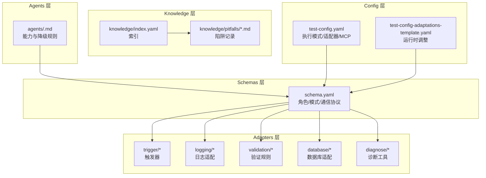
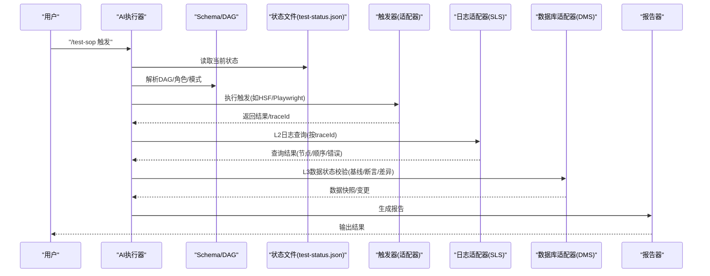
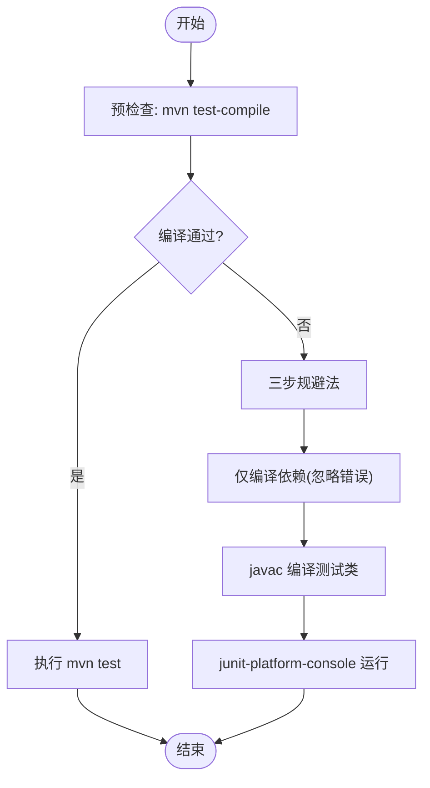
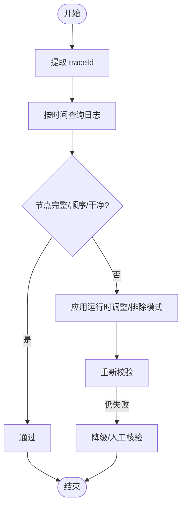
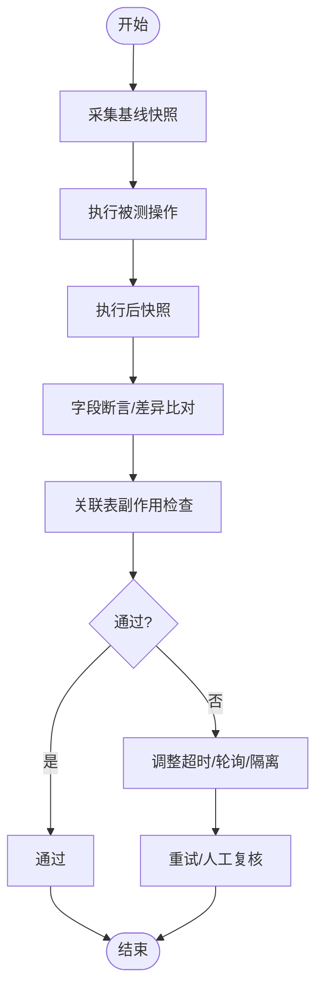
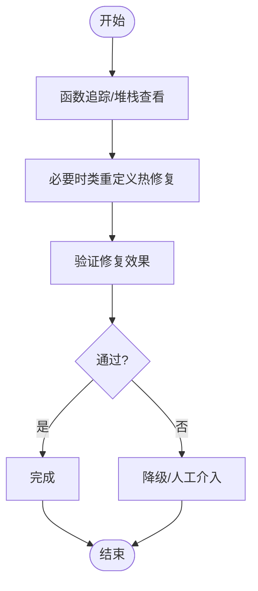
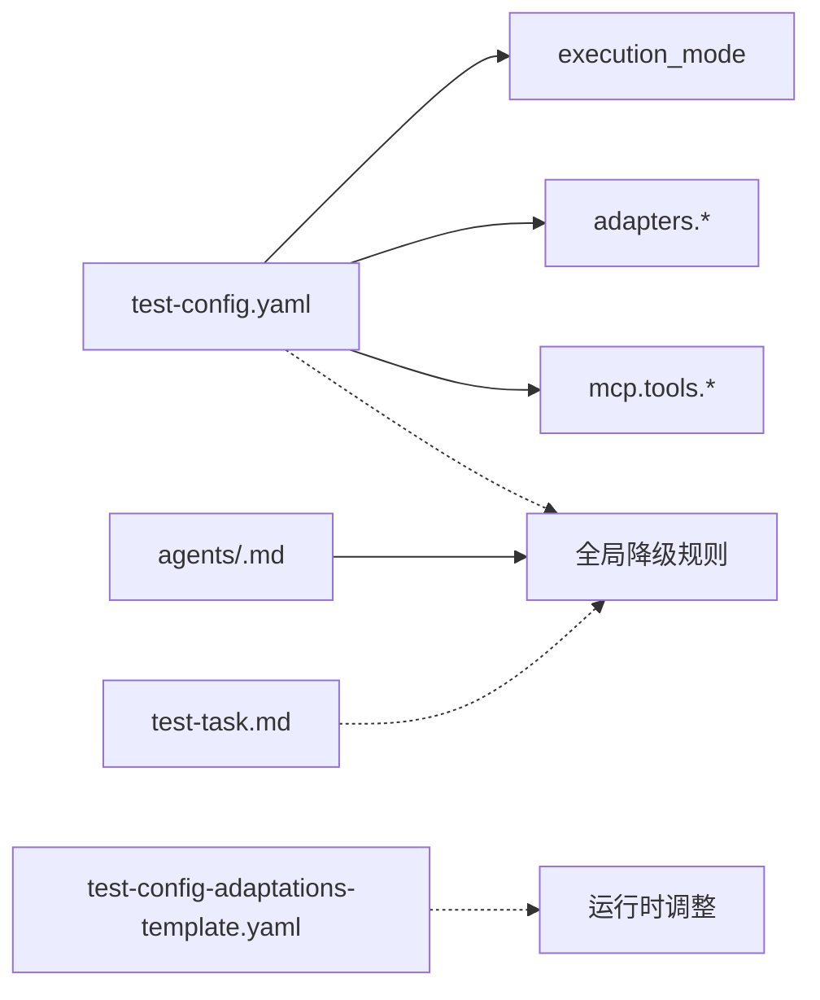

# 故障排除

<cite>
**本文引用的文件**
- [README.md](file://README.md)
- [DESIGN.md](file://DESIGN.md)
- [INSTRUCTIONS.md](file://INSTRUCTIONS.md)
- [install.sh](file://install.sh)
- [config/test-config-template.yaml](file://config/test-config-template.yaml)
- [config/test-config-adaptations-template.yaml](file://config/test-config-adaptations-template.yaml)
- [adapters/testing/unit-test.md](file://adapters/testing/unit-test.md)
- [adapters/diagnose/arthas.md](file://adapters/diagnose/arthas.md)
- [adapters/logging/sls.md](file://adapters/logging/sls.md)
- [adapters/validation/log-path.md](file://adapters/validation/log-path.md)
- [adapters/validation/data-state.md](file://adapters/validation/data-state.md)
- [adapters/domains.yaml](file://adapters/domains.yaml)
- [knowledge/pitfalls/maven-compile-fail.md](file://knowledge/pitfalls/maven-compile-fail.md)
- [knowledge/index.yaml](file://knowledge/index.yaml)
- [agents/template.md](file://agents/template.md)
- [agents/self-check-instructions.md](file://agents/self-check-instructions.md)
</cite>

## 目录
1. [简介](#简介)
2. [项目结构](#项目结构)
3. [核心组件](#核心组件)
4. [架构总览](#架构总览)
5. [详细组件分析](#详细组件分析)
6. [依赖关系分析](#依赖关系分析)
7. [性能与稳定性考虑](#性能与稳定性考虑)
8. [故障排除指南](#故障排除指南)
9. [结论](#结论)
10. [附录](#附录)

## 简介
本指南面向技术支持与运维团队，聚焦于该AI自动化测试框架在实际运行中可能遇到的典型问题与系统化排障方法。内容覆盖编译失败、MCP工具不可用、日志查询与验证异常、数据库状态校验失败、权限与环境差异、以及不同执行模式（全托管 vs 半托管）下的故障特征与处理策略。同时提供根因定位步骤、修复建议、预防性措施与最佳实践，帮助团队高效闭环问题。

## 项目结构
该仓库采用“分层+适配器”的架构组织方式，便于在不改动核心流程的情况下切换技术栈与工具链：
- schemas：工作流定义（DAG、角色、通信协议）
- adapters：技术实现适配器（触发、日志、数据、诊断、部署等）
- agents：AI代理能力与降级规则模板
- knowledge：知识库（陷阱与最佳实践）
- config：配置模板（执行模式、适配器选择、MCP开关、运行时调整）

图表来源
- [DESIGN.md:12-38](file://DESIGN.md#L12-L38)
- [adapters/domains.yaml:1-27](file://adapters/domains.yaml#L1-L27)
- [config/test-config-template.yaml:1-32](file://config/test-config-template.yaml#L1-L32)
- [config/test-config-adaptations-template.yaml:1-26](file://config/test-config-adaptations-template.yaml#L1-L26)
- [knowledge/index.yaml:1-10](file://knowledge/index.yaml#L1-L10)

章节来源
- [README.md:71-84](file://README.md#L71-L84)
- [DESIGN.md:12-38](file://DESIGN.md#L12-L38)

## 核心组件
- 执行模式与路由
  - 全托管（full-auto）：AI自动完成部署、调用、日志与数据验证
  - 半托管（assisted）：生成人工测试清单，等待人工执行与回传结果
- 通信协议
  - 基于共享文件的状态机（test-status.json），读前写、跳过已完成、支持重试循环
- 日志与验证层级
  - L1：响应结构校验
  - L2：日志路径校验（提取traceId、按时间排序查询、完整性/顺序/干净度）
  - L3：数据状态校验（基线快照对比、副作用检查）
- 降级规则
  - 触发条件：无MCP、无Shell、无部署、无数据库
  - 可选动作：SKIP、FAIL、MANUAL、FALLBACK:<adapter>

章节来源
- [DESIGN.md:39-55](file://DESIGN.md#L39-L55)
- [DESIGN.md:106-115](file://DESIGN.md#L106-L115)
- [DESIGN.md:70-105](file://DESIGN.md#L70-L105)
- [DESIGN.md:148-187](file://DESIGN.md#L148-L187)

## 架构总览
下图展示从触发到报告的关键交互与落盘输出，便于定位问题阶段与责任边界。

图表来源
- [INSTRUCTIONS.md:27-36](file://INSTRUCTIONS.md#L27-L36)
- [DESIGN.md:56-105](file://DESIGN.md#L56-L105)
- [adapters/logging/sls.md:1-10](file://adapters/logging/sls.md#L1-L10)
- [adapters/validation/log-path.md:1-10](file://adapters/validation/log-path.md#L1-L10)
- [adapters/validation/data-state.md:1-8](file://adapters/validation/data-state.md#L1-L8)

## 详细组件分析

### 组件A：单元测试执行与编译失败
- 症状
  - mvn test 编译期报错（类缺失），但当前修改无关模块
- 根因
  - 多模块工程存在遗留编译错误，导致整体无法通过
- 解决方案
  - 采用“三步规避法”：仅编译依赖 -> javac 编译单测类 -> 使用 junit-platform-console 运行
- 适用场景
  - 多模块遗留构建问题；CI/CLI自动化测试场景

图表来源
- [adapters/testing/unit-test.md:1-11](file://adapters/testing/unit-test.md#L1-L11)
- [knowledge/pitfalls/maven-compile-fail.md:1-18](file://knowledge/pitfalls/maven-compile-fail.md#L1-L18)

章节来源
- [adapters/testing/unit-test.md:1-11](file://adapters/testing/unit-test.md#L1-L11)
- [knowledge/pitfalls/maven-compile-fail.md:1-18](file://knowledge/pitfalls/maven-compile-fail.md#L1-L18)

### 组件B：日志路径验证（L2）
- 规则
  - 提取traceId
  - 按时间排序查询日志
  - 校验：节点完整、顺序正确、无ERROR/WARN
- 常见问题
  - MCP工具不可用或鉴权失败
  - 日志查询语法/参数错误
  - 第三方噪声日志导致误报
- 修复策略
  - 确认MCP可用与参数正确
  - 在运行时调整中加入日志排除模式
  - 必要时使用替代诊断适配器

图表来源
- [adapters/validation/log-path.md:1-10](file://adapters/validation/log-path.md#L1-L10)
- [adapters/logging/sls.md:1-10](file://adapters/logging/sls.md#L1-L10)
- [config/test-config-adaptations-template.yaml:8-26](file://config/test-config-adaptations-template.yaml#L8-L26)

章节来源
- [adapters/validation/log-path.md:1-10](file://adapters/validation/log-path.md#L1-L10)
- [adapters/logging/sls.md:1-10](file://adapters/logging/sls.md#L1-L10)
- [config/test-config-adaptations-template.yaml:8-26](file://config/test-config-adaptations-template.yaml#L8-L26)

### 组件C：数据状态验证（L3）
- 规则
  - 执行前快照基线
  - 执行后断言与差异比对
  - 关联表副作用检查
- 常见问题
  - 数据库连接/权限不足
  - 异步落库延迟导致超时
  - 并发/事务隔离引发的瞬时不一致
- 修复策略
  - 调整轮询/超时参数
  - 降低并发或增加重试窗口
  - 明确隔离级别与一致性要求

图表来源
- [adapters/validation/data-state.md:1-8](file://adapters/validation/data-state.md#L1-L8)
- [config/test-config-adaptations-template.yaml:8-26](file://config/test-config-adaptations-template.yaml#L8-L26)

章节来源
- [adapters/validation/data-state.md:1-8](file://adapters/validation/data-state.md#L1-L8)
- [config/test-config-adaptations-template.yaml:8-26](file://config/test-config-adaptations-template.yaml#L8-L26)

### 组件D：诊断与热修复（Arthas）
- 用途
  - 函数追踪、堆栈查看、类重定义热修复
- 常见问题
  - 无MCP或无Shell
  - PID/类名/方法名参数错误
- 修复策略
  - 使用FALLBACK:<adapter>或MANUAL降级
  - 确认目标进程与类加载上下文

图表来源
- [adapters/diagnose/arthas.md:1-10](file://adapters/diagnose/arthas.md#L1-L10)
- [DESIGN.md:148-187](file://DESIGN.md#L148-L187)

章节来源
- [adapters/diagnose/arthas.md:1-10](file://adapters/diagnose/arthas.md#L1-L10)
- [DESIGN.md:148-187](file://DESIGN.md#L148-L187)

## 依赖关系分析
- 配置与适配器
  - execution_mode 决定全托管/半托管
  - adapters.trigger/logging/database/deployment 指向具体适配器
  - MCP 工具开关决定L2/L3可用性
- 代理能力与降级
  - agents/<profile>.md 定义全局降级规则
  - test-config.yaml 可在需求层覆盖
  - test-task.md 可在用例层微调
- 运行时调整
  - test-config-adaptations-template.yaml 支持超时、排除模式等参数化调整

图表来源
- [config/test-config-template.yaml:1-32](file://config/test-config-template.yaml#L1-L32)
- [agents/template.md:17-27](file://agents/template.md#L17-L27)
- [config/test-config-adaptations-template.yaml:1-26](file://config/test-config-adaptations-template.yaml#L1-L26)

章节来源
- [config/test-config-template.yaml:1-32](file://config/test-config-template.yaml#L1-L32)
- [agents/template.md:17-27](file://agents/template.md#L17-L27)
- [config/test-config-adaptations-template.yaml:1-26](file://config/test-config-adaptations-template.yaml#L1-L26)

## 性能与稳定性考虑
- L3异步轮询
  - 若消息队列延迟导致超时，优先通过运行时调整提高轮询上限或延长等待
- L2日志噪声
  - 使用排除模式减少第三方噪声干扰，避免误报
- 并发与隔离
  - 在高并发场景下，适当放宽隔离级别或增加重试窗口，确保一致性窗口内稳定收敛

章节来源
- [config/test-config-adaptations-template.yaml:8-26](file://config/test-config-adaptations-template.yaml#L8-L26)

## 故障排除指南

### 一、安装与初始化
- 症状
  - 安装脚本报错或未生成默认配置
- 根因
  - 环境缺少git
  - 已存在安装目录但元数据清理不彻底
- 修复
  - 安装git并重试
  - 清理旧安装目录后重新克隆
- 预防
  - 安装前确认git可用
  - 使用脚本提供的初始化逻辑生成默认配置

章节来源
- [install.sh:11-28](file://install.sh#L11-L28)
- [README.md:14-37](file://README.md#L14-L37)

### 二、编译失败（Maven）
- 症状
  - mvn test 报类缺失，当前变更无关模块
- 根因
  - 存在遗留编译错误，阻塞整体构建
- 修复
  - 采用“三步规避法”：仅编译依赖 -> javac 单测类 -> junit-platform-console 运行
- 预防
  - 修复上游模块编译问题
  - 在CI中区分模块编译与测试执行

章节来源
- [knowledge/pitfalls/maven-compile-fail.md:1-18](file://knowledge/pitfalls/maven-compile-fail.md#L1-L18)
- [adapters/testing/unit-test.md:1-11](file://adapters/testing/unit-test.md#L1-L11)

### 三、MCP工具不可用
- 症状
  - L2/L3验证失败，提示无MCP或无数据库访问
- 根因
  - MCP工具未启用或鉴权失败
- 修复
  - 在配置中启用对应工具
  - 或根据降级规则改为MANUAL/FAIL/SKIP/FALLBACK
- 预防
  - 在CI/本地统一配置MCP工具
  - 为代理能力生成profile并纳入自检

章节来源
- [config/test-config-template.yaml:18-31](file://config/test-config-template.yaml#L18-L31)
- [DESIGN.md:148-187](file://DESIGN.md#L148-L187)
- [agents/self-check-instructions.md:1-25](file://agents/self-check-instructions.md#L1-L25)

### 四、日志查询与L2验证异常
- 症状
  - traceId提取成功但查询为空或报错
- 根因
  - 参数错误、权限不足、日志延迟、第三方噪声
- 修复
  - 校验查询参数与鉴权
  - 在运行时调整中添加排除模式
  - 必要时降级为人工核验
- 预防
  - 统一日志查询规范
  - 对高频噪声建立排除策略

章节来源
- [adapters/logging/sls.md:1-10](file://adapters/logging/sls.md#L1-L10)
- [adapters/validation/log-path.md:1-10](file://adapters/validation/log-path.md#L1-L10)
- [config/test-config-adaptations-template.yaml:8-26](file://config/test-config-adaptations-template.yaml#L8-L26)

### 五、数据状态验证（L3）失败
- 症状
  - 基线与断言不一致，或出现副作用
- 根因
  - 数据库权限/连接问题、异步落库延迟、并发/隔离不当
- 修复
  - 调整轮询/超时参数
  - 明确隔离级别与一致性窗口
- 预防
  - 在测试前准备稳定的基线
  - 限制并发或引入重试窗口

章节来源
- [adapters/validation/data-state.md:1-8](file://adapters/validation/data-state.md#L1-L8)
- [config/test-config-adaptations-template.yaml:8-26](file://config/test-config-adaptations-template.yaml#L8-L26)

### 六、执行模式差异与处理
- 全托管（full-auto）
  - 特征：自动部署、调用、验证；需完备MCP与权限
  - 故障：MCP缺失或权限不足时，按降级规则处理
- 半托管（assisted）
  - 特征：生成人工测试清单，等待人工回传
  - 故障：清单不清晰或回传信息不完整时，补充说明与回溯

章节来源
- [DESIGN.md:39-55](file://DESIGN.md#L39-L55)
- [DESIGN.md:148-187](file://DESIGN.md#L148-L187)
- [config/test-config-template.yaml:3-4](file://config/test-config-template.yaml#L3-L4)

### 七、权限与环境配置
- 权限
  - 确保具备Shell执行、文件读写、MCP调用权限
- 环境
  - 统一Java/Spring版本、Maven缓存与代理设置
- 自检
  - 使用自检指令生成代理profile，明确能力边界

章节来源
- [agents/self-check-instructions.md:1-25](file://agents/self-check-instructions.md#L1-L25)
- [agents/template.md:17-27](file://agents/template.md#L17-L27)

### 八、日志与状态文件分析
- 执行日志（execution-log.md）
  - 记录每次工具调用的详细参数与时间戳，用于审计与回放
- 状态文件（test-status.json）
  - 读前写、跳过已完成、支持重试循环，便于恢复与定位卡点

章节来源
- [README.md:61-70](file://README.md#L61-L70)
- [DESIGN.md:106-115](file://DESIGN.md#L106-L115)

### 九、知识库与自演进
- 知识库（pitfalls/index）
  - 记录历史陷阱与解法，避免重复踩坑
- 运行时调整（.test-adaptations.yaml）
  - 小幅参数化调整，立即生效
- 结构化提案（proposals/）
  - 重大变更需人工评审与合并

章节来源
- [knowledge/index.yaml:1-10](file://knowledge/index.yaml#L1-L10)
- [DESIGN.md:196-224](file://DESIGN.md#L196-L224)

## 结论
本指南提供了从安装、配置、执行到验证与自演进的全链路排障方法。建议团队在日常工作中：
- 明确执行模式与降级策略
- 统一MCP与环境配置
- 建立日志排除与运行时调整机制
- 利用知识库沉淀经验
- 以状态文件与执行日志为依据进行根因定位与复盘

## 附录

### A. 常见问题快速对照
- 安装失败：检查git可用性与安装脚本输出
- 编译失败：采用三步规避法或修复上游模块
- MCP不可用：启用工具或按降级规则处理
- L2查询异常：校验参数/鉴权/排除噪声
- L3数据不一致：调整轮询/隔离或人工复核
- 执行卡住：检查test-status.json与执行日志

### B. 最佳实践
- 在CI中固定MCP工具与权限
- 对高频噪声建立排除模式
- 将失败案例归档至知识库
- 使用状态文件与执行日志进行可追溯审计
- 以小步提交运行时调整，快速验证与回滚