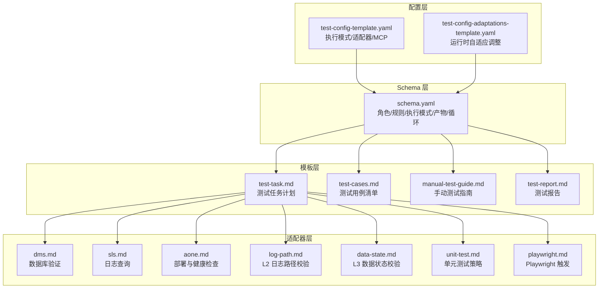
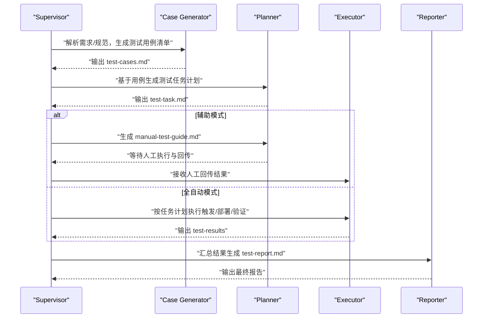
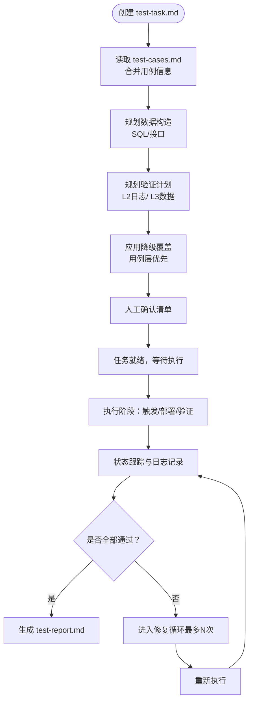
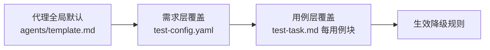
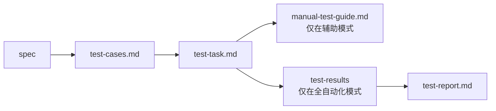
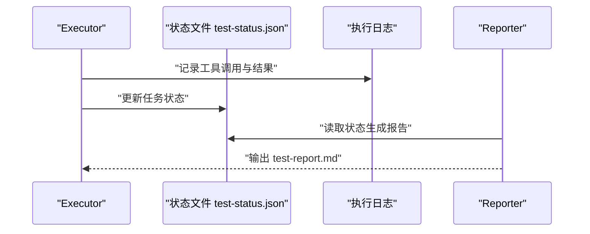
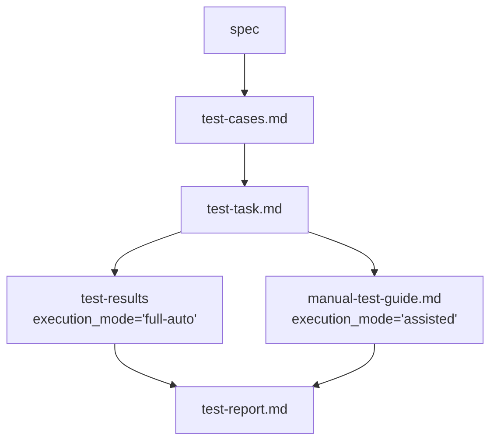

# 测试任务模板

<cite>
**本文引用的文件**
- [schemas/ai-test-workflow/schema.yaml](file://schemas/ai-test-workflow/schema.yaml)
- [schemas/ai-test-workflow/templates/test-task.md](file://schemas/ai-test-workflow/templates/test-task.md)
- [schemas/ai-test-workflow/templates/test-cases.md](file://schemas/ai-test-workflow/templates/test-cases.md)
- [schemas/ai-test-workflow/templates/manual-test-guide.md](file://schemas/ai-test-workflow/templates/manual-test-guide.md)
- [schemas/ai-test-workflow/templates/test-report.md](file://schemas/ai-test-workflow/templates/test-report.md)
- [config/test-config-template.yaml](file://config/test-config-template.yaml)
- [config/test-config-adaptations-template.yaml](file://config/test-config-adaptations-template.yaml)
- [agents/template.md](file://agents/template.md)
- [adapters/database/dms.md](file://adapters/database/dms.md)
- [adapters/logging/sls.md](file://adapters/logging/sls.md)
- [adapters/deployment/aone.md](file://adapters/deployment/aone.md)
- [adapters/validation/data-state.md](file://adapters/validation/data-state.md)
- [adapters/validation/log-path.md](file://adapters/validation/log-path.md)
- [adapters/testing/unit-test.md](file://adapters/testing/unit-test.md)
- [adapters/trigger/playwright.md](file://adapters/trigger/playwright.md)
</cite>

## 目录
1. [简介](#简介)
2. [项目结构](#项目结构)
3. [核心组件](#核心组件)
4. [架构总览](#架构总览)
5. [详细组件分析](#详细组件分析)
6. [依赖分析](#依赖分析)
7. [性能考虑](#性能考虑)
8. [故障排查指南](#故障排查指南)
9. [结论](#结论)
10. [附录](#附录)

## 简介
本文件围绕“测试任务模板”展开，系统性阐述测试任务模板的结构与用途、任务分配与执行顺序、资源管理、生命周期（创建、执行、监控、完成）、任务依赖与并行策略、状态跟踪与进度报告、定制化与扩展方法，以及最佳实践与性能优化建议。该模板基于统一的Schema与适配器体系，支持全自动化与辅助式两种执行模式，并通过三层降级规则（全局、需求层、用例层）保障在资源受限时仍可产出可接受结果。

## 项目结构
该项目以“Schema + 模板 + 配置 + 适配器”的方式组织测试工作流：
- Schema 定义角色、规则、执行模式、通信协议、产物与循环修复机制
- 模板提供标准化的测试产物（测试用例、测试任务、手动测试指南、测试报告）
- 配置提供执行模式、适配器选择、MCP能力与降级覆盖
- 适配器封装具体技术栈的触发、日志、数据库、部署与验证策略

图表来源
- [schemas/ai-test-workflow/schema.yaml:1-111](file://schemas/ai-test-workflow/schema.yaml#L1-L111)
- [schemas/ai-test-workflow/templates/test-task.md:1-53](file://schemas/ai-test-workflow/templates/test-task.md#L1-L53)
- [schemas/ai-test-workflow/templates/test-cases.md:1-33](file://schemas/ai-test-workflow/templates/test-cases.md#L1-L33)
- [schemas/ai-test-workflow/templates/manual-test-guide.md:1-32](file://schemas/ai-test-workflow/templates/manual-test-guide.md#L1-L32)
- [schemas/ai-test-workflow/templates/test-report.md:1-34](file://schemas/ai-test-workflow/templates/test-report.md#L1-L34)
- [config/test-config-template.yaml:1-32](file://config/test-config-template.yaml#L1-L32)
- [config/test-config-adaptations-template.yaml:1-26](file://config/test-config-adaptations-template.yaml#L1-L26)
- [adapters/database/dms.md:1-10](file://adapters/database/dms.md#L1-L10)
- [adapters/logging/sls.md:1-10](file://adapters/logging/sls.md#L1-L10)
- [adapters/deployment/aone.md:1-12](file://adapters/deployment/aone.md#L1-L12)
- [adapters/validation/log-path.md:1-10](file://adapters/validation/log-path.md#L1-L10)
- [adapters/validation/data-state.md:1-8](file://adapters/validation/data-state.md#L1-L8)
- [adapters/testing/unit-test.md:1-11](file://adapters/testing/unit-test.md#L1-L11)
- [adapters/trigger/playwright.md:1-8](file://adapters/trigger/playwright.md#L1-L8)

章节来源
- [schemas/ai-test-workflow/schema.yaml:1-111](file://schemas/ai-test-workflow/schema.yaml#L1-L111)
- [config/test-config-template.yaml:1-32](file://config/test-config-template.yaml#L1-L32)
- [config/test-config-adaptations-template.yaml:1-26](file://config/test-config-adaptations-template.yaml#L1-L26)

## 核心组件
- 测试任务模板（test-task.md）：定义用例概览、数据准备、验证计划（L2日志路径、L3数据状态）、降级覆盖与人工确认清单。是任务规划与执行的直接依据。
- 测试用例模板（test-cases.md）：生成用例清单与覆盖矩阵，明确优先级与降级策略，作为任务模板的输入之一。
- 手动测试指南（manual-test-guide.md）：在辅助模式下生成，指导人工执行与回传观测结果。
- 测试报告（test-report.md）：汇总结论、执行详情、失败原因、修复记录与改进建议。
- 执行配置（test-config-template.yaml）：指定执行模式（全自动化/辅助）、适配器类型（触发/日志/数据库/部署）、MCP能力与降级覆盖。
- 运行时自适应（test-config-adaptations-template.yaml）：基于执行反馈动态调整参数（如超时、日志排除模式）。
- 代理全局降级规则（agents/template.md）：定义全局默认降级动作（SKIP/FAIL/MANUAL/FALLBACK），可被需求层与用例层覆盖。
- 适配器：封装具体技术栈的触发、日志、数据库、部署与验证策略，确保任务模板与底层实现解耦。

章节来源
- [schemas/ai-test-workflow/templates/test-task.md:1-53](file://schemas/ai-test-workflow/templates/test-task.md#L1-L53)
- [schemas/ai-test-workflow/templates/test-cases.md:1-33](file://schemas/ai-test-workflow/templates/test-cases.md#L1-L33)
- [schemas/ai-test-workflow/templates/manual-test-guide.md:1-32](file://schemas/ai-test-workflow/templates/manual-test-guide.md#L1-L32)
- [schemas/ai-test-workflow/templates/test-report.md:1-34](file://schemas/ai-test-workflow/templates/test-report.md#L1-L34)
- [config/test-config-template.yaml:1-32](file://config/test-config-template.yaml#L1-L32)
- [config/test-config-adaptations-template.yaml:1-26](file://config/test-config-adaptations-template.yaml#L1-L26)
- [agents/template.md:1-36](file://agents/template.md#L1-L36)

## 架构总览
测试任务模板在统一Schema驱动下，串联“生成-规划-执行-报告”的闭环流程。Schema定义角色职责、规则与产物依赖；模板承载任务计划与报告；配置决定执行模式与适配器；适配器实现具体技术动作。

图表来源
- [schemas/ai-test-workflow/schema.yaml:65-104](file://schemas/ai-test-workflow/schema.yaml#L65-L104)
- [schemas/ai-test-workflow/templates/test-task.md:1-53](file://schemas/ai-test-workflow/templates/test-task.md#L1-L53)
- [schemas/ai-test-workflow/templates/manual-test-guide.md:1-32](file://schemas/ai-test-workflow/templates/manual-test-guide.md#L1-L32)
- [schemas/ai-test-workflow/templates/test-report.md:1-34](file://schemas/ai-test-workflow/templates/test-report.md#L1-L34)

## 详细组件分析

### 测试任务模板（test-task.md）
- 结构要点
  - 任务概览：TC-ID、场景、优先级、类型、数据构造、验证点、降级策略
  - 数据构造：新增接口或SQL准备与清理
  - 验证计划：L2日志路径与L3数据状态的验证矩阵
  - 用例级降级覆盖：仅列出需要覆盖全局/需求层默认值的用例
  - 人工确认清单：策略审批、SQL核验、Mock值确认
- 用途
  - 作为执行阶段的直接依据，指导触发、部署、验证与降级处理
  - 与测试用例模板形成“用例清单—任务计划”的上下行关系
- 生命周期
  - 创建：由Planner基于test-cases.md生成
  - 执行：Executor按计划调用适配器执行各验证层
  - 监控：通过状态文件与日志进行进度跟踪
  - 完成：生成测试报告或进入修复循环

图表来源
- [schemas/ai-test-workflow/templates/test-task.md:1-53](file://schemas/ai-test-workflow/templates/test-task.md#L1-L53)
- [schemas/ai-test-workflow/templates/test-cases.md:1-33](file://schemas/ai-test-workflow/templates/test-cases.md#L1-L33)
- [schemas/ai-test-workflow/schema.yaml:38-61](file://schemas/ai-test-workflow/schema.yaml#L38-L61)

章节来源
- [schemas/ai-test-workflow/templates/test-task.md:1-53](file://schemas/ai-test-workflow/templates/test-task.md#L1-L53)

### 三层降级规则与继承链
- 继承层级：用例层 > 需求层 > 全局（代理档案）
- 解析算法：按层级合并，后层覆盖前层未指定项
- 可选动作：SKIP（跳过）、FAIL（立即失败）、MANUAL（转人工）、FALLBACK:<适配器>（替代方案）
- 触发条件：无MCP、Shell、部署、数据库等资源不可用

图表来源
- [schemas/ai-test-workflow/schema.yaml:38-61](file://schemas/ai-test-workflow/schema.yaml#L38-L61)
- [agents/template.md:17-27](file://agents/template.md#L17-L27)
- [config/test-config-template.yaml:24-32](file://config/test-config-template.yaml#L24-L32)
- [schemas/ai-test-workflow/templates/test-task.md:33-47](file://schemas/ai-test-workflow/templates/test-task.md#L33-L47)

章节来源
- [schemas/ai-test-workflow/schema.yaml:38-61](file://schemas/ai-test-workflow/schema.yaml#L38-L61)
- [agents/template.md:17-27](file://agents/template.md#L17-L27)
- [config/test-config-template.yaml:24-32](file://config/test-config-template.yaml#L24-L32)
- [schemas/ai-test-workflow/templates/test-task.md:33-47](file://schemas/ai-test-workflow/templates/test-task.md#L33-L47)

### 执行顺序与并行策略
- 顺序约束：产物依赖严格遵循Schema定义（如test-task依赖test-cases，test-results依赖test-task）
- 并行策略：代理具备并行执行能力声明，可在满足资源与隔离前提下并行执行独立任务
- 资源隔离：输出写入固定目录，避免混杂输入与输出

图表来源
- [schemas/ai-test-workflow/schema.yaml:78-104](file://schemas/ai-test-workflow/schema.yaml#L78-L104)

章节来源
- [schemas/ai-test-workflow/schema.yaml:78-104](file://schemas/ai-test-workflow/schema.yaml#L78-L104)

### 任务状态跟踪与进度报告
- 状态文件：使用JSON文件记录测试状态，便于跨进程/跨轮次追踪
- 通信协议：文件型协议，状态文件为关键共享对象
- 报告维度：结论（总数/通过数/失败数/通过率/状态）、执行详情（分层结果）、失败详情、修复记录、建议

图表来源
- [schemas/ai-test-workflow/schema.yaml:74-77](file://schemas/ai-test-workflow/schema.yaml#L74-L77)
- [schemas/ai-test-workflow/templates/test-report.md:1-34](file://schemas/ai-test-workflow/templates/test-report.md#L1-L34)

章节来源
- [schemas/ai-test-workflow/schema.yaml:74-77](file://schemas/ai-test-workflow/schema.yaml#L74-L77)
- [schemas/ai-test-workflow/templates/test-report.md:1-34](file://schemas/ai-test-workflow/templates/test-report.md#L1-L34)

### 任务模板定制化与扩展
- 全局降级：在代理档案中设置默认动作，作为最终兜底
- 需求层覆盖：在配置文件中覆盖全局默认，适用于整条需求的统一策略
- 用例层覆盖：在任务模板中针对个别用例指定降级动作，精确控制风险
- 运行时自适应：根据历史执行反馈调整超时、日志过滤等参数，提升稳定性与准确性

章节来源
- [agents/template.md:17-27](file://agents/template.md#L17-L27)
- [config/test-config-template.yaml:24-32](file://config/test-config-template.yaml#L24-L32)
- [config/test-config-adaptations-template.yaml:1-26](file://config/test-config-adaptations-template.yaml#L1-L26)
- [schemas/ai-test-workflow/templates/test-task.md:33-47](file://schemas/ai-test-workflow/templates/test-task.md#L33-L47)

### 适配器与技术栈集成
- 触发：支持Playwright等UI触发
- 日志：通过SLS查询与观察
- 数据库：通过DMS执行SQL验证
- 部署：Aone异步部署与健康检查
- 验证：L2日志路径完整性与时序校验、L3数据状态前后快照对比与副作用检查
- 单元测试：编译错误三步 workaround，运行时错误引导人工介入

章节来源
- [adapters/trigger/playwright.md:1-8](file://adapters/trigger/playwright.md#L1-L8)
- [adapters/logging/sls.md:1-10](file://adapters/logging/sls.md#L1-L10)
- [adapters/database/dms.md:1-10](file://adapters/database/dms.md#L1-L10)
- [adapters/deployment/aone.md:1-12](file://adapters/deployment/aone.md#L1-L12)
- [adapters/validation/log-path.md:1-10](file://adapters/validation/log-path.md#L1-L10)
- [adapters/validation/data-state.md:1-8](file://adapters/validation/data-state.md#L1-L8)
- [adapters/testing/unit-test.md:1-11](file://adapters/testing/unit-test.md#L1-L11)

## 依赖分析
- 产物依赖链：spec → test-cases → test-task → manual-test-guide 或 test-results → test-report
- 条件产物：manual-test-guide与test-results仅在对应执行模式下生成
- 循环修复：当测试结果包含FAIL时，自动触发修复循环，最多迭代N次

图表来源
- [schemas/ai-test-workflow/schema.yaml:81-104](file://schemas/ai-test-workflow/schema.yaml#L81-L104)
- [schemas/ai-test-workflow/schema.yaml:105-109](file://schemas/ai-test-workflow/schema.yaml#L105-L109)

章节来源
- [schemas/ai-test-workflow/schema.yaml:81-104](file://schemas/ai-test-workflow/schema.yaml#L81-L104)
- [schemas/ai-test-workflow/schema.yaml:105-109](file://schemas/ai-test-workflow/schema.yaml#L105-L109)

## 性能考虑
- 并行执行：在满足资源隔离与依赖约束的前提下，利用代理的并行能力提升吞吐
- 资源复用：部署后冷却时间与健康检查减少无效重试
- 查询优化：日志与数据库查询限定时间窗口与索引字段，降低IO开销
- 自适应调整：基于历史反馈动态放宽/收紧超时与过滤规则，平衡准确度与速度
- 输出隔离：固定输出基线避免I/O争用与路径污染

## 故障排查指南
- 降级触发定位
  - 检查代理全局降级规则、需求层覆盖与用例层覆盖，确认生效层级
  - 使用三层解析算法核对最终生效规则
- 执行失败回溯
  - 查看状态文件与执行日志，确认工具调用参数与返回
  - 对照测试报告中的失败详情与修复记录，定位根因
- 适配器问题
  - 确认MCP工具可用性与CLI命令正确性
  - 校验数据库/日志服务连通性与权限
- 修复循环
  - 当出现FAIL时，检查修复记录与变更范围，避免过度修复

章节来源
- [schemas/ai-test-workflow/schema.yaml:38-61](file://schemas/ai-test-workflow/schema.yaml#L38-L61)
- [agents/template.md:17-27](file://agents/template.md#L17-L27)
- [config/test-config-template.yaml:24-32](file://config/test-config-template.yaml#L24-L32)
- [schemas/ai-test-workflow/templates/test-report.md:22-31](file://schemas/ai-test-workflow/templates/test-report.md#L22-L31)

## 结论
测试任务模板通过标准化结构与Schema驱动的规则体系，实现了从用例到任务再到报告的完整闭环。借助三层降级规则与运行时自适应，系统能在资源受限时仍保持可交付的结果。配合适配器与并行策略，可在保证质量的同时提升效率。建议在实际落地中严格遵循依赖链与隔离原则，结合日志与状态文件做好可观测性建设。

## 附录
- 关键文件速览
  - 测试任务模板：[test-task.md:1-53](file://schemas/ai-test-workflow/templates/test-task.md#L1-L53)
  - 测试用例模板：[test-cases.md:1-33](file://schemas/ai-test-workflow/templates/test-cases.md#L1-L33)
  - 手动测试指南：[manual-test-guide.md:1-32](file://schemas/ai-test-workflow/templates/manual-test-guide.md#L1-L32)
  - 测试报告模板：[test-report.md:1-34](file://schemas/ai-test-workflow/templates/test-report.md#L1-L34)
  - 执行配置模板：[test-config-template.yaml:1-32](file://config/test-config-template.yaml#L1-L32)
  - 运行时自适应模板：[test-config-adaptations-template.yaml:1-26](file://config/test-config-adaptations-template.yaml#L1-L26)
  - 代理降级规则：[agents/template.md:17-27](file://agents/template.md#L17-L27)
  - 适配器参考：日志查询、数据库验证、部署健康检查、L2/L3验证、单元测试、Playwright触发