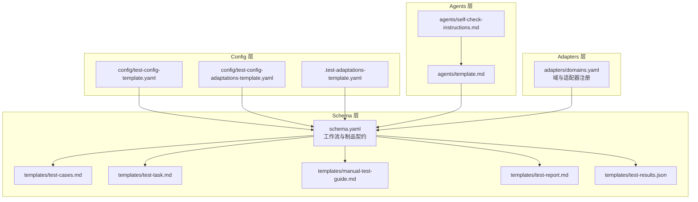
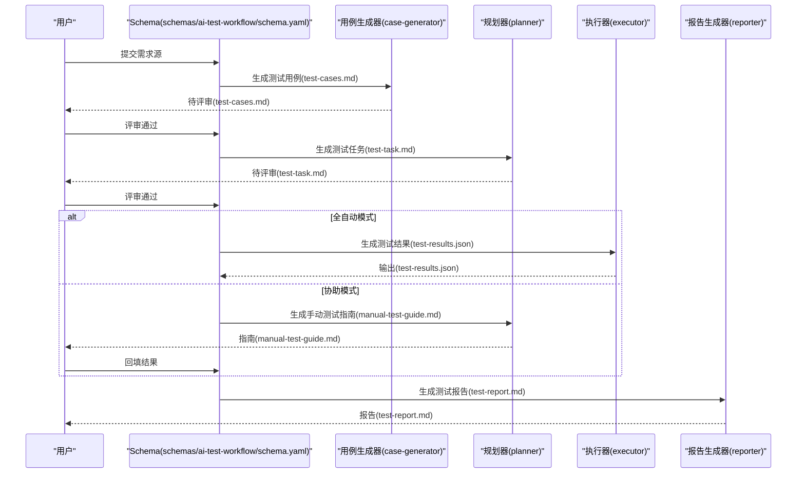
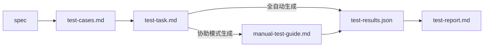

# 测试制品模板

<cite>
**本文引用的文件**
- [README.md](file://README.md)
- [DESIGN.md](file://DESIGN.md)
- [INSTRUCTIONS.md](file://INSTRUCTIONS.md)
- [schemas/ai-test-workflow/schema.yaml](file://schemas/ai-test-workflow/schema.yaml)
- [schemas/ai-test-workflow/templates/test-cases.md](file://schemas/ai-test-workflow/templates/test-cases.md)
- [schemas/ai-test-workflow/templates/test-task.md](file://schemas/ai-test-workflow/templates/test-task.md)
- [schemas/ai-test-workflow/templates/manual-test-guide.md](file://schemas/ai-test-workflow/templates/manual-test-guide.md)
- [schemas/ai-test-workflow/templates/test-report.md](file://schemas/ai-test-workflow/templates/test-report.md)
- [schemas/ai-test-workflow/templates/test-results.json](file://schemas/ai-test-workflow/templates/test-results.json)
- [config/test-config-template.yaml](file://config/test-config-template.yaml)
- [config/test-config-adaptations-template.yaml](file://config/test-config-adaptations-template.yaml)
- [config/.test-adaptations-template.yaml](file://config/.test-adaptations-template.yaml)
- [agents/template.md](file://agents/template.md)
- [agents/self-check-instructions.md](file://agents/self-check-instructions.md)
- [adapters/domains.yaml](file://adapters/domains.yaml)
</cite>

## 目录
1. [简介](#简介)
2. [项目结构](#项目结构)
3. [核心组件](#核心组件)
4. [架构总览](#架构总览)
5. [详细组件分析](#详细组件分析)
6. [依赖分析](#依赖分析)
7. [性能考虑](#性能考虑)
8. [故障排查指南](#故障排查指南)
9. [结论](#结论)
10. [附录](#附录)

## 简介
本文件系统化阐述“测试制品模板”的设计与使用，覆盖测试用例模板、测试任务模板、手动测试指南、测试报告模板以及测试结果数据模型。文档解释各制品的职责、生成机制、制品间依赖关系与生成顺序，并给出定制扩展方法、版本管理与归档共享策略、最佳实践与质量保障措施，以支撑测试流程的标准化与可复用。

## 项目结构
该仓库采用分层架构：Schema 层定义工作流与制品契约；Adapters 层封装技术实现；Agents 层描述执行者能力；Knowledge 层沉淀经验；Config 层提供配置与自适应参数；Schemas 下的 templates 存放各类制品模板。

图表来源
- [schemas/ai-test-workflow/schema.yaml:1-111](file://schemas/ai-test-workflow/schema.yaml#L1-L111)
- [schemas/ai-test-workflow/templates/test-cases.md:1-33](file://schemas/ai-test-workflow/templates/test-cases.md#L1-L33)
- [schemas/ai-test-workflow/templates/test-task.md:1-53](file://schemas/ai-test-workflow/templates/test-task.md#L1-L53)
- [schemas/ai-test-workflow/templates/manual-test-guide.md:1-32](file://schemas/ai-test-workflow/templates/manual-test-guide.md#L1-L32)
- [schemas/ai-test-workflow/templates/test-report.md:1-34](file://schemas/ai-test-workflow/templates/test-report.md#L1-L34)
- [schemas/ai-test-workflow/templates/test-results.json:1-15](file://schemas/ai-test-workflow/templates/test-results.json#L1-L15)
- [adapters/domains.yaml:1-27](file://adapters/domains.yaml#L1-L27)
- [agents/template.md:1-36](file://agents/template.md#L1-L36)
- [agents/self-check-instructions.md:1-25](file://agents/self-check-instructions.md#L1-L25)
- [config/test-config-template.yaml:1-32](file://config/test-config-template.yaml#L1-L32)
- [config/test-config-adaptations-template.yaml:1-26](file://config/test-config-adaptations-template.yaml#L1-L26)
- [config/.test-adaptations-template.yaml:1-16](file://config/.test-adaptations-template.yaml#L1-L16)

章节来源
- [README.md:71-84](file://README.md#L71-L84)
- [DESIGN.md:12-38](file://DESIGN.md#L12-L38)

## 核心组件
- 测试用例模板（test-cases.md）：用于生成可执行的测试用例清单与覆盖矩阵，明确 TC-ID、场景、期望行为、优先级与降级策略。
- 测试任务模板（test-task.md）：将用例转化为可执行计划，包括数据准备、验证点规划、降级覆盖与人工确认清单。
- 手动测试指南（manual-test-guide.md）：在“协助模式”下生成的人工可执行步骤清单，指导用户在 IDE 或 Postman 中执行并回传结果。
- 测试报告模板（test-report.md）：汇总测试结论、执行详情、失败原因、修复记录与改进建议。
- 测试结果数据模型（test-results.json）：标准化的 JSON 结构，承载每个 TC 的触发信息、响应、traceId、耗时与各层级验证状态。

章节来源
- [schemas/ai-test-workflow/templates/test-cases.md:1-33](file://schemas/ai-test-workflow/templates/test-cases.md#L1-L33)
- [schemas/ai-test-workflow/templates/test-task.md:1-53](file://schemas/ai-test-workflow/templates/test-task.md#L1-L53)
- [schemas/ai-test-workflow/templates/manual-test-guide.md:1-32](file://schemas/ai-test-workflow/templates/manual-test-guide.md#L1-L32)
- [schemas/ai-test-workflow/templates/test-report.md:1-34](file://schemas/ai-test-workflow/templates/test-report.md#L1-L34)
- [schemas/ai-test-workflow/templates/test-results.json:1-15](file://schemas/ai-test-workflow/templates/test-results.json#L1-L15)

## 架构总览
测试制品模板由 Schema 层统一编排，按执行模式（全自动化/协助模式）生成相应制品。制品间存在严格的前置依赖与生成顺序，确保测试流程可追溯、可复现。

图表来源
- [schemas/ai-test-workflow/schema.yaml:65-104](file://schemas/ai-test-workflow/schema.yaml#L65-L104)
- [schemas/ai-test-workflow/templates/test-cases.md:1-33](file://schemas/ai-test-workflow/templates/test-cases.md#L1-L33)
- [schemas/ai-test-workflow/templates/test-task.md:1-53](file://schemas/ai-test-workflow/templates/test-task.md#L1-L53)
- [schemas/ai-test-workflow/templates/manual-test-guide.md:1-32](file://schemas/ai-test-workflow/templates/manual-test-guide.md#L1-L32)
- [schemas/ai-test-workflow/templates/test-results.json:1-15](file://schemas/ai-test-workflow/templates/test-results.json#L1-L15)
- [schemas/ai-test-workflow/templates/test-report.md:1-34](file://schemas/ai-test-workflow/templates/test-report.md#L1-L34)

## 详细组件分析

### 测试用例模板（test-cases.md）
- 结构要点
  - 生成策略：复杂度与覆盖范围说明
  - 用例概览：TC-ID、场景、期望行为、优先级、降级策略
  - 用例详情：触发方式、接口期望、数据状态断言、日志路径断言
  - 覆盖矩阵：需求点与用例映射
- 作用与生成机制
  - 由“用例生成器”基于需求与代码分析生成
  - 支持用户评审与调整，评审通过后进入任务规划阶段
- 定制与扩展
  - 可在模板中增加“异常场景”、“边界条件”等分类
  - 可引入“优先级计算规则”或“覆盖率指标”

章节来源
- [schemas/ai-test-workflow/templates/test-cases.md:1-33](file://schemas/ai-test-workflow/templates/test-cases.md#L1-L33)
- [schemas/ai-test-workflow/schema.yaml:18-25](file://schemas/ai-test-workflow/schema.yaml#L18-L25)

### 测试任务模板（test-task.md）
- 结构要点
  - 任务概览：TC-ID、场景、优先级、类型、数据构造、验证点、降级策略
  - 数据准备：SQL 预置与清理脚本
  - 验证规划：数据状态验证与日志观察点
  - 降级覆盖（案例级）：仅列出需要覆盖全局/需求层默认值的用例
  - 用户确认清单：评审通过的检查项
- 作用与生成机制
  - 由“规划器”根据用例与执行环境生成
  - 在“全自动化”模式下驱动执行器；在“协助模式”下生成手动指南
- 定制与扩展
  - 可扩展“Mock 数据”与“部署策略”
  - 可增加“并发 TC 组合”与“资源占用评估”

章节来源
- [schemas/ai-test-workflow/templates/test-task.md:1-53](file://schemas/ai-test-workflow/templates/test-task.md#L1-L53)
- [DESIGN.md:48-55](file://DESIGN.md#L48-L55)

### 手动测试指南（manual-test-guide.md）
- 结构要点
  - 前置检查：环境就绪、代码部署状态
  - 测试用例执行：逐条操作步骤、输入数据、预期结果、观察点
  - 用户输入提示：要求回填响应/截图/日志
  - 提交说明：回填完成后继续验证与报告生成
- 作用与生成机制
  - 在“协助模式”下由“规划器”生成，等待人工执行并回填结果
- 定制与扩展
  - 可按浏览器/IDE/Postman 等不同工具链定制步骤
  - 可增加“截图模板”与“日志关键词指引”

章节来源
- [schemas/ai-test-workflow/templates/manual-test-guide.md:1-32](file://schemas/ai-test-workflow/templates/manual-test-guide.md#L1-L32)
- [DESIGN.md:48-55](file://DESIGN.md#L48-L55)

### 测试报告模板（test-report.md）
- 结构要点
  - 结论：总用例数、通过数、失败数、通过率与总体状态
  - 执行详情：逐 TC 的层级验证结果与最终结果
  - 失败详情：失败层级与原因分析
  - 修复记录：代码修复与影响范围
  - 建议：改进方向与补充建议
- 作用与生成机制
  - 由“报告生成器”汇总测试结果与知识层反馈生成
- 定制与扩展
  - 可增加“回归趋势图”与“质量雷达图”
  - 可引入“风险等级”与“根因分析标签”

章节来源
- [schemas/ai-test-workflow/templates/test-report.md:1-34](file://schemas/ai-test-workflow/templates/test-report.md#L1-L34)

### 测试结果数据模型（test-results.json）
- 结构要点
  - TC-ID：触发信息、响应体、traceId、执行耗时
  - 各层级状态：L1（响应）、L2（日志路径）、L3（数据状态）、L4（补充校验）
  - 最终结果：PASS/FAIL/SKIPPED
- 作用与生成机制
  - 在“全自动化”模式下由“执行器”生成，供“报告生成器”消费
- 定制与扩展
  - 可扩展“L5 日志语义校验”或“性能阈值”
  - 可引入“断言明细”与“对比差异图”

章节来源
- [schemas/ai-test-workflow/templates/test-results.json:1-15](file://schemas/ai-test-workflow/templates/test-results.json#L1-L15)

### 适配器与域定义（adapters/domains.yaml）
- 作用
  - 注册测试域与其所需适配器（触发、日志、数据库、部署、验证）
  - 支持多域组合（如前端 UI、后端 API、全栈联调）
- 生成机制
  - 通过配置选择域，自动拼装触发与验证链路
- 定制与扩展
  - 新增域时需配套触发与验证适配器
  - 可替换现有适配器以适配不同工具链

章节来源
- [adapters/domains.yaml:1-27](file://adapters/domains.yaml#L1-L27)

### 执行模式与制品依赖
- 执行模式
  - 全自动化：从用例到任务再到结果与报告
  - 协助模式：生成手动指南，人工执行并回填结果后继续
- 制品依赖与顺序
  - spec → test-cases → test-task → test-execution/test-results → test-report
  - manual-test-guide 仅在协助模式下生成

章节来源
- [schemas/ai-test-workflow/schema.yaml:65-104](file://schemas/ai-test-workflow/schema.yaml#L65-L104)
- [DESIGN.md:43-55](file://DESIGN.md#L43-L55)

### 降级规则与三层继承
- 三层继承链（优先级从高到低）
  - 案例级（test-task.md）> 需求级（test-config.yaml）> 全局（agents/<profile>.md）
- 可用动作
  - SKIP、FAIL、MANUAL、FALLBACK:<适配器>
- 生成机制
  - 有效规则通过合并算法生成，未指定键继承父层

章节来源
- [DESIGN.md:127-187](file://DESIGN.md#L127-L187)
- [config/test-config-template.yaml:24-32](file://config/test-config-template.yaml#L24-L32)
- [agents/template.md:17-27](file://agents/template.md#L17-L27)

## 依赖分析
制品之间的依赖关系与生成顺序如下：

图表来源
- [schemas/ai-test-workflow/schema.yaml:81-104](file://schemas/ai-test-workflow/schema.yaml#L81-L104)

章节来源
- [schemas/ai-test-workflow/schema.yaml:81-104](file://schemas/ai-test-workflow/schema.yaml#L81-L104)

## 性能考虑
- 生成效率
  - 使用模板与占位符（如 {{Requirement_Name}}、{{Date}} 等）减少重复劳动
  - 将评审节点前置（用例与任务评审），降低后期返工成本
- 执行效率
  - 在“全自动化”模式下，尽量利用并行与缓存，缩短等待时间
  - 对 L3 数据验证设置合理的轮询超时与重试次数
- 可观测性
  - 严格遵循“每次工具调用前写入执行日志”的约定，便于定位性能瓶颈

## 故障排查指南
- 常见问题与处理
  - MCP 工具不可用：根据降级规则选择 SKIP/FAIL/MANUAL/FALLBACK
  - Shell 执行受限：降级为 MANUAL 并生成手动指南
  - 数据库访问失败：跳过 L3 验证或使用替代方案
  - 日志查询误报：通过运行时自适应规则添加排除模式
- 自适应与演进
  - 运行时自适应（Tier 1）：自动调整超时、排除模式等参数
  - 结构性提案（Tier 2）：重大变更需人工评审与批准

章节来源
- [DESIGN.md:196-224](file://DESIGN.md#L196-L224)
- [config/.test-adaptations-template.yaml:1-16](file://config/.test-adaptations-template.yaml#L1-L16)
- [config/test-config-adaptations-template.yaml:1-26](file://config/test-config-adaptations-template.yaml#L1-L26)

## 结论
测试制品模板通过标准化的结构与严格的生成顺序，实现了测试流程的可复用与可演进。结合三层降级规则与自适应机制，能够在不同执行环境下稳定产出高质量测试结果。建议在团队内推广模板使用、建立评审与归档规范，并持续沉淀知识与最佳实践。

## 附录

### 版本管理、归档与共享策略
- 版本管理
  - 以 Schema 版本号（如 schema.yaml 中的 version 字段）为基准进行兼容性控制
  - 模板更新遵循向后兼容原则，必要时提供迁移指南
- 归档
  - 每次测试运行的制品统一输出至 test-runs/<requirement-id>/ 目录
  - 历史报告与结果可用于回归分析与趋势追踪
- 共享
  - 通过 Git 管理模板与配置，团队成员可在本地复制模板并按需定制
  - 建议在团队内约定模板命名与目录结构，避免冲突

章节来源
- [schemas/ai-test-workflow/schema.yaml:1-3](file://schemas/ai-test-workflow/schema.yaml#L1-L3)
- [DESIGN.md:60-70](file://DESIGN.md#L60-L70)

### 模板定制与扩展方法
- 模板定制
  - 在 test-task.md 中按需覆盖降级规则与验证点
  - 在 test-config.yaml 中设置需求级降级策略
  - 在 agents/<profile>.md 中定义全局默认降级规则
- 扩展方法
  - 新增域时完善 adapters/domains.yaml 并配套触发/验证适配器
  - 如需新增验证层级，可在 Schema 中扩展 artifacts 与 loops，并在模板中补充字段

章节来源
- [schemas/ai-test-workflow/schema.yaml:38-61](file://schemas/ai-test-workflow/schema.yaml#L38-L61)
- [adapters/domains.yaml:1-27](file://adapters/domains.yaml#L1-L27)
- [agents/template.md:17-27](file://agents/template.md#L17-L27)

### 最佳实践与质量保证
- 质量保证
  - 用例与任务必须经过评审后再进入执行阶段
  - 执行前严格检查环境与依赖，必要时启用降级策略
  - 保持执行日志的完整性与可追溯性
- 最佳实践
  - 明确 TC 的优先级与覆盖范围，避免遗漏关键路径
  - 在任务模板中清晰标注数据准备与清理步骤
  - 报告中保留失败根因与修复建议，形成闭环

章节来源
- [DESIGN.md:196-224](file://DESIGN.md#L196-L224)
- [INSTRUCTIONS.md:27-36](file://INSTRUCTIONS.md#L27-L36)