# 测试用例模板

<cite>
**本文引用的文件**
- [测试用例模板](file://schemas/ai-test-workflow/templates/test-cases.md)
- [手动测试指南模板](file://schemas/ai-test-workflow/templates/manual-test-guide.md)
- [测试任务计划模板](file://schemas/ai-test-workflow/templates/test-task.md)
- [AI测试工作流架构](file://schemas/ai-test-workflow/schema.yaml)
- [响应验证适配器](file://adapters/validation/response.md)
- [日志路径验证适配器](file://adapters/validation/log-path.md)
- [数据状态验证适配器](file://adapters/validation/data-state.md)
- [单元测试策略](file://adapters/testing/unit-test.md)
- [项目配置模板](file://config/test-config-template.yaml)
- [项目适配配置模板](file://config/test-config-adaptations-template.yaml)
- [代理配置模板](file://agents/template.md)
- [项目自述文件](file://README.md)
- [AI测试SOP指令](file://INSTRUCTIONS.md)
</cite>

## 目录
1. [简介](#简介)
2. [项目结构](#项目结构)
3. [核心组件](#核心组件)
4. [架构概览](#架构概览)
5. [详细组件分析](#详细组件分析)
6. [依赖关系分析](#依赖关系分析)
7. [性能考虑](#性能考虑)
8. [故障排除指南](#故障排除指南)
9. [结论](#结论)
10. [附录](#附录)

## 简介

AI自动测试SOP是一个通用的、基于AI驱动的自动化测试框架，专为复杂业务系统设计。该框架采用分层验证策略，通过三个验证层次（L1响应验证、L2日志路径验证、L3数据状态验证）确保测试的全面性和可靠性。

本框架的核心优势在于其自适应能力，能够根据AI代理的能力和环境条件自动调整测试策略，并通过知识库机制实现持续改进。框架支持完全自动化执行和辅助模式两种执行方式，为不同场景提供灵活的解决方案。

## 项目结构

该项目采用模块化设计，主要包含以下核心目录：

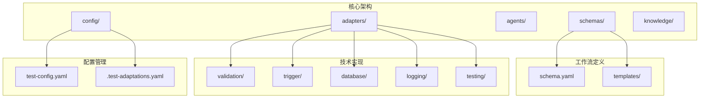

**图表来源**
- [AI测试工作流架构:1-111](file://schemas/ai-test-workflow/schema.yaml#L1-L111)
- [项目结构:71-84](file://README.md#L71-L84)

**章节来源**
- [项目结构:71-84](file://README.md#L71-L84)
- [AI测试工作流架构:1-111](file://schemas/ai-test-workflow/schema.yaml#L1-L111)

## 核心组件

### 测试用例模板系统

测试用例模板是整个框架的核心输出之一，采用Markdown格式定义，包含完整的测试设计规范。模板系统支持复杂的测试场景描述和多维度的验证策略。

#### 模板结构层次

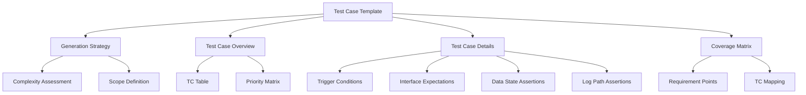

**图表来源**
- [测试用例模板:1-33](file://schemas/ai-test-workflow/templates/test-cases.md#L1-L33)

#### 复杂度评估体系

框架采用三层复杂度评估标准：
- **简单**：单一路径验证，无边界条件处理
- **普通**：包含基本边界条件，单次调用验证
- **复杂**：多路径分支，跨服务调用，异步处理

复杂度评估直接影响测试策略选择和资源分配。

**章节来源**
- [测试用例模板:3-6](file://schemas/ai-test-workflow/templates/test-cases.md#L3-L6)

### 验证层次系统

框架实现了严格的三层验证体系，每层都有明确的职责边界和技术要求：

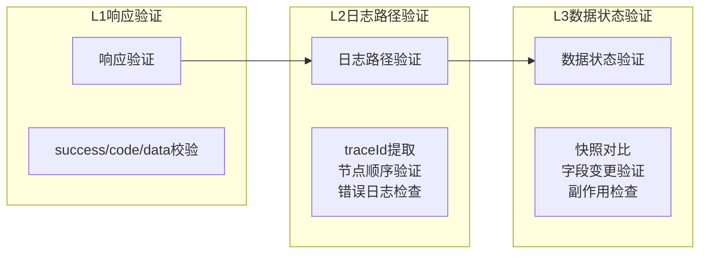

**图表来源**
- [AI测试工作流架构:38-61](file://schemas/ai-test-workflow/schema.yaml#L38-L61)
- [响应验证适配器:1-7](file://adapters/validation/response.md#L1-L7)
- [日志路径验证适配器:1-10](file://adapters/validation/log-path.md#L1-L10)
- [数据状态验证适配器:1-8](file://adapters/validation/data-state.md#L1-L8)

**章节来源**
- [AI测试工作流架构:38-61](file://schemas/ai-test-workflow/schema.yaml#L38-L61)
- [响应验证适配器:1-7](file://adapters/validation/response.md#L1-L7)
- [日志路径验证适配器:1-10](file://adapters/validation/log-path.md#L1-L10)
- [数据状态验证适配器:1-8](file://adapters/validation/data-state.md#L1-L8)

## 架构概览

### 工作流执行架构

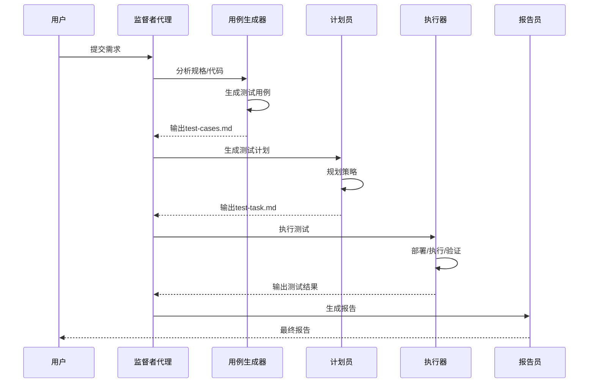

**图表来源**
- [AI测试工作流架构:17-26](file://schemas/ai-test-workflow/schema.yaml#L17-L26)
- [AI测试工作流架构:65-70](file://schemas/ai-test-workflow/schema.yaml#L65-L70)

### 执行模式对比

框架支持两种执行模式，针对不同场景提供最优解决方案：

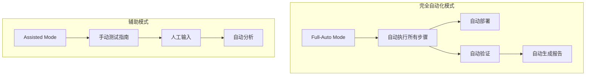

**图表来源**
- [AI测试工作流架构:65-70](file://schemas/ai-test-workflow/schema.yaml#L65-L70)
- [手动测试指南模板:1-32](file://schemas/ai-test-workflow/templates/manual-test-guide.md#L1-L32)

**章节来源**
- [AI测试工作流架构:65-70](file://schemas/ai-test-workflow/schema.yaml#L65-L70)
- [手动测试指南模板:1-32](file://schemas/ai-test-workflow/templates/manual-test-guide.md#L1-L32)

## 详细组件分析

### 测试用例表格字段定义

测试用例表格是测试设计的核心载体，采用标准化的字段定义确保测试的一致性和可追溯性。

#### 基础字段体系

| 字段名称 | 类型 | 必填 | 描述 | 示例值 |
|---------|------|------|------|--------|
| TC-ID | 文本 | 是 | 测试用例唯一标识符 | TC-001 |
| 场景描述 | 文型 | 是 | 条件→结果的完整描述 | 正常路径:请求成功→返回数据非空 |
| 预期行为 | 文本 | 是 | 明确的成功/失败条件 | success=true, data非空 |
| 优先级 | 文本 | 是 | P0/P1/P2等级别 | P0 |
| 降级 | 文本 | 否 | 特殊降级规则覆盖 | no_mcp: FAIL |

#### 降级规则继承机制

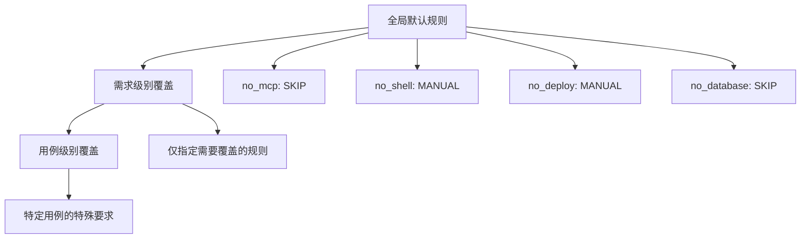

**图表来源**
- [AI测试工作流架构:38-61](file://schemas/ai-test-workflow/schema.yaml#L38-L61)
- [代理配置模板:17-27](file://agents/template.md#L17-L27)

**章节来源**
- [测试用例模板:7-14](file://schemas/ai-test-workflow/templates/test-cases.md#L7-L14)
- [代理配置模板:17-27](file://agents/template.md#L17-L27)

### 测试用例详情结构

测试用例详情部分提供了详细的执行指导和验证标准，确保测试的可重复性和准确性。

#### 触发条件定义

触发条件必须明确具体的技术操作：
- **HSF调用**：服务名.方法名(参数列表)
- **HTTP请求**：URL + 请求头 + 请求体
- **数据库操作**：SQL语句 + 参数绑定
- **文件操作**：路径 + 文件内容

#### 接口期望规范

接口期望采用结构化的键值对格式：
- **响应码**：success布尔值，code字符串
- **数据结构**：字段存在性，类型正确性
- **业务逻辑**：业务规则验证

#### 数据状态断言

数据状态断言通过表格形式定义：
- **表名**：目标数据库表
- **条件**：WHERE子句
- **字段断言**：字段名=期望值

#### 日志路径断言

日志路径断言确保端到端流程的可观测性：
- **顺序验证**：节点出现的先后顺序
- **完整性检查**：所有必要节点都存在
- **时间窗口**：事件发生的时间范围
- **关键字匹配**：日志内容的关键信息

**章节来源**
- [测试用例模板:15-28](file://schemas/ai-test-workflow/templates/test-cases.md#L15-L28)

### 覆盖率矩阵

覆盖率矩阵是测试设计质量的重要指标，用于量化测试的全面性。

#### 覆盖矩阵结构

| 需求点 | TC-001 | TC-002 | ... |
|--------|--------|--------|-----|
| R1: 正常流程 | ✅ | ❌ | ... |
| R2: 边界条件 | ✅ | ✅ | ... |
| R3: 异常处理 | ❌ | ✅ | ... |

#### 使用方法

1. **需求点识别**：从需求文档中提取关键功能点
2. **用例映射**：将测试用例与需求点建立对应关系
3. **覆盖率计算**：统计每个需求点的覆盖情况
4. **缺口分析**：识别未覆盖的需求点并补充测试

**章节来源**
- [测试用例模板:29-33](file://schemas/ai-test-workflow/templates/test-cases.md#L29-L33)

### 测试任务计划

测试任务计划模板提供了更详细的执行规划，适用于复杂场景的测试实施。

#### 任务规划要素

| 字段 | 描述 | 示例 |
|------|------|------|
| TC-ID | 测试用例标识 | TC-001 |
| 场景 | 场景类型 | 正常/异常/边界 |
| 优先级 | P0/P1/P2 | P0 |
| 类型 | HSF/Mock/HTTP | HSF |
| 数据构建 | 预置数据方案 | 现有数据 |
| 验证 | 验证层次 | L1+L2+L3 |
| 降级 | 特殊规则 | *(default)* |

#### 数据构建细节

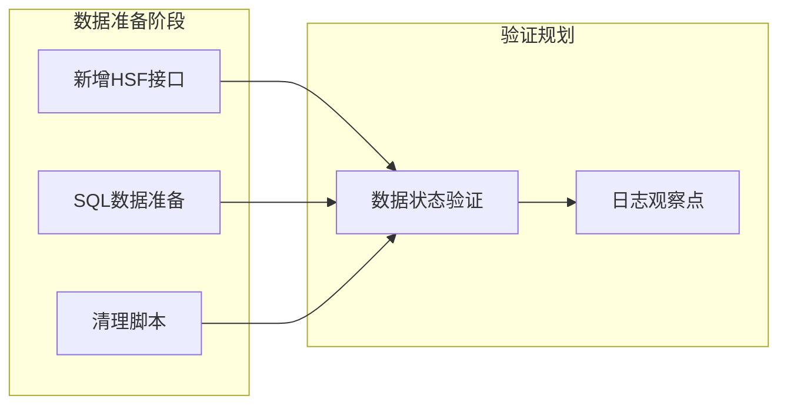

**图表来源**
- [测试任务计划模板:9-32](file://schemas/ai-test-workflow/templates/test-task.md#L9-L32)

**章节来源**
- [测试任务计划模板:1-53](file://schemas/ai-test-workflow/templates/test-task.md#L1-L53)

## 依赖关系分析

### 组件耦合度分析

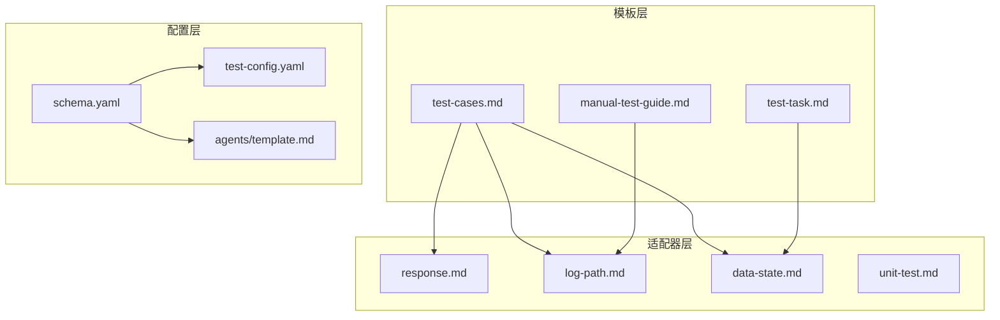

**图表来源**
- [AI测试工作流架构:1-111](file://schemas/ai-test-workflow/schema.yaml#L1-L111)
- [测试用例模板:1-33](file://schemas/ai-test-workflow/templates/test-cases.md#L1-L33)

### 外部依赖集成

框架通过MCP（Model Context Protocol）工具实现外部系统的集成：

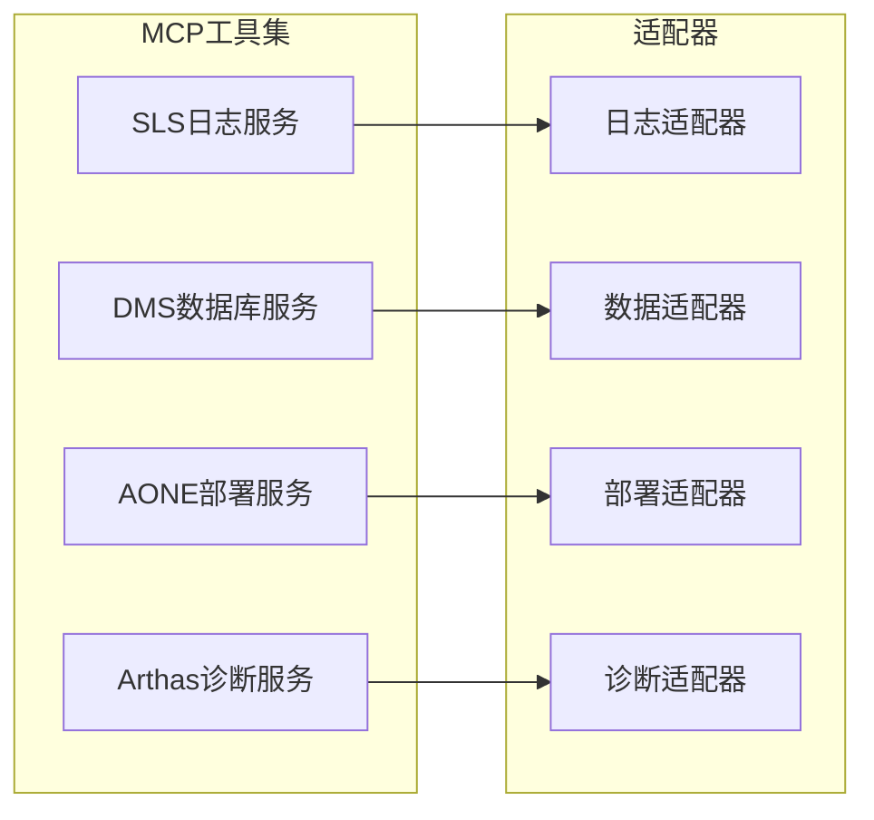

**图表来源**
- [项目配置模板:18-23](file://config/test-config-template.yaml#L18-L23)
- [日志路径验证适配器:1-10](file://adapters/validation/log-path.md#L1-L10)
- [数据状态验证适配器:1-8](file://adapters/validation/data-state.md#L1-L8)

**章节来源**
- [项目配置模板:18-23](file://config/test-config-template.yaml#L18-L23)
- [AI测试工作流架构:38-61](file://schemas/ai-test-workflow/schema.yaml#L38-L61)

## 性能考虑

### 执行效率优化

1. **并行执行**：支持多个测试用例的并行执行，提高整体效率
2. **智能降级**：根据环境条件自动选择最优的验证层次
3. **缓存机制**：利用MCP工具的缓存能力减少重复操作
4. **增量更新**：只执行必要的验证步骤，避免全量扫描

### 资源管理策略

- **内存管理**：支持会话级和持久化内存模式
- **并发控制**：限制同时运行的进程数量
- **超时设置**：为每个操作设置合理的超时时间
- **重试机制**：对临时性失败进行自动重试

## 故障排除指南

### 常见问题诊断

#### 单元测试执行失败

当单元测试编译或运行失败时，框架提供三种处理策略：

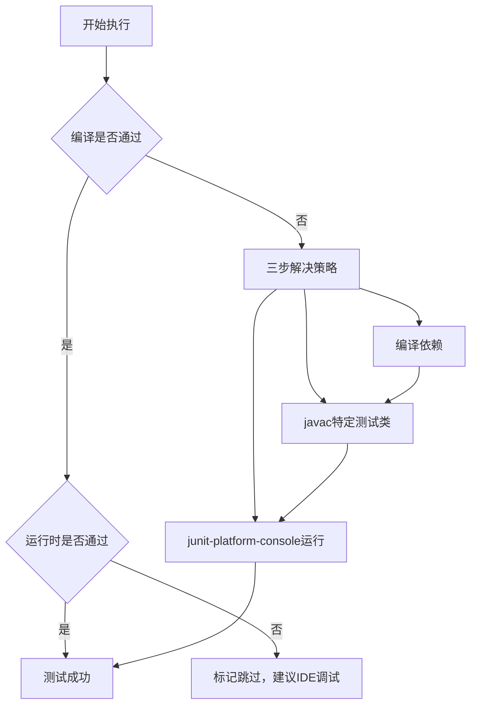

**图表来源**
- [单元测试策略:1-11](file://adapters/testing/unit-test.md#L1-L11)

#### MCP工具不可用

当MCP工具不可用时，框架按照降级规则自动调整：

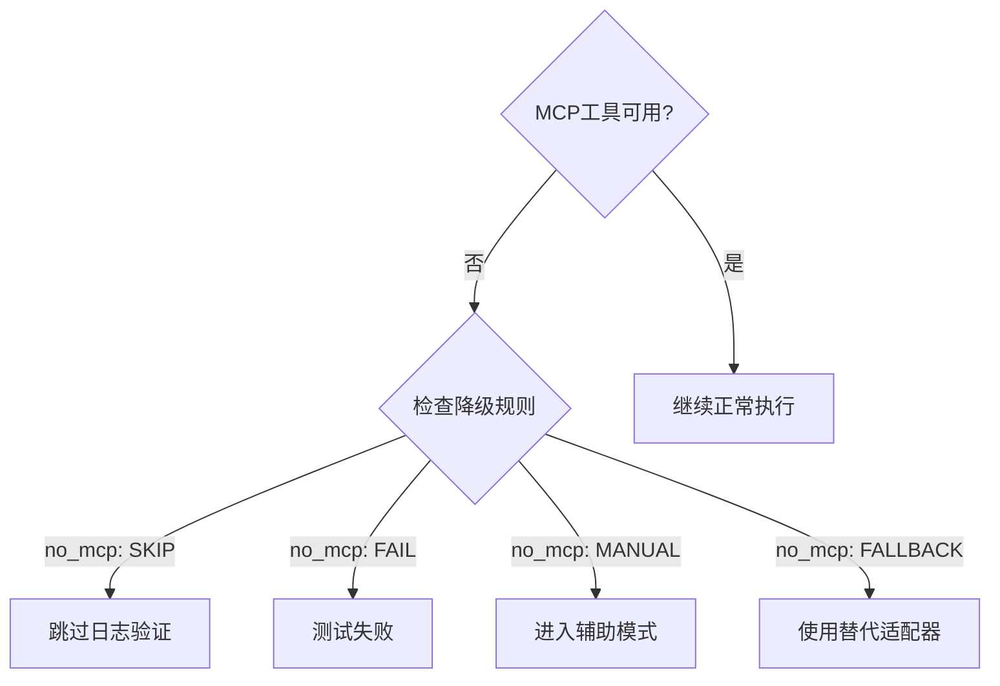

**图表来源**
- [AI测试工作流架构:56-59](file://schemas/ai-test-workflow/schema.yaml#L56-L59)
- [代理配置模板:29-36](file://agents/template.md#L29-L36)

**章节来源**
- [单元测试策略:1-11](file://adapters/testing/unit-test.md#L1-L11)
- [代理配置模板:29-36](file://agents/template.md#L29-L36)

### 自我修复循环

框架内置了自我修复机制，当检测到测试失败时自动尝试修复：

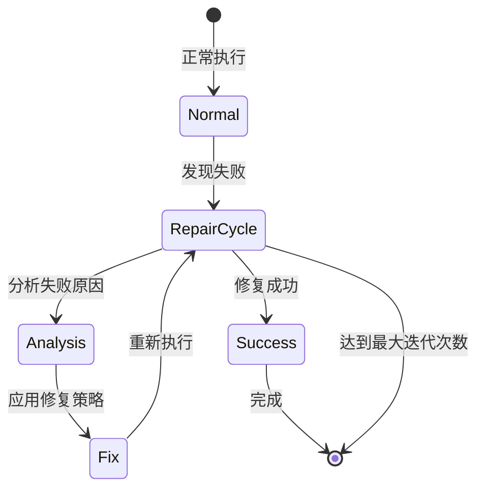

**图表来源**
- [AI测试工作流架构:105-109](file://schemas/ai-test-workflow/schema.yaml#L105-L109)

**章节来源**
- [AI测试工作流架构:105-109](file://schemas/ai-test-workflow/schema.yaml#L105-L109)

## 结论

AI自动测试SOP框架通过标准化的测试用例模板、严格的验证层次和智能化的降级策略，为复杂系统的自动化测试提供了完整的解决方案。框架的核心价值体现在：

1. **标准化**：统一的模板格式确保测试的一致性和可维护性
2. **自适应**：根据环境条件自动调整测试策略，提高成功率
3. **可扩展**：模块化的架构支持新适配器和新验证层次的添加
4. **可追踪**：完整的执行日志和状态文件便于问题定位和审计

该框架特别适合需要高可靠性的企业级应用测试，能够有效提升测试效率和质量，减少人工干预，实现真正的智能化测试。

## 附录

### 实际测试用例示例

以下是一个完整的测试用例示例，展示了模板的实际应用：

#### 基础用例示例

| TC-ID | 场景描述 | 预期行为 | 优先级 | 降级 |
|-------|----------|----------|--------|------|
| TC-001 | 正常路径:用户登录→返回令牌 | success=true, code="0", data包含token | P0 | *(default)* |
| TC-002 | 边界条件:用户名为空→返回错误 | success=false, code="ERR_001" | P1 | `no_mcp: FAIL` |

#### 详细用例示例

**TC-001: 用户登录正常流程**

- **触发条件**：HSF调用 `user.login({username:"admin",password:"123456"})`
- **接口期望**：`success=true`, `code="0"`, `data.token`存在且非空
- **数据状态断言**：
  - 表 `users`: `username="admin"` → `last_login_time` 更新
- **日志路径断言**：
  - 顺序：`Auth.start` → `Auth.validate` → `Auth.success`
  - 时间窗口：0-2秒内完成

### 最佳实践建议

1. **优先级划分**：P0级用例必须覆盖核心业务流程，P1级覆盖重要边界条件
2. **复杂度评估**：复杂用例应拆分为多个子用例，便于维护和调试
3. **降级策略**：合理使用降级规则，避免过度依赖特定工具
4. **覆盖率矩阵**：定期更新覆盖率矩阵，确保测试的全面性
5. **模板定制**：根据项目特点调整模板字段，满足特定需求

### 定制化建议

1. **字段扩展**：根据业务需要添加自定义字段，如业务指标、SLA要求等
2. **验证层次**：根据系统特性调整验证层次的严格程度
3. **降级规则**：结合项目历史问题制定针对性的降级策略
4. **执行模式**：根据团队能力和项目要求选择合适的执行模式
5. **监控集成**：集成项目现有的监控和告警系统