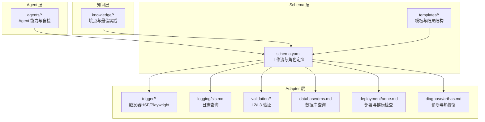
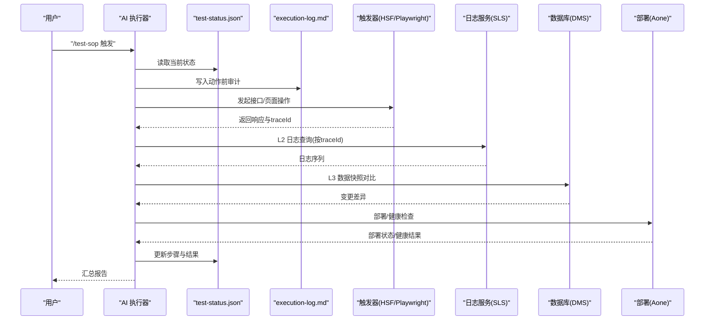
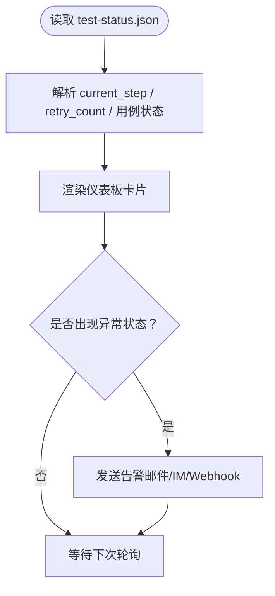
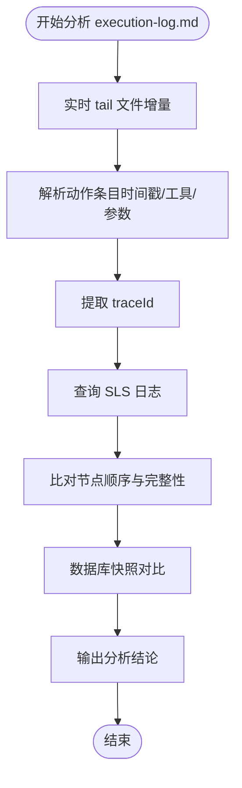
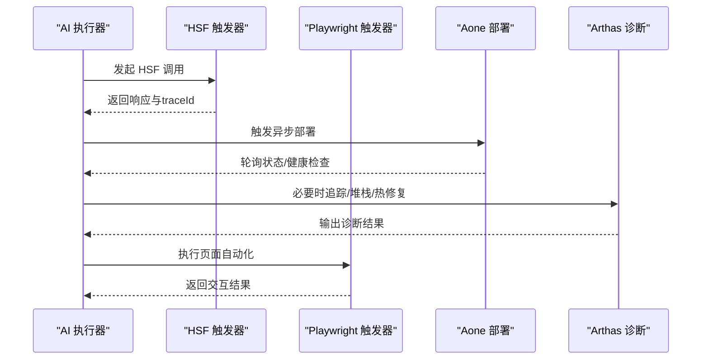
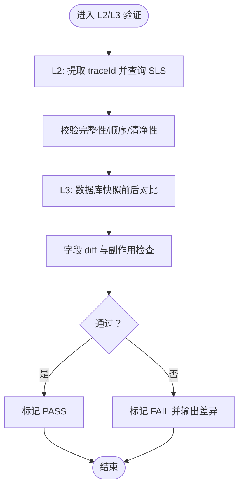
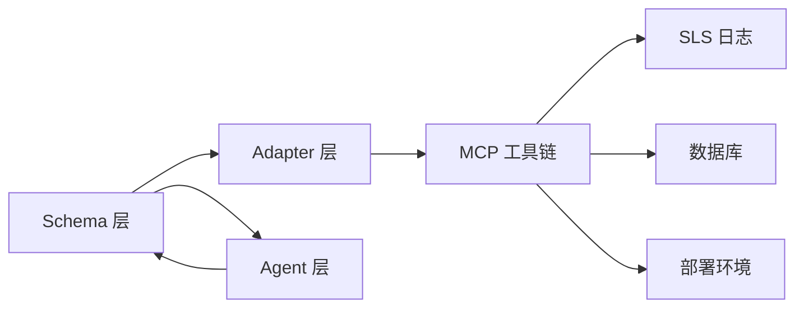

# 监控与透明度

<cite>
**本文引用的文件**
- [README.md](file://README.md)
- [DESIGN.md](file://DESIGN.md)
- [INSTRUCTIONS.md](file://INSTRUCTIONS.md)
- [test-results.json](file://schemas/ai-test-workflow/templates/test-results.json)
- [sls.md](file://adapters/logging/sls.md)
- [log-path.md](file://adapters/validation/log-path.md)
- [data-state.md](file://adapters/validation/data-state.md)
- [hsf.md](file://adapters/trigger/hsf.md)
- [aone.md](file://adapters/deployment/aone.md)
- [arthas.md](file://adapters/diagnose/arthas.md)
- [dms.md](file://adapters/database/dms.md)
- [unit-test.md](file://adapters/testing/unit-test.md)
- [playwright.md](file://adapters/trigger/playwright.md)
</cite>

## 目录
1. [简介](#简介)
2. [项目结构](#项目结构)
3. [核心组件](#核心组件)
4. [架构总览](#架构总览)
5. [详细组件分析](#详细组件分析)
6. [依赖关系分析](#依赖关系分析)
7. [性能考量](#性能考量)
8. [故障排查指南](#故障排查指南)
9. [结论](#结论)
10. [附录](#附录)

## 简介
本指南聚焦于该AI自动化测试框架的监控与透明度机制，围绕以下关键要素展开：
- 使用 test-status.json 作为仪表板监控测试进度
- 使用 execution-log.md 作为审计日志进行实时查看与分析
- 实时跟踪AI工作流（基于共享状态机与多层验证）
- 定义监控指标、告警配置与性能分析方法
- 提供日志聚合、检索与可视化的实践建议
- 解释透明度机制对测试可信度的关键作用
- 覆盖监控系统的部署、维护与优化策略，为运维团队提供完整方案

## 项目结构
该仓库采用分层设计：Schema层定义流程与规则；Adapter层封装技术实现；Agent层描述执行能力；Knowledge层沉淀经验。监控与透明度贯穿于执行日志、状态文件与多层验证适配器中。

图表来源
- [DESIGN.md:12-38](file://DESIGN.md#L12-L38)
- [INSTRUCTIONS.md:27-36](file://INSTRUCTIONS.md#L27-L36)

章节来源
- [README.md:71-84](file://README.md#L71-L84)
- [DESIGN.md:12-38](file://DESIGN.md#L12-L38)

## 核心组件
- 共享状态机（test-status.json）
  - 通过文件系统实现跨Agent的无状态通信，记录当前步骤与重试次数，支持断点续跑与可观测性。
- 执行审计日志（execution-log.md）
  - 记录每次动作前的详细上下文（时间戳、参数、工具调用），形成“黑盒”审计轨迹。
- 多层日志与数据验证（L2/L3）
  - L2 基于 traceId 查询SLS日志，校验节点完整性、顺序与干净度。
  - L3 基于数据库快照前后对比，校验状态变更与副作用。
- 触发与诊断适配器
  - HSF/Playwright 触发器、Aone 部署与健康检查、Arthas 诊断与热修复、DMS 数据库查询、Maven 单测策略。

章节来源
- [README.md:61-70](file://README.md#L61-L70)
- [DESIGN.md:56-105](file://DESIGN.md#L56-L105)
- [sls.md:1-10](file://adapters/logging/sls.md#L1-L10)
- [log-path.md:1-10](file://adapters/validation/log-path.md#L1-L10)
- [data-state.md:1-8](file://adapters/validation/data-state.md#L1-L8)
- [hsf.md:1-14](file://adapters/trigger/hsf.md#L1-L14)
- [aone.md:1-12](file://adapters/deployment/aone.md#L1-L12)
- [arthas.md:1-10](file://adapters/diagnose/arthas.md#L1-L10)
- [dms.md:1-10](file://adapters/database/dms.md#L1-L10)
- [unit-test.md:1-11](file://adapters/testing/unit-test.md#L1-L11)
- [playwright.md:1-8](file://adapters/trigger/playwright.md#L1-L8)

## 架构总览
下图展示从触发到验证的端到端流程，以及监控与透明度的关键节点。

图表来源
- [INSTRUCTIONS.md:27-36](file://INSTRUCTIONS.md#L27-L36)
- [DESIGN.md:56-105](file://DESIGN.md#L56-L105)
- [sls.md:1-10](file://adapters/logging/sls.md#L1-L10)
- [log-path.md:1-10](file://adapters/validation/log-path.md#L1-L10)
- [data-state.md:1-8](file://adapters/validation/data-state.md#L1-L8)
- [hsf.md:1-14](file://adapters/trigger/hsf.md#L1-L14)
- [aone.md:1-12](file://adapters/deployment/aone.md#L1-L12)

## 详细组件分析

### 组件一：test-status.json 仪表板监控
- 文件位置与用途
  - 位于 test-runs/<id>/test-status.json，作为共享状态机驱动执行。
- 关键字段与含义
  - current_step：当前执行阶段（如生成规范、生成用例、计划策略、执行测试、生成报告等）。
  - retry_count：失败重试次数，配合 repair-cycle 控制循环。
  - 各测试用例的最终状态与各层级验证结果（L1/L2/L3/L4）。
- 仪表板接入建议
  - 定时读取 test-status.json 并解析 current_step/retry_count/final 状态。
  - 将每个用例的 L1/L2/L3/L4 状态映射为 PASS/FAIL/SKIPPED/ERROR，形成看板。
  - 对异常状态（如 L2 清单不满足、L3 数据不一致）触发告警。
- 断点续跑与恢复
  - 读取状态后跳过已完成步骤，支持长时间运行的AI工作流。

图表来源
- [README.md:65-67](file://README.md#L65-L67)
- [DESIGN.md:106-115](file://DESIGN.md#L106-L115)
- [test-results.json:1-15](file://schemas/ai-test-workflow/templates/test-results.json#L1-L15)

章节来源
- [README.md:65-67](file://README.md#L65-L67)
- [DESIGN.md:106-115](file://DESIGN.md#L106-L115)
- [test-results.json:1-15](file://schemas/ai-test-workflow/templates/test-results.json#L1-L15)

### 组件二：execution-log.md 审计日志查看与分析
- 文件位置与用途
  - 位于 test-runs/<id>/execution-log.md，记录每次动作前的上下文与参数。
- 内容要点
  - HSF 调用详情（接口、方法、参数）、SQL 语句与结果、Shell 命令执行记录。
  - 时间戳与 traceId，便于与 L2 日志关联。
- 实时查看与分析方法
  - 实时流式读取文件增量内容，按时间戳排序展示。
  - 关键词过滤：traceId、ERROR/WARN、接口名、表名。
  - 结合 L2 日志验证：提取 traceId，查询 SLS 日志，比对节点顺序与完整性。
  - 结合 L3 数据验证：核对数据库快照前后差异，定位副作用问题。

图表来源
- [README.md:67-70](file://README.md#L67-L70)
- [DESIGN.md:56-84](file://DESIGN.md#L56-L84)
- [sls.md:1-10](file://adapters/logging/sls.md#L1-L10)
- [log-path.md:1-10](file://adapters/validation/log-path.md#L1-L10)
- [data-state.md:1-8](file://adapters/validation/data-state.md#L1-L8)

章节来源
- [README.md:67-70](file://README.md#L67-L70)
- [DESIGN.md:56-84](file://DESIGN.md#L56-L84)

### 组件三：实时跟踪AI工作流
- 触发器
  - HSF 接口调用与参数提取 traceId，用于后续 L2 日志验证。
  - Playwright 页面自动化，记录交互步骤与参数。
- 部署与健康检查
  - 异步部署+轮询+冷却，结合端口探测、只读接口检查与最近一分钟 SLS 错误日志检查。
- 诊断与热修复
  - Arthas 追踪与堆栈查看，必要时进行类重定义热修复。

图表来源
- [hsf.md:1-14](file://adapters/trigger/hsf.md#L1-L14)
- [playwright.md:1-8](file://adapters/trigger/playwright.md#L1-L8)
- [aone.md:1-12](file://adapters/deployment/aone.md#L1-L12)
- [arthas.md:1-10](file://adapters/diagnose/arthas.md#L1-L10)

章节来源
- [hsf.md:1-14](file://adapters/trigger/hsf.md#L1-L14)
- [playwright.md:1-8](file://adapters/trigger/playwright.md#L1-L8)
- [aone.md:1-12](file://adapters/deployment/aone.md#L1-L12)
- [arthas.md:1-10](file://adapters/diagnose/arthas.md#L1-L10)

### 组件四：日志与数据验证（L2/L3）
- L2 日志路径验证
  - 从响应中提取 traceId，查询 SLS 日志，校验：
    - 节点完整性：所有期望节点均出现
    - 节点顺序：严格的时间先后顺序
    - 清净性：无 ERROR/WARN 日志
- L3 数据状态验证
  - 执行前快照 baseline，执行后查询并 diff，关注：
    - 主体字段变化（如状态由 DRAFT → APPROVED）
    - 副作用（关联表的非预期变更）

图表来源
- [log-path.md:1-10](file://adapters/validation/log-path.md#L1-L10)
- [data-state.md:1-8](file://adapters/validation/data-state.md#L1-L8)
- [sls.md:1-10](file://adapters/logging/sls.md#L1-L10)
- [dms.md:1-10](file://adapters/database/dms.md#L1-L10)

章节来源
- [log-path.md:1-10](file://adapters/validation/log-path.md#L1-L10)
- [data-state.md:1-8](file://adapters/validation/data-state.md#L1-L8)
- [sls.md:1-10](file://adapters/logging/sls.md#L1-L10)
- [dms.md:1-10](file://adapters/database/dms.md#L1-L10)

### 组件五：单元测试与单测策略
- 编译期错误处理
  - 依赖编译先行，再执行单测；若编译失败，采用“三步 workaround”继续推进。
- 运行期错误处理
  - 若仅运行期异常，标记 SKIP，并引导在 IDE 中定位问题。

章节来源
- [unit-test.md:1-11](file://adapters/testing/unit-test.md#L1-L11)

## 依赖关系分析
- 组件耦合与协作
  - Schema 层定义 DAG 与角色，决定何时调用 L2/L3 验证。
  - Adapter 层提供可插拔实现（SLS/DMS/Aone/Arthas/Playwright/HSF）。
  - Agent 层根据自身能力选择执行模式（全自动化/辅助模式）。
- 外部依赖
  - MCP 工具链（sls-mcp、dms-mcp-server、group-env、arthas）。
  - SLS 日志服务、数据库与部署环境。
- 可能的环路与风险
  - 依赖 MCP 工具可用性，缺失时按降级规则（SKIP/FAIL/MANUAL/FALLBACK）处理。
  - 部署轮询与健康检查需避免过度频繁请求。

图表来源
- [DESIGN.md:12-38](file://DESIGN.md#L12-L38)
- [DESIGN.md:148-186](file://DESIGN.md#L148-L186)

章节来源
- [DESIGN.md:12-38](file://DESIGN.md#L12-L38)
- [DESIGN.md:148-186](file://DESIGN.md#L148-L186)

## 性能考量
- I/O 与轮询
  - 部署轮询间隔建议 30s，健康检查采用端口探测与只读接口，减少对业务的影响。
- 日志查询
  - L2 查询按 traceId 限定范围，避免全局扫描；建议缓存 traceId 到日志行映射。
- 状态更新
  - test-status.json 的写入应批量合并，降低磁盘写压力。
- 并发与资源
  - Playwright 浏览器实例数量限制，避免内存与 CPU 抖动。
- 自适应优化
  - 通过 .test-adaptations.yaml 动态调整超时阈值与排除模式，减少误报与抖动。

## 故障排查指南
- test-status.json 异常
  - 现象：current_step 长时间不变或重复。
  - 排查：确认读写顺序（先读后写）、是否存在并发写冲突；检查 repair-cycle 是否生效。
- execution-log.md 缺失或为空
  - 现象：审计轨迹缺失。
  - 排查：确认 AI 在每次动作前已写入；检查权限与路径；核对 /test-sop 触发流程。
- L2 日志验证失败
  - 现象：节点缺失/顺序错乱/存在 ERROR/WARN。
  - 排查：核对 traceId 提取是否正确；SLS 查询条件是否匹配；排除规则是否误命中。
- L3 数据验证失败
  - 现象：状态未变更或副作用异常。
  - 排查：确认快照采集时机；核对 diff 字段；检查事务隔离与并发写入。
- 部署与健康检查
  - 现象：部署卡住或健康检查失败。
  - 排查：检查轮询间隔与冷却时间；核对只读接口与 SLS 最近一分钟错误日志。
- 诊断与热修复
  - 现象：线上问题难以复现。
  - 排查：使用 Arthas 进行函数追踪与堆栈查看；必要时进行类重定义热修复。

章节来源
- [DESIGN.md:56-105](file://DESIGN.md#L56-L105)
- [aone.md:1-12](file://adapters/deployment/aone.md#L1-L12)
- [arthas.md:1-10](file://adapters/diagnose/arthas.md#L1-L10)

## 结论
通过 test-status.json 与 execution-log.md 的双轨监控，结合 L2/L3 多层验证与可插拔的 Adapter 体系，该框架实现了高透明度与强可观测性的AI自动化测试。运维团队可据此建立统一的仪表板、告警与日志分析流程，持续提升测试可信度与稳定性。

## 附录

### 监控指标定义与告警配置建议
- 指标
  - 任务成功率：（PASS + SKIPPED）/ 总用例数
  - L2 通过率：L2 完整性/顺序/清净性均通过的比例
  - L3 通过率：数据状态变更与副作用检查通过的比例
  - 平均执行时长：各用例 exec_time_ms 的均值
  - 重试次数分布：retry_count 分布统计
- 告警
  - L2 不通过或 L3 数据不一致立即告警
  - 重试次数超过阈值（如 >3）触发升级告警
  - 部署健康检查连续失败触发告警
  - SLS 最近一分钟 ERROR/WARN 数量异常上升触发告警

### 日志聚合、搜索与可视化方案
- 聚合
  - 将 execution-log.md 与 SLS 日志统一归档，按 traceId 建立索引。
- 搜索
  - 支持 traceId、接口名、表名、时间范围、错误关键字检索。
- 可视化
  - 仪表板：用例状态看板、L2/L3 通过率趋势、重试次数分布。
  - 轨迹回放：按时间线回放 execution-log.md 与对应日志片段。

### 透明度与测试可信度
- 透明度机制
  - test-status.json 提供执行进度与决策依据；execution-log.md 提供“黑盒”审计轨迹。
- 对可信度的作用
  - 可追溯：任一步骤失败均可溯源至具体动作与日志。
  - 可验证：L2/L3 验证确保行为与数据一致性。
  - 可改进：自演进机制自动优化参数与规则，持续提升质量。