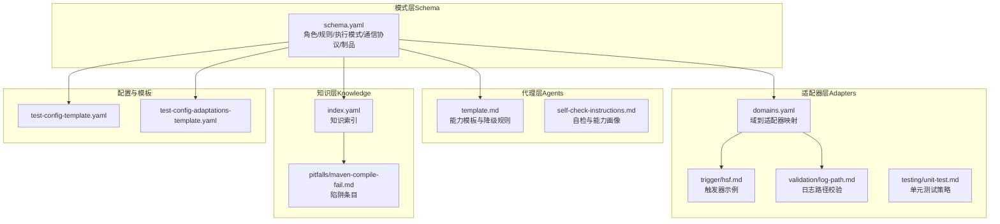
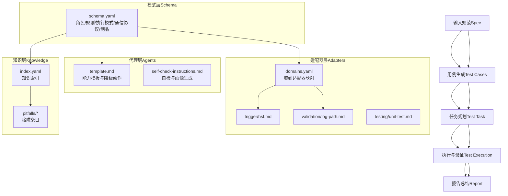
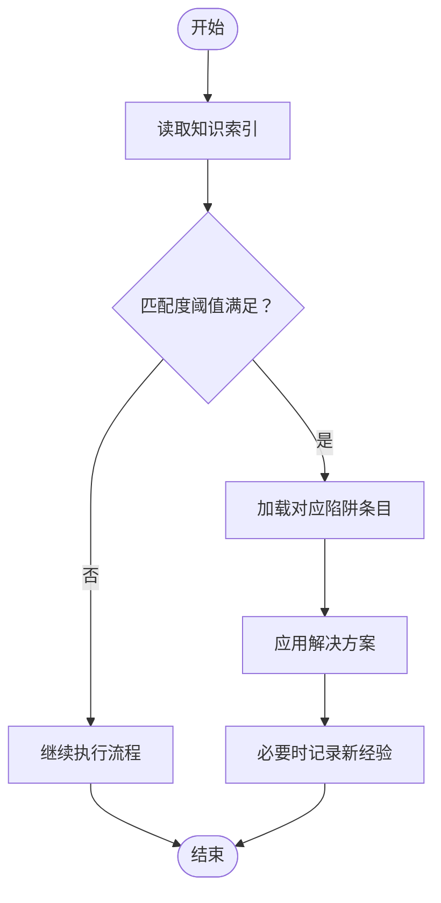
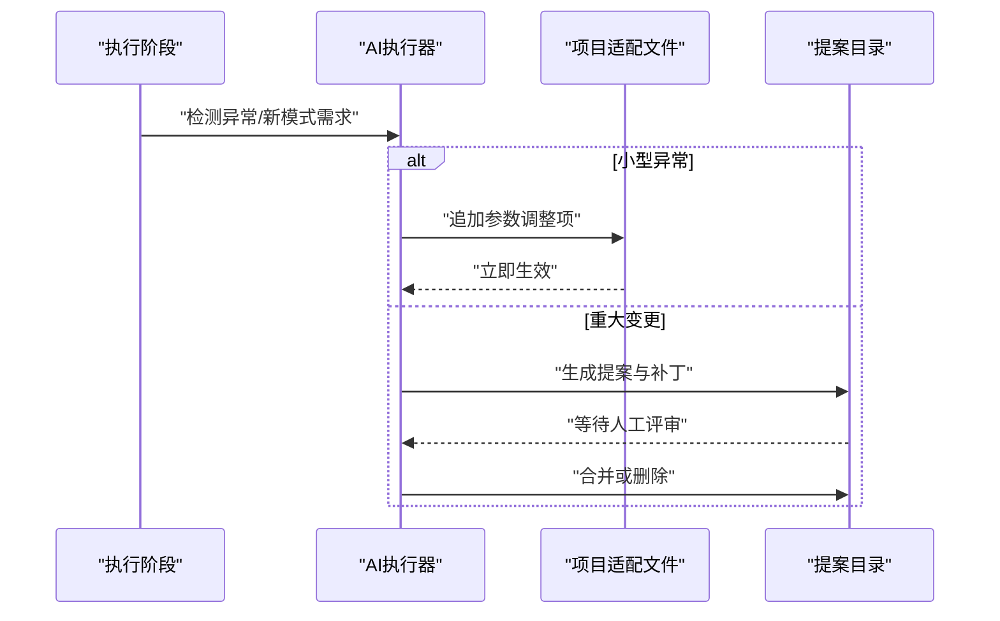
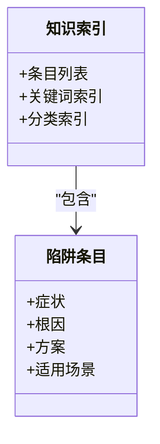
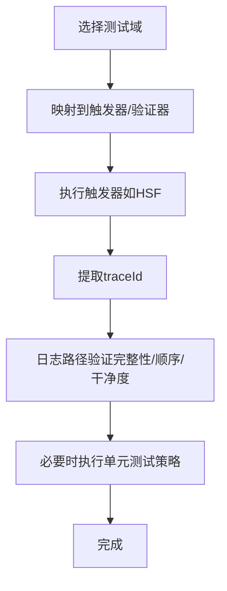
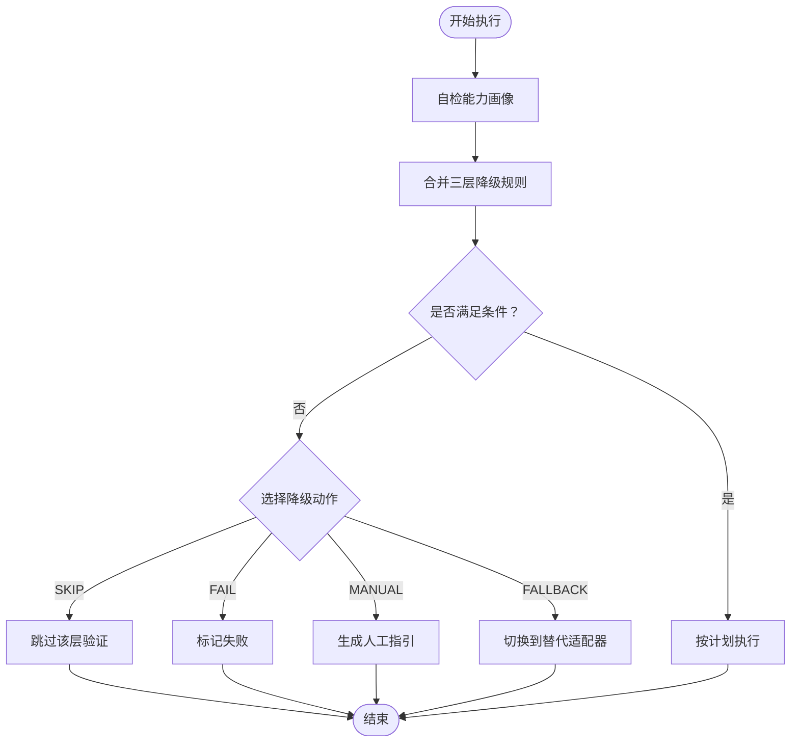
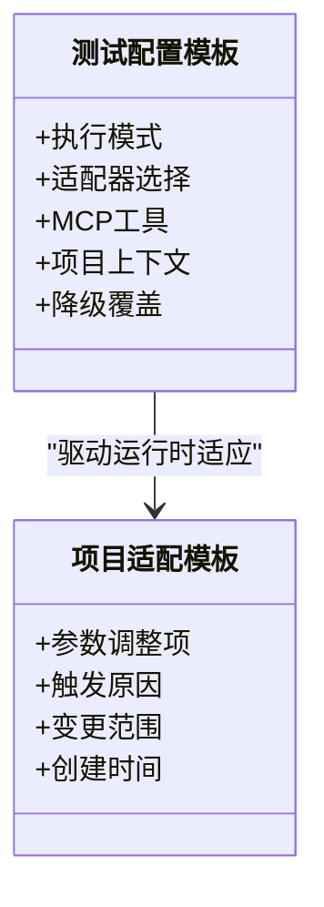
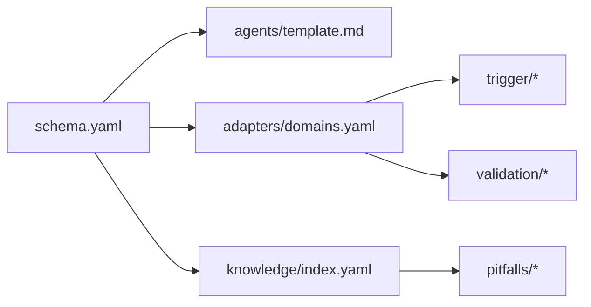

# 知识管理体系

<cite>
**本文引用的文件**
- [README.md](file://README.md)
- [DESIGN.md](file://DESIGN.md)
- [INSTRUCTIONS.md](file://INSTRUCTIONS.md)
- [knowledge/index.yaml](file://knowledge/index.yaml)
- [knowledge/pitfalls/maven-compile-fail.md](file://knowledge/pitfalls/maven-compile-fail.md)
- [adapters/domains.yaml](file://adapters/domains.yaml)
- [adapters/trigger/hsf.md](file://adapters/trigger/hsf.md)
- [adapters/validation/log-path.md](file://adapters/validation/log-path.md)
- [adapters/testing/unit-test.md](file://adapters/testing/unit-test.md)
- [agents/template.md](file://agents/template.md)
- [agents/self-check-instructions.md](file://agents/self-check-instructions.md)
- [config/test-config-template.yaml](file://config/test-config-template.yaml)
- [config/test-config-adaptations-template.yaml](file://config/test-config-adaptations-template.yaml)
- [schemas/ai-test-workflow/schema.yaml](file://schemas/ai-test-workflow/schema.yaml)
- [install.sh](file://install.sh)
</cite>

## 目录
1. [引言](#引言)
2. [项目结构](#项目结构)
3. [核心组件](#核心组件)
4. [架构总览](#架构总览)
5. [详细组件分析](#详细组件分析)
6. [依赖关系分析](#依赖关系分析)
7. [性能与可扩展性](#性能与可扩展性)
8. [故障排查指南](#故障排查指南)
9. [结论](#结论)
10. [附录](#附录)

## 引言
本文件系统化阐述该AI自动测试SOP的知识管理体系：知识库架构、自我演化机制、陷阱收集、最佳实践存储与学习算法、知识更新与版本管理、冲突解决策略、知识表示与检索、应用模式、贡献与质量保障流程、对工作流优化的影响与评估方法，以及知识库维护、备份与迁移策略，并为开发者提供扩展知识体系的指导。

## 项目结构
该项目采用分层解耦的架构，知识体系位于“知识层”，与“模式层（Schema）”“适配器层（Adapters）”“代理层（Agents）”协同工作，形成“输入规范 → 用例生成 → 任务规划 → 执行验证 → 报告总结”的闭环，并在每次运行后通过自演化机制持续改进。

图表来源
- [schemas/ai-test-workflow/schema.yaml:1-111](file://schemas/ai-test-workflow/schema.yaml#L1-L111)
- [agents/template.md:1-36](file://agents/template.md#L1-L36)
- [agents/self-check-instructions.md:1-25](file://agents/self-check-instructions.md#L1-L25)
- [adapters/domains.yaml:1-27](file://adapters/domains.yaml#L1-L27)
- [adapters/trigger/hsf.md:1-14](file://adapters/trigger/hsf.md#L1-L14)
- [adapters/validation/log-path.md:1-10](file://adapters/validation/log-path.md#L1-L10)
- [adapters/testing/unit-test.md:1-11](file://adapters/testing/unit-test.md#L1-L11)
- [knowledge/index.yaml:1-10](file://knowledge/index.yaml#L1-L10)
- [knowledge/pitfalls/maven-compile-fail.md:1-18](file://knowledge/pitfalls/maven-compile-fail.md#L1-L18)
- [config/test-config-template.yaml:1-32](file://config/test-config-template.yaml#L1-L32)
- [config/test-config-adaptations-template.yaml:1-26](file://config/test-config-adaptations-template.yaml#L1-L26)

章节来源
- [README.md:71-84](file://README.md#L71-L84)
- [DESIGN.md:12-38](file://DESIGN.md#L12-L38)

## 核心组件
- 知识索引与陷阱库
  - 索引文件用于快速检索相关解决方案，支持关键词与分类查询。
  - 陷阱条目记录症状、根因、方案与适用场景，便于复用与传播。
- 自我演化机制
  - 运行时适应（Tier 1）：参数级调整，如超时、日志排除等，写入项目级适配文件。
  - 结构提案（Tier 2）：重大变更以提案形式暂停，经人工评审后合并或拒绝。
- 执行与反馈闭环
  - 模式层定义角色、规则、执行模式与通信协议；代理层根据能力画像动态降级；适配器层封装技术实现；知识层在运行前检索并在异常时沉淀经验。

章节来源
- [DESIGN.md:127-155](file://DESIGN.md#L127-L155)
- [knowledge/index.yaml:1-10](file://knowledge/index.yaml#L1-L10)
- [knowledge/pitfalls/maven-compile-fail.md:1-18](file://knowledge/pitfalls/maven-compile-fail.md#L1-L18)
- [config/test-config-adaptations-template.yaml:1-26](file://config/test-config-adaptations-template.yaml#L1-L26)

## 架构总览
下图展示知识体系在整体框架中的位置与交互关系：模式层驱动执行，代理层决定能力与降级策略，适配器层承载技术细节，知识层提供检索与沉淀。

图表来源
- [schemas/ai-test-workflow/schema.yaml:1-111](file://schemas/ai-test-workflow/schema.yaml#L1-L111)
- [agents/template.md:1-36](file://agents/template.md#L1-L36)
- [agents/self-check-instructions.md:1-25](file://agents/self-check-instructions.md#L1-L25)
- [adapters/domains.yaml:1-27](file://adapters/domains.yaml#L1-L27)
- [adapters/trigger/hsf.md:1-14](file://adapters/trigger/hsf.md#L1-L14)
- [adapters/validation/log-path.md:1-10](file://adapters/validation/log-path.md#L1-L10)
- [adapters/testing/unit-test.md:1-11](file://adapters/testing/unit-test.md#L1-L11)
- [knowledge/index.yaml:1-10](file://knowledge/index.yaml#L1-L10)
- [knowledge/pitfalls/maven-compile-fail.md:1-18](file://knowledge/pitfalls/maven-compile-fail.md#L1-L18)

## 详细组件分析

### 组件一：知识索引与陷阱库
- 知识索引
  - 作用：为AI在执行前快速检索相关解决方案，避免重复踩坑。
  - 结构：包含陷阱条目的清单（ID、关键词、分类、文件路径），支持注释化预留字段以便扩展。
- 陷阱条目
  - 结构：症状、根因、解决方案、适用场景等，便于直接复用。
  - 示例：Maven编译失败的三步规避策略，结合单元测试适配器使用。

图表来源
- [knowledge/index.yaml:1-10](file://knowledge/index.yaml#L1-L10)
- [knowledge/pitfalls/maven-compile-fail.md:1-18](file://knowledge/pitfalls/maven-compile-fail.md#L1-L18)

章节来源
- [knowledge/index.yaml:1-10](file://knowledge/index.yaml#L1-L10)
- [knowledge/pitfalls/maven-compile-fail.md:1-18](file://knowledge/pitfalls/maven-compile-fail.md#L1-L18)

### 组件二：自我演化机制
- Tier 1：运行时适应（自动）
  - 文件：项目级适配文件（参数级调整，如超时、日志排除）。
  - 触发：运行中出现的小型异常或误报。
  - 行为：AI直接写入并立即生效，降低风险。
- Tier 2：结构提案（人工介入）
  - 文件夹：提案目录，包含提案说明与差异补丁。
  - 触发：需要改变流程、新增验证层级或调整DAG。
  - 行为：AI暂停并等待人工评审，批准则合并，拒绝则清理。

图表来源
- [DESIGN.md:127-155](file://DESIGN.md#L127-L155)
- [config/test-config-adaptations-template.yaml:1-26](file://config/test-config-adaptations-template.yaml#L1-L26)

章节来源
- [DESIGN.md:127-155](file://DESIGN.md#L127-L155)
- [config/test-config-adaptations-template.yaml:1-26](file://config/test-config-adaptations-template.yaml#L1-L26)

### 组件三：知识表示与检索
- 表示方法
  - 结构化条目：症状、根因、方案、适用场景。
  - 索引元数据：ID、关键词、分类、文件路径。
- 检索机制
  - 基于关键词与分类的快速匹配，优先返回高相关度条目。
  - 支持注释化预留字段，便于未来扩展。

图表来源
- [knowledge/index.yaml:1-10](file://knowledge/index.yaml#L1-L10)
- [knowledge/pitfalls/maven-compile-fail.md:1-18](file://knowledge/pitfalls/maven-compile-fail.md#L1-L18)

章节来源
- [knowledge/index.yaml:1-10](file://knowledge/index.yaml#L1-L10)
- [knowledge/pitfalls/maven-compile-fail.md:1-18](file://knowledge/pitfalls/maven-compile-fail.md#L1-L18)

### 组件四：适配器与技术实现
- 域到适配器映射
  - 定义不同测试域（后端接口、前端UI、全栈）所需的触发器与验证器组合。
- 触发器与验证器
  - 触发器：如HSF调用示例，输出traceId供日志链路验证。
  - 日志路径验证：基于traceId查询日志，校验节点完整性、顺序与干净度。
  - 单元测试策略：编译失败时的三步规避流程，提升自动化可用性。

图表来源
- [adapters/domains.yaml:1-27](file://adapters/domains.yaml#L1-L27)
- [adapters/trigger/hsf.md:1-14](file://adapters/trigger/hsf.md#L1-L14)
- [adapters/validation/log-path.md:1-10](file://adapters/validation/log-path.md#L1-L10)
- [adapters/testing/unit-test.md:1-11](file://adapters/testing/unit-test.md#L1-L11)

章节来源
- [adapters/domains.yaml:1-27](file://adapters/domains.yaml#L1-L27)
- [adapters/trigger/hsf.md:1-14](file://adapters/trigger/hsf.md#L1-L14)
- [adapters/validation/log-path.md:1-10](file://adapters/validation/log-path.md#L1-L10)
- [adapters/testing/unit-test.md:1-11](file://adapters/testing/unit-test.md#L1-L11)

### 组件五：代理能力与降级策略
- 能力画像
  - 通过自检脚本探测文件读写、Shell、后台进程、MCP支持、并行能力。
- 降级规则
  - 三层继承：用例级别 > 需求级别（配置） > 全局默认（代理模板）。
  - 动作：跳过、失败、人工引导、回退到替代适配器。

图表来源
- [agents/self-check-instructions.md:1-25](file://agents/self-check-instructions.md#L1-L25)
- [agents/template.md:1-36](file://agents/template.md#L1-L36)
- [schemas/ai-test-workflow/schema.yaml:38-61](file://schemas/ai-test-workflow/schema.yaml#L38-L61)

章节来源
- [agents/self-check-instructions.md:1-25](file://agents/self-check-instructions.md#L1-L25)
- [agents/template.md:1-36](file://agents/template.md#L1-L36)
- [schemas/ai-test-workflow/schema.yaml:38-61](file://schemas/ai-test-workflow/schema.yaml#L38-L61)

### 组件六：配置与模板
- 测试配置模板
  - 定义执行模式、适配器选择、MCP工具、项目上下文与可选的降级覆盖。
- 项目适配模板
  - 定义参数级调整的结构，支持超时、日志排除等。

图表来源
- [config/test-config-template.yaml:1-32](file://config/test-config-template.yaml#L1-L32)
- [config/test-config-adaptations-template.yaml:1-26](file://config/test-config-adaptations-template.yaml#L1-L26)

章节来源
- [config/test-config-template.yaml:1-32](file://config/test-config-template.yaml#L1-L32)
- [config/test-config-adaptations-template.yaml:1-26](file://config/test-config-adaptations-template.yaml#L1-L26)

## 依赖关系分析
- 松耦合设计
  - 模式层定义流程与规则，不直接依赖具体技术实现。
  - 适配器层通过域映射解耦技术栈变化。
  - 知识层独立于执行逻辑，仅在检索与沉淀阶段参与。
- 关键依赖链
  - schema.yaml → agents/template.md（能力与降级）→ adapters/domains.yaml（触发/验证）→ knowledge/index.yaml（检索）。
- 冲突与一致性
  - 三层降级规则确保冲突最小化，后层覆盖前层未指定项。
  - 提案机制在结构层面引入人工把关，避免无审查的破坏性变更。

图表来源
- [schemas/ai-test-workflow/schema.yaml:1-111](file://schemas/ai-test-workflow/schema.yaml#L1-L111)
- [agents/template.md:1-36](file://agents/template.md#L1-L36)
- [adapters/domains.yaml:1-27](file://adapters/domains.yaml#L1-L27)
- [knowledge/index.yaml:1-10](file://knowledge/index.yaml#L1-L10)

章节来源
- [schemas/ai-test-workflow/schema.yaml:38-61](file://schemas/ai-test-workflow/schema.yaml#L38-L61)
- [adapters/domains.yaml:1-27](file://adapters/domains.yaml#L1-L27)

## 性能与可扩展性
- 性能特征
  - 知识检索为轻量文本匹配，开销极低；运行时适应以参数调整为主，影响面小。
  - 适配器插件化设计降低技术栈切换成本，提升长期可维护性。
- 可扩展性
  - 新增陷阱条目无需修改核心逻辑；新增域只需扩展域映射与适配器。
  - 提案机制支持渐进式结构演进，避免一次性大改带来的风险。

## 故障排查指南
- 常见问题定位
  - 日志链路验证失败：检查traceId提取与日志查询配置，必要时在项目适配文件中添加排除模式。
  - 编译失败导致测试中断：参考单元测试策略的三步规避流程。
  - 代理能力不足导致验证被跳过：通过代理模板或配置文件调整降级策略。
- 自检与画像
  - 使用自检指令生成代理能力画像，确保执行环境与期望一致。
- 版本与更新
  - 使用安装脚本初始化或更新框架，确保配置文件存在且正确。

章节来源
- [adapters/validation/log-path.md:1-10](file://adapters/validation/log-path.md#L1-L10)
- [adapters/testing/unit-test.md:1-11](file://adapters/testing/unit-test.md#L1-L11)
- [agents/self-check-instructions.md:1-25](file://agents/self-check-instructions.md#L1-L25)
- [install.sh:1-40](file://install.sh#L1-L40)

## 结论
该知识管理体系以“索引+陷阱条目”为基础，结合“运行时适应+结构提案”的双层自我演化机制，在保证安全的前提下持续优化测试流程。通过模式、代理、适配器与知识层的协同，实现了从“可执行”到“可进化”的闭环，显著提升了测试效率与稳定性。

## 附录

### 知识更新流程与版本管理
- 更新流程
  - 运行期：小问题自动写入项目适配文件，立即生效。
  - 结构变更：生成提案与差异补丁，经人工评审后合并或拒绝。
- 版本管理
  - 模式层版本号用于标识流程结构；知识层以文件版本控制变更历史。
  - 建议在合并提案前打标签或分支，便于回溯与审计。

章节来源
- [DESIGN.md:127-155](file://DESIGN.md#L127-L155)
- [schemas/ai-test-workflow/schema.yaml:1-3](file://schemas/ai-test-workflow/schema.yaml#L1-L3)

### 冲突解决策略
- 三层降级规则优先级：用例级别 > 需求级别 > 全局默认。
- 提案阶段的人工把关，确保结构变更可控。
- 适配器回退机制：在工具不可用时切换到替代实现。

章节来源
- [schemas/ai-test-workflow/schema.yaml:38-61](file://schemas/ai-test-workflow/schema.yaml#L38-L61)
- [agents/template.md:17-36](file://agents/template.md#L17-L36)

### 知识表示与检索应用模式
- 表示：结构化条目 + 元数据索引。
- 应用：执行前检索，命中即应用；执行中沉淀，形成下一轮输入。

章节来源
- [knowledge/index.yaml:1-10](file://knowledge/index.yaml#L1-L10)
- [knowledge/pitfalls/maven-compile-fail.md:1-18](file://knowledge/pitfalls/maven-compile-fail.md#L1-L18)

### 质量保证与贡献指南
- 质量保证
  - 通过模式层规则约束输出基线与日志要求；利用日志链路验证与数据状态验证双重保障。
  - 项目适配文件用于参数级验证，减少误报与漏报。
- 贡献指南
  - 新增陷阱条目：在陷阱目录创建条目，补充索引元数据。
  - 新增域或适配器：扩展域映射与适配器实现，保持与现有接口一致。
  - 结构变更：以提案形式提交，包含说明与差异补丁，经评审后合并。

章节来源
- [DESIGN.md:70-105](file://DESIGN.md#L70-L105)
- [adapters/domains.yaml:1-27](file://adapters/domains.yaml#L1-L27)
- [knowledge/index.yaml:1-10](file://knowledge/index.yaml#L1-L10)

### 对工作流优化的影响与评估
- 影响
  - 减少重复问题与返工，缩短回归周期。
  - 通过参数级自适应与人工引导，平衡自动化与可控性。
- 评估方法
  - 指标：失败率下降、平均修复时间、人工干预次数、提案通过率。
  - 方法：对比实验组与对照组，跟踪提案实施后的回归表现。

章节来源
- [DESIGN.md:127-155](file://DESIGN.md#L127-L155)

### 维护、备份与迁移策略
- 维护
  - 定期审阅提案与适配文件，清理无效规则；更新陷阱条目以反映最新问题。
- 备份
  - 索引与条目采用文本文件存储，建议纳入版本控制；定期导出关键配置。
- 迁移
  - 适配器插件化设计便于迁移至新工具链；域映射可逐步替换触发/验证器。

章节来源
- [adapters/domains.yaml:1-27](file://adapters/domains.yaml#L1-L27)
- [install.sh:1-40](file://install.sh#L1-L40)