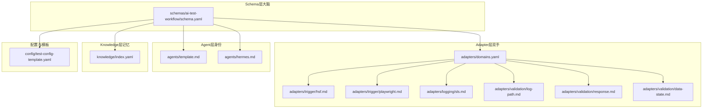
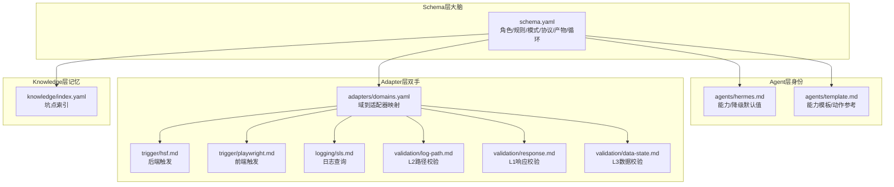
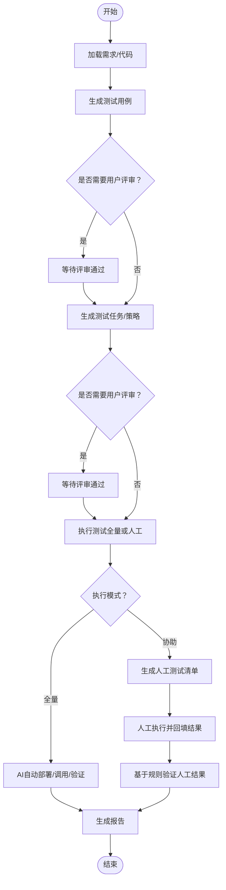
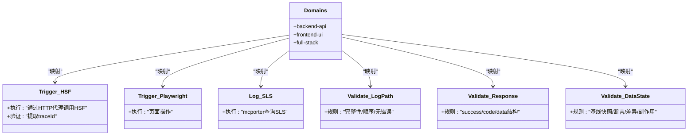
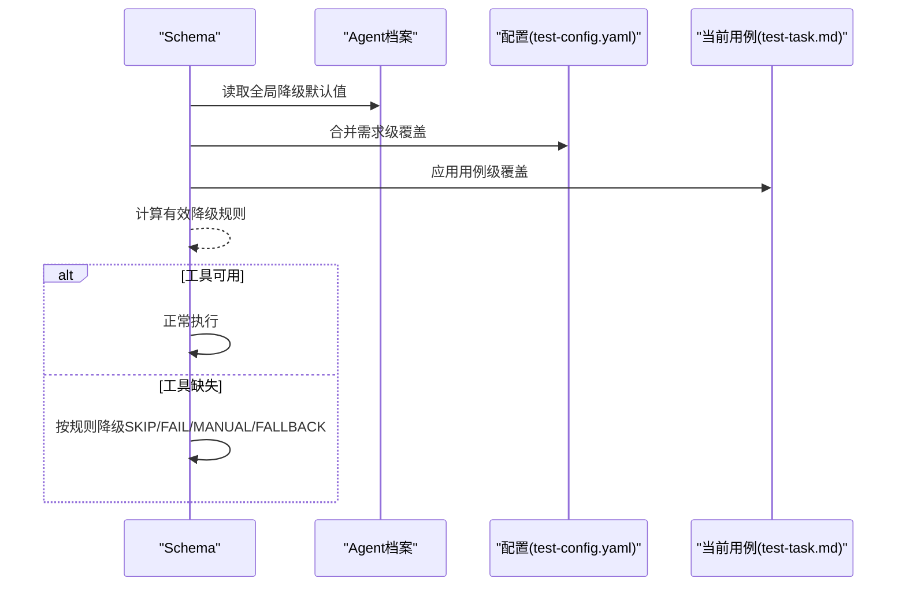

# 分层架构设计

<cite>
**本文引用的文件**
- [README.md](file://README.md)
- [DESIGN.md](file://DESIGN.md)
- [INSTRUCTIONS.md](file://INSTRUCTIONS.md)
- [schemas/ai-test-workflow/schema.yaml](file://schemas/ai-test-workflow/schema.yaml)
- [adapters/domains.yaml](file://adapters/domains.yaml)
- [adapters/trigger/hsf.md](file://adapters/trigger/hsf.md)
- [adapters/trigger/playwright.md](file://adapters/trigger/playwright.md)
- [adapters/logging/sls.md](file://adapters/logging/sls.md)
- [adapters/validation/log-path.md](file://adapters/validation/log-path.md)
- [adapters/validation/response.md](file://adapters/validation/response.md)
- [adapters/validation/data-state.md](file://adapters/validation/data-state.md)
- [agents/template.md](file://agents/template.md)
- [agents/hermes.md](file://agents/hermes.md)
- [knowledge/index.yaml](file://knowledge/index.yaml)
- [config/test-config-template.yaml](file://config/test-config-template.yaml)
</cite>

## 目录
1. [引言](#引言)
2. [项目结构](#项目结构)
3. [核心组件](#核心组件)
4. [架构总览](#架构总览)
5. [详细组件分析](#详细组件分析)
6. [依赖分析](#依赖分析)
7. [性能考量](#性能考量)
8. [故障排查指南](#故障排查指南)
9. [结论](#结论)
10. [附录](#附录)

## 引言
本文件面向“AI自动化测试SOP框架”，系统化阐述其四层架构：Schema层（大脑）、Adapter层（双手）、Agent层（身份）、Knowledge层（记忆）。文档从职责边界、关键组件与设计原理出发，解释分层解耦的优势、适配器模式的应用以及为何采用该架构；并给出层间交互关系图与数据流说明，最后总结架构决策的技术背景与权衡。

## 项目结构
仓库采用按“能力域”组织的分层目录结构，便于在不修改Schema的前提下替换技术实现、在不同Agent之间复用知识与策略。

图表来源
- [schemas/ai-test-workflow/schema.yaml:1-111](file://schemas/ai-test-workflow/schema.yaml#L1-L111)
- [adapters/domains.yaml:1-27](file://adapters/domains.yaml#L1-L27)
- [adapters/trigger/hsf.md:1-14](file://adapters/trigger/hsf.md#L1-L14)
- [adapters/trigger/playwright.md:1-8](file://adapters/trigger/playwright.md#L1-L8)
- [adapters/logging/sls.md:1-10](file://adapters/logging/sls.md#L1-L10)
- [adapters/validation/log-path.md:1-10](file://adapters/validation/log-path.md#L1-L10)
- [adapters/validation/response.md:1-7](file://adapters/validation/response.md#L1-L7)
- [adapters/validation/data-state.md:1-8](file://adapters/validation/data-state.md#L1-L8)
- [agents/template.md:1-36](file://agents/template.md#L1-L36)
- [agents/hermes.md:1-29](file://agents/hermes.md#L1-L29)
- [knowledge/index.yaml:1-10](file://knowledge/index.yaml#L1-L10)
- [config/test-config-template.yaml:1-32](file://config/test-config-template.yaml#L1-L32)

章节来源
- [README.md:71-84](file://README.md#L71-L84)
- [DESIGN.md:12-38](file://DESIGN.md#L12-L38)

## 核心组件
- Schema层（大脑）
  - 职责：定义角色、规则、执行模式、通信协议、产物与循环控制；通过声明式DAG驱动流程。
  - 关键文件：[schemas/ai-test-workflow/schema.yaml:1-111](file://schemas/ai-test-workflow/schema.yaml#L1-L111)
- Adapter层（双手）
  - 职责：封装具体技术实现（触发、日志、验证、数据库等），支持可插拔切换。
  - 关键文件：[adapters/domains.yaml:1-27](file://adapters/domains.yaml#L1-L27)、[adapters/trigger/hsf.md:1-14](file://adapters/trigger/hsf.md#L1-L14)、[adapters/trigger/playwright.md:1-8](file://adapters/trigger/playwright.md#L1-L8)、[adapters/logging/sls.md:1-10](file://adapters/logging/sls.md#L1-L10)、[adapters/validation/log-path.md:1-10](file://adapters/validation/log-path.md#L1-L10)、[adapters/validation/response.md:1-7](file://adapters/validation/response.md#L1-L7)、[adapters/validation/data-state.md:1-8](file://adapters/validation/data-state.md#L1-L8)
- Agent层（身份）
  - 职责：描述AI执行者的能力与降级策略，决定在工具缺失时如何退化。
  - 关键文件：[agents/template.md:1-36](file://agents/template.md#L1-L36)、[agents/hermes.md:1-29](file://agents/hermes.md#L1-L29)
- Knowledge层（记忆）
  - 职责：记录历史坑点与最佳实践，支撑运行前检索与自进化。
  - 关键文件：[knowledge/index.yaml:1-10](file://knowledge/index.yaml#L1-L10)

章节来源
- [DESIGN.md:16-38](file://DESIGN.md#L16-L38)
- [schemas/ai-test-workflow/schema.yaml:8-26](file://schemas/ai-test-workflow/schema.yaml#L8-L26)
- [adapters/domains.yaml:1-27](file://adapters/domains.yaml#L1-L27)
- [agents/template.md:1-36](file://agents/template.md#L1-L36)
- [agents/hermes.md:1-29](file://agents/hermes.md#L1-L29)
- [knowledge/index.yaml:1-10](file://knowledge/index.yaml#L1-L10)

## 架构总览
四层架构通过“声明式流程 + 可插拔实现 + 能力感知 + 记忆沉淀”的组合，达成“规范可变、实现可换、执行可降级、经验可复用”。

图表来源
- [schemas/ai-test-workflow/schema.yaml:1-111](file://schemas/ai-test-workflow/schema.yaml#L1-L111)
- [agents/hermes.md:1-29](file://agents/hermes.md#L1-L29)
- [agents/template.md:1-36](file://agents/template.md#L1-L36)
- [adapters/domains.yaml:1-27](file://adapters/domains.yaml#L1-L27)
- [adapters/trigger/hsf.md:1-14](file://adapters/trigger/hsf.md#L1-L14)
- [adapters/trigger/playwright.md:1-8](file://adapters/trigger/playwright.md#L1-L8)
- [adapters/logging/sls.md:1-10](file://adapters/logging/sls.md#L1-L10)
- [adapters/validation/log-path.md:1-10](file://adapters/validation/log-path.md#L1-L10)
- [adapters/validation/response.md:1-7](file://adapters/validation/response.md#L1-L7)
- [adapters/validation/data-state.md:1-8](file://adapters/validation/data-state.md#L1-L8)
- [knowledge/index.yaml:1-10](file://knowledge/index.yaml#L1-L10)

## 详细组件分析

### Schema层（大脑）：声明式工作流与状态机
- 角色与分工
  - 主管（supervisor）：解析输入、管理状态、派发任务。
  - 子角色：用例生成器、规划师、执行器、报告员。
- 规则与约束
  - 隔离原则：输入只读、输出写入独立目录。
  - 日志要求：每次工具调用前必须记录参数与预期结果。
- 执行模式
  - 全自动：从需求到报告全程由AI执行。
  - 协助模式：生成人工测试清单，等待人工输入后再验证。
- 通信协议
  - 基于文件的状态机：test-status.json，遵循“先读后写、已完成跳过、循环控制”。
- 循环与修复
  - 失败触发修复循环，最多重试固定次数。
- 产物定义
  - 明确各阶段产物的生成者与前置条件，支持用户评审节点。

图表来源
- [schemas/ai-test-workflow/schema.yaml:8-26](file://schemas/ai-test-workflow/schema.yaml#L8-L26)
- [schemas/ai-test-workflow/schema.yaml:65-70](file://schemas/ai-test-workflow/schema.yaml#L65-L70)
- [schemas/ai-test-workflow/schema.yaml:105-111](file://schemas/ai-test-workflow/schema.yaml#L105-L111)

章节来源
- [schemas/ai-test-workflow/schema.yaml:8-26](file://schemas/ai-test-workflow/schema.yaml#L8-L26)
- [schemas/ai-test-workflow/schema.yaml:28-51](file://schemas/ai-test-workflow/schema.yaml#L28-L51)
- [schemas/ai-test-workflow/schema.yaml:65-70](file://schemas/ai-test-workflow/schema.yaml#L65-L70)
- [schemas/ai-test-workflow/schema.yaml:105-111](file://schemas/ai-test-workflow/schema.yaml#L105-L111)

### Adapter层（双手）：适配器模式与可插拔实现
- 设计原理
  - 将“做什么”与“怎么做”分离：Schema定义验证层级与触发方式，Adapter封装具体实现。
  - 通过domains.yaml将测试域映射到一组触发与验证适配器，便于扩展新域。
- 关键适配器
  - 触发：HSF触发（后端接口）、Playwright触发（前端UI）。
  - 日志：SLS日志查询。
  - 验证：L1响应结构、L2日志路径顺序与清洁度、L3数据状态一致性。
- 切换与回退
  - 支持在同一域内通过FALLBACK策略切换到替代适配器，降低对外部工具的强依赖。

图表来源
- [adapters/domains.yaml:1-27](file://adapters/domains.yaml#L1-L27)
- [adapters/trigger/hsf.md:1-14](file://adapters/trigger/hsf.md#L1-L14)
- [adapters/trigger/playwright.md:1-8](file://adapters/trigger/playwright.md#L1-L8)
- [adapters/logging/sls.md:1-10](file://adapters/logging/sls.md#L1-L10)
- [adapters/validation/log-path.md:1-10](file://adapters/validation/log-path.md#L1-L10)
- [adapters/validation/response.md:1-7](file://adapters/validation/response.md#L1-L7)
- [adapters/validation/data-state.md:1-8](file://adapters/validation/data-state.md#L1-L8)

章节来源
- [adapters/domains.yaml:1-27](file://adapters/domains.yaml#L1-L27)
- [adapters/trigger/hsf.md:1-14](file://adapters/trigger/hsf.md#L1-L14)
- [adapters/trigger/playwright.md:1-8](file://adapters/trigger/playwright.md#L1-L8)
- [adapters/logging/sls.md:1-10](file://adapters/logging/sls.md#L1-L10)
- [adapters/validation/log-path.md:1-10](file://adapters/validation/log-path.md#L1-L10)
- [adapters/validation/response.md:1-7](file://adapters/validation/response.md#L1-L7)
- [adapters/validation/data-state.md:1-8](file://adapters/validation/data-state.md#L1-L8)

### Agent层（身份）：能力感知与自适应执行
- Agent档案
  - 模板：定义能力项、MCP支持、运行模式与全局降级规则。
  - 示例：Hermes具备文件读写、Shell、后台进程、并行子Agent等能力，默认降级策略明确。
- 自适应执行
  - 当外部工具不可用或权限不足时，Schema根据三层继承链（用例>需求>全局）计算有效降级规则，自动从全量执行退化到协助模式或跳过某层验证。

图表来源
- [agents/template.md:1-36](file://agents/template.md#L1-L36)
- [agents/hermes.md:1-29](file://agents/hermes.md#L1-L29)
- [config/test-config-template.yaml:24-31](file://config/test-config-template.yaml#L24-L31)
- [schemas/ai-test-workflow/schema.yaml:38-51](file://schemas/ai-test-workflow/schema.yaml#L38-L51)

章节来源
- [agents/template.md:1-36](file://agents/template.md#L1-L36)
- [agents/hermes.md:1-29](file://agents/hermes.md#L1-L29)
- [config/test-config-template.yaml:24-31](file://config/test-config-template.yaml#L24-L31)
- [schemas/ai-test-workflow/schema.yaml:38-51](file://schemas/ai-test-workflow/schema.yaml#L38-L51)

### Knowledge层（记忆）：历史坑点与最佳实践
- 索引与检索
  - knowledge/index.yaml作为索引入口，AI在执行前快速检索相关坑点，避免重复踩坑。
- 内容沉淀
  - 以pitfalls/*.md记录典型问题与解决方案，形成可复用的知识资产。
- 与Schema协同
  - 在自进化过程中，将新发现的问题纳入知识库，提升后续执行质量。

章节来源
- [knowledge/index.yaml:1-10](file://knowledge/index.yaml#L1-L10)

## 依赖分析
- 层间耦合与内聚
  - Schema层高内聚：集中定义流程、规则与产物；低耦合：不直接绑定具体实现。
  - Adapter层高内聚：同一域内的触发/日志/验证保持一致的契约；低耦合：彼此可替换。
  - Agent层高内聚：能力与降级策略统一管理；低耦合：与具体工具解绑。
  - Knowledge层高内聚：围绕“问题-方案”组织；低耦合：被其他层消费而非反向依赖。
- 继承链与合并算法
  - 三层优先级：用例 > 需求 > 全局；后层覆盖前层未指定项，形成灵活而可控的覆盖机制。

图表来源
- [schemas/ai-test-workflow/schema.yaml:38-51](file://schemas/ai-test-workflow/schema.yaml#L38-L51)
- [agents/template.md:17-27](file://agents/template.md#L17-L27)
- [config/test-config-template.yaml:24-31](file://config/test-config-template.yaml#L24-L31)

章节来源
- [DESIGN.md:127-187](file://DESIGN.md#L127-L187)
- [schemas/ai-test-workflow/schema.yaml:38-51](file://schemas/ai-test-workflow/schema.yaml#L38-L51)

## 性能考量
- 并行与串行
  - 在具备并行能力的Agent下，可并行执行相互独立的验证任务，缩短端到端时间。
- 降级策略
  - 在工具缺失场景下，优先选择SKIP或FALLBACK，避免阻塞主流程。
- 日志与审计
  - 严格的执行前记录与多层级验证，有助于快速定位瓶颈与失败根因，间接提升整体效率。

## 故障排查指南
- 执行前检查
  - 确认Agent档案存在且能力匹配；核对配置文件中的execution_mode与MCP工具启用状态。
- 常见问题定位
  - L1响应失败：检查响应结构与字段约定。
  - L2日志缺失/顺序异常：确认traceId提取与日志查询适配器可用。
  - L3数据不一致：核对基线快照与断言逻辑。
- 降级与回退
  - 若触发no_mcp/no_shell/no_deploy/no_database，依据三层继承链的有效规则进行处理；必要时使用FALLBACK策略切换适配器。
- 状态与恢复
  - 使用test-status.json判断当前步骤与重试次数，支持从失败处恢复。

章节来源
- [INSTRUCTIONS.md:1-44](file://INSTRUCTIONS.md#L1-L44)
- [DESIGN.md:56-105](file://DESIGN.md#L56-L105)
- [DESIGN.md:166-187](file://DESIGN.md#L166-L187)
- [adapters/validation/response.md:1-7](file://adapters/validation/response.md#L1-L7)
- [adapters/validation/log-path.md:1-10](file://adapters/validation/log-path.md#L1-L10)
- [adapters/validation/data-state.md:1-8](file://adapters/validation/data-state.md#L1-L8)

## 结论
该四层架构通过“声明式流程+可插拔实现+能力感知+记忆沉淀”的设计，实现了跨Agent、跨域、跨工具的通用性与鲁棒性。Schema层确保流程稳定可演进，Adapter层保证技术实现可替换，Agent层提供自适应降级，Knowledge层保障经验复用与持续改进。三层继承链进一步简化了用户配置，兼顾灵活性与安全性。

## 附录
- 快速上手与配置要点
  - 零配置触发：将INSTRUCTIONS.md粘贴至项目，输入/test-sop即可启动自检与执行。
  - 手动配置：复制模板配置文件，设置execution_mode与MCP工具，再按Schema定义的DAG执行。
- MCP工具建议
  - 全自动模式需启用日志查询、数据验证与部署相关工具；若受限，可切换至协助模式或调整降级规则。

章节来源
- [README.md:14-53](file://README.md#L14-L53)
- [INSTRUCTIONS.md:1-44](file://INSTRUCTIONS.md#L1-L44)
- [config/test-config-template.yaml:1-32](file://config/test-config-template.yaml#L1-L32)