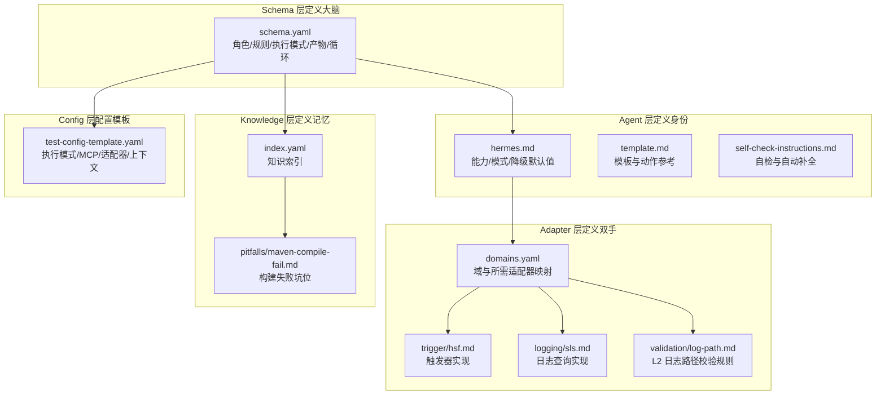
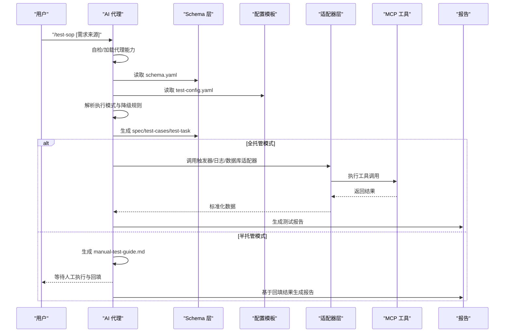
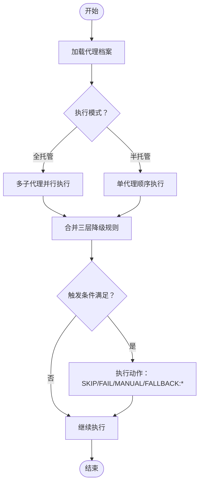
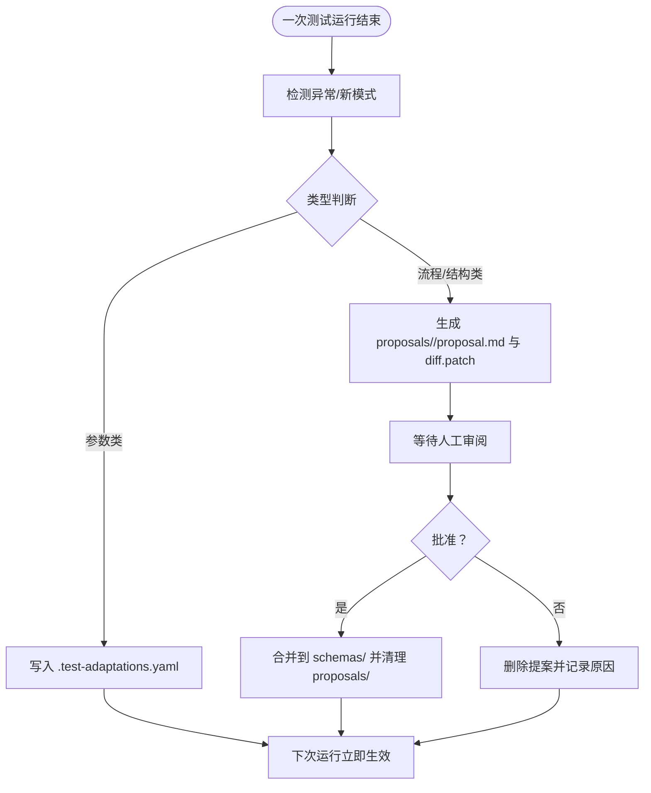
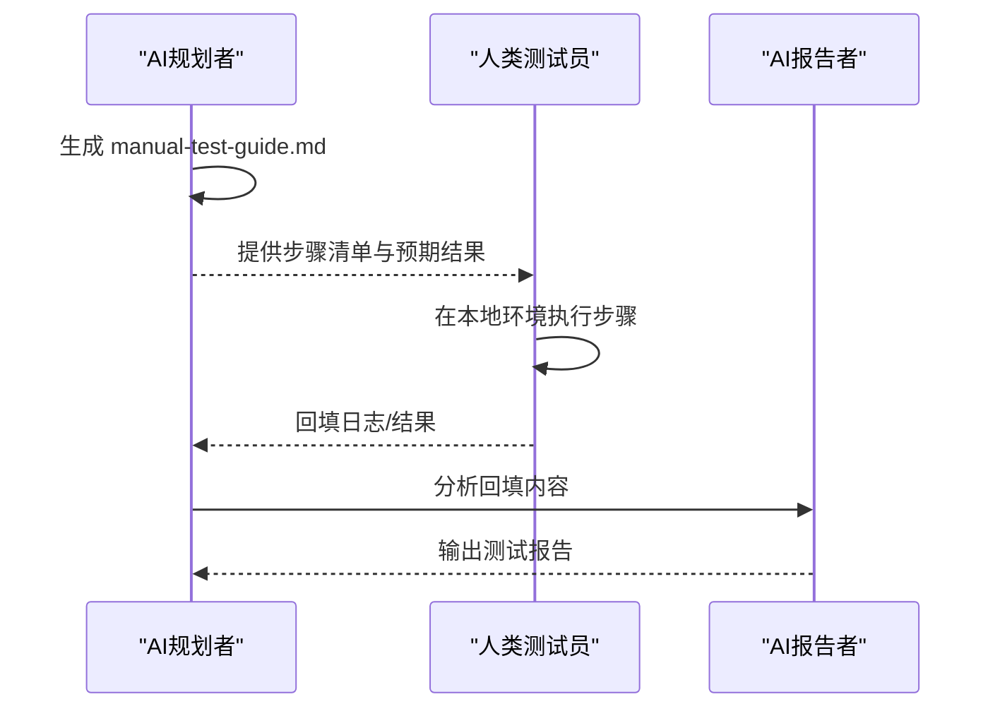
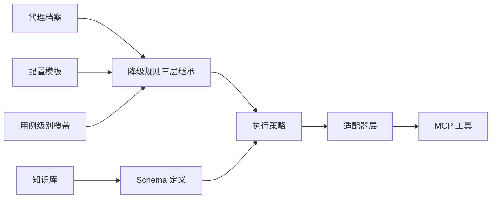

# 核心理念

<cite>
**本文引用的文件**
- [README.md](file://README.md)
- [DESIGN.md](file://DESIGN.md)
- [INSTRUCTIONS.md](file://INSTRUCTIONS.md)
- [agents/hermes.md](file://agents/hermes.md)
- [agents/self-check-instructions.md](file://agents/self-check-instructions.md)
- [agents/template.md](file://agents/template.md)
- [schemas/ai-test-workflow/schema.yaml](file://schemas/ai-test-workflow/schema.yaml)
- [config/test-config-template.yaml](file://config/test-config-template.yaml)
- [adapters/domains.yaml](file://adapters/domains.yaml)
- [adapters/trigger/hsf.md](file://adapters/trigger/hsf.md)
- [adapters/logging/sls.md](file://adapters/logging/sls.md)
- [adapters/validation/log-path.md](file://adapters/validation/log-path.md)
- [knowledge/index.yaml](file://knowledge/index.yaml)
- [knowledge/pitfalls/maven-compile-fail.md](file://knowledge/pitfalls/maven-compile-fail.md)
</cite>

## 目录
1. 引言
2. 项目结构
3. 核心组件
4. 架构总览
5. 详细组件分析
6. 依赖关系分析
7. 性能考量
8. 故障排查指南
9. 结论
10. 附录

## 引言
本文件系统化阐述 AI 自动化测试 SOP 框架的三大核心理念与人机协作模式，面向初学者提供易懂的概念解释，同时为专家用户提供可追溯到源码的实现细节与演进机制。三大原则旨在解决 AI 驱动测试中的“碎片化”问题：
- 规格无关性（Spec-Agnostic）：统一输入来源，将不同格式的测试需求标准化为统一规范，确保流程稳定可复用。
- 代理无关性（Agent-Agnostic）：通过“执行模式”与“降级规则”的分层设计，使不同能力的 AI 代理都能按既定 Schema 稳健运行。
- 自我演化（Self-Evolving）：以“运行时自适配 + 结构化提案”的双轨机制，持续优化参数与流程，实现“日新又新”。

此外，人机协作模式（Assisted Mode）在工具受限或权限不足时，提供“AI 规划 + 人工执行 + AI 验证”的闭环，保障可落地性与可审计性。

## 项目结构
该仓库采用“分层解耦 + 可插拔适配”的组织方式，便于在不修改核心逻辑的前提下替换技术实现与代理能力。

图示来源
- [schemas/ai-test-workflow/schema.yaml:1-111](file://schemas/ai-test-workflow/schema.yaml#L1-L111)
- [agents/hermes.md:1-29](file://agents/hermes.md#L1-L29)
- [agents/template.md:1-36](file://agents/template.md#L1-L36)
- [agents/self-check-instructions.md:1-25](file://agents/self-check-instructions.md#L1-L25)
- [adapters/domains.yaml:1-27](file://adapters/domains.yaml#L1-L27)
- [adapters/trigger/hsf.md:1-14](file://adapters/trigger/hsf.md#L1-L14)
- [adapters/logging/sls.md:1-10](file://adapters/logging/sls.md#L1-L10)
- [adapters/validation/log-path.md:1-10](file://adapters/validation/log-path.md#L1-L10)
- [knowledge/index.yaml:1-10](file://knowledge/index.yaml#L1-L10)
- [knowledge/pitfalls/maven-compile-fail.md:1-18](file://knowledge/pitfalls/maven-compile-fail.md#L1-L18)
- [config/test-config-template.yaml:1-32](file://config/test-config-template.yaml#L1-L32)

章节来源
- [README.md:71-84](file://README.md#L71-L84)
- [DESIGN.md:12-38](file://DESIGN.md#L12-L38)

## 核心组件
- 规格无关性（Spec-Agnostic）
  - 设计动机：避免测试流程被特定文档格式或平台绑定，降低迁移成本与碎片化风险。
  - 实现方式：Schema 将输入统一为标准规范（如 spec.md），随后生成测试用例与任务，保证后续步骤一致。
  - 价值：跨来源（OpenSpec、语雀、Markdown、自然语言）统一处理，提升可移植性与可维护性。
- 代理无关性（Agent-Agnostic）
  - 设计动机：不同 AI 代理的能力差异巨大，需要通过“Schema 定义做什么 + 代理能力决定怎么执行”的分离实现稳健适配。
  - 实现方式：通过“执行模式”（全托管 vs 半托管）与“降级规则”（三层继承链）实现自适应执行。
  - 价值：同一套流程可在多种代理上稳定运行，无需重写业务逻辑。
- 自我演化（Self-Evolving）
  - 设计动机：传统脚本难以沉淀经验，SOP 通过“运行时自适配 + 结构化提案”形成闭环改进。
  - 实现方式：记录异常与模式，自动更新参数配置；重大变更以提案形式暂停并等待人工审阅。
  - 价值：持续优化参数与流程，实现“日新又新”，降低重复问题成本。
- 人机协作模式（Assisted Mode）
  - 设计动机：当工具或权限受限时，仍需推进测试闭环，通过“AI 规划 + 人工执行 + AI 验证”达成可落地的验证。
  - 实现方式：在受限条件下生成手动测试指引，等待人工执行后由 AI 进行结果比对与报告。
  - 价值：兼顾速度与安全，最大化可用性与可审计性。

章节来源
- [DESIGN.md:3-11](file://DESIGN.md#L3-L11)
- [DESIGN.md:116-126](file://DESIGN.md#L116-L126)
- [DESIGN.md:196-224](file://DESIGN.md#L196-L224)
- [README.md:39-53](file://README.md#L39-L53)

## 架构总览
下图展示了从输入到输出的端到端流程，以及各层之间的职责边界与交互关系。

图示来源
- [INSTRUCTIONS.md:5-44](file://INSTRUCTIONS.md#L5-L44)
- [schemas/ai-test-workflow/schema.yaml:1-111](file://schemas/ai-test-workflow/schema.yaml#L1-L111)
- [config/test-config-template.yaml:1-32](file://config/test-config-template.yaml#L1-L32)
- [agents/hermes.md:1-29](file://agents/hermes.md#L1-L29)

## 详细组件分析

### 组件一：规格无关性（Spec-Agnostic）
- 设计动机
  - 测试需求来源多样，若直接绑定特定格式或平台，将导致流程碎片化与迁移成本高。
- 实现方式
  - Schema 将输入统一为标准规范（如 spec.md），再依次生成测试用例与任务，确保后续步骤一致。
  - 支持多来源输入，最终归一化处理，减少对上游系统的耦合。
- 价值
  - 提升跨平台、跨团队的可移植性；降低因文档格式差异引发的执行偏差。
- 使用场景与案例
  - 场景：需求来自自然语言描述或第三方平台导出的 Markdown。
  - 案例：通过统一的规范生成与任务规划，避免重复适配不同来源的差异。

章节来源
- [DESIGN.md:7](file://DESIGN.md#L7)
- [schemas/ai-test-workflow/schema.yaml:81-92](file://schemas/ai-test-workflow/schema.yaml#L81-L92)

### 组件二：代理无关性（Agent-Agnostic）
- 设计动机
  - 不同 AI 代理在并发、文件操作、MCP 支持等方面能力差异显著，需要通过 Schema 与降级规则实现自适应。
- 实现方式
  - 执行模式：全托管（多子代理并行）与半托管（单代理串行）两种模式，满足不同代理能力。
  - 降级规则：三层继承链（用例 > 需求 > 全局代理默认），按优先级合并生效，未指定项继承父层。
  - 代理自检：缺失代理档案时自动执行自检流程，生成符合模板的档案。
- 价值
  - 同一套流程在多种代理上稳定运行，无需重写业务逻辑；在能力受限时自动降级，保障可用性。
- 使用场景与案例
  - 场景：在不具备后台进程或 MCP 的代理上运行。
  - 案例：全局默认“无 MCP 则跳过 L2/L3”，需求层覆盖为“必须具备 MCP，否则失败”，用例层针对离线用例覆盖为“跳过 Shell”。

图示来源
- [agents/hermes.md:10-29](file://agents/hermes.md#L10-L29)
- [agents/self-check-instructions.md:1-25](file://agents/self-check-instructions.md#L1-L25)
- [schemas/ai-test-workflow/schema.yaml:38-61](file://schemas/ai-test-workflow/schema.yaml#L38-L61)

章节来源
- [DESIGN.md:29-37](file://DESIGN.md#L29-L37)
- [DESIGN.md:116-126](file://DESIGN.md#L116-L126)
- [DESIGN.md:127-195](file://DESIGN.md#L127-L195)
- [agents/template.md:17-36](file://agents/template.md#L17-L36)

### 组件三：自我演化（Self-Evolving）
- 设计动机
  - 传统脚本难以沉淀经验，SOP 通过“运行时自适配 + 结构化提案”形成闭环改进。
- 实现方式
  - 运行时自适配：针对参数类问题（如超时阈值、日志排除规则）自动更新配置文件，立即生效。
  - 结构化提案：重大变更（如新增 L5 验证层或 DAG 流程调整）以提案形式暂停，等待人工审阅与决策。
  - 知识捕获：将坑位与最佳实践写入知识库，避免重复踩坑。
- 价值
  - 平衡速度与安全，确保“日新又新”；降低重复问题成本，提升长期稳定性。
- 使用场景与案例
  - 场景：发现第三方日志导致 L2 验证误报。
  - 案例：自动追加日志排除规则至自适配文件；若涉及流程变更，则生成提案目录并等待评审。

图示来源
- [DESIGN.md:196-224](file://DESIGN.md#L196-L224)
- [knowledge/index.yaml:1-10](file://knowledge/index.yaml#L1-L10)
- [knowledge/pitfalls/maven-compile-fail.md:1-18](file://knowledge/pitfalls/maven-compile-fail.md#L1-L18)

章节来源
- [DESIGN.md:196-224](file://DESIGN.md#L196-L224)

### 组件四：人机协作模式（Assisted Mode）
- 设计动机
  - 当工具或权限受限时，仍需推进测试闭环，通过“AI 规划 + 人工执行 + AI 验证”达成可落地的验证。
- 实现方式
  - 在受限条件下生成手动测试指引（manual-test-guide.md），等待人工执行后回填结果，AI 再进行结果比对与报告。
  - 通过状态文件与通信协议保障可审计与可恢复。
- 价值
  - 兼顾速度与安全，最大化可用性与可审计性。
- 使用场景与案例
  - 场景：缺少 MCP 工具或数据库访问权限。
  - 案例：在配置中设置执行模式为半托管，AI 生成指引，人工在 IDE 或 Postman 中执行，回填结果后由 AI 生成报告。

图示来源
- [DESIGN.md:48-55](file://DESIGN.md#L48-L55)
- [README.md:39-53](file://README.md#L39-L53)
- [schemas/ai-test-workflow/schema.yaml:68-69](file://schemas/ai-test-workflow/schema.yaml#L68-L69)

章节来源
- [DESIGN.md:48-55](file://DESIGN.md#L48-L55)
- [README.md:39-53](file://README.md#L39-L53)

## 依赖关系分析
- 层间耦合与内聚
  - Schema 层定义流程与约束，Agent 层提供能力声明，Adapter 层封装技术实现，Knowledge 层沉淀经验，彼此低耦合、高内聚。
- 外部依赖与集成点
  - MCP 工具（日志、数据库、部署等）作为外部能力接入点，通过适配器与配置模板进行桥接。
- 降级规则与继承链
  - 三层继承链（用例 > 需求 > 全局代理默认）确保在不同粒度上灵活覆盖，且未指定项自动继承。

图示来源
- [schemas/ai-test-workflow/schema.yaml:38-61](file://schemas/ai-test-workflow/schema.yaml#L38-L61)
- [config/test-config-template.yaml:1-32](file://config/test-config-template.yaml#L1-L32)
- [agents/template.md:17-36](file://agents/template.md#L17-L36)

章节来源
- [DESIGN.md:127-195](file://DESIGN.md#L127-L195)
- [adapters/domains.yaml:1-27](file://adapters/domains.yaml#L1-L27)

## 性能考量
- 并发与容错
  - 全托管模式支持子代理并行执行，提升吞吐；半托管模式适合资源受限或需要严格上下文的场景。
- 降级策略
  - 通过三层继承链快速适配能力缺失，避免整条流水线阻塞。
- 日志与审计
  - 统一的执行日志与状态文件有助于定位瓶颈与异常，减少重复执行成本。

## 故障排查指南
- 常见问题与定位
  - MCP 工具不可用：检查配置模板中的工具启用状态与降级规则，必要时切换到半托管模式。
  - 代理能力不足：通过代理自检生成档案，明确支持能力后再运行。
  - 日志误报：在自适配文件中追加排除规则，或使用降级动作切换到替代适配器。
- 知识库检索
  - 在知识库中查找类似问题的解决方案，避免重复踩坑。

章节来源
- [DESIGN.md:166-187](file://DESIGN.md#L166-L187)
- [knowledge/index.yaml:1-10](file://knowledge/index.yaml#L1-L10)
- [knowledge/pitfalls/maven-compile-fail.md:1-18](file://knowledge/pitfalls/maven-compile-fail.md#L1-L18)

## 结论
本框架以“规格无关性、代理无关性、自我演化”为核心，结合“人机协作模式”，在不牺牲灵活性的前提下，系统化解决了 AI 驱动测试中的碎片化问题。通过分层解耦、可插拔适配与闭环演进，实现“即开即用、越用越强、越跑越稳”。对于初学者，建议从零配置触发与半托管模式入手；对于专家用户，可深入定制代理能力、降级规则与知识库，以获得更高的自动化程度与更强的适应性。

## 附录
- 快速上手
  - 零配置触发：复制指令文件到项目根目录，输入触发命令即可自动引导。
  - 手动配置：复制配置模板，按需开启 MCP 工具与选择适配器。
- 关键文件路径
  - 触发与自检：[INSTRUCTIONS.md:1-44](file://INSTRUCTIONS.md#L1-L44)、[agents/self-check-instructions.md:1-25](file://agents/self-check-instructions.md#L1-L25)
  - 代理档案与模板：[agents/hermes.md:1-29](file://agents/hermes.md#L1-L29)、[agents/template.md:1-36](file://agents/template.md#L1-L36)
  - 流程与规则：[schemas/ai-test-workflow/schema.yaml:1-111](file://schemas/ai-test-workflow/schema.yaml#L1-L111)
  - 配置模板：[config/test-config-template.yaml:1-32](file://config/test-config-template.yaml#L1-L32)
  - 适配器与验证：[adapters/domains.yaml:1-27](file://adapters/domains.yaml#L1-L27)、[adapters/trigger/hsf.md:1-14](file://adapters/trigger/hsf.md#L1-L14)、[adapters/logging/sls.md:1-10](file://adapters/logging/sls.md#L1-L10)、[adapters/validation/log-path.md:1-10](file://adapters/validation/log-path.md#L1-L10)
  - 知识库：[knowledge/index.yaml:1-10](file://knowledge/index.yaml#L1-L10)、[knowledge/pitfalls/maven-compile-fail.md:1-18](file://knowledge/pitfalls/maven-compile-fail.md#L1-L18)