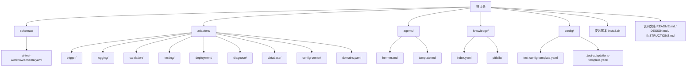
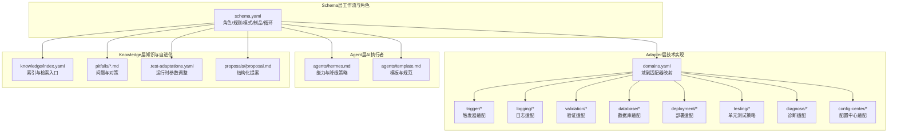
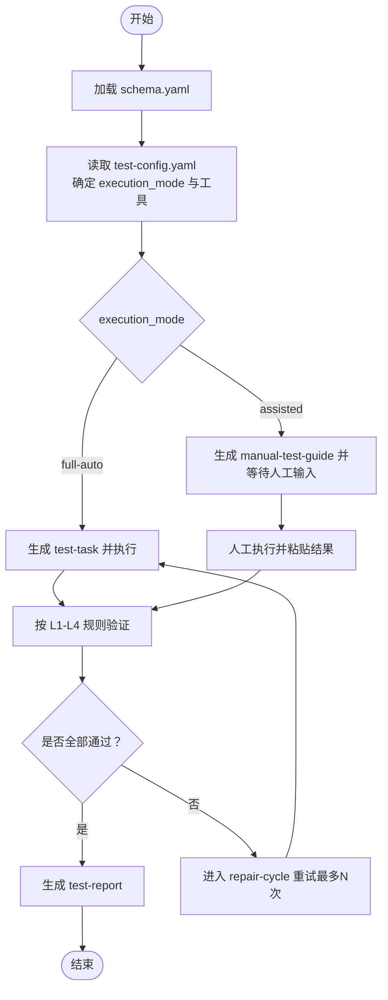
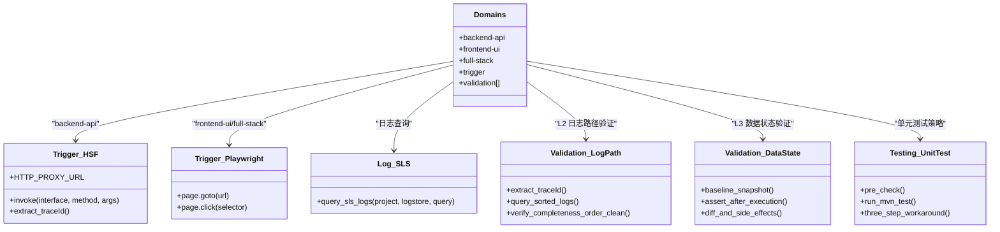
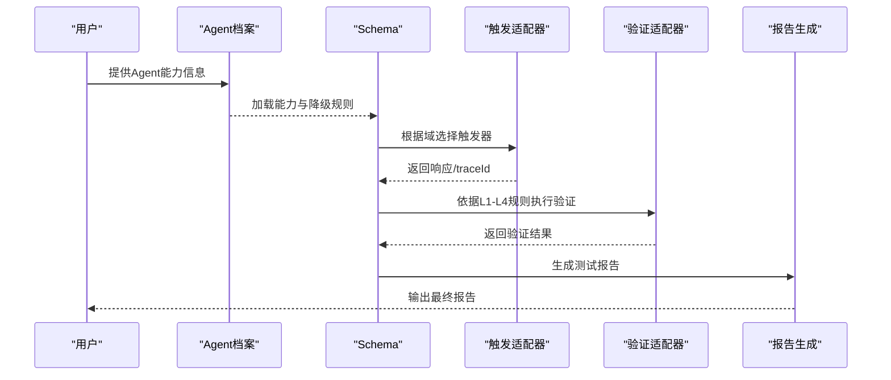
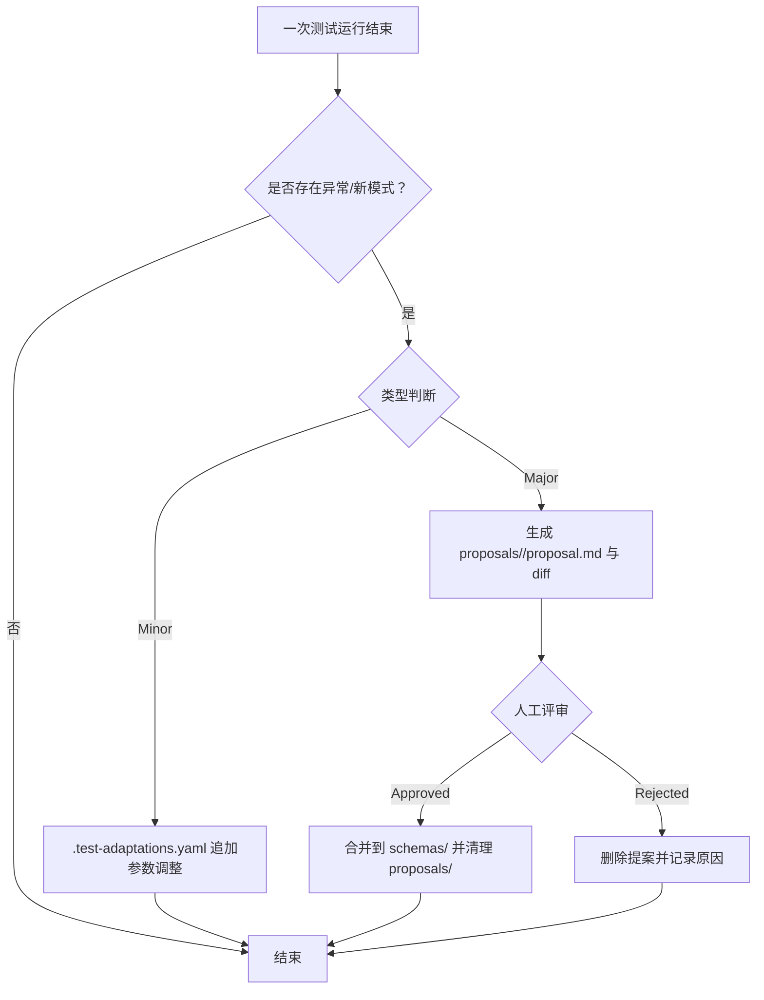
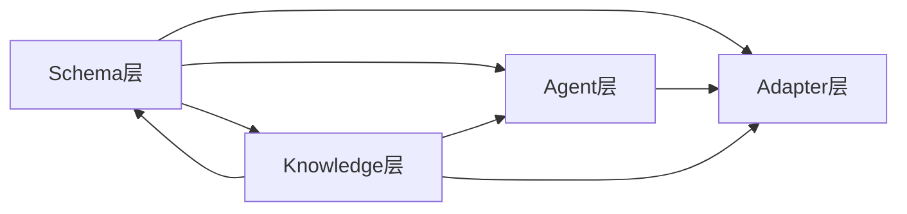

# 系统架构

<cite>
**本文引用的文件**
- [README.md](file://README.md)
- [DESIGN.md](file://DESIGN.md)
- [INSTRUCTIONS.md](file://INSTRUCTIONS.md)
- [install.sh](file://install.sh)
- [schemas/ai-test-workflow/schema.yaml](file://schemas/ai-test-workflow/schema.yaml)
- [adapters/domains.yaml](file://adapters/domains.yaml)
- [adapters/trigger/hsf.md](file://adapters/trigger/hsf.md)
- [adapters/trigger/playwright.md](file://adapters/trigger/playwright.md)
- [adapters/logging/sls.md](file://adapters/logging/sls.md)
- [adapters/validation/log-path.md](file://adapters/validation/log-path.md)
- [adapters/validation/data-state.md](file://adapters/validation/data-state.md)
- [adapters/testing/unit-test.md](file://adapters/testing/unit-test.md)
- [config/test-config-template.yaml](file://config/test-config-template.yaml)
- [config/.test-adaptations-template.yaml](file://config/.test-adaptations-template.yaml)
- [knowledge/index.yaml](file://knowledge/index.yaml)
- [agents/hermes.md](file://agents/hermes.md)
- [agents/template.md](file://agents/template.md)
</cite>

## 目录
1. [引言](#引言)
2. [项目结构](#项目结构)
3. [核心组件](#核心组件)
4. [架构总览](#架构总览)
5. [详细组件分析](#详细组件分析)
6. [依赖分析](#依赖分析)
7. [性能考虑](#性能考虑)
8. [故障排查指南](#故障排查指南)
9. [结论](#结论)
10. [附录](#附录)

## 引言
本文件面向AI自动化测试SOP（标准作业程序）框架，提供系统级架构文档。该框架采用四层解耦设计：Schema层（工作流与角色）、Adapter层（技术实现适配）、Agent层（AI执行者能力）、Knowledge层（知识与自进化）。文档阐述各层职责、相互关系与数据流向，解释分层解耦、适配器模式与状态机执行机制；并给出系统边界、组件交互与数据流图，说明技术决策、权衡与约束，覆盖基础设施、可扩展性与部署拓扑，以及安全性、监控与灾难恢复等横切关注点。

## 项目结构
仓库采用按“职责域”组织的目录结构，清晰分离工作流定义、适配器实现、Agent能力描述、知识库与配置模板，便于独立演进与替换。

图表来源
- [README.md:71-84](file://README.md#L71-L84)
- [DESIGN.md:12-38](file://DESIGN.md#L12-L38)

章节来源
- [README.md:71-84](file://README.md#L71-L84)
- [DESIGN.md:12-38](file://DESIGN.md#L12-L38)

## 核心组件
- Schema层：以声明式方式定义角色、规则、执行模式、通信协议、制品与循环策略，确保流程逻辑与工具实现解耦。
- Adapter层：封装具体技术实现（触发、日志、验证、数据库、部署等），通过适配器文件实现插拔式替换。
- Agent层：描述AI执行者的功能能力与降级策略，支持多Agent编排与串行执行两种模式。
- Knowledge层：沉淀历史问题、最佳实践与自进化规则，支撑运行时调整与结构化提案。

章节来源
- [DESIGN.md:16-38](file://DESIGN.md#L16-L38)
- [schemas/ai-test-workflow/schema.yaml:8-26](file://schemas/ai-test-workflow/schema.yaml#L8-L26)
- [adapters/domains.yaml:1-27](file://adapters/domains.yaml#L1-L27)
- [knowledge/index.yaml:1-10](file://knowledge/index.yaml#L1-L10)

## 架构总览
四层架构通过“声明+适配”的方式实现高内聚、低耦合。Schema层定义“做什么”，Agent层决定“谁来做”，Adapter层负责“怎么做”，Knowledge层提供“如何做得更好”。

图表来源
- [schemas/ai-test-workflow/schema.yaml:1-87](file://schemas/ai-test-workflow/schema.yaml#L1-L87)
- [adapters/domains.yaml:1-27](file://adapters/domains.yaml#L1-L27)
- [agents/hermes.md:1-17](file://agents/hermes.md#L1-L17)
- [agents/template.md:1-20](file://agents/template.md#L1-L20)
- [knowledge/index.yaml:1-10](file://knowledge/index.yaml#L1-L10)
- [config/.test-adaptations-template.yaml:1-16](file://config/.test-adaptations-template.yaml#L1-L16)

## 详细组件分析

### Schema层（工作流与角色）
- 角色定义：主协调者、子Agent集合（用例生成、规划、执行、报告）。
- 全局规则：输入只读、输出隔离至 test-runs/<req-id>/。
- 执行模式：全自动化（AI完成全部步骤）与协助模式（人类执行测试步骤）。
- 通信协议：基于文件的状态机 test-status.json，遵循“先读后写、已完成则跳过、循环控制”。
- 制品与依赖：spec → test-cases → test-task → manual-test-guide 或 test-results → test-report。
- 循环策略：失败触发修复循环，最多重试若干次。

图表来源
- [schemas/ai-test-workflow/schema.yaml:41-87](file://schemas/ai-test-workflow/schema.yaml#L41-L87)
- [DESIGN.md:39-55](file://DESIGN.md#L39-L55)

章节来源
- [schemas/ai-test-workflow/schema.yaml:8-26](file://schemas/ai-test-workflow/schema.yaml#L8-L26)
- [schemas/ai-test-workflow/schema.yaml:41-87](file://schemas/ai-test-workflow/schema.yaml#L41-L87)
- [DESIGN.md:39-55](file://DESIGN.md#L39-L55)

### Adapter层（技术实现适配）
- 域到适配器映射：通过 domains.yaml 将测试域（后端接口、前端UI、全栈）映射到对应触发与验证适配器。
- 触发适配器：HSF HTTP代理调用、Playwright前端操作。
- 日志与验证：SLS日志查询、日志路径验证（完整性/顺序/干净度）、数据状态验证（基线对比与副作用检查）。
- 测试策略：针对编译错误与运行时错误的三步化解法。
- 配置与数据库：配置中心、数据库管理服务等适配器预留。
- 可替换性：切换日志系统或验证策略仅需更换适配器文件。

图表来源
- [adapters/domains.yaml:1-27](file://adapters/domains.yaml#L1-L27)
- [adapters/trigger/hsf.md:1-14](file://adapters/trigger/hsf.md#L1-L14)
- [adapters/trigger/playwright.md:1-8](file://adapters/trigger/playwright.md#L1-L8)
- [adapters/logging/sls.md:1-10](file://adapters/logging/sls.md#L1-L10)
- [adapters/validation/log-path.md:1-10](file://adapters/validation/log-path.md#L1-L10)
- [adapters/validation/data-state.md:1-8](file://adapters/validation/data-state.md#L1-L8)
- [adapters/testing/unit-test.md:1-11](file://adapters/testing/unit-test.md#L1-L11)

章节来源
- [adapters/domains.yaml:1-27](file://adapters/domains.yaml#L1-L27)
- [adapters/trigger/hsf.md:1-14](file://adapters/trigger/hsf.md#L1-L14)
- [adapters/trigger/playwright.md:1-8](file://adapters/trigger/playwright.md#L1-L8)
- [adapters/logging/sls.md:1-10](file://adapters/logging/sls.md#L1-L10)
- [adapters/validation/log-path.md:1-10](file://adapters/validation/log-path.md#L1-L10)
- [adapters/validation/data-state.md:1-8](file://adapters/validation/data-state.md#L1-L8)
- [adapters/testing/unit-test.md:1-11](file://adapters/testing/unit-test.md#L1-L11)

### Agent层（AI执行者能力）
- 能力清单：文件读写/补丁、Shell执行、后台进程、并行任务（委托）、状态管理。
- 执行模式：多Agent编排（主协调者委派子Agent）与串行执行（单一Agent承担多个角色）。
- 降级策略：无Shell权限则手动部署；无MCP工具则跳过L2/L3验证。
- 模板规范：提供标准化Agent档案模板，统一能力描述与降级规则。

图表来源
- [agents/hermes.md:1-17](file://agents/hermes.md#L1-L17)
- [agents/template.md:1-20](file://agents/template.md#L1-L20)
- [adapters/domains.yaml:1-27](file://adapters/domains.yaml#L1-L27)
- [DESIGN.md:116-126](file://DESIGN.md#L116-L126)

章节来源
- [agents/hermes.md:1-17](file://agents/hermes.md#L1-L17)
- [agents/template.md:1-20](file://agents/template.md#L1-L20)
- [DESIGN.md:116-126](file://DESIGN.md#L116-L126)

### Knowledge层（知识与自进化）
- 索引与检索：通过 index.yaml 快速定位相关问题与最佳实践。
- 运行时调整：.test-adaptations.yaml 记录参数调整（如超时、排除模式），即时生效。
- 结构化提案：proposals/<id>/ 下的 proposal.md 与 schema-diff.patch，用于重大结构变更的人机评审与合并。
- 自我演化闭环：小改动自动应用，大改动暂停并请求人工确认，确保“快而稳”。

图表来源
- [DESIGN.md:127-155](file://DESIGN.md#L127-L155)
- [config/.test-adaptations-template.yaml:1-16](file://config/.test-adaptations-template.yaml#L1-L16)
- [knowledge/index.yaml:1-10](file://knowledge/index.yaml#L1-L10)

章节来源
- [DESIGN.md:127-155](file://DESIGN.md#L127-L155)
- [config/.test-adaptations-template.yaml:1-16](file://config/.test-adaptations-template.yaml#L1-L16)
- [knowledge/index.yaml:1-10](file://knowledge/index.yaml#L1-L10)

## 依赖分析
- 层间依赖：Schema层驱动Adapter层与Agent层协作；Knowledge层反馈到Schema层与Adapter层，形成闭环。
- 组件耦合：Adapter层内部通过 domains.yaml 解耦域与实现；Agent层通过能力描述与降级策略降低对工具链的强依赖。
- 外部依赖：MCP工具（日志、数据库、部署）在配置中启用/降级；安装脚本确保环境满足基础依赖。

图表来源
- [DESIGN.md:12-38](file://DESIGN.md#L12-L38)
- [adapters/domains.yaml:1-27](file://adapters/domains.yaml#L1-L27)
- [config/test-config-template.yaml:18-23](file://config/test-config-template.yaml#L18-L23)

章节来源
- [DESIGN.md:12-38](file://DESIGN.md#L12-L38)
- [adapters/domains.yaml:1-27](file://adapters/domains.yaml#L1-L27)
- [config/test-config-template.yaml:18-23](file://config/test-config-template.yaml#L18-L23)

## 性能考虑
- 并行与串行：多Agent编排提升吞吐，但需注意上下文污染；串行执行更稳定但吞吐较低。
- 适配器替换成本：通过适配器文件化实现，可在不修改Schema与Agent的情况下快速切换底层技术栈。
- 日志与验证开销：L2/L3验证引入外部系统调用，应结合超时与重试策略优化。
- 参数自适应：.test-adaptations.yaml 的参数调整可减少无效重试与超时失败，提高整体效率。

## 故障排查指南
- 安装与环境
  - 确认已安装 git；使用安装脚本初始化框架与默认配置。
- 配置与模式
  - 检查 execution_mode 与 adapters 字段；若无MCP工具，设置 execution_mode: assisted 并生成 manual-test-guide。
- 状态机与日志
  - 使用 test-status.json 作为共享状态；确保每次工具调用前写入 execution-log.md。
- 常见问题定位
  - HSF调用失败：检查 traceId 提取与日志查询；核对 SLS 工具可用性。
  - 数据状态验证失败：确认基线快照与断言字段；检查副作用表。
  - 单测失败：区分编译错误与运行时错误，按单元测试策略处理。

章节来源
- [install.sh:11-37](file://install.sh#L11-L37)
- [config/test-config-template.yaml:3-23](file://config/test-config-template.yaml#L3-L23)
- [DESIGN.md:56-105](file://DESIGN.md#L56-L105)
- [adapters/trigger/hsf.md:1-14](file://adapters/trigger/hsf.md#L1-L14)
- [adapters/logging/sls.md:1-10](file://adapters/logging/sls.md#L1-L10)
- [adapters/validation/data-state.md:1-8](file://adapters/validation/data-state.md#L1-L8)
- [adapters/testing/unit-test.md:1-11](file://adapters/testing/unit-test.md#L1-L11)

## 结论
该SOP框架通过四层解耦设计实现了“流程声明、工具适配、执行者能力、知识自进化”的有机统一。Schema层提供稳定的契约与状态机协议，Adapter层以适配器模式屏蔽技术差异，Agent层以能力描述与降级策略适配不同执行环境，Knowledge层以参数与结构化提案保障持续改进。该架构在保证可扩展性与可移植性的同时，兼顾了透明性、可观测性与人机协同。

## 附录

### 技术栈与第三方依赖
- 安装与更新：git（安装脚本依赖）。
- MCP工具（可选）：sls-mcp、dms-mcp-server、group-env；可通过配置启用/降级。
- 日志与验证：SLS日志查询、数据库状态校验、前端Playwright、后端HSF调用。
- 配置与模板：test-config-template.yaml、.test-adaptations-template.yaml。

章节来源
- [install.sh:11-28](file://install.sh#L11-L28)
- [config/test-config-template.yaml:18-23](file://config/test-config-template.yaml#L18-L23)
- [DESIGN.md:39-55](file://DESIGN.md#L39-L55)

### 部署拓扑与基础设施要求
- 基础设施：具备Shell执行能力与文件系统访问；可选MCP工具链。
- 部署拓扑：单机/容器均可；建议将 test-runs/<req-id>/ 作为持久化输出目录。
- 更新策略：通过安装脚本拉取最新版本，保持 .test-sop 与本地配置分离。

章节来源
- [README.md:54-59](file://README.md#L54-L59)
- [install.sh:17-37](file://install.sh#L17-L37)

### 安全性、监控与灾难恢复
- 安全性：输入源只读、输出隔离；最小权限原则使用MCP工具；避免在源路径写入。
- 监控：通过 execution-log.md 与 test-status.json 实现黑盒审计与状态追踪。
- 灾难恢复：支持从 test-status.json 恢复执行；repair-cycle 提供有限重试；人工评审机制保障重大变更安全。

章节来源
- [schemas/ai-test-workflow/schema.yaml:30-36](file://schemas/ai-test-workflow/schema.yaml#L30-L36)
- [DESIGN.md:106-115](file://DESIGN.md#L106-L115)
- [DESIGN.md:127-155](file://DESIGN.md#L127-L155)