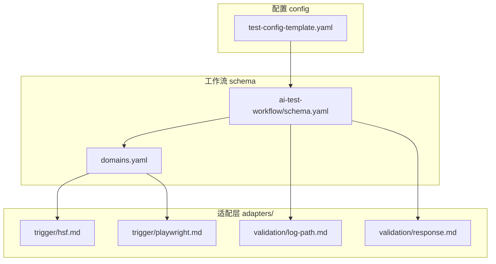
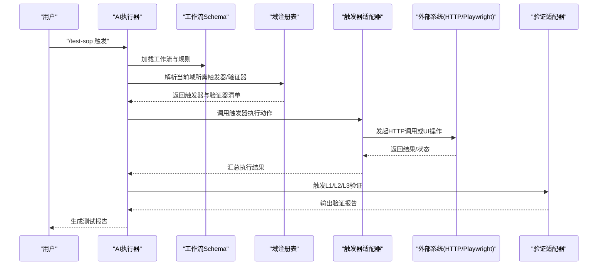
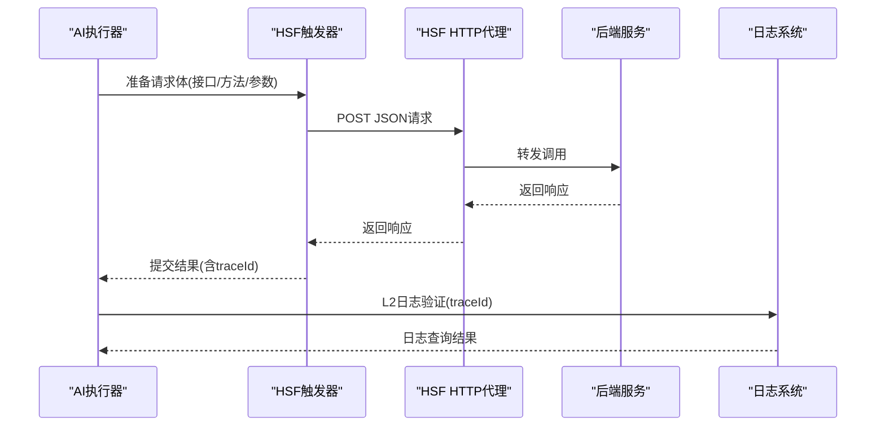
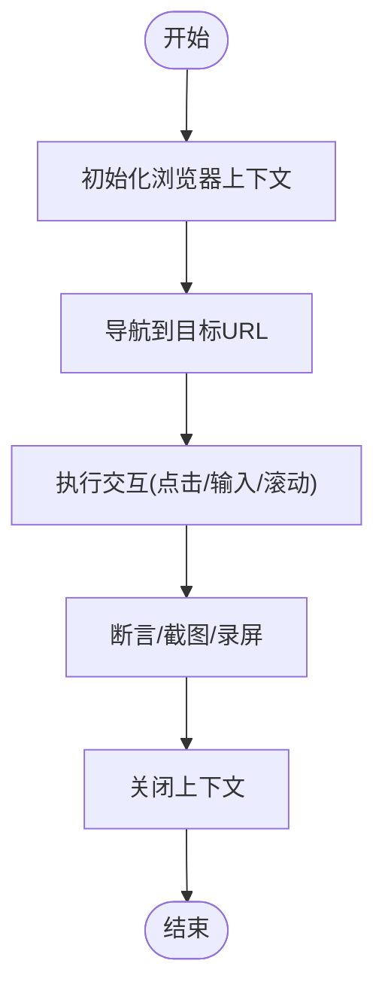
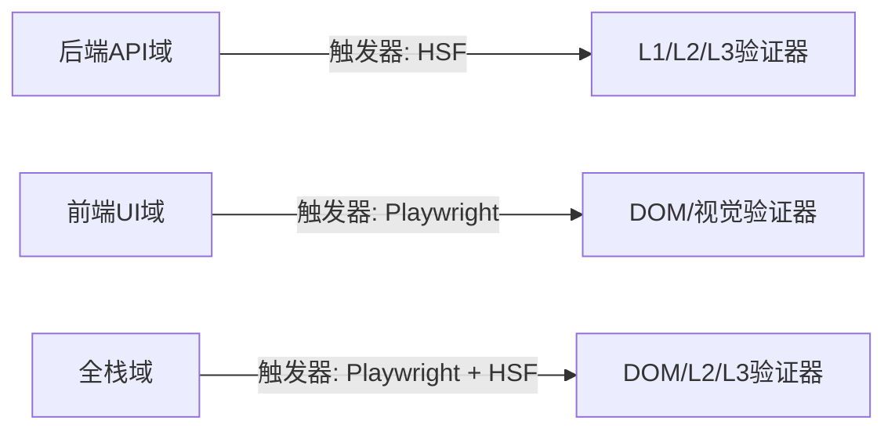
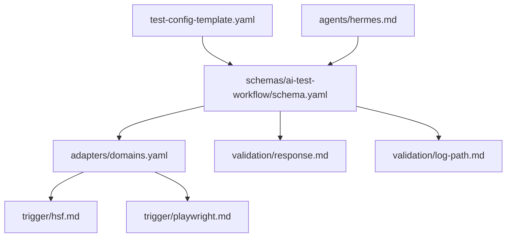

# 触发器适配器

<cite>
**本文引用的文件**
- [adapters/trigger/hsf.md](file://adapters/trigger/hsf.md)
- [adapters/trigger/playwright.md](file://adapters/trigger/playwright.md)
- [adapters/domains.yaml](file://adapters/domains.yaml)
- [schemas/ai-test-workflow/schema.yaml](file://schemas/ai-test-workflow/schema.yaml)
- [config/test-config-template.yaml](file://config/test-config-template.yaml)
- [DESIGN.md](file://DESIGN.md)
- [README.md](file://README.md)
- [INSTRUCTIONS.md](file://INSTRUCTIONS.md)
- [adapters/validation/log-path.md](file://adapters/validation/log-path.md)
- [adapters/validation/response.md](file://adapters/validation/response.md)
- [agents/hermes.md](file://agents/hermes.md)
- [.test-adaptations-template.yaml](file://.test-adaptations-template.yaml)
</cite>

## 目录
1. [简介](#简介)
2. [项目结构](#项目结构)
3. [核心组件](#核心组件)
4. [架构总览](#架构总览)
5. [详细组件分析](#详细组件分析)
6. [依赖分析](#依赖分析)
7. [性能考虑](#性能考虑)
8. [故障排查指南](#故障排查指南)
9. [结论](#结论)
10. [附录](#附录)

## 简介
本文件聚焦“触发器适配器”的技术实现与使用说明，面向AI测试流程的执行入口角色，负责统一调度外部系统与工具（如HTTP代理、Playwright UI自动化等）。本文以仓库中已提供的适配器文档为依据，系统化阐述：
- HSF触发器适配器的HTTP代理调用机制、参数传递格式与响应处理要点
- Playwright触发器适配器的UI自动化测试能力、页面交互模拟与测试执行流程
- 配置示例、错误处理策略与性能优化建议
- 开发指南与最佳实践

同时，结合工作流Schema、Agent能力、日志与验证适配器，给出端到端的执行路径与质量保障策略。

## 项目结构
触发器适配器位于适配层（adapters），通过domains注册表与工作流Schema联动，决定在不同测试域（后端接口、前端UI、全栈）中采用何种触发方式，并串联L1/L2/L3验证层。

图示来源
- [adapters/domains.yaml](file://adapters/domains.yaml)
- [schemas/ai-test-workflow/schema.yaml](file://schemas/ai-test-workflow/schema.yaml)
- [config/test-config-template.yaml](file://config/test-config-template.yaml)
- [adapters/trigger/hsf.md](file://adapters/trigger/hsf.md)
- [adapters/trigger/playwright.md](file://adapters/trigger/playwright.md)
- [adapters/validation/log-path.md](file://adapters/validation/log-path.md)
- [adapters/validation/response.md](file://adapters/validation/response.md)

章节来源
- [README.md:71-84](file://README.md#L71-L84)
- [DESIGN.md:24-37](file://DESIGN.md#L24-L37)
- [adapters/domains.yaml:1-27](file://adapters/domains.yaml#L1-L27)
- [schemas/ai-test-workflow/schema.yaml:1-111](file://schemas/ai-test-workflow/schema.yaml#L1-L111)

## 核心组件
- HSF触发器适配器：通过HTTP代理调用后端接口，遵循统一的请求体结构与响应字段校验，便于日志追踪与跨系统集成。
- Playwright触发器适配器：提供前端UI自动化能力，支持页面导航、元素交互与断言，适合端到端场景。
- 域注册表domains.yaml：声明不同测试域（后端API、前端UI、全栈）所需的触发器与验证器组合。
- 工作流Schema：定义角色、规则、执行模式、通信协议与产物生命周期，驱动AI按序执行并记录审计日志。
- 配置模板test-config-template.yaml：指定执行模式、适配器选择、MCP工具与降级策略等。

章节来源
- [adapters/trigger/hsf.md:1-14](file://adapters/trigger/hsf.md#L1-L14)
- [adapters/trigger/playwright.md:1-8](file://adapters/trigger/playwright.md#L1-L8)
- [adapters/domains.yaml:1-27](file://adapters/domains.yaml#L1-L27)
- [schemas/ai-test-workflow/schema.yaml:1-111](file://schemas/ai-test-workflow/schema.yaml#L1-L111)
- [config/test-config-template.yaml:1-32](file://config/test-config-template.yaml#L1-L32)

## 架构总览
下图展示从需求到执行再到验证的整体链路，突出触发器适配器在不同域中的职责与协作关系。

图示来源
- [INSTRUCTIONS.md:5-44](file://INSTRUCTIONS.md#L5-L44)
- [DESIGN.md:39-55](file://DESIGN.md#L39-L55)
- [adapters/domains.yaml:1-27](file://adapters/domains.yaml#L1-L27)
- [schemas/ai-test-workflow/schema.yaml:1-111](file://schemas/ai-test-workflow/schema.yaml#L1-L111)

## 详细组件分析

### HSF触发器适配器
- 作用定位
  - 作为AI测试流程的执行入口之一，负责调用后端接口（通过HTTP代理），并输出可审计的执行日志。
- HTTP代理调用机制
  - 使用HTTP POST请求访问代理URL，请求头设置为JSON格式；请求体包含接口标识、方法名与参数数组。
  - 响应需包含成功标志位，以便后续L1响应验证；同时提取分布式追踪ID用于L2日志路径验证。
- 参数传递格式
  - 请求体字段包括：接口标识、方法名、参数列表；字段类型与顺序由具体业务约定，但需保持稳定以便日志与回放。
- 响应处理
  - 成功标志位用于快速判定；若失败，需保留原始响应与traceId，便于进一步定位问题。
- 与验证层的衔接
  - L1响应验证：检查成功标志、返回码与数据结构
  - L2日志路径验证：基于traceId查询日志，校验节点完整性、顺序与无错误/警告
  - L3数据状态验证：校验数据库状态变化是否符合预期

图示来源
- [adapters/trigger/hsf.md:3-14](file://adapters/trigger/hsf.md#L3-L14)
- [adapters/validation/response.md:1-7](file://adapters/validation/response.md#L1-L7)
- [adapters/validation/log-path.md:1-10](file://adapters/validation/log-path.md#L1-L10)

章节来源
- [adapters/trigger/hsf.md:1-14](file://adapters/trigger/hsf.md#L1-L14)
- [adapters/validation/response.md:1-7](file://adapters/validation/response.md#L1-L7)
- [adapters/validation/log-path.md:1-10](file://adapters/validation/log-path.md#L1-L10)

### Playwright触发器适配器
- 作用定位
  - 面向前端UI自动化测试，支持页面导航、元素交互与断言，适用于端到端场景。
- UI自动化能力
  - 页面跳转、点击、输入、滚动等基础交互
  - 基于选择器的元素定位与等待策略
  - 截图、视频录制等可视化证据收集（建议）
- 页面交互模拟
  - 通过选择器定位目标元素，执行点击、提交等动作
  - 结合等待策略确保页面状态稳定后再继续下一步
- 测试执行流程
  - 初始化浏览器上下文
  - 导航至目标URL
  - 执行一系列交互步骤
  - 校验页面状态或截图
  - 关闭上下文并产出报告

图示来源
- [adapters/trigger/playwright.md:1-8](file://adapters/trigger/playwright.md#L1-L8)

章节来源
- [adapters/trigger/playwright.md:1-8](file://adapters/trigger/playwright.md#L1-L8)

### 域与触发器映射
- 后端API域：采用HSF触发器，配合L1/L2/L3验证器
- 前端UI域：采用Playwright触发器，配合DOM/视觉验证器
- 全栈域：先执行Playwright触发器进行前端操作，再执行HSF触发器进行后端验证，形成端到端闭环

图示来源
- [adapters/domains.yaml:1-27](file://adapters/domains.yaml#L1-L27)

章节来源
- [adapters/domains.yaml:1-27](file://adapters/domains.yaml#L1-L27)

## 依赖分析
- 触发器与域注册表
  - domains.yaml声明了各域的触发器与验证器组合，是路由到具体适配器的关键
- 触发器与工作流Schema
  - schema.yaml定义角色、规则、执行模式与通信协议，决定何时调用触发器以及如何记录审计日志
- 触发器与验证器
  - HSF触发器与L1/L2/L3验证器协同，形成“调用—验证—反馈”的闭环
- 配置与降级策略
  - test-config-template.yaml提供执行模式、适配器选择与MCP工具开关；agents/hermes.md定义全局降级规则，domains.yaml与schema.yaml共同决定域内触发器与验证器的优先级

图示来源
- [config/test-config-template.yaml](file://config/test-config-template.yaml)
- [agents/hermes.md](file://agents/hermes.md)
- [adapters/domains.yaml](file://adapters/domains.yaml)
- [schemas/ai-test-workflow/schema.yaml](file://schemas/ai-test-workflow/schema.yaml)
- [adapters/trigger/hsf.md](file://adapters/trigger/hsf.md)
- [adapters/trigger/playwright.md](file://adapters/trigger/playwright.md)
- [adapters/validation/response.md](file://adapters/validation/response.md)
- [adapters/validation/log-path.md](file://adapters/validation/log-path.md)

章节来源
- [config/test-config-template.yaml:1-32](file://config/test-config-template.yaml#L1-L32)
- [agents/hermes.md:1-29](file://agents/hermes.md#L1-L29)
- [adapters/domains.yaml:1-27](file://adapters/domains.yaml#L1-L27)
- [schemas/ai-test-workflow/schema.yaml:1-111](file://schemas/ai-test-workflow/schema.yaml#L1-L111)

## 性能考虑
- 并行与串行
  - 在具备并行能力的Agent（如多代理编排）下，可对独立的触发器任务进行并发执行，缩短整体时延
- 超时与重试
  - 对外部HTTP调用与UI自动化设置合理的超时阈值与重试次数，避免单点阻塞
- 日志与追踪
  - 统一采集traceId，减少跨系统定位成本；对高频调用进行采样，平衡可观测性与开销
- 缓存与复用
  - 复用浏览器上下文与登录态，降低冷启动成本；对静态资源与页面进行缓存控制
- 自适应调整
  - 利用自动生成的运行时适配文件，动态调整超时、轮询间隔与过滤规则，持续优化执行效率

## 故障排查指南
- 响应验证失败
  - 检查成功标志位、返回码与数据结构；必要时扩大日志范围或增加调试字段
- 日志路径验证异常
  - 确认traceId提取正确；核对日志查询条件与时间窗口；排除第三方噪声日志
- 数据状态验证不一致
  - 核对数据库连接与事务隔离级别；确认数据变更幂等性与一致性约束
- UI自动化不稳定
  - 增加等待策略与重试；对动态内容采用更稳健的选择器；录制视频辅助定位
- 降级策略生效
  - 若MCP工具不可用或Shell受限，根据全局/需求/用例层面的降级规则切换到人工引导或替代方案

章节来源
- [adapters/validation/response.md:1-7](file://adapters/validation/response.md#L1-L7)
- [adapters/validation/log-path.md:1-10](file://adapters/validation/log-path.md#L1-L10)
- [DESIGN.md:148-186](file://DESIGN.md#L148-L186)
- [agents/hermes.md:15-29](file://agents/hermes.md#L15-L29)

## 结论
触发器适配器作为AI测试流程的执行入口，承担着对接外部系统与工具的关键职责。通过标准化的HTTP代理调用与UI自动化交互，结合严格的工作流Schema与验证适配器，能够实现从需求到报告的全链路自动化与可观测性。建议在实际工程中：
- 明确域与触发器映射，按需扩展验证层
- 建立完善的日志与追踪体系，确保问题可定位
- 制定降级策略与自适应机制，提升鲁棒性
- 将性能优化纳入持续改进循环，逐步提升吞吐与稳定性

## 附录

### 配置示例与最佳实践
- 执行模式与适配器选择
  - 在配置模板中明确执行模式与各域触发器/验证器组合，确保与Agent能力匹配
- MCP工具与降级规则
  - 根据环境可用性启用/禁用MCP工具，并在全局/需求/用例层面设定降级动作
- 运行时适配
  - 利用自动生成的适配文件记录微调参数，避免反复手工干预
- 审计日志
  - 在每次外部调用前写入执行日志，包含时间戳、参数与期望结果，便于回溯

章节来源
- [config/test-config-template.yaml:1-32](file://config/test-config-template.yaml#L1-L32)
- [DESIGN.md:66-70](file://DESIGN.md#L66-L70)
- [.test-adaptations-template.yaml:1-16](file://.test-adaptations-template.yaml#L1-L16)