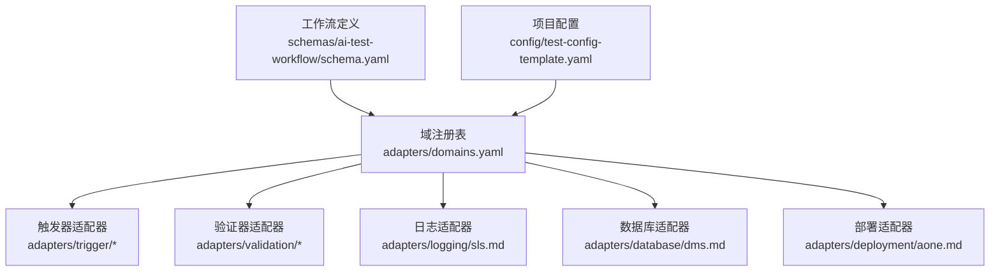
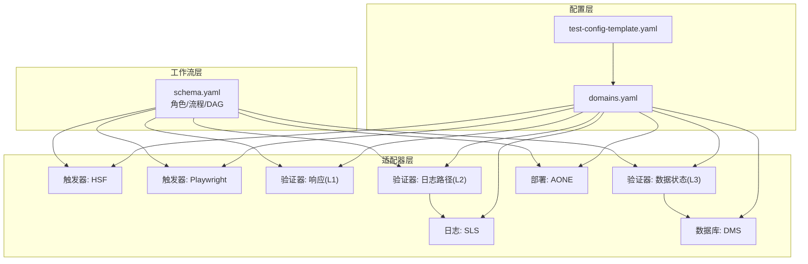
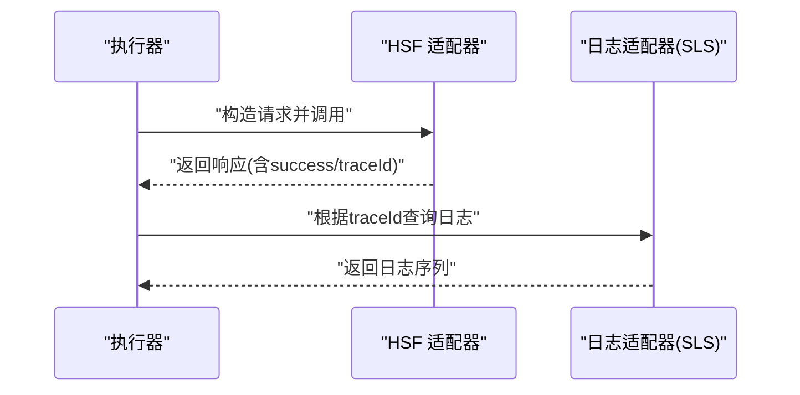
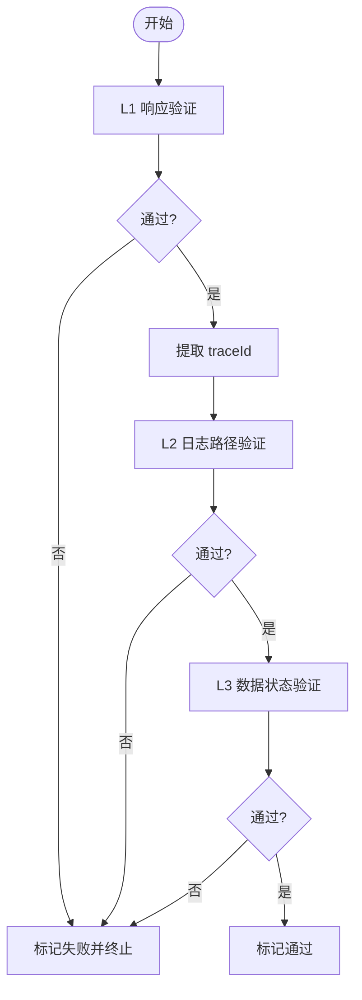
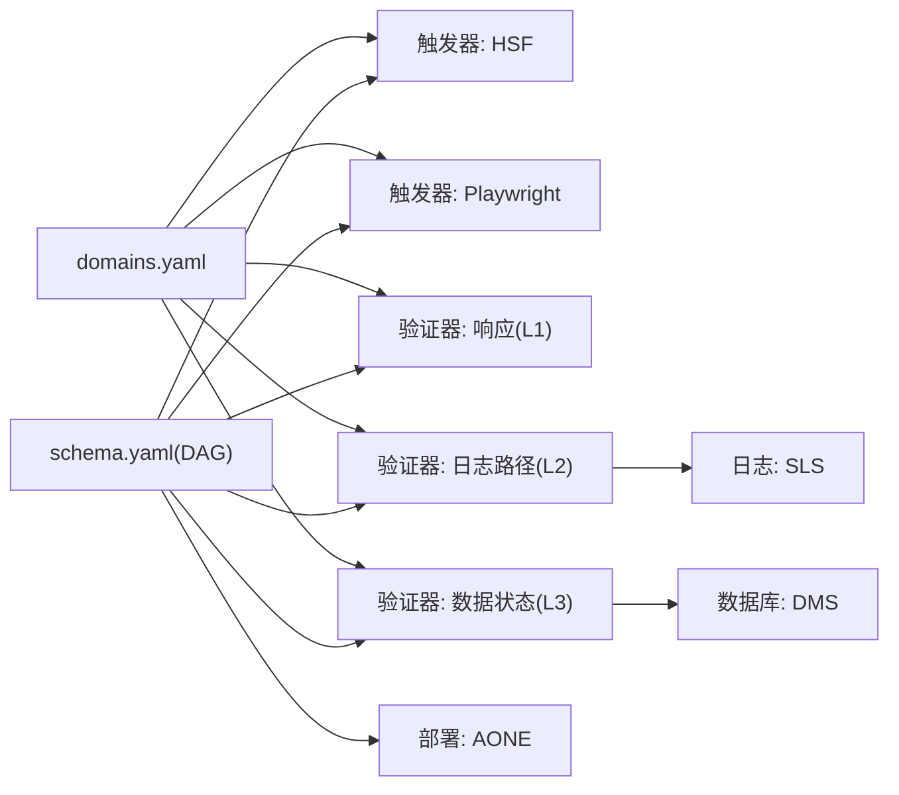

# 适配器系统

<cite>
**本文引用的文件**
- [README.md](file://README.md)
- [DESIGN.md](file://DESIGN.md)
- [INSTRUCTIONS.md](file://INSTRUCTIONS.md)
- [adapters/domains.yaml](file://adapters/domains.yaml)
- [adapters/trigger/hsf.md](file://adapters/trigger/hsf.md)
- [adapters/trigger/playwright.md](file://adapters/trigger/playwright.md)
- [adapters/validation/response.md](file://adapters/validation/response.md)
- [adapters/validation/log-path.md](file://adapters/validation/log-path.md)
- [adapters/validation/data-state.md](file://adapters/validation/data-state.md)
- [adapters/logging/sls.md](file://adapters/logging/sls.md)
- [adapters/database/dms.md](file://adapters/database/dms.md)
- [adapters/deployment/aone.md](file://adapters/deployment/aone.md)
- [config/test-config-template.yaml](file://config/test-config-template.yaml)
- [config/test-config-adaptations-template.yaml](file://config/test-config-adaptations-template.yaml)
- [config/.test-adaptations-template.yaml](file://config/.test-adaptations-template.yaml)
- [schemas/ai-test-workflow/schema.yaml](file://schemas/ai-test-workflow/schema.yaml)
</cite>

## 目录
1. [简介](#简介)
2. [项目结构](#项目结构)
3. [核心组件](#核心组件)
4. [架构总览](#架构总览)
5. [详细组件分析](#详细组件分析)
6. [依赖分析](#依赖分析)
7. [性能考虑](#性能考虑)
8. [故障排查指南](#故障排查指南)
9. [结论](#结论)
10. [附录](#附录)

## 简介
本文件面向“适配器系统”的技术文档，系统性阐述适配器架构设计与插件化扩展机制，覆盖触发器、验证器、日志、数据库与部署五大类适配器，解释其功能边界、生命周期管理、错误处理策略与性能优化要点，并提供开发指南、接口规范与最佳实践。同时，结合配置模板与工作流定义，说明适配器间的依赖关系与组合使用模式。

## 项目结构
适配器系统位于 adapters/ 目录下，按功能域划分子目录：
- trigger：触发器适配器（HSF、Playwright）
- validation：验证器适配器（响应、日志路径、数据状态）
- logging：日志适配器（SLS）
- database：数据库适配器（DMS）
- deployment：部署适配器（AONE）

此外，通过 domains.yaml 将不同测试域（如后端接口、前端UI、全栈）与对应适配器进行注册绑定；配置模板 test-config-template.yaml 指定当前项目启用的适配器类型；schema.yaml 定义执行流程与角色分工，驱动适配器在工作流中被调用。

**图示来源**
- [adapters/domains.yaml:1-27](file://adapters/domains.yaml#L1-L27)
- [schemas/ai-test-workflow/schema.yaml:1-87](file://schemas/ai-test-workflow/schema.yaml#L1-L87)
- [config/test-config-template.yaml:1-23](file://config/test-config-template.yaml#L1-L23)

**章节来源**
- [README.md:71-84](file://README.md#L71-L84)
- [DESIGN.md:24-37](file://DESIGN.md#L24-L37)
- [adapters/domains.yaml:1-27](file://adapters/domains.yaml#L1-L27)
- [config/test-config-template.yaml:1-23](file://config/test-config-template.yaml#L1-L23)
- [schemas/ai-test-workflow/schema.yaml:1-87](file://schemas/ai-test-workflow/schema.yaml#L1-L87)

## 核心组件
- 触发器适配器
  - HSF：通过 HTTP 代理调用远程接口，返回包含 traceId 的响应，用于后续日志链路验证。
  - Playwright：前端 UI 自动化触发，支持页面导航与交互操作。
- 验证器适配器
  - 响应（L1）：校验 success 字段、业务码与 data 结构。
  - 日志路径（L2）：基于 traceId 查询日志，校验节点完整性、顺序与干净度。
  - 数据状态（L3）：执行前后快照对比，校验主数据与副作用。
- 日志适配器（SLS）
  - 通过 MCP 工具查询 SLS 日志，支持按 traceId 过滤与排序。
- 数据库适配器（DMS）
  - 通过 MCP 工具执行 SQL，支持只读或变更后的状态校验。
- 部署适配器（AONE）
  - 异步部署 + 轮询 + 冷却，配套健康检查（端口、接口、日志）。

上述组件均以“适配器”形式存在，遵循统一的“声明式规则 + 可插拔实现”的设计，便于替换与扩展。

**章节来源**
- [adapters/trigger/hsf.md:1-14](file://adapters/trigger/hsf.md#L1-L14)
- [adapters/trigger/playwright.md:1-8](file://adapters/trigger/playwright.md#L1-L8)
- [adapters/validation/response.md:1-7](file://adapters/validation/response.md#L1-L7)
- [adapters/validation/log-path.md:1-10](file://adapters/validation/log-path.md#L1-L10)
- [adapters/validation/data-state.md:1-8](file://adapters/validation/data-state.md#L1-L8)
- [adapters/logging/sls.md:1-10](file://adapters/logging/sls.md#L1-L10)
- [adapters/database/dms.md:1-10](file://adapters/database/dms.md#L1-L10)
- [adapters/deployment/aone.md:1-12](file://adapters/deployment/aone.md#L1-L12)

## 架构总览
适配器系统采用“分层解耦 + 域注册 + 工作流编排”的架构：
- 分层解耦：Schema 层定义流程与角色，Adapter 层封装技术实现，Agent 层负责执行，Knowledge 层沉淀经验。
- 域注册：domains.yaml 将“域”与“适配器集合”绑定，支持单域多触发器与多验证器组合。
- 工作流编排：schema.yaml 的 DAG 与角色定义驱动适配器在不同阶段被调用；execution-log.md 提供审计与可追溯性。

**图示来源**
- [schemas/ai-test-workflow/schema.yaml:1-87](file://schemas/ai-test-workflow/schema.yaml#L1-L87)
- [adapters/domains.yaml:1-27](file://adapters/domains.yaml#L1-L27)
- [config/test-config-template.yaml:1-23](file://config/test-config-template.yaml#L1-L23)

## 详细组件分析

### 触发器适配器
- HSF 适配器
  - 执行方式：通过 HTTP 代理调用目标接口，返回包含 traceId 的响应，供 L2 日志验证使用。
  - 关键点：请求参数需包含接口名、方法名与参数列表；成功标志与 traceId 是后续链路的关键输入。
- Playwright 适配器
  - 执行方式：页面导航与交互（如点击），适合前端 UI 场景。
  - 关键点：与 DOM/视觉验证适配器配合，形成前端测试闭环。

**图示来源**
- [adapters/trigger/hsf.md:3-14](file://adapters/trigger/hsf.md#L3-L14)
- [adapters/logging/sls.md:3-10](file://adapters/logging/sls.md#L3-L10)

**章节来源**
- [adapters/trigger/hsf.md:1-14](file://adapters/trigger/hsf.md#L1-L14)
- [adapters/trigger/playwright.md:1-8](file://adapters/trigger/playwright.md#L1-L8)

### 验证器适配器
- 响应（L1）
  - 规则：校验 success 布尔值、业务码是否为“0”、data 结构（空值、数组长度等）。
  - 作用：快速过滤明显失败的请求，避免进入更昂贵的日志/数据验证。
- 日志路径（L2）
  - 规则：提取 traceId，按时间排序查询日志，校验节点完整性、顺序与干净度（无 ERROR/WARN）。
  - 依赖：SLS 日志适配器。
- 数据状态（L3）
  - 规则：执行前/后快照对比，校验字段变化（如状态从 DRAFT 到 APPROVED），并检查关联表副作用。

**图示来源**
- [adapters/validation/response.md:3-7](file://adapters/validation/response.md#L3-L7)
- [adapters/validation/log-path.md:3-10](file://adapters/validation/log-path.md#L3-L10)
- [adapters/validation/data-state.md:3-8](file://adapters/validation/data-state.md#L3-L8)

**章节来源**
- [adapters/validation/response.md:1-7](file://adapters/validation/response.md#L1-L7)
- [adapters/validation/log-path.md:1-10](file://adapters/validation/log-path.md#L1-L10)
- [adapters/validation/data-state.md:1-8](file://adapters/validation/data-state.md#L1-L8)

### 日志适配器（SLS）
- 执行方式：通过 mcporter 调用 sls-mcp 查询日志，按 traceId 过滤并按时间排序。
- 使用场景：L2 日志路径验证的核心能力。
- 配置要求：在 MCP 工具可用时启用；可通过运行时调整排除模式降低误报。

**章节来源**
- [adapters/logging/sls.md:1-10](file://adapters/logging/sls.md#L1-L10)
- [DESIGN.md:96-104](file://DESIGN.md#L96-L104)

### 数据库适配器（DMS）
- 执行方式：通过 mcporter 调用 dms-mcp-server 执行 SQL，支持只读查询与状态断言。
- 使用场景：L3 数据状态验证，对比执行前后数据一致性。
- 注意事项：SQL 设计需稳定且幂等，避免对生产数据造成影响。

**章节来源**
- [adapters/database/dms.md:1-10](file://adapters/database/dms.md#L1-L10)

### 部署适配器（AONE）
- 执行策略：异步部署（后台触发），定时轮询状态，成功后等待冷却时间，再进行健康检查。
- 健康检查：端口探测、只读接口检查、近一分钟内 SLS 中无 ERROR。
- 适用场景：需要在自动化测试前确保目标环境已就绪。

**章节来源**
- [adapters/deployment/aone.md:1-12](file://adapters/deployment/aone.md#L1-L12)

## 依赖分析
- 域到适配器的绑定
  - backend-api：HSF 触发 + 响应/L2 日志/L3 数据验证
  - frontend-ui：Playwright 触发 + DOM/视觉验证
  - full-stack：Playwright + HSF 触发 + DOM/L2 日志/L3 数据验证
- 适配器间依赖
  - L2 日志验证依赖 SLS 日志适配器
  - L3 数据验证依赖数据库适配器
  - 部署适配器为触发与验证提供环境保障
- 配置与路由
  - domains.yaml 决定每个域启用哪些适配器
  - test-config-template.yaml 指定当前项目启用的适配器类型
  - schema.yaml 的 DAG 决定适配器在流程中的调用时机

**图示来源**
- [adapters/domains.yaml:1-27](file://adapters/domains.yaml#L1-L27)
- [schemas/ai-test-workflow/schema.yaml:1-87](file://schemas/ai-test-workflow/schema.yaml#L1-L87)

**章节来源**
- [adapters/domains.yaml:1-27](file://adapters/domains.yaml#L1-L27)
- [config/test-config-template.yaml:9-13](file://config/test-config-template.yaml#L9-L13)
- [schemas/ai-test-workflow/schema.yaml:1-87](file://schemas/ai-test-workflow/schema.yaml#L1-L87)

## 性能考虑
- L1 快速过滤：优先进行 L1 响应验证，尽早失败，减少后续昂贵的 L2/L3 成本。
- L2 查询优化：按 traceId 进行精确过滤与时间排序，避免全量扫描；必要时通过运行时排除模式减少无关日志干扰。
- L3 查询优化：仅查询受影响的数据集，避免全表扫描；对高频查询建立索引或缓存。
- 异步部署与轮询：部署阶段采用异步触发 + 固定间隔轮询，成功后短暂冷却，平衡成功率与等待时间。
- 并发与隔离：在 Agent 能力允许的情况下，尽量并行执行不相互依赖的验证步骤，但需遵守工作流的顺序约束。

[本节为通用性能建议，无需特定文件引用]

## 故障排查指南
- 常见问题与定位
  - L1 失败：检查接口入参、鉴权与业务码约定；确认响应结构符合预期。
  - L2 无日志或误报：核对 traceId 提取是否正确；调整日志排除模式以减少第三方噪声。
  - L3 数据不一致：确认快照采集时机与字段差异范围；检查事务隔离与并发写入。
  - 部署失败：查看轮询状态与冷却时间设置；执行健康检查三步法（端口/接口/日志）。
- 配置与运行时调整
  - 使用运行时自适应文件记录参数调整与排除规则，避免重复踩坑。
  - 在 MCP 工具不可用时，切换到辅助模式生成手动测试指引，逐步补齐能力。

**章节来源**
- [DESIGN.md:96-104](file://DESIGN.md#L96-L104)
- [config/.test-adaptations-template.yaml:1-16](file://config/.test-adaptations-template.yaml#L1-L16)
- [adapters/deployment/aone.md:8-12](file://adapters/deployment/aone.md#L8-L12)

## 结论
适配器系统通过“域注册 + 工作流编排 + 插件化实现”的设计，实现了测试能力的高可移植性与强扩展性。借助 domains.yaml 与 schema.yaml，团队可以灵活组合不同适配器，构建从接口到前端再到全栈的完整测试链路；借助 MCP 工具与运行时自适应，系统在真实执行中不断学习与优化，持续提升稳定性与效率。

[本节为总结性内容，无需特定文件引用]

## 附录

### 开发指南与接口规范
- 适配器开发步骤
  - 明确适配器职责：触发、验证、日志、数据库或部署。
  - 编写适配器文档：在对应目录新增适配器文件，描述执行方式与规则。
  - 集成 MCP 工具：通过 mcporter 调用工具，确保参数与输出格式标准化。
  - 注册到域：在 domains.yaml 中将新适配器加入目标域。
  - 配置启用：在 test-config-template.yaml 中选择启用该适配器。
- 接口规范
  - 输入/输出：明确参数与返回值结构，便于工作流解析。
  - 错误码：统一错误语义与重试策略，避免歧义。
  - 审计日志：每次调用前写入 execution-log.md，保留时间戳与参数。
- 最佳实践
  - 优先实现 L1 快速验证，降低整体成本。
  - 对 L2/L3 查询做最小化范围与索引优化。
  - 异步部署 + 冷却 + 健康检查三步法确保环境稳定。
  - 使用运行时自适应文件沉淀经验，避免同类问题反复出现。

**章节来源**
- [INSTRUCTIONS.md:1-44](file://INSTRUCTIONS.md#L1-L44)
- [DESIGN.md:56-104](file://DESIGN.md#L56-L104)
- [adapters/domains.yaml:1-27](file://adapters/domains.yaml#L1-L27)
- [config/test-config-template.yaml:1-23](file://config/test-config-template.yaml#L1-L23)

### 配置说明
- 项目配置模板
  - test-config-template.yaml：指定 execution_mode、适配器类型与 MCP 工具启用情况。
  - test-config-adaptations-template.yaml：定义运行时自适应规则的结构与示例。
  - .test-adaptations-template.yaml：AI 自动生成的运行时调整条目，覆盖默认行为。
- 使用建议
  - 在 MCP 工具齐全时启用 full-auto 模式，最大化自动化收益。
  - 当工具受限时启用 assisted 模式，由 AI 生成手动指引，保证流程可控。

**章节来源**
- [config/test-config-template.yaml:1-23](file://config/test-config-template.yaml#L1-L23)
- [config/test-config-adaptations-template.yaml:1-26](file://config/test-config-adaptations-template.yaml#L1-L26)
- [config/.test-adaptations-template.yaml:1-16](file://config/.test-adaptations-template.yaml#L1-L16)
- [README.md:39-52](file://README.md#L39-L52)