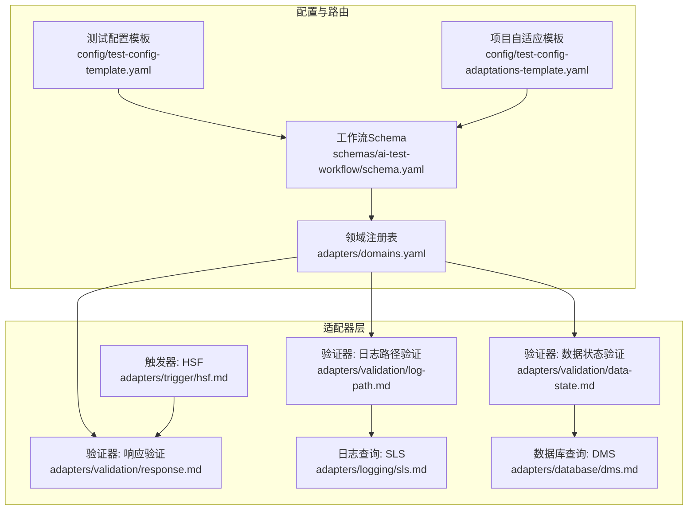
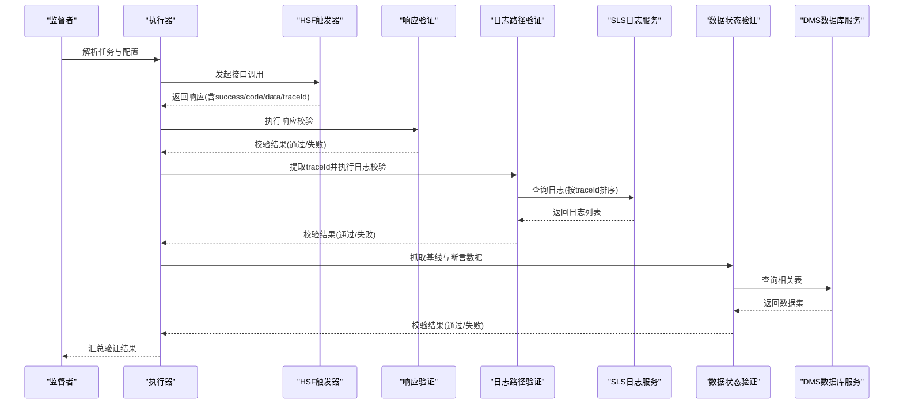
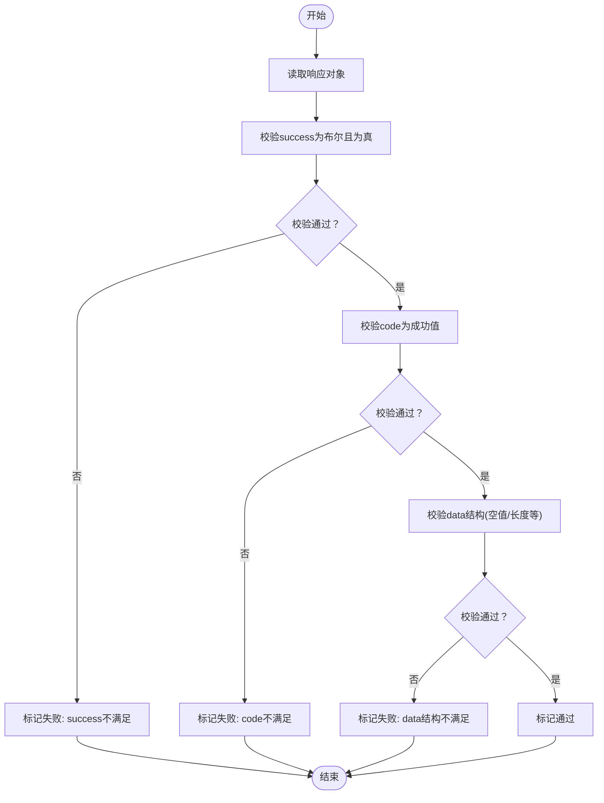
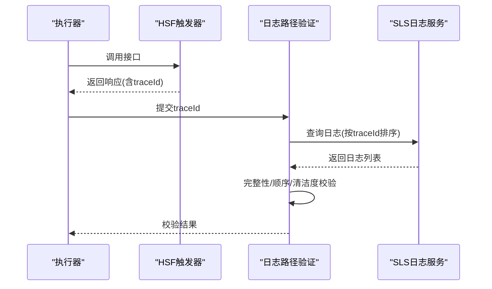
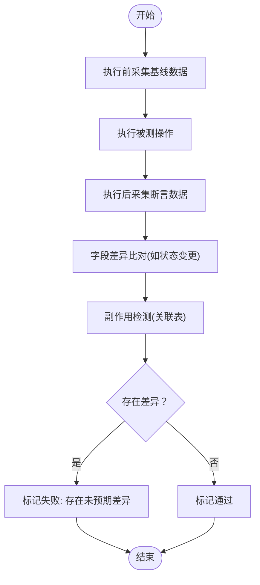
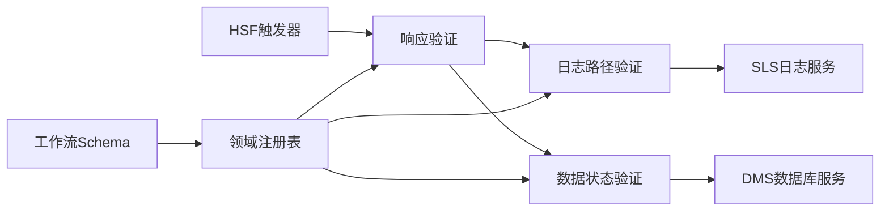

# 验证器适配器

<cite>
**本文引用的文件**
- [response.md](file://adapters/validation/response.md)
- [log-path.md](file://adapters/validation/log-path.md)
- [data-state.md](file://adapters/validation/data-state.md)
- [domains.yaml](file://adapters/domains.yaml)
- [schema.yaml](file://schemas/ai-test-workflow/schema.yaml)
- [test-config-template.yaml](file://config/test-config-template.yaml)
- [test-config-adaptations-template.yaml](file://config/test-config-adaptations-template.yaml)
- [sls.md](file://adapters/logging/sls.md)
- [dms.md](file://adapters/database/dms.md)
- [hsf.md](file://adapters/trigger/hsf.md)
- [template.md](file://agents/template.md)
</cite>

## 目录
1. [简介](#简介)
2. [项目结构](#项目结构)
3. [核心组件](#核心组件)
4. [架构总览](#架构总览)
5. [详细组件分析](#详细组件分析)
6. [依赖关系分析](#依赖关系分析)
7. [性能考量](#性能考量)
8. [故障排查指南](#故障排查指南)
9. [结论](#结论)
10. [附录](#附录)

## 简介
本文件系统化梳理验证器适配器在自动化测试流程中的关键作用，重点覆盖三层验证：
- 响应验证适配器：对HTTP/HSF响应进行结构与语义校验，确保接口返回的正确性与一致性。
- 日志路径验证适配器：基于traceId检索SLS日志，执行完整性、顺序性与清洁度校验，定位问题根因。
- 数据状态验证适配器：通过基线快照与执行后对比，完成字段差异与副作用检测，保障业务一致性。

同时，文档阐述验证规则配置、降级策略、错误诊断与调试技巧，帮助读者在不同环境与约束下稳定运行验证层。

## 项目结构
验证器适配器位于适配器层（adapters），通过领域注册表（domains.yaml）声明在不同测试域中所需的验证组合，并由工作流Schema驱动执行与降级。

图表来源
- [domains.yaml:1-26](file://adapters/domains.yaml#L1-L26)
- [schema.yaml:1-111](file://schemas/ai-test-workflow/schema.yaml#L1-L111)
- [response.md:1-7](file://adapters/validation/response.md#L1-L7)
- [log-path.md:1-10](file://adapters/validation/log-path.md#L1-L10)
- [data-state.md:1-8](file://adapters/validation/data-state.md#L1-L8)
- [sls.md:1-10](file://adapters/logging/sls.md#L1-L10)
- [dms.md:1-10](file://adapters/database/dms.md#L1-L10)
- [hsf.md:1-14](file://adapters/trigger/hsf.md#L1-L14)

章节来源
- [domains.yaml:1-26](file://adapters/domains.yaml#L1-L26)
- [schema.yaml:1-111](file://schemas/ai-test-workflow/schema.yaml#L1-L111)

## 核心组件
- 响应验证适配器：校验接口返回的布尔成功标志、业务码与数据结构，确保上游调用结果符合预期。
- 日志路径验证适配器：从HSF响应提取traceId，查询SLS日志，执行节点完整性、顺序与清洁度校验。
- 数据状态验证适配器：在执行前后分别抓取基线与断言数据，进行字段差异与副作用检测，保证业务状态一致。

章节来源
- [response.md:1-7](file://adapters/validation/response.md#L1-L7)
- [log-path.md:1-10](file://adapters/validation/log-path.md#L1-L10)
- [data-state.md:1-8](file://adapters/validation/data-state.md#L1-L8)

## 架构总览
验证器适配器在工作流中作为“验证阶段”的执行单元，遵循三层继承的降级规则，结合配置与Agent能力动态选择执行策略。

图表来源
- [hsf.md:1-14](file://adapters/trigger/hsf.md#L1-L14)
- [response.md:1-7](file://adapters/validation/response.md#L1-L7)
- [log-path.md:1-10](file://adapters/validation/log-path.md#L1-L10)
- [sls.md:1-10](file://adapters/logging/sls.md#L1-L10)
- [data-state.md:1-8](file://adapters/validation/data-state.md#L1-L8)
- [dms.md:1-10](file://adapters/database/dms.md#L1-L10)
- [schema.yaml:38-69](file://schemas/ai-test-workflow/schema.yaml#L38-L69)

## 详细组件分析

### 响应验证适配器
职责与流程
- 输入：接口调用响应（包含success、code、data等字段）。
- 处理：
  - 成功标志校验：确认success为布尔值且为真。
  - 业务码校验：code应为特定成功值（如“0”）。
  - 数据结构校验：对data进行空值检查与数组长度等约束。
- 输出：通过/失败，失败时记录具体字段与期望值。

图表来源
- [response.md:1-7](file://adapters/validation/response.md#L1-L7)

章节来源
- [response.md:1-7](file://adapters/validation/response.md#L1-L7)
- [hsf.md:11-14](file://adapters/trigger/hsf.md#L11-L14)

### 日志路径验证适配器
职责与流程
- 输入：来自HSF响应的traceId。
- 处理：
  - 通过SLS MCP工具按traceId查询日志，按时间排序。
  - 完整性校验：确认所有期望节点均出现。
  - 顺序校验：节点出现顺序符合预期。
  - 清洁度校验：排除ERROR/WARN级别日志或仅保留允许级别。
- 输出：通过/失败，失败时输出缺失节点、异常日志片段与时间范围。

图表来源
- [log-path.md:1-10](file://adapters/validation/log-path.md#L1-L10)
- [sls.md:1-10](file://adapters/logging/sls.md#L1-L10)
- [hsf.md:12-13](file://adapters/trigger/hsf.md#L12-L13)

章节来源
- [log-path.md:1-10](file://adapters/validation/log-path.md#L1-L10)
- [sls.md:1-10](file://adapters/logging/sls.md#L1-L10)
- [hsf.md:12-13](file://adapters/trigger/hsf.md#L12-L13)

### 数据状态验证适配器
职责与流程
- 输入：执行前后的数据快照。
- 处理：
  - 基线采集：在执行前抓取相关表/字段快照。
  - 断言查询：执行后再次查询，形成断言数据集。
  - 差异比对：比较关键字段变化（如状态从草稿到审批）。
  - 副作用检测：检查关联表是否存在未预期变更。
- 输出：通过/失败，失败时输出差异详情与异常字段。

图表来源
- [data-state.md:1-8](file://adapters/validation/data-state.md#L1-L8)
- [dms.md:1-10](file://adapters/database/dms.md#L1-L10)

章节来源
- [data-state.md:1-8](file://adapters/validation/data-state.md#L1-L8)
- [dms.md:1-10](file://adapters/database/dms.md#L1-L10)

## 依赖关系分析
验证器适配器与外部系统的耦合关系如下：
- 响应验证依赖HSF触发器提供的响应结构。
- 日志路径验证依赖SLS日志查询能力。
- 数据状态验证依赖DMS数据库查询能力。
- 降级策略由工作流Schema与Agent配置共同决定。

图表来源
- [hsf.md:1-14](file://adapters/trigger/hsf.md#L1-L14)
- [response.md:1-7](file://adapters/validation/response.md#L1-L7)
- [log-path.md:1-10](file://adapters/validation/log-path.md#L1-L10)
- [sls.md:1-10](file://adapters/logging/sls.md#L1-L10)
- [data-state.md:1-8](file://adapters/validation/data-state.md#L1-L8)
- [dms.md:1-10](file://adapters/database/dms.md#L1-L10)
- [schema.yaml:38-69](file://schemas/ai-test-workflow/schema.yaml#L38-L69)
- [domains.yaml:1-26](file://adapters/domains.yaml#L1-L26)

章节来源
- [schema.yaml:38-69](file://schemas/ai-test-workflow/schema.yaml#L38-L69)
- [domains.yaml:1-26](file://adapters/domains.yaml#L1-L26)

## 性能考量
- 查询优化
  - 日志查询建议限定时间窗口，避免全量扫描。
  - 数据库查询使用索引列作为过滤条件，减少全表扫描。
- 并发与重试
  - 对于异步操作，采用轮询+指数退避策略，避免频繁查询导致资源压力。
- 资源隔离
  - 将验证阶段与执行阶段分离，避免共享资源竞争。
- 可观测性
  - 在验证前记录traceId与关键参数，便于回溯与定位。

## 故障排查指南
常见问题与处理建议
- 响应验证失败
  - 检查接口是否返回success与code字段，确认业务码约定。
  - 核对data结构是否为空或长度不符合预期。
- 日志路径验证失败
  - 确认traceId提取正确且与请求一致。
  - 检查SLS查询条件与时间范围，必要时缩小时间窗。
  - 排除第三方噪声日志，必要时在项目自适应模板中添加排除模式。
- 数据状态验证失败
  - 确认基线采集与断言采集的时间点与范围。
  - 检查差异字段是否属于预期变更，副作用是否可接受。
  - 关联表查询需确保权限与连接正常。

降级策略参考
- 当MCP不可用时，可跳过日志/数据验证或降级为人工辅助模式。
- 当Shell不可用时，优先生成手动测试指南。
- 当部署能力不足时，改为手动部署或跳过相关步骤。

章节来源
- [schema.yaml:38-69](file://schemas/ai-test-workflow/schema.yaml#L38-L69)
- [template.md:17-27](file://agents/template.md#L17-L27)
- [test-config-template.yaml:18-32](file://config/test-config-template.yaml#L18-L32)
- [test-config-adaptations-template.yaml:1-26](file://config/test-config-adaptations-template.yaml#L1-L26)

## 结论
验证器适配器通过结构化规则与可插拔实现，确保测试结果的准确性与可靠性。结合工作流Schema的三层降级机制与Agent能力声明，可在不同约束条件下稳定运行。建议在实际项目中：
- 明确各域的验证组合与规则边界；
- 在配置模板中预留可调整项（如超时、排除模式）；
- 建立统一的错误诊断与修复闭环，持续优化验证覆盖率与稳定性。

## 附录
- 领域与验证组合
  - 后端接口域：响应验证 + 日志路径验证 + 数据状态验证。
  - 前端UI域：DOM与视觉验证（非本文重点）。
  - 全栈域：前端操作 + 后端验证 + 日志路径验证 + 数据状态验证。

章节来源
- [domains.yaml:1-26](file://adapters/domains.yaml#L1-L26)