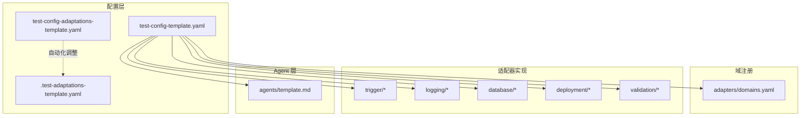
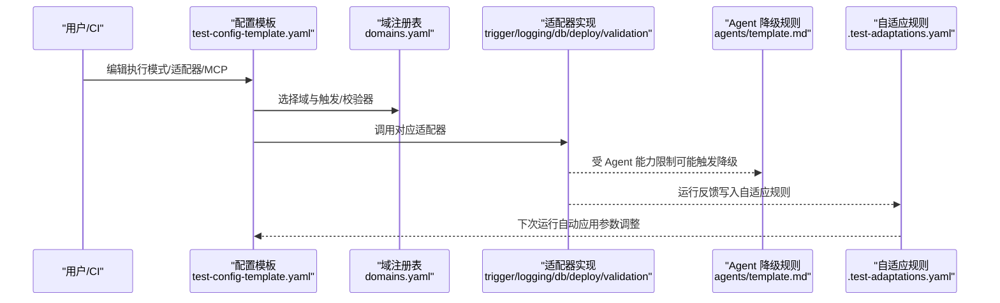
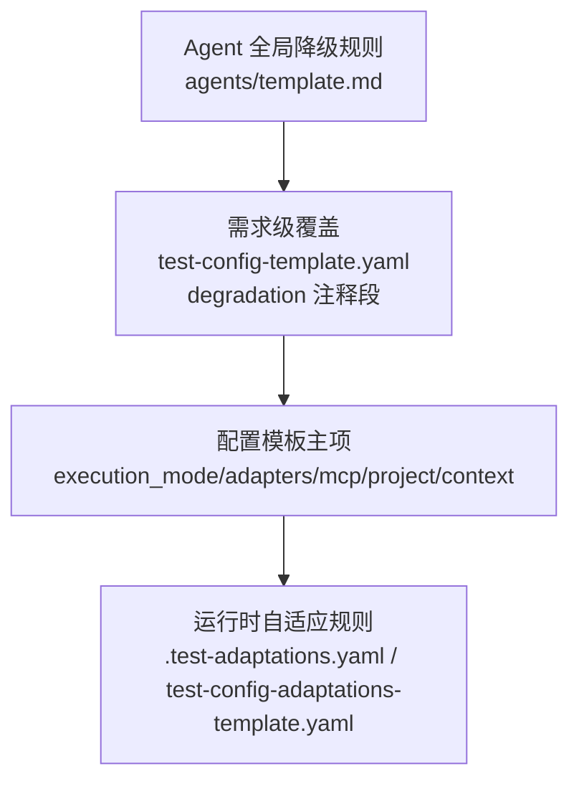
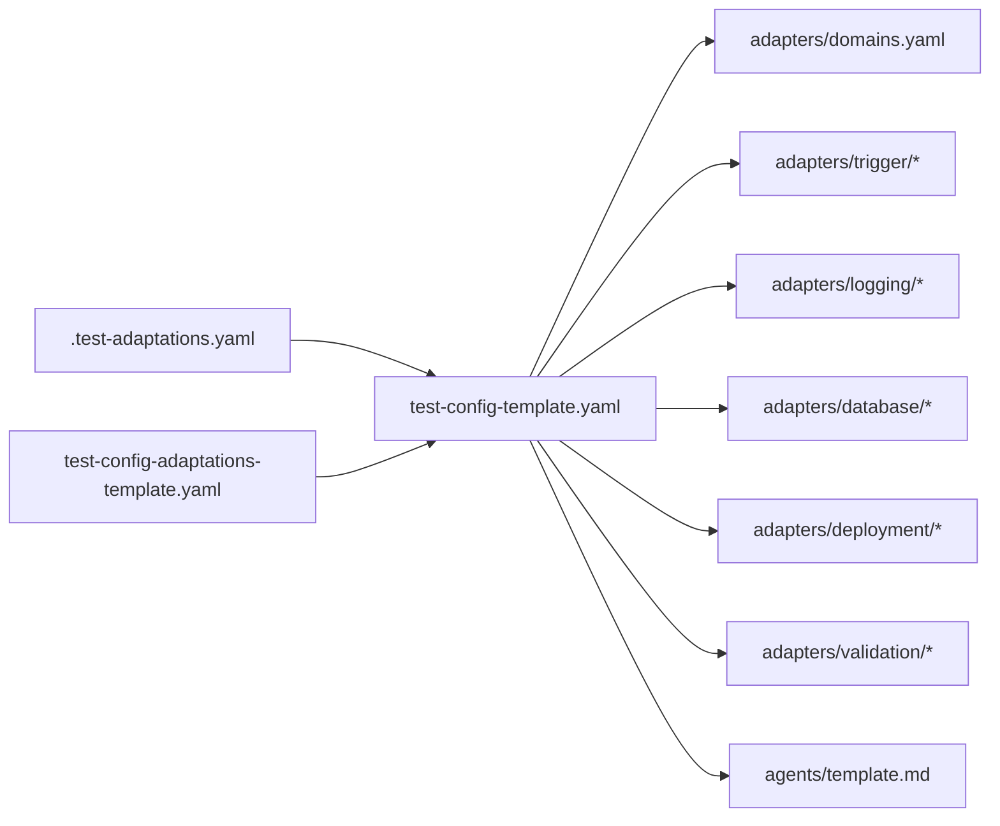

# 配置管理

<cite>
**本文引用的文件**
- [README.md](file://README.md)
- [DESIGN.md](file://DESIGN.md)
- [test-config-template.yaml](file://config/test-config-template.yaml)
- [test-config-adaptations-template.yaml](file://config/test-config-adaptations-template.yaml)
- [.test-adaptations-template.yaml](file://config/.test-adaptations-template.yaml)
- [domains.yaml](file://adapters/domains.yaml)
- [hsf.md](file://adapters/trigger/hsf.md)
- [playwright.md](file://adapters/trigger/playwright.md)
- [sls.md](file://adapters/logging/sls.md)
- [dms.md](file://adapters/database/dms.md)
- [aone.md](file://adapters/deployment/aone.md)
- [response.md](file://adapters/validation/response.md)
- [log-path.md](file://adapters/validation/log-path.md)
- [data-state.md](file://adapters/validation/data-state.md)
- [template.md](file://agents/template.md)
</cite>

## 目录
1. [简介](#简介)
2. [项目结构](#项目结构)
3. [核心组件](#核心组件)
4. [架构总览](#架构总览)
5. [详细组件分析](#详细组件分析)
6. [依赖分析](#依赖分析)
7. [性能考虑](#性能考虑)
8. [故障排查指南](#故障排查指南)
9. [结论](#结论)
10. [附录](#附录)

## 简介
本指南围绕“配置管理”主题，系统性阐述本项目的配置模板结构、参数语义与优先级，以及在不同执行模式、MCP 工具配置与域注册表设置下的使用方法。文档同时覆盖配置验证、错误检查、调试方法、迁移与版本管理、团队协作、安全与敏感信息保护、访问控制，以及面向不同用户角色（AI Agent、开发者、测试工程师、运维）的针对性配置建议。

## 项目结构
本项目采用“声明式配置 + 适配器实现 + 自我演化知识库”的分层设计。配置相关的关键位置如下：
- 配置模板：config/ 下提供测试配置模板与自适应规则模板
- 执行域注册：adapters/domains.yaml 定义不同测试域及其所需适配器
- 适配器实现：adapters/trigger、adapters/logging、adapters/database、adapters/deployment、adapters/validation 下的各技术实现说明
- Agent 配置：agents/template.md 提供降级规则与能力边界
- 框架设计与执行模式：DESIGN.md 与 README.md 提供高层说明与快速开始

图表来源
- [test-config-template.yaml:1-32](file://config/test-config-template.yaml#L1-L32)
- [test-config-adaptations-template.yaml:1-26](file://config/test-config-adaptations-template.yaml#L1-L26)
- [.test-adaptations-template.yaml:1-16](file://config/.test-adaptations-template.yaml#L1-L16)
- [domains.yaml:1-27](file://adapters/domains.yaml#L1-L27)
- [template.md:1-36](file://agents/template.md#L1-L36)

章节来源
- [README.md:1-89](file://README.md#L1-L89)
- [DESIGN.md:1-155](file://DESIGN.md#L1-L155)

## 核心组件
- 测试配置模板（test-config-template.yaml）
  - 关键字段：schema、execution_mode、project、adapters、context、mcp、degradation（注释区）
  - 作用：定义执行模式、项目归属、适配器选择、MCP 工具启用与回退策略、需求级降级覆盖等
- 域注册表（adapters/domains.yaml）
  - 关键字段：domains.<domain>.description、trigger、validation
  - 作用：将测试域映射到具体触发器与校验器，决定执行链路
- 适配器实现（adapters/*）
  - 触发器：HSF、Playwright
  - 日志：SLS 查询
  - 数据库：DMS 查询
  - 部署：Aone 异步部署与健康检查
  - 校验：响应体、日志路径、数据状态
- Agent 降级规则模板（agents/template.md）
  - 关键字段：degradation（no_mcp、no_shell、no_deploy、no_database）
  - 作用：定义全局默认降级策略，可被配置层覆盖
- 自适应规则模板
  - test-config-adaptations-template.yaml：项目级运行时自适应（参数级变更）
  - .test-adaptations-template.yaml：AI 自动生成的自适应规则追加文件

章节来源
- [test-config-template.yaml:1-32](file://config/test-config-template.yaml#L1-L32)
- [domains.yaml:1-27](file://adapters/domains.yaml#L1-L27)
- [template.md:17-36](file://agents/template.md#L17-L36)
- [test-config-adaptations-template.yaml:1-26](file://config/test-config-adaptations-template.yaml#L1-L26)
- [.test-adaptations-template.yaml:1-16](file://config/.test-adaptations-template.yaml#L1-L16)

## 架构总览
下图展示配置如何驱动执行流程：配置模板决定执行模式与适配器组合；域注册表决定触发与校验链路；Agent 的降级规则作为最低优先级兜底；自适应规则在运行后自动优化参数。

图表来源
- [test-config-template.yaml:1-32](file://config/test-config-template.yaml#L1-L32)
- [domains.yaml:1-27](file://adapters/domains.yaml#L1-L27)
- [template.md:17-36](file://agents/template.md#L17-L36)
- [.test-adaptations-template.yaml:1-16](file://config/.test-adaptations-template.yaml#L1-L16)

## 详细组件分析

### 执行模式配置
- 全自动（full-auto）：AI 自动完成部署、调用接口、日志与数据校验
- 半自动（assisted）：AI 生成手动测试指引，等待人工执行与结果回填
- 影响点：Schema 层路由逻辑、Agent 的降级策略、MCP 工具启用与否

章节来源
- [DESIGN.md:39-55](file://DESIGN.md#L39-L55)
- [README.md:32-52](file://README.md#L32-L52)
- [test-config-template.yaml:3-4](file://config/test-config-template.yaml#L3-L4)

### MCP 工具配置
- 必要性：全自动化需要 MCP 工具支持日志、数据与部署
- 常用工具与用途：
  - sls-mcp：日志路径校验
  - dms-mcp-server：数据库状态校验
  - group-env：部署与环境准备
- 回退策略：可通过配置为特定工具设置降级提示或替代方案

章节来源
- [README.md:39-52](file://README.md#L39-L52)
- [test-config-template.yaml:18-23](file://config/test-config-template.yaml#L18-L23)

### 域注册表设置
- domains.<domain> 映射：
  - trigger：触发方式（单个或多个）
  - validation：校验器列表（如响应、日志路径、数据状态）
- 示例域：
  - backend-api：后端接口测试（HSF/HTTP）
  - frontend-ui：前端 UI 测试（Playwright）
  - full-stack：端到端（前端操作 + 后端校验）

章节来源
- [domains.yaml:1-27](file://adapters/domains.yaml#L1-L27)
- [hsf.md:1-14](file://adapters/trigger/hsf.md#L1-L14)
- [playwright.md:1-8](file://adapters/trigger/playwright.md#L1-L8)
- [log-path.md:1-10](file://adapters/validation/log-path.md#L1-L10)
- [data-state.md:1-8](file://adapters/validation/data-state.md#L1-L8)
- [response.md:1-7](file://adapters/validation/response.md#L1-L7)

### 配置优先级、继承关系与覆盖机制
- Agent 全局默认降级规则（最低优先级）：agents/template.md 中的 degradation
- 需求级覆盖（第二优先级）：test-config-template.yaml 中的 degradation 注释段落，仅需列出需要覆盖的键
- 配置模板主项（最高优先级）：execution_mode、adapters、mcp、project、context
- 自适应规则（运行时生效）：.test-adaptations.yaml 与 test-config-adaptations-template.yaml 在下次运行中生效

图表来源
- [template.md:17-27](file://agents/template.md#L17-L27)
- [test-config-template.yaml:24-32](file://config/test-config-template.yaml#L24-L32)
- [.test-adaptations-template.yaml:1-16](file://config/.test-adaptations-template.yaml#L1-L16)
- [test-config-adaptations-template.yaml:1-26](file://config/test-config-adaptations-template.yaml#L1-L26)

章节来源
- [template.md:17-27](file://agents/template.md#L17-L27)
- [test-config-template.yaml:24-32](file://config/test-config-template.yaml#L24-L32)
- [.test-adaptations-template.yaml:1-16](file://config/.test-adaptations-template.yaml#L1-L16)
- [test-config-adaptations-template.yaml:1-26](file://config/test-config-adaptations-template.yaml#L1-L26)

### 不同场景下的配置示例与最佳实践
- 场景一：全自动化后端接口测试
  - 执行模式：full-auto
  - 适配器：trigger=hsf、logging=sls、database=dms、deployment=aone
  - MCP：启用 sls-mcp、dms-mcp-server、group-env
  - 建议：开启日志排除规则以降低误报
- 场景二：半自动化前端 UI 测试
  - 执行模式：assisted
  - 适配器：trigger=playwright、validation=dom/visual
  - 建议：保留日志与数据校验开关，便于后续升级为全自动化
- 场景三：端到端集成测试
  - 执行模式：full-auto
  - 适配器：trigger=[playwright, hsf]、validation=[dom, log-path, data-state]
  - 建议：先在 assisted 模式验证流程，再切换至 full-auto

章节来源
- [test-config-template.yaml:3-23](file://config/test-config-template.yaml#L3-L23)
- [domains.yaml:18-27](file://adapters/domains.yaml#L18-L27)
- [README.md:32-52](file://README.md#L32-L52)

### 配置验证、错误检查与调试
- 验证清单
  - 执行模式是否与团队能力匹配
  - MCP 工具是否启用且可用
  - 域注册表中的触发与校验器是否齐全
  - 降级规则是否合理覆盖关键缺失能力
- 错误检查
  - 若无 MCP：execution_mode 应设为 assisted 或补齐工具
  - 若部署失败：检查 group-env 的异步部署与轮询策略
  - 若日志校验异常：检查 sls-mcp 的查询条件与日志排除规则
- 调试方法
  - 查看 test-status.json 的当前步骤与重试次数
  - 查看 execution-log.md 的实时审计记录
  - 使用适配器文档中的命令样例进行独立验证

章节来源
- [README.md:61-70](file://README.md#L61-L70)
- [DESIGN.md:56-89](file://DESIGN.md#L56-L89)
- [aone.md:1-12](file://adapters/deployment/aone.md#L1-L12)
- [sls.md:1-10](file://adapters/logging/sls.md#L1-L10)

### 配置迁移、版本管理与团队协作
- 版本管理
  - 框架更新：定期从 .test-sop 拉取最新版本
  - 配置迁移：新增字段时优先在模板中声明，避免直接修改历史配置
- 团队协作
  - 统一的配置模板与域注册表，确保跨项目一致性
  - 自适应规则由 AI 自动生成，减少人为维护成本
  - 结构性提案通过 proposals/ 目录进行评审与合并

章节来源
- [README.md:54-59](file://README.md#L54-L59)
- [DESIGN.md:127-155](file://DESIGN.md#L127-L155)

### 安全配置、敏感信息保护与访问控制
- 敏感信息保护
  - MCP 工具调用参数（如项目名、日志库名、SQL）应避免硬编码在配置中
  - 建议通过环境变量注入或外部密钥管理服务传递
- 访问控制
  - 部署与数据库访问应遵循最小权限原则
  - 日志查询与数据查询需明确授权范围与审计日志
- 最佳实践
  - 将密钥与凭据放入受控的配置源，不在仓库中提交明文
  - 对外暴露的触发器接口需具备鉴权与速率限制

章节来源
- [sls.md:4-9](file://adapters/logging/sls.md#L4-L9)
- [dms.md:4-9](file://adapters/database/dms.md#L4-L9)
- [aone.md:3-12](file://adapters/deployment/aone.md#L3-L12)

### 面向不同用户角色的配置指导
- AI Agent 角色
  - 关注 execution_mode 与 MCP 工具可用性，按需启用或回退
  - 依据 agents/template.md 的降级规则，确保在受限环境下仍能推进
- 开发者角色
  - 负责提供适配器实现与域注册表，保证触发与校验链路完整
  - 在 test-config-adaptations-template.yaml 中沉淀参数级优化
- 测试工程师角色
  - 在 assisted 模式下使用 manual-test-guide 逐步验证
  - 将发现的问题归档至 knowledge/ 与 pitfalls/，促进知识共享
- 运维角色
  - 确保 MCP 工具链路稳定与授权正确
  - 监控部署健康检查与日志告警，保障端到端质量

章节来源
- [template.md:1-36](file://agents/template.md#L1-L36)
- [DESIGN.md:29-37](file://DESIGN.md#L29-L37)
- [README.md:14-37](file://README.md#L14-L37)

## 依赖分析
- 配置对域注册表的依赖：domains.yaml 决定触发与校验器集合
- 配置对适配器实现的依赖：adapters/* 提供具体执行细节
- 配置对 Agent 降级规则的依赖：agents/template.md 提供兜底策略
- 自适应规则对配置的反向影响：.test-adaptations.yaml 与 test-config-adaptations-template.yaml 在下一次运行中生效

图表来源
- [test-config-template.yaml:1-32](file://config/test-config-template.yaml#L1-L32)
- [domains.yaml:1-27](file://adapters/domains.yaml#L1-L27)
- [template.md:17-27](file://agents/template.md#L17-L27)
- [.test-adaptations-template.yaml:1-16](file://config/.test-adaptations-template.yaml#L1-L16)
- [test-config-adaptations-template.yaml:1-26](file://config/test-config-adaptations-template.yaml#L1-L26)

章节来源
- [test-config-template.yaml:1-32](file://config/test-config-template.yaml#L1-L32)
- [domains.yaml:1-27](file://adapters/domains.yaml#L1-L27)
- [template.md:17-27](file://agents/template.md#L17-L27)
- [.test-adaptations-template.yaml:1-16](file://config/.test-adaptations-template.yaml#L1-L16)
- [test-config-adaptations-template.yaml:1-26](file://config/test-config-adaptations-template.yaml#L1-L26)

## 性能考虑
- 参数级自适应（timeout、日志排除）可显著降低无效重试与误报
- 异步部署与轮询策略需平衡启动时间与资源占用
- 日志查询与数据库查询应尽量缩小范围，避免全量扫描

章节来源
- [DESIGN.md:96-104](file://DESIGN.md#L96-L104)
- [aone.md:4-6](file://adapters/deployment/aone.md#L4-L6)

## 故障排查指南
- 执行模式不匹配
  - 症状：Agent 无法执行部署或日志校验
  - 处理：将 execution_mode 设为 assisted 或补齐 MCP 工具
- MCP 工具不可用
  - 症状：日志/数据校验失败或超时
  - 处理：检查工具启用状态与回退策略，必要时使用 FALLBACK:<adapter>
- 部署失败
  - 症状：服务未就绪或健康检查失败
  - 处理：确认异步部署轮询与冷却时间，检查健康检查步骤
- 日志路径校验异常
  - 症状：traceId 无法匹配或日志顺序/完整性不符
  - 处理：核对 sls-mcp 查询条件与日志排除规则

章节来源
- [README.md:39-52](file://README.md#L39-L52)
- [aone.md:8-12](file://adapters/deployment/aone.md#L8-L12)
- [sls.md:4-9](file://adapters/logging/sls.md#L4-L9)
- [log-path.md:6-9](file://adapters/validation/log-path.md#L6-L9)

## 结论
本项目的配置管理体系以“声明式配置 + 适配器实现 + 自我演化知识库”为核心，通过清晰的优先级与覆盖机制，确保在不同执行模式与工具能力下都能稳定运行。建议团队在实践中坚持“模板先行、参数自适、知识沉淀、安全可控”的原则，持续提升测试效率与质量。

## 附录
- 快速开始与零配置选项见 README 的“快速开始”与“手动设置”
- 执行路由与日志体系详见 DESIGN 的“执行路由”与“日志系统”

章节来源
- [README.md:14-37](file://README.md#L14-L37)
- [DESIGN.md:39-104](file://DESIGN.md#L39-L104)