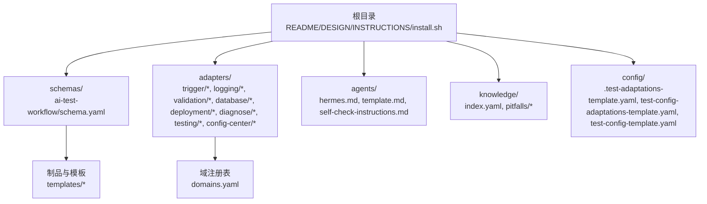
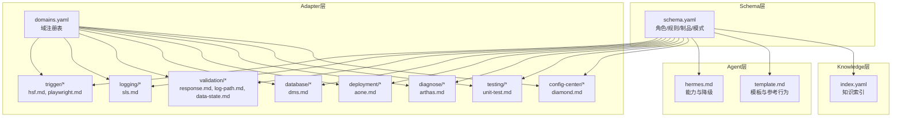
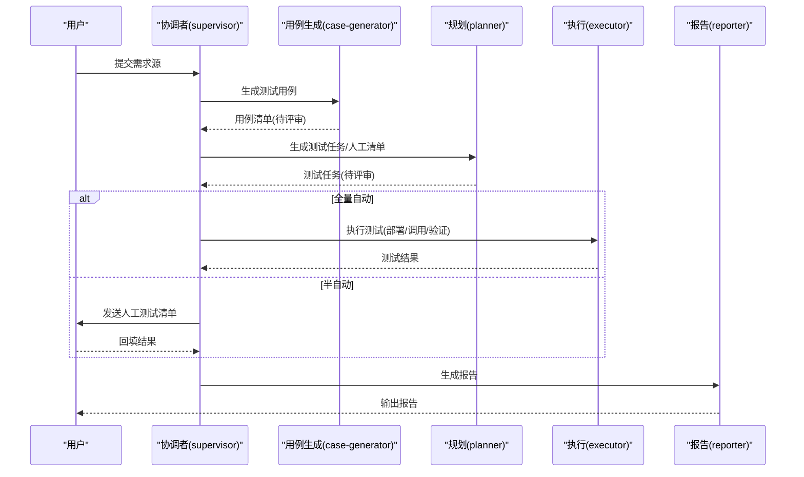
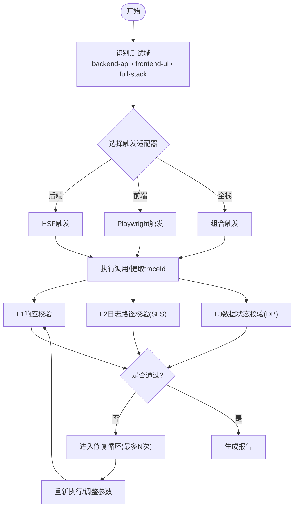
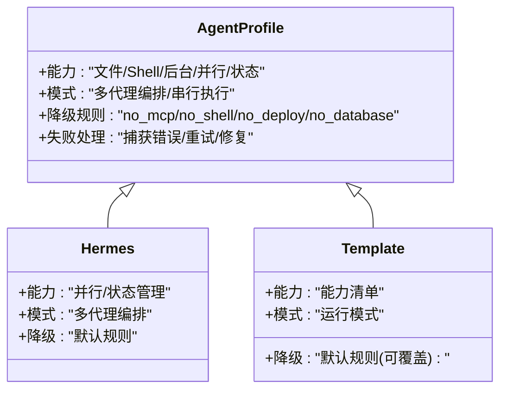
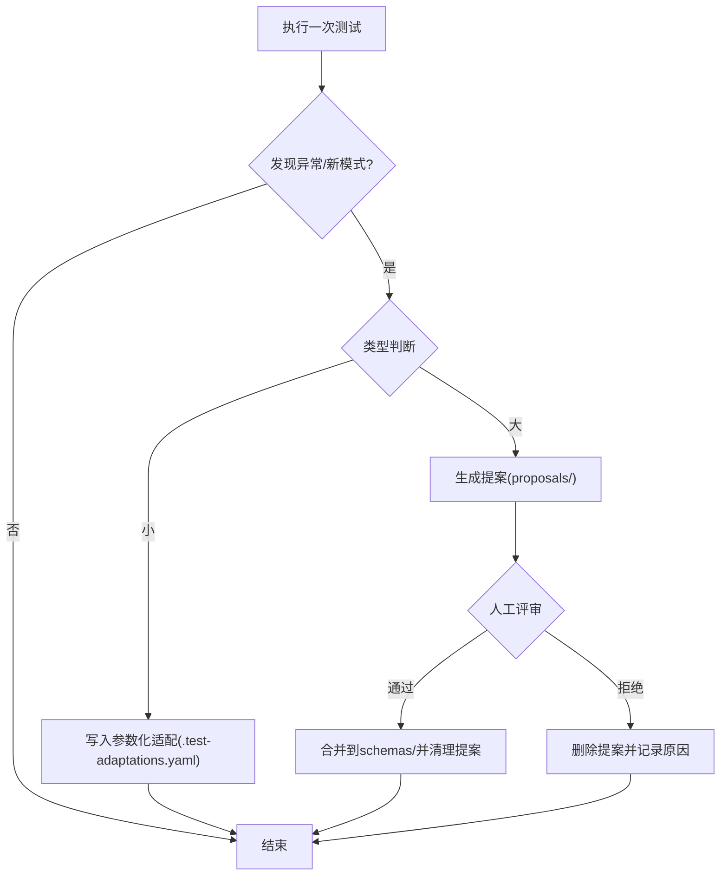
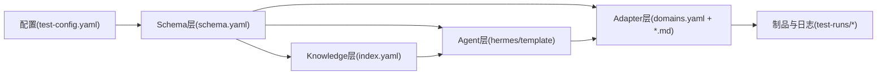

# 项目概述

<cite>
**本文引用的文件**
- [README.md](file://README.md)
- [DESIGN.md](file://DESIGN.md)
- [INSTRUCTIONS.md](file://INSTRUCTIONS.md)
- [install.sh](file://install.sh)
- [schema.yaml](file://schemas/ai-test-workflow/schema.yaml)
- [domains.yaml](file://adapters/domains.yaml)
- [test-config-template.yaml](file://config/test-config-template.yaml)
- [index.yaml](file://knowledge/index.yaml)
- [hsf.md](file://adapters/trigger/hsf.md)
- [sls.md](file://adapters/logging/sls.md)
- [log-path.md](file://adapters/validation/log-path.md)
- [hermes.md](file://agents/hermes.md)
- [template.md](file://agents/template.md)
- [test-task.md](file://schemas/ai-test-workflow/templates/test-task.md)
- [manual-test-guide.md](file://schemas/ai-test-workflow/templates/manual-test-guide.md)
</cite>

## 目录
1. [引言](#引言)
2. [项目结构](#项目结构)
3. [核心组件](#核心组件)
4. [架构总览](#架构总览)
5. [详细组件分析](#详细组件分析)
6. [依赖关系分析](#依赖关系分析)
7. [性能考虑](#性能考虑)
8. [故障排查指南](#故障排查指南)
9. [结论](#结论)
10. [附录](#附录)

## 引言
AI自动化测试SOP是一个标准化、可扩展的AI驱动自动化测试框架，旨在解决传统测试脚本在“工具绑定、流程固化、缺乏自适应”方面的痛点。其核心价值主张体现在三大特性：
- 通用性：规范输入来源（OpenSpec、语雀、Markdown或自然语言），统一生成标准规格，确保执行层不被输入格式所限。
- 代理无关性：通过“流程定义”与“执行者身份”解耦，使不同AI代理（如Hermes、Aone Copilot等）都能按同一套Schema高效协作。
- 自我演化：基于运行时反馈构建知识库与参数化适配，形成“小改自动应用、大改人工评审”的双层演进机制。

该框架适用于需要高一致性、强透明度与持续改进的测试团队，尤其适合在复杂系统中进行端到端验证与回归保障。

## 项目结构
仓库采用“分层+插件化”的组织方式，便于替换与扩展：
- schemas/：工作流定义与模板（DAG、角色、制品、通信协议）
- adapters/：技术实现适配器（触发、日志、数据库、部署、诊断、校验等）
- agents/：AI代理配置与能力声明（含降级规则与执行模式）
- knowledge/：知识库索引与避坑记录
- config/：配置模板（执行模式、适配器映射、MCP工具）
- 根目录：安装脚本、设计文档、使用说明与触发指令

图表来源
- [schema.yaml:1-87](file://schemas/ai-test-workflow/schema.yaml#L1-L87)
- [domains.yaml:1-27](file://adapters/domains.yaml#L1-L27)
- [README.md:71-84](file://README.md#L71-L84)

章节来源
- [README.md:71-84](file://README.md#L71-L84)

## 核心组件
- 工作流与角色（Schema层）
  - 定义主协调者、用例生成、规划、执行、报告五大角色及全局规则（隔离、日志要求）、执行模式（全量自动/半自动）、制品产出与状态文件约定。
- 技术适配器（Adapter层）
  - 将具体技术栈（HSF调用、Playwright前端、SLS日志、DMS数据、Aone部署等）封装为可插拔模块，支持跨域组合（后端接口、前端UI、全栈联测）。
- AI代理（Agent层）
  - 声明代理能力边界与降级策略，支持多代理编排与串行执行两种模式，依据能力动态调整执行路径。
- 知识与演化（Knowledge层）
  - 记录避坑与最佳实践，结合运行时异常自动生成参数化适配与结构化提案，形成“参数微调+逻辑评审”的闭环。

章节来源
- [schema.yaml:8-26](file://schemas/ai-test-workflow/schema.yaml#L8-L26)
- [schema.yaml:28-37](file://schemas/ai-test-workflow/schema.yaml#L28-L37)
- [schema.yaml:41-45](file://schemas/ai-test-workflow/schema.yaml#L41-L45)
- [schema.yaml:57-80](file://schemas/ai-test-workflow/schema.yaml#L57-L80)
- [domains.yaml:2-27](file://adapters/domains.yaml#L2-L27)
- [hermes.md:3-29](file://agents/hermes.md#L3-L29)
- [template.md:17-36](file://agents/template.md#L17-L36)
- [index.yaml:1-10](file://knowledge/index.yaml#L1-L10)

## 架构总览
系统分为四层，职责清晰、耦合度低：
- Schema层：定义流程、角色、制品与通信协议，保证变更无需改代码。
- Adapter层：封装技术实现，支持日志、触发、校验、数据库、部署等子域。
- Agent层：描述执行者能力与降级策略，支撑自适应执行。
- Knowledge层：沉淀历史经验，驱动参数化适配与结构化演进。

图表来源
- [schema.yaml:1-87](file://schemas/ai-test-workflow/schema.yaml#L1-L87)
- [domains.yaml:1-27](file://adapters/domains.yaml#L1-L27)
- [hermes.md:1-29](file://agents/hermes.md#L1-L29)
- [template.md:1-36](file://agents/template.md#L1-L36)
- [index.yaml:1-10](file://knowledge/index.yaml#L1-L10)

## 详细组件分析

### 组件A：工作流与角色（Schema层）
- 角色职责
  - 协调者：解析输入、管理状态、派发任务
  - 用例生成：基于规格生成测试用例
  - 规划：制定策略，必要时生成人工测试清单
  - 执行：部署/调用/验证
  - 报告：汇总结果、修复问题、生成报告
- 全局规则
  - 输入只读、输出隔离至独立目录
  - 每次工具调用前必须写入审计日志
- 执行模式
  - 全量自动：由AI完成部署、调用与验证
  - 半自动：生成人工测试清单，等待人工执行与回填
- 制品与状态
  - 制品按依赖顺序生成，支持用户评审节点
  - 通过文件状态机（test-status.json）实现跨轮次恢复与重试控制

图表来源
- [schema.yaml:8-26](file://schemas/ai-test-workflow/schema.yaml#L8-L26)
- [schema.yaml:41-45](file://schemas/ai-test-workflow/schema.yaml#L41-L45)
- [schema.yaml:57-80](file://schemas/ai-test-workflow/schema.yaml#L57-L80)

章节来源
- [schema.yaml:8-26](file://schemas/ai-test-workflow/schema.yaml#L8-L26)
- [schema.yaml:28-37](file://schemas/ai-test-workflow/schema.yaml#L28-L37)
- [schema.yaml:41-45](file://schemas/ai-test-workflow/schema.yaml#L41-L45)
- [schema.yaml:57-80](file://schemas/ai-test-workflow/schema.yaml#L57-L80)

### 组件B：技术适配器（Adapter层）
- 触发适配
  - HSF触发：通过HTTP代理发起调用，并提取traceId用于后续日志验证
  - Playwright触发：面向前端UI自动化
- 日志与校验
  - SLS日志查询：通过MCP工具按traceId检索链路日志
  - 日志路径校验：完整性、顺序性、干净性三原则
  - 响应校验：基础结构与字段校验
  - 数据状态校验：数据库一致性与持久化校验
- 域注册表
  - 后端接口、前端UI、全栈联测三种域，分别声明触发与校验组合

图表来源
- [domains.yaml:2-27](file://adapters/domains.yaml#L2-L27)
- [hsf.md:1-14](file://adapters/trigger/hsf.md#L1-L14)
- [sls.md:1-10](file://adapters/logging/sls.md#L1-L10)
- [log-path.md:1-10](file://adapters/validation/log-path.md#L1-L10)

章节来源
- [domains.yaml:2-27](file://adapters/domains.yaml#L2-L27)
- [hsf.md:1-14](file://adapters/trigger/hsf.md#L1-L14)
- [sls.md:1-10](file://adapters/logging/sls.md#L1-L10)
- [log-path.md:1-10](file://adapters/validation/log-path.md#L1-L10)

### 组件C：AI代理与降级策略（Agent层）
- 能力声明
  - 文件读写/Shell/后台进程/并行代理/状态管理等
- 执行模式
  - 多代理编排：主协调者委派子角色并行执行
  - 串行执行：单一代理承担全部角色
- 降级规则（全局默认）
  - 无MCP→跳过L2/L3；无Shell→转人工；无部署→人工部署；无数据库→跳过L3
- 失败处理
  - 子代理失败不影响整体流程，协调者负责重试与修复

图表来源
- [hermes.md:1-29](file://agents/hermes.md#L1-L29)
- [template.md:1-36](file://agents/template.md#L1-L36)

章节来源
- [hermes.md:3-29](file://agents/hermes.md#L3-L29)
- [template.md:17-36](file://agents/template.md#L17-L36)

### 组件D：知识与自我演化（Knowledge层）
- 知识索引
  - 自动生成避坑与最佳实践索引，供AI在执行前检索
- 自我演化
  - 参数化适配：小问题自动写入适配文件，立即生效
  - 结构化提案：重大变更生成提案目录，经人工评审后合并
- 运行时反馈
  - 异常模式识别→参数微调/结构评审→下一次运行更智能

图表来源
- [DESIGN.md:127-155](file://DESIGN.md#L127-L155)
- [index.yaml:1-10](file://knowledge/index.yaml#L1-L10)

章节来源
- [DESIGN.md:127-155](file://DESIGN.md#L127-L155)
- [index.yaml:1-10](file://knowledge/index.yaml#L1-L10)

## 依赖关系分析
- 层内解耦
  - Schema层仅声明流程与约束，不包含具体实现
  - Adapter层通过域注册表与Schema解耦，便于替换与扩展
- 层间耦合
  - Agent层根据自身能力影响执行路径与降级策略
  - Knowledge层为下一轮执行提供上下文增强
- 配置驱动
  - 执行模式、适配器映射、MCP工具开关均来自配置文件，便于环境差异化

图表来源
- [test-config-template.yaml:1-23](file://config/test-config-template.yaml#L1-L23)
- [schema.yaml:1-87](file://schemas/ai-test-workflow/schema.yaml#L1-L87)
- [domains.yaml:1-27](file://adapters/domains.yaml#L1-L27)
- [index.yaml:1-10](file://knowledge/index.yaml#L1-L10)

章节来源
- [test-config-template.yaml:1-23](file://config/test-config-template.yaml#L1-L23)
- [schema.yaml:1-87](file://schemas/ai-test-workflow/schema.yaml#L1-L87)
- [domains.yaml:1-27](file://adapters/domains.yaml#L1-L27)
- [index.yaml:1-10](file://knowledge/index.yaml#L1-L10)

## 性能考虑
- 并行与串行权衡
  - 多代理编排具备更强容错与吞吐，但需避免上下文污染
  - 串行执行简单稳定，适合资源受限或对一致性要求更高的场景
- 日志与校验成本
  - L2日志查询与L3数据校验会增加执行时间，建议在失败率较高时启用
- 参数化适配优先
  - 通过小步快跑的参数调整降低整体失败率，减少重试次数

## 故障排查指南
- 快速定位
  - 使用状态文件test-status.json查看当前步骤与重试次数
  - 查看实时审计日志execution-log.md，确认每次工具调用的参数与结果
- 常见问题
  - 无MCP工具：执行模式降级为半自动，或在配置中设置回退策略
  - 无Shell权限：触发人工测试清单，按清单逐项回填
  - 日志/数据校验误报：通过参数化适配添加排除规则
- 透明度与可观测性
  - 建议在长流程中开启状态文件与审计日志，便于复盘与优化

章节来源
- [README.md:61-70](file://README.md#L61-L70)
- [DESIGN.md:56-105](file://DESIGN.md#L56-L105)

## 结论
AI自动化测试SOP以“通用输入、代理无关、自我演化”为核心理念，通过分层解耦与插件化适配，实现了从需求到报告的全链路自动化与可视化。其双层演化机制既保证了日常效率，又确保了长期安全与可持续改进。对于追求高质量交付与持续演进的团队，该框架提供了可落地、可扩展、可治理的测试自动化基座。

## 附录

### 快速入门与安装
- 零配置（推荐给AI代理）
  - 克隆框架并复制触发指令到项目根目录，即可通过命令触发全流程
- 手动安装（开发者）
  - 克隆框架、复制配置模板、编辑执行模式与适配器映射、启动AI执行
- MCP配置（全量自动所需）
  - 在配置中启用日志、数据库、部署相关MCP工具，或在无工具时切换为半自动模式

章节来源
- [README.md:14-53](file://README.md#L14-L53)
- [install.sh:1-40](file://install.sh#L1-L40)

### 使用场景与目标用户
- 场景
  - 后端接口联调、前端UI回归、全栈端到端验证
- 用户
  - 测试工程师、开发工程师、平台工程团队、AI代理运维人员

章节来源
- [DESIGN.md:3-11](file://DESIGN.md#L3-L11)
- [README.md:7-13](file://README.md#L7-L13)

### 关键模板与制品
- 测试任务计划模板：用于生成策略、数据准备与验证点
- 人工测试清单模板：在半自动模式下生成，指导人工执行与回填

章节来源
- [test-task.md:1-37](file://schemas/ai-test-workflow/templates/test-task.md#L1-L37)
- [manual-test-guide.md:1-32](file://schemas/ai-test-workflow/templates/manual-test-guide.md#L1-L32)